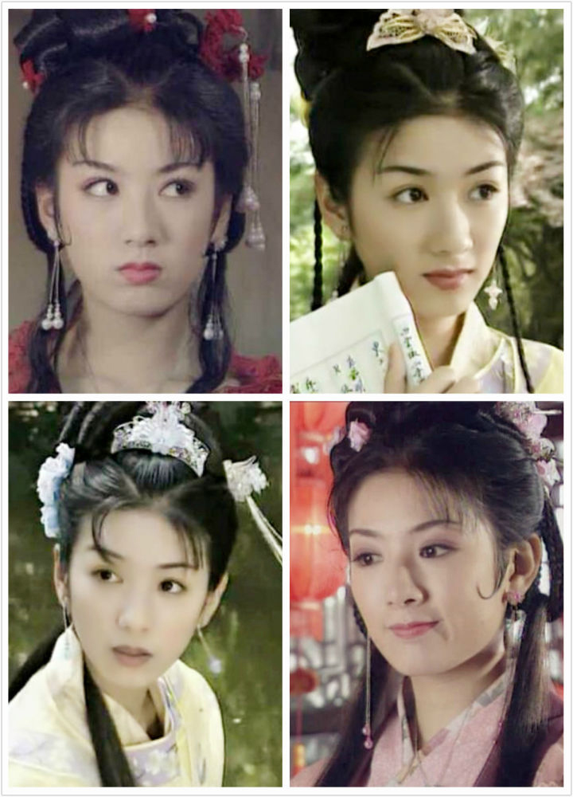
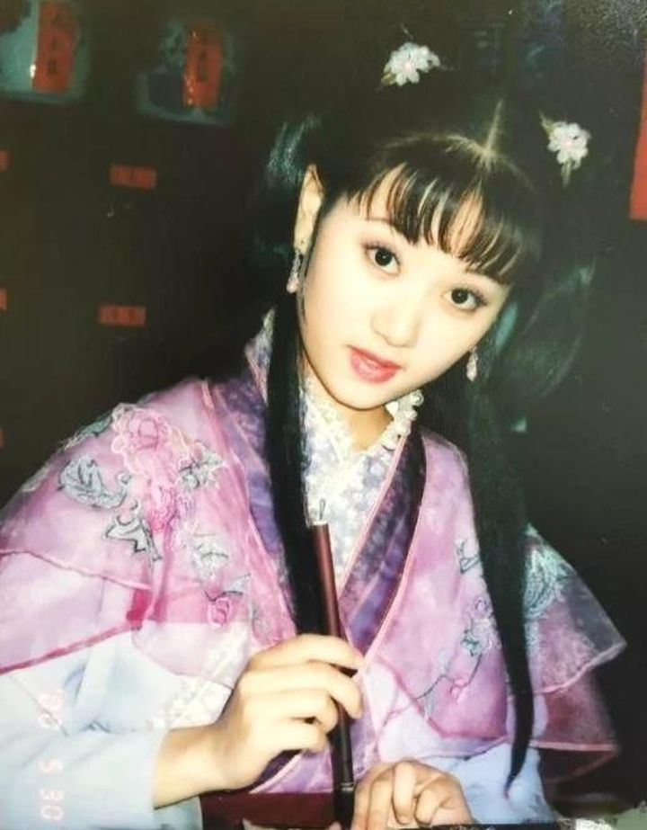

# 上错花轿嫁对郎

[annotation]: <id> (838dbf00-60dd-4d24-a470-3ec428f5f12c)
[annotation]: <status> (public)
[annotation]: <create_time> (2021-02-16 00:21:13)
[annotation]: <category> (心情随笔)
[annotation]: <tags> (电视剧)
[annotation]: <comments> (false)
[annotation]: <url> (http://blog.ccyg.studio/article/838dbf00-60dd-4d24-a470-3ec428f5f12c)

> 雨绵绵、情依依  
> 多少故事在心里  
> 五月烟雨蒙蒙唱扬州  
> 百年巧合话惊奇  

今天和我妈看了一天的《上错花轿嫁对郎》，不禁对电视剧里的服道化拍案叫绝，更是对其中演员的模样心生艳羡。真的是太漂亮了。

---

---

---

话又说回来，悲观的我，又得感叹一下：韶华易逝，红颜易老；这是热力学第二定律无情的诅咒！

不过对美好的向往，我想每个人心里都会有的，而且永远不会消逝！那就是 **希望**。
