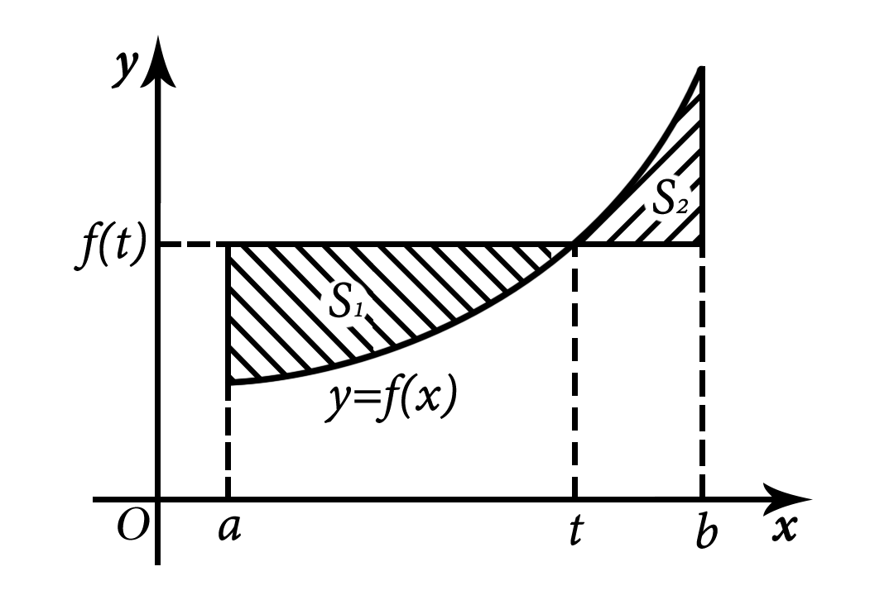

# 1988考研数学一真题

[annotation]: <id> (243e3980-a86a-4d19-9a60-0e8174bf7234)
[annotation]: <status> (public)
[annotation]: <create_time> (2021-03-06 11:33:34)
[annotation]: <category> (数学理论)
[annotation]: <tags> (考研数学)
[annotation]: <comments> (true)
[annotation]: <topic> (考研数学一真题)
[annotation]: <index> (-1988)
[annotation]: <url> (http://blog.ccyg.studio/article/243e3980-a86a-4d19-9a60-0e8174bf7234)

> 1988年全国硕士研究生招生考试数学一试题

---

## 一、（本题共 3 小题，每小题 5 分，满分 15 分）

(1) 求幂级数 $\displaystyle \sum_{n=1}^\infty {(x - 3)^n \over n \cdot 3^n}$ 的收敛域

(2) 已知 $f(x)=e^{x^2}, f[\varphi(x)]=1 - x$，且 $\varphi(x) \geqslant 0$，求 $\varphi(x)$ 并写出它的定义域

(3) 设 $\Sigma$ 为曲面 $x^2 + y^2 + z^2 = 1$ 的外侧，计算曲面积分 $\displaystyle I = \iint\limits_\Sigma x^3 dydz + y^3 dzdx + z^3 dxdy$

---

## 二、填空题（本题共 4 小题，每小题 3 分，满分 12 分）

(1) 若 $\displaystyle f(t) = \lim_{x\to\infty} \left(1 + {1\over x}\right)^{2tx}$，则 $f'(t)=$ \_\_\_\_\_

(2) 设 $f(x)$ 是周期为 2 的周期函数，它在区间 $(-1, 1]$ 上的定义为 $\displaystyle f(x)=\begin{cases} 2, & -1 < x \leqslant 0, \\ x^3, & 0 < x \leqslant 1,\end{cases}$，则 $f(x)$ 的傅里叶级数在 $x=1$ 处收敛于 \_\_\_\_\_

(3) 设 $f(x)$ 是连续函数，且 $\displaystyle\int_0^{x^3 - 1}f(t)dt = x$，则 $f(7)=$ \_\_\_\_\_

(4) 设 $4 \times 4$ 矩阵 $A=(\boldsymbol{\alpha}, \boldsymbol{\gamma}_2, \boldsymbol{\gamma}_3, \boldsymbol{\gamma}_4), B=(\boldsymbol{\beta}, \boldsymbol{\gamma}_2, \boldsymbol{\gamma}_3, \boldsymbol{\gamma}_4)$，其中 $\boldsymbol{\alpha}, \boldsymbol{\beta}, \boldsymbol{\gamma}_2, \boldsymbol{\gamma}_3, \boldsymbol{\gamma}_4$ 均为 4 维列向量，且已知 $|A| = 4, |B| = 1$，则行列式 $|A+B| =$ \_\_\_\_\_

---

## 三、选择题（本题共 5 小题，每小题 3 分，满分 15 分）

(1) 设 $f(x)$ 可导且 $\displaystyle f'(x_0) = {1 \over 2}$，则 $\Delta x \to 0$ 时， $f(x)$ 在点 $x_0$ 处的微分 $dy$ 是

- (A) 与 $\Delta x$ 等价的无穷小
- (B) 与 $\Delta x$ 同阶的无穷小
- (C) 比 $\Delta x$ 低阶的无穷小
- (D) 比 $\Delta x$ 高阶的无穷小

(2) 设 $y=f(x)$ 是方程 $y''-2y'+4y=0$ 的一个解，且 $f(x_0)>0,f'(x_0)=0$，则函数 $f(x)$ 在点 $x_0$ 处

- (A) 取得极大值
- (B) 取得极小值
- (C) 某邻域内单调增加
- (D) 某领域内单调减少

(3) 设有空间区域 $\Omega_1:x^2 + y^2 + z^2 \leqslant R^2, z\geqslant 0$ 及 $\Omega_2:x^2 + y^2 + z^2 \leqslant R^2, x \geqslant 0, y \geqslant 0, z\geqslant 0$，则

- (A) $\displaystyle \iiint\limits_{\Omega_1} x dv = 4 \iiint\limits_{\Omega_2} x dv$

- (B) $\displaystyle \iiint\limits_{\Omega_1} y dv = 4 \iiint\limits_{\Omega_2} y dv$

- (C) $\displaystyle \iiint\limits_{\Omega_1} z dv = 4 \iiint\limits_{\Omega_2} z dv$

- (D) $\displaystyle \iiint\limits_{\Omega_1} xyz dv = 4 \iiint\limits_{\Omega_2} xyz dv$

(4) 若 $\displaystyle\sum_{n = 1}^\infty a_n(x-1)^n$ 在 $x=-1$ 处收敛，则此级数在 $x=2$ 处

- (A) 条件收敛
- (B) 绝对收敛
- (C) 发散
- (D) 敛散性不能确定

(5) $n$ 维向量组 $\boldsymbol{\alpha_1},\boldsymbol{\alpha_2},\cdots,\boldsymbol{\alpha_s}(3 \leqslant s \leqslant n)$ 线性无关的充分必要条件是

- (A) 存在一组不全为 0 的数，$k_1,k_2,\cdots,k_s$，使 $k_1\boldsymbol{\alpha_1} + k_2\boldsymbol{\alpha_2} + \cdots + k_s\boldsymbol{\alpha_s} \neq 0$
- (B) $\boldsymbol{\alpha_1},\boldsymbol{\alpha_2},\cdots,\boldsymbol{\alpha_s}$ 中任意两个向量都线性无关
- (C) $\boldsymbol{\alpha_1},\boldsymbol{\alpha_2},\cdots,\boldsymbol{\alpha_s}$ 中存在一个向量，它不能用其余向量线性表出
- (D) $\boldsymbol{\alpha_1},\boldsymbol{\alpha_2},\cdots,\boldsymbol{\alpha_s}$ 中任意一个向量，都不能用其余向量向量线性表出

---

## 四、（本题满分 6 分）

设 $\displaystyle u=yf({x\over y}) + xg({y\over x})$，其中 $f,g$ 具有二阶连续导数，求 $\displaystyle x{\partial^2 u \over \partial^2 x} + y {\partial^2 u \over \partial x\partial y}$

---

## 五、选择题（本题满分 8 分）

设函数 $y=y(x)$ 满足微分方程 $y'' - 3y' + 2y=2e^x$，且其图形在点 $(0, 1)$ 处的切线与曲线 $y=x^2 - x + 1$ 在该点的切线重合，求函数 $y=y(x)$

---

## 六、（本题满分 9 分）

设位于点 $(0, 1)$ 的质点 $A$ 对质点 $M$ 的引力大小为 $\displaystyle {k\over r^2}$ ($k>0$ 为常数，$r$ 为质点 $A$ 与 $M$ 之间的距离)，质点 $M$ 延曲线 $y=\sqrt{2x-x^2}$ 自 $B(2, 0)$ 运动到 $O(0, 0)$，求在此运动过程中质点 $A$ 对质点 $M$ 的引力所作的功

---

## 七、（本题满分 6 分）

已知 $AP = PB$，其中 
$\displaystyle B=\begin{bmatrix}1 & 0 & 0 \\0 & 0 & 0 \\0 & 0 & -1 \\\end{bmatrix}, P=\begin{bmatrix}1 & 0 & 0 \\2 & -1 & 0 \\2 & 1 & 1 \\\end{bmatrix}$，求 $A$ 及 $A^5$

---

## 八、（本题满分 8 分）

已知矩阵 $\displaystyle A=\begin{bmatrix} 2 & 0 & 0 \\0 & 0 & 1 \\0 & 1 & x \\\end{bmatrix}$ 与 $\displaystyle B=\begin{bmatrix} 2 & 0 & 0 \\0 & y & 0 \\0 & 0 & -1 \\\end{bmatrix}$ 相似

- (1) 求 $x$ 与 $y$
- (2) 求一个满足 $P^{-1}AP = B$ 的可逆矩阵 $P$

---

## 九、（本题满分 9 分）

设函数 $f(x)$ 在区间 $[a, b]$ 上连续，且在 $(a, b)$ 内有 $f'(x) > 0$，证明：在 $(a, b)$ 内存在唯一的 $\xi$，使曲线 $y=f(x)$ 与两直线 $y=f(\xi), x=a$ 所围成的平面图形面积 $S_1$ 是曲线 $y=f(x)$ 与两直线 $y=f(\xi), x=b$ 所围成平面图形面积 $S_2$ 的三倍（如图）

---

## 十、填空题（本题共 3 小题，每小题 2 分，满分 6 分）

(1) 设在三次独立试验中，事件 $A$ 出现的概率相等；若已知 $A$ 至少出现一次的概率等于 $\displaystyle {19 \over 27}$，则事件 $A$ 在一次试验中出现的概率为 \_\_\_\_\_

(2) 在区间 $(0, 1)$ 中随机地取两个数，则事件 **两数之和小于$\displaystyle{6 \over 5}$** 的概率为 \_\_\_\_\_

(3) 设随机变量 $X$ 服从均值 10，均方差为 0.02 的正太分布，已知 $\displaystyle \Phi(x) = \int_{-\infty}^x {1\over \sqrt{2\pi}} e^{-{u^2 \over 2}} du$，$\Phi(2.5)=0.9938$，则 $X$ 落在区间 $(9.95, 10.05)$ 内的概率为 \_\_\_\_\_

---

## 十一、（本题满分 6 分）

设随机变量 $X$ 的概率密度函数为 $\displaystyle f_X(x)={1 \over \pi(1 + x^2)}$，求随机变量 $Y = 1 - \sqrt[3]{X}$ 的概率密度函数 $f_Y(y)$
