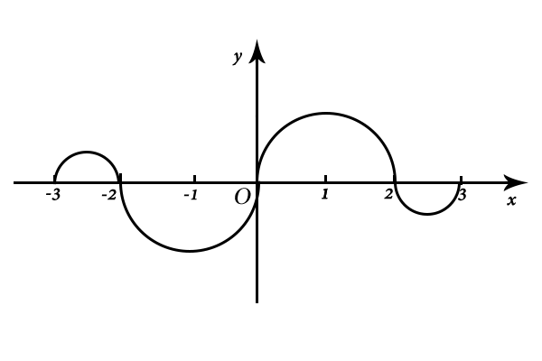

# 2007考研数学一真题

[annotation]: <id> (d4a2db55-97e9-48a5-b299-57c4823f9899)
[annotation]: <status> (public)
[annotation]: <create_time> (2021-03-10 11:23:31)
[annotation]: <category> (数学理论)
[annotation]: <tags> (考研数学)
[annotation]: <comments> (true)
[annotation]: <topic> (考研数学一真题)
[annotation]: <index> (-2007)
[annotation]: <url> (http://blog.ccyg.studio/article/d4a2db55-97e9-48a5-b299-57c4823f9899)

> 2007年全国硕士研究生招生考试数学一试题

## 一、选择题（本题共 10 小题，每小题 4 分，共 40 分）

---

(1) 当 $x\to 0$ 时，与 $x$ 等价的无穷小量是

- (A) $1 - e^{\sqrt{x}}$

- (B) $\displaystyle \ln {1 + x \over 1 - \sqrt{x}}$

- (C) $\sqrt{1 + \sqrt{x}} - 1$

- (D) $1 - \cos \sqrt{x}$

---

(2) 曲线 $\displaystyle y = {1 \over x} + \ln(1 + e^x)$ 渐近线的条数为

- (A) $0$ 
- (B) $1$
- (C) $2$
- (D) $3$

---

(3) 如图，连续函数 $y=f(x)$ 在区间 $[-3,-2]$，$[2,3]$ 上的图形分别是直径为 $1$ 的上、下半圆周，在区间 $[-2,0]$，$[0,2]$ 的图形分别是直径为 $2$ 的上、下半圆周，设 $\displaystyle F(x) =\int_0^x f(t) dt$，则下列结论正确的是

- (A) $\displaystyle F(3) = -{3 \over 4} F(-2)$

- (B) $\displaystyle F(3) = {5 \over 4} F(-2)$

- (C) $\displaystyle F(3) = {3 \over 4} F(-2)$

- (D) $\displaystyle F(3) = -{5 \over 4} F(-2)$

---

(4) 设函数 $f(x)$ 在 $x = 0$ 处连续，下列命题错误的是

- (A) 若 $\displaystyle \lim_{x \to 0} {f(x) \over x}$ 存在，则 $f(0) = 0$

- (B) 若 $\displaystyle \lim_{x \to 0} {f(x) + f(-x) \over x}$ 存在，则 $f(0) = 0$

- (C) 若 $\displaystyle \lim_{x \to 0} {f(x) \over x}$ 存在，则 $f'(0) = 0$

- (D) 若 $\displaystyle \lim_{x \to 0} {f(x) - f(-x) \over x}$ 存在,则 $f'(0) = 0$

---

(5)设函数 $f(x)$ 在 $(0, +\infty)$ 上具有二阶导数，且 $f''(x) > 0$，令 $u_n = f(n)$ $(n = 1, 2, \cdots)$，则下列结论正确的是

- (A) 若 $u_1 > u_2$，则 $\{u_n\}$ 必收敛
- (B) 若 $u_1 > u_2$，则 $\{u_n\}$ 必发散
- (C) 若 $u_1 < u_2$，则 $\{u_n\}$ 必收敛
- (D) 若 $u_1 < u_2$，则 $\{u_n\}$ 必发散

---

(6) 设曲线 $L:f(x, y) = 1$ ($f(x, y)$ 具有一阶连续偏导数)，过第 $2$ 象限内的点 $M$ 和第 $4$ 象限内的点 $N$，$\Gamma$ 为 $L$ 上从点 $M$ 到 $N$ 的一段弧，则下列小于零的是

- (A) $\displaystyle \int_\Gamma f(x, y) dx$

- (B) $\displaystyle \int_\Gamma f(x, y) dy$

- (C) $\displaystyle \int_\Gamma f(x, y) ds$

- (D) $\displaystyle \int_\Gamma f_x'(x, y) dx + f_y'(x, y) dy$

---

(7) 设向量组 $\boldsymbol{\alpha}_1,\boldsymbol{\alpha}_2,\boldsymbol{\alpha}_3$ 线性无关，则下列向量组线形相关的是

- (A) $\boldsymbol{\alpha_1} - \boldsymbol{\alpha_2},$ $\boldsymbol{\alpha_2} - \boldsymbol{\alpha_3},$ $\boldsymbol{\alpha_3} - \boldsymbol{\alpha_1}$
- (B) $\boldsymbol{\alpha_1} + \boldsymbol{\alpha_2},$ $\boldsymbol{\alpha_2} + \boldsymbol{\alpha_3},$ $\boldsymbol{\alpha_3} + \boldsymbol{\alpha_1}$
- (C) $\boldsymbol{\alpha_1} - 2\boldsymbol{\alpha_2},$ $\boldsymbol{\alpha_2} - 2\boldsymbol{\alpha_3},$ $\boldsymbol{\alpha_3} - 2\boldsymbol{\alpha_1}$
- (D) $\boldsymbol{\alpha_1} + 2\boldsymbol{\alpha_2},$ $\boldsymbol{\alpha_2} + 2\boldsymbol{\alpha_3},$ $\boldsymbol{\alpha_3} + 2\boldsymbol{\alpha_1}$

---

(8)设矩阵  $\displaystyle A = \begin{bmatrix} 2 & -1 & -1 \\ -1 & 2 & -1 \\ -1 & -1 & 2\end{bmatrix}$，$\displaystyle B = \begin{bmatrix} 1 & 0 & 0 \\ 0 & 1 & 0 \\ 0 & 0 & 0 \end{bmatrix}$，则 $A$ 与 $B$

- (A) 合同，且相似 
- (B) 合同，但不相似
- (C) 不合同，但相似
- (D) 既不合同，也不相似

---

(9) 某人向同一目标独立重复射击，每次射击命中目标的概率为 $p(0 < p < 1)$，则此人第 $4$ 次射击恰好第 $2$ 次命中目标的概率为

- (A) $3p(1 - p)^2$
- (B) $6p(1 - p)^2$
- (C) $3p^2(1 - p)^2$
- (D) $6p^2(1 - p)^2$

---

(10) 设随即变量 $(X,Y)$ 服从二维正态分布，且 $X$ 与 $Y$ 不相关，$f_X(x),f_Y(y)$ 分别表示 $X,Y$ 的概率密度，则在 $Y=y$ 的条件下，$X$ 的条件概率密度 $f_{X|Y}(x|y)$ 为

- (A) $f_X(x)$

- (B) $f_Y(y)$

- (C) $f_X(x)f_Y(y)$

- (D) $\displaystyle {f_X(x) \over f_Y(y)}$

---

## 二、填空题（本题共 6 小题，每小题 4 分，共 24 分）

---

(11) $\displaystyle \int_1^2 {1 \over x^3} e^{1\over x} dx =$  \_\_\_\_\_

---

(12) 设 $f(u, v)$ 为二元可微函数，$z=f(x^y, y^x)$，则 $\displaystyle {\partial z \over \partial x}=$  \_\_\_\_\_

---

(13) 二阶常系数非齐次线性方程 $y'' - 4y' + 3y = 2e^{2x}$ 的通解为 $y=$  \_\_\_\_\_

---

(14) 设曲面 $\displaystyle \Sigma:|x| + |y| + |z| = 1$，则 $\displaystyle \iint\limits_\Sigma (x + |y|) ds=$  \_\_\_\_\_

---

(15) 设矩阵  $\displaystyle A = \begin{bmatrix} 0 & 1 & 0 & 0 \\ 0 & 0 & 1 & 0 \\ 0 & 0 & 0 & 1 \\ 0 & 0 & 0 & 0\end{bmatrix}$，则 $A^3$ 的秩为  \_\_\_\_\_

---

(16) 在区间 $(0,1)$ 中随机地取两个数，则这两个数之差的绝对值小于 $\displaystyle{1 \over 2}$ 的概率为  \_\_\_\_\_

---

## 三、解答题（本题共 8 小题，共 86 分）

---

(17) （本题满分 11 分）

求函数 $f(x, y)= x^2 + 2y^2 - x^2y^2$ 在区域 $D=\{(x, y)| x^2 + y^2 \leqslant 4, y \geqslant 0\}$ 上的最大值和最小值

---

(18) （本题满分 10 分）

计算曲面积分 $\displaystyle I = \iint\limits_\Sigma xz dydz + 2zy dzdx + 3xy dxdy$，其中 $\Sigma$ 为曲面 $\displaystyle z = 1 - x^2 - {y^2 \over 4}$ $(0 \leqslant z \leqslant 1)$ 的上侧

---

(19) （本题满分 11 分）

设函数 $f(x), g(x)$ 在 $[a, b]$ 上连续，在 $(a, b)$ 内具有二阶导数且存在相等的最大值，$f(a) = g(a)$，$f(b) = g(b)$，证明：存在 $\xi \in (a, b)$ 使得 $f''(\xi) = g''(\xi)$

---

(20) （本题满分 10 分）

设幂级数 $\displaystyle \sum_{n=1}^\infty a_nx^n$ 在 $(-\infty, +\infty)$ 内收敛，其和函数 $y(x)$ 满足 $y'' - 2xy' - 4y =0$，$y(0)=0$, $y'(0)=1$

- (1) 证明：$\displaystyle a_{n + 2} = {1 \over n + 1} a_n,$ $n = 1, 2, \cdots$
- (2) 求 $y(x)$ 的表达式

---

(21) （本题满分 11 分）

设线性方程组

$$
\begin{cases}
x_1 + x_2 + x_3 = 0 \\
x_1 + 2x_2 + ax_3 = 0 \\
x_1 + 4x_2 + a^2x_3 = 0 \\
\end{cases}
$$

与方程

$$
x_1 + 2x_2 + x_3 = a - 1
$$

有公共解，求 $a$ 的值及所有公共解

---

(22) （本题满分 11 分）

设 $3$ 阶实对称矩阵 $A$ 的特征向量值 $\lambda_1 = 1$，$\lambda_2 = 2$，$\lambda_3 = -2$，$\boldsymbol{\alpha_1} = (1, -1, 1)^T$ 是 $A$ 的属于特征值 $\lambda_1$ 的一个特征向量，记 $B = A^5 - 4A^3 + E$，其中 $E$ 为 $3$ 阶单位矩阵

- (1) 验证 $\boldsymbol{\alpha_1}$ 是矩阵 $B$ 的特征向量，并求 $B$ 的全部特征值与特征向量
- (2) 求矩阵 $B$

---

(23) （本题满分 11 分）

设二维随机变量 $(X,Y)$ 的概率密度为

$$
f(x, y) = \begin{cases}
2 - x - y, & 0 < x < 1, 0 < y < 1 \\
0, & 其他
\end{cases}
$$

- (1) 求 $P\{X > 2Y\}$
- (2) 求 $Z = X + Y$ 的概率密度

---

(24) （本题满分 11 分）

设总体 $X$ 的概率密度为

$$
f(x; \theta) = \begin{cases}
\displaystyle {1 \over 2 \theta}, & 0 < x < \theta \\
\displaystyle {1 \over 2(1 - \theta)}, & 0 \leqslant x < 1 \\
0, & 其他
\end{cases}
$$

$X_1, X_2, \cdots, X_n$ 是来自总体 $X$ 的简单随机样本，$\overline{X}$ 是样本均值

- (1) 求参数 $\theta$ 的矩估计量 $\hat{\theta}$
- (2) 判断 $4\overline{X}^2$ 是否为 $\theta^2$ 的无偏估计量，并说明理由
