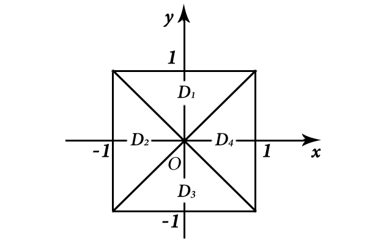
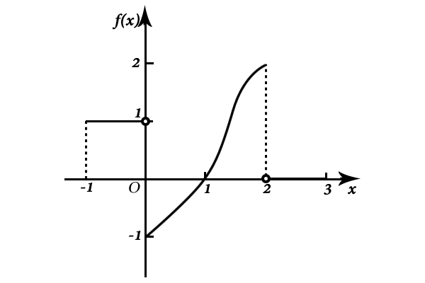
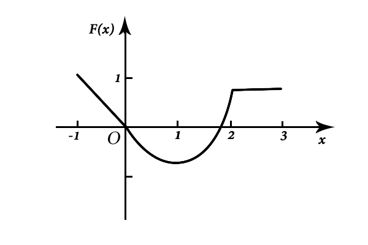
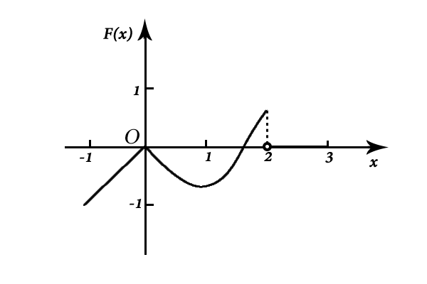
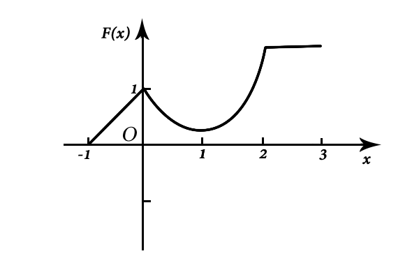
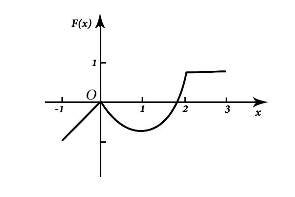

# 2009考研数学一真题

[annotation]: <id> (78583390-c778-4435-b7d8-00a2d9aca048)
[annotation]: <status> (public)
[annotation]: <create_time> (2021-03-08 15:23:31)
[annotation]: <category> (数学理论)
[annotation]: <tags> (考研数学)
[annotation]: <comments> (true)
[annotation]: <topic> (考研数学一真题)
[annotation]: <index> (-2009)
[annotation]: <url> (http://blog.ccyg.studio/article/78583390-c778-4435-b7d8-00a2d9aca048)

> 2009年全国硕士研究生招生考试数学一试题

## 一、选择题（本题共 8 小题，每小题 4 分，共 32 分）

---

(1) 当 $x \to 0$ 时，$f(x) = x - \sin ax$ 与 $g(x) = x^2\ln(1 - bx)$ 是等价无穷小，则

- (A) $\displaystyle a = 1, b=-{1 \over 6}$

- (B) $\displaystyle a = 1, b={1 \over 6}$

- (C) $\displaystyle a = -1, b=-{1 \over 6}$

- (D) $\displaystyle a = -1, b={1 \over 6}$

(2) 如图，正方形 $\{(x, y) \big| |x| \leqslant 1, |y| \leqslant 1\}$ 被其对角线划分为四个区域 $D_k(k = 1, 2, 3, 4)$，$\displaystyle I_k = \iint\limits_{D_k} y\cos x dxdy$，则 $\displaystyle \max_{1 \leqslant k \leqslant 4}\{I_k\}=$

- (A) $I_1$
- (B) $I_2$
- (C) $I_3$
- (D) $I_4$

---

(3) 设函数 $y = f(x)$ 在区间 $[-1, 3]$ 上的图形为

则函数 $\displaystyle F(x) = \int_0^x f(t)dt$ 的图形为

- (A)

- (B)

- (C)

- (D)

---

(4) 设有两个数列 $\{a_n\}$，$\{b_n\}$，若 $\displaystyle \lim_{n\to \infty} a_n = 0$，则

- (A) 当 $\displaystyle \sum_{n=1}^\infty b_n$ 收敛时，$\displaystyle \sum_{n=1}^\infty a_nb_n$ 收敛

- (B) 当 $\displaystyle \sum_{n=1}^\infty b_n$ 发散时，$\displaystyle \sum_{n=1}^\infty a_nb_n$ 发散

- (C) 当 $\displaystyle \sum_{n=1}^\infty |b_n|$ 收敛时，$\displaystyle \sum_{n=1}^\infty a_n^2b_n^2$ 收敛. 

- (D) 当 $\displaystyle \sum_{n=1}^\infty |b_n|$ 发散时，$\displaystyle \sum_{n=1}^\infty a_n^2b_n^2$发散.

---

(5) 设 $\boldsymbol{\alpha}_1,\boldsymbol{\alpha}_2,\boldsymbol{\alpha}_3$ 是 $3$ 维向量空间 $R^3$ 的一组基，则由基 $\displaystyle \boldsymbol{\alpha}_1,{1\over 2}\boldsymbol{\alpha}_2,{1 \over 3}\boldsymbol{\alpha}_3$ 到基 $\boldsymbol{\alpha}_1 + \boldsymbol{\alpha}_2,\boldsymbol{\alpha}_2 + \boldsymbol{\alpha}_3,\boldsymbol{\alpha}_3 + \boldsymbol{\alpha}_1$ 的过渡矩阵为

- (A)  $\displaystyle\begin{bmatrix} 1 & 0 & 1 \\ 2 & 2 & 0 \\ 0 & 3 & 3 \end{bmatrix}$

- (B) $\displaystyle\begin{bmatrix} 1 & 2 & 0 \\ 0 & 2 & 3 \\ 1 & 0 & 3 \end{bmatrix}$

- (C) $\begin{bmatrix} \displaystyle {1\over 2} & \displaystyle{1\over 4} & \displaystyle -{1\over 6} \\\\ \displaystyle -{1\over 2} & \displaystyle {1\over 4} &  \displaystyle {1\over 6} \\\\ \displaystyle {1\over 2} & \displaystyle -{1\over 4} &  \displaystyle {1\over 6} \end{bmatrix}$

- (D) $\begin{bmatrix} \displaystyle {1\over 2} & \displaystyle-{1\over 2} & \displaystyle {1\over 2} \\\\ \displaystyle {1\over 4} & \displaystyle {1\over 4} &  \displaystyle -{1\over 4} \\\\ \displaystyle -{1\over 6} & \displaystyle {1\over 6} &  \displaystyle {1\over 6} \end{bmatrix}$

---

(6)设 $A,B$ 均为 $2$ 阶矩阵，$A^*,B^*$分别为 $A,B$ 的伴随矩阵，若 $|A| = 2$，$|B| = 3$，则分块矩阵  $\displaystyle \begin{bmatrix} O & A \\ B & O \\ \end{bmatrix}$ 的伴随矩阵为

- (A) $\displaystyle \begin{bmatrix} O & 3B^* \\ 2A^* & O \\ \end{bmatrix}$

- (B) $\displaystyle \begin{bmatrix} O & 2B^* \\ 3A^* & O \\ \end{bmatrix}$

- (C) $\displaystyle \begin{bmatrix} O & 3A^* \\ 2B^* & O \\ \end{bmatrix}$

- (D) $\displaystyle \begin{bmatrix} O & 2A^* \\ 3B^* & O \\ \end{bmatrix}$

---

(7)设随机变量 $X$ 的分布函数为 $\displaystyle F(x)= 0.3\Phi(x) + 0.7\Phi\left(x - 1 \over 2\right)$ 其中 $\Phi(x)$ 为标准正态分布函数，则 $EX=$

- (A) $0$
- (B) $0.3$
- (C) $0.7$
- (D) $1$

---

(8) 设随机变量 $X$ 与 $Y$ 相互独立，且 $X$ 服从标准正态分布 $N(0, 1)$，$Y$ 的概率分布为 $\displaystyle P\{Y=0\}=P\{Y=1\}={1\over 2}$，记 $F_Z(z)$ 为随机变量 $Z=XY$ 的分布函数，则函数 $F_Z(z)$ 的间断点个数为

- (A) $0$
- (B) $1$
- (C) $2$
- (D) $3$

---

## 二、填空题（本题共 6 小题，每小题 4 分，共 24 分）

---

(9) 设函数 $f(u, v)$ 具有二阶连续偏导数，$z=f(x, xy)$，则 $\displaystyle {\partial^2 z \over \partial x \partial y} =$  \_\_\_\_\_

---

(10) 若二阶常系数线性齐次微分方程 $y'' + ay' + by = 0$ 的通解为 $y = (C_1 + C_2x)e^x$，则非齐次方程 $y'' + ay' + by = x$ 满足条件 $y(0) = 2, y'(0) = 0$ 的解为 $y=$  \_\_\_\_\_

---

(11) 已知曲线 $L:y=x^2 \,(0 \leqslant x \leqslant \sqrt{2})$，则 $\displaystyle \int_L x ds=$  \_\_\_\_\_

---

(12) 设 $\Omega = \{(x, y , z) | x^2 + y^2 + z^2 \leqslant 1 \}$，则 $\displaystyle \iiint\limits_\omega z^2 dxdydz=$  \_\_\_\_\_

---

(13) 若 $3$ 维列向量 $\boldsymbol{\alpha}, \boldsymbol{\beta}$ 满足 $\boldsymbol{\alpha}^T\boldsymbol{\beta} = 2$，其中 $\boldsymbol{\alpha}^T$ 为 $\boldsymbol{\alpha}$ 的转置，则矩阵 $\boldsymbol{\beta}\boldsymbol{\alpha}^T$ 的非零特征值为  \_\_\_\_\_

---

(14) 设 $X_1, X_2,\cdots,X_m$ 为来自二项分布总体 $B(n, p)$ 的简单随机样本，$\overline{X}$ 和 $S^2$ 分别为样本均值和样本方差，若 $\overline{X} + kS^2$ 为 $np^2$ 的无偏估计量，则 $k=$  \_\_\_\_\_

---

## 三、解答题（本题共 9 小题，共 94 分）

---

(15) （本题满分 10 分）

求二元函数 $f(x, y)= x^2 (2 + y^2) + y\ln y$ 的极值

---

(16) （本题满分 10 分）

设 $a_n$ 为曲线 $y = x^n$ 与 $y = x^{n + 1}\,(n = 1, 2,\cdots)$ 所围成区域的面积，记 $\displaystyle S_1 = \sum_{n=1}^\infty a_n$，$\displaystyle S_2 = \sum_{n=1}^\infty a_{2n-1}$，求 $S_1$ 与 $S_2$ 的值

---

(17) （本题满分 10 分）

椭球面 $S_1$ 是椭圆 $\displaystyle {x^2 \over 4} + {y^2 \over 3} = 1$ 绕 $x$ 轴旋转而成，圆锥面 $S_2$ 是过点 $(4, 0)$ 且与椭圆 $\displaystyle {x^2 \over 4} + {y^2 \over 3} = 1$ 相切的直线绕 $x$ 轴旋转而成

- (1) 求 $S_1$ 及 $S_2$ 的方程
- (2) 求 $S_1$ 与 $S_2$ 之间的立体体积

---

(18) （本题满分 10 分）

- (1) 证明拉格朗日中值定理：若函数 $f(x)$ 在 $[a, b]$ 上连续，在 $(a, b)$ 可导，则存在 $\xi \in (a, b)$，使得 $f(b) - f(a) = f'(\xi)(b - a)$

- (2) 证明：若函数 $f(x)$ 在 $x = 0$ 处连续，在 $(0, \delta)\,(\delta > 0)$ 内可导，且 $\displaystyle \lim_{x \to 0^+}f'(x) = A$，则 $f'_+(0)$ 存在，且 $f'_+(0) = A$

---

(19) （本题满分 10 分）

计算曲面积分 $\displaystyle \iint\limits_\Sigma {xdydz + ydzdx + zdxdy \over (x^2 + y^2 + z^2)^{3 \over 2}}$，其中 $\Sigma$ 是曲面 $2x^2 + 2y^2 + z^2 = 4$ 的外侧

---

(20) （本题满分 11 分）

设  $\displaystyle A = \begin{bmatrix} 1 & -1 & -1 \\ -1 & 1 & 1 \\ 0 & -4 & -2 \end{bmatrix}$，$\displaystyle \xi_1 = \begin{bmatrix} -1 \\ 1 \\ -2\end{bmatrix}$

- (1) 求满足 $A\xi_2 = \xi_1$ 的 $\xi_2$，$A^2\xi_3 = \xi_1$ 的所有向量 $\xi_2, \xi_3$
- (2) 对 (1) 中的任意向量 $\xi_2, \xi_3$ 证明 $\xi_1, \xi_2, \xi_3$ 无关

---

(21) （本题满分 11 分）

设二次型 $f(x_1, x_2, x_3) = ax_1^2 + ax_2^2 + (a - 1)x_3^2 + 2x_1x_2 - 2x_2x_3$

- (1) 求二次型 $f$ 的矩阵的所有特征值
- (2) 若二次型 $f$ 的规范形为 $y_1^2 + y_2^2$，求 $a$ 的值

---

(22) （本题满分 11 分）

袋中有 $1$ 个红色球，$2$ 个黑色球与 $3$ 个白球，现有回放地从袋中取两次，每次取一球，以 $X,Y,Z$ 分别表示两次取球所取得的红球、黑球与白球的个数

- (1) 求 $P\{X=1 |Z=0\}$
- (2) 求二维随机变量 $(X, Y)$ 的概率分布

---

(23) （本题满分 11 分）

设总体 $X$ 的概率密度为 

$$
f(x) = \begin{cases}
\lambda^2 x e^{-\lambda x}, & x > 0 \\
0, & 其他
\end{cases}
$$

其中参数 $\lambda(\lambda > 0)$ 未知，$X_1, X_2, \cdots, X_n$ 是来自总体 $X$ 的简单随机样本

- (1) 求参数 $\lambda$ 的矩估计量
- (2) 求参数 $\lambda$ 的最大似然估计量