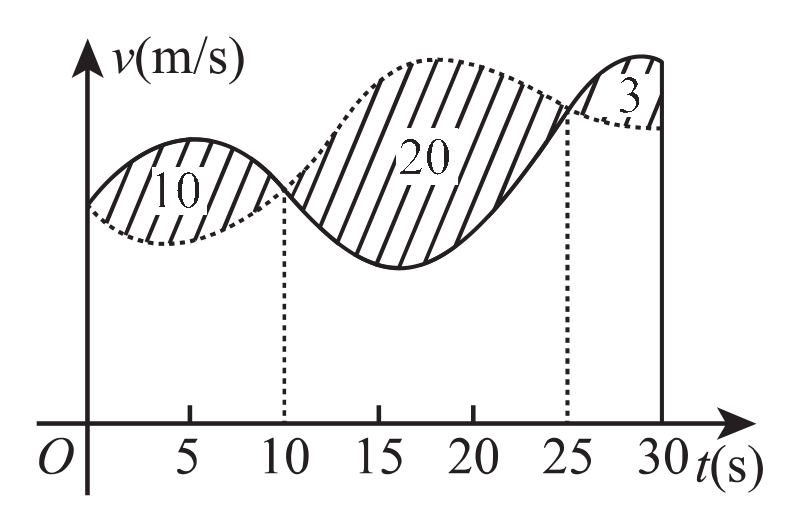

# 2017考研数学一真题

[annotation]: <id> (24922053-69e8-4bd8-8e51-426237cd619a)
[annotation]: <status> (public)
[annotation]: <create_time> (2021-03-07 11:21:51)
[annotation]: <category> (数学理论)
[annotation]: <tags> (考研数学)
[annotation]: <comments> (true)
[annotation]: <topic> (考研数学一真题)
[annotation]: <index> (-2017)
[annotation]: <url> (http://blog.ccyg.studio/article/24922053-69e8-4bd8-8e51-426237cd619a)

> 2017年全国硕士研究生招生考试数学一试题

## 一、选择题（本题共 8 小题，每小题 4 分，共 32 分）

---

(1) 若函数 $\displaystyle f(x)=\begin{cases} {\displaystyle {1 - \cos \sqrt{x} \over ax}}, & x > 0 \\ b, & x \leqslant 0\end{cases}$，在 $x = 0$ 处连续，则

- (A) $\displaystyle ab = {1 \over 2}$

- (B) $\displaystyle ab = - {1 \over 2}$

- (C) $\displaystyle ab = 0$

- (D) $\displaystyle ab = 2$

---

(2) 设函数 $f(x)$ 可导，且 $f(x)f'(x) > 0$，则

- (A) $f(1) > f(-1)$
- (B) $f(1) < f(-1)$
- (C) $|f(1)| > |f(-1)|$
- (D) $|f(1)| < |f(-1)|$

---

(3) 函数 $f(x, y, z) = x^2y + z^2$ 在点  $(1,2,0)$ 处沿向量 $\boldsymbol{n} = (1,2,2)$ 的方向导数为

- (A) $12$
- (B) $6$
- (C) $4$
- (D) $2$

---

(4) 甲、乙两人赛跑，计时开始时，甲在乙前方 $10$ （单位：$m$）处，图中，实线表示甲的速度曲线 $v = v_1(t)$(单位：$m/s$)，虚线表示乙的速度曲线 $v = v_2(t)$ ，三块阴影部分面积的数值依次是 $10,20,3$，计时开始后乙追上甲的时刻记为 $t_0$(单位：$s$)，则

- (A) $t_0 = 10$
- (B) $15 < t_0 <20$
- (C) $t_0 = 25$
- (D) $t_0 > 25$

---

(5) 设 $\boldsymbol{\alpha}$ 为 $n$ 维单位列向量，$E$ 为 $n$ 阶单位矩阵，则

- (A) $E -\boldsymbol{\alpha}\boldsymbol{\alpha}^T$ 不可逆
- (B) $E + \boldsymbol{\alpha}\boldsymbol{\alpha}^T$ 不可逆
- (C) $E + 2\boldsymbol{\alpha}\boldsymbol{\alpha}^T$ 不可逆
- (D) $E - 2\boldsymbol{\alpha}\boldsymbol{\alpha}^T$ 不可逆

---

(6) 已知矩阵 $\displaystyle A=\begin{bmatrix} 2 & 0 & 0 \\ 0 & 2 & 1 \\ 0 & 0 & 1\end{bmatrix}$，$\displaystyle B=\begin{bmatrix} 2 & 1 & 0 \\ 0 & 2 & 0 \\ 0 & 0 & 1\end{bmatrix}$，$\displaystyle C=\begin{bmatrix} 1 & 0 & 0 \\ 0 & 2 & 0 \\ 0 & 0 & 2\end{bmatrix}$，则

- (A) $A$ 与 $C$ 相似，$B$ 与 $C$ 相似
- (B) $A$ 与 $C$ 相似，$B$ 与 $C$ 不相似
- (C) $A$ 与 $C$ 不相似，$B$ 与 $C$ 相似
- (D) $A$ 与 $C$ 不相似，$B$ 与 $C$ 不相似

---

(7) 设 $A,B$ 为随机事件，若 $0< P(A) <1$，$0<P(B) < 1$，则 $P(A | B) > P(A | \overline{B} )$ 的充分必要条件是

- (A) $P(B | A) > P(B | \overline{A} )$
- (B) $P(B | A) < P(B | \overline{A} )$
- (C) $P(\overline{B} | A) > P(B | \overline{A} )$
- (D) $P(\overline{B} | A) < P(B | \overline{A} )$

---

(8) 设 $X_1,X_2, \cdots, X_n\,(n \geqslant 2)$ 为来自总体 $N(\mu,1)$ 的简单随机样本，记 $\displaystyle \overline{X} = {1\over n} \sum_{i=1}^n X_i$，则下列结论中不正确的是

- (A) $\displaystyle \sum_{i=1}^n (X_i - \mu)^2$ 服从 $\chi^2$ 分布

- (B) $2(X_n -X_1)^2$ 服从 $\chi^2$ 分布

- (C) $\displaystyle \sum_{i=1}^n (X_i - \overline{X})^2$ 服从 $\chi^2$ 分布

- (D) $n(\overline{X} - \mu)^2$ 服从 $\chi^2$ 分布

---

## 二、填空题（本题共 6 小题，每小题 4 分，共 24 分）

---

(9) 已知函数 $\displaystyle f(x) = {1 \over 1 + x^2}$，则 $f^{(3)} (0) =$ \_\_\_\_\_

---

(10) 微分方程 $y'' + 2y'+ 3y =0$ 的通解为 $y=$ \_\_\_\_\_

---

(11) 若曲线积分 $\displaystyle \int_L {xdx-aydy \over x^2 + y^2 - 1}$ 在区域 $D = \{(x, y) | x^2 + y^2 < 1 \}$ 内与路径无关，则 $a=$ \_\_\_\_\_

---

(12) 幂级数 $\displaystyle \sum_{n=1}^\infty (-1)^{n - 1} n x^{n - 1}$ 在区间 $(-1, 1)$ 内的和函数 $S(x)=$ \_\_\_\_\_

---

(13) 设矩阵  $\displaystyle A=\begin{bmatrix} 1 & 0 & 1 \\ 1 & 1 & 2 \\ 0 & 1 & 1\end{bmatrix}$，$\boldsymbol{\alpha}_1,\boldsymbol{\alpha}_2,\boldsymbol{\alpha}_3$ 为线性无关的 $3$ 维列向量组，则向量组 $A\boldsymbol{\alpha}_1,A\boldsymbol{\alpha}_2,A\boldsymbol{\alpha}_3$ 的秩为 \_\_\_\_\_

---

(14) 设随机变量 $X$ 的分布函数为 $\displaystyle F(x) =0.5\Phi(x) + 0.5\Phi\left(x - 4 \over 2\right)$，其中 $\Phi(x)$ 为标准正态分布函数，则 $E(X)=$ \_\_\_\_\_

---

## 三、解答题（本题共 9 小题，共 94 分）

---

(15) （本题满分 10 分）

设函数 $f(u,v)$ 具有 $2$ 阶连续偏导数，$y = f(e^x, \cos x)$，求 $\displaystyle {dy\over dx}\bigg|_{x = 0},{d^2y\over dx^2}\bigg|_{x = 0}$

---

(16) （本题满分 10 分）

求 $\displaystyle \lim_{n\to \infty} \sum_{k = 1}^n {k \over n^2}\ln \left( 1 + {k \over n}\right)$

---

(17) （本题满分 10 分）

已知函数 $y(x)$ 由方程 $x^3 + y^3 - 3x + 3y -2 =0$ 确定，求 $y(x)$ 的极值

---

(18) （本题满分 10 分）

设函数 $f(x)$ 在区间 $[0, 1]$ 上具有 $2$ 阶导数，且 $f(1) > 0$，$\displaystyle \lim_{x\to 0^+}{f(x) \over x}<0$，证明：

- (1) 方程 $f(x) = 0$ 在区间 $(0, 1)$ 内至少存在一个实根
- (2) 方程 $f(x)f''(x) + [f'(x)]^2 = 0$ 在区间 $(0, 1)$ 内至少存在两个不同实根

---

(19) （本题满分 10 分）

设薄片型物体 $S$ 是圆锥面 $z= \sqrt{x^2 + y^2}$ 被柱面 $z^2=2x$ 割下的有限部分，其上任一点的密度为 $μ(x,y,z) = 9\sqrt{x^2 + y^2 +z^2}$，记圆锥面与柱面的交线为 $C$

- (1) 求 $C$ 在 $xOy$ 平面上的投影曲线的方程
- (2) 求 $S$ 的质量 $M$

---

(20) （本题满分 11 分）

设 $3$ 阶矩阵 $A=(\boldsymbol{\alpha}_1,\boldsymbol{\alpha}_2,\boldsymbol{\alpha}_3)$ 有 $3$ 个不同的特征值，且 $\boldsymbol{\alpha}_3 = \boldsymbol{\alpha}_1 + 2\boldsymbol{\alpha}_2$

- (1) 证明 $r(A) = 2$
- (2) 设 $\boldsymbol{\beta} = \boldsymbol{\alpha}_1 + \boldsymbol{\alpha}_2 + \boldsymbol{\alpha}_3$，求方程组 $Ax =\boldsymbol{\beta}$ 的通解

---

(21) （本题满分 11 分）

设二次型 $f(x_1,x_2,x_3) = 2x_1^2 - x_2^2 + ax_3^2 + 2x_1x_2 - 8x_1x_3 + 2x_2x_3$ 在正交变换 $x = Qy$ 下的标准形为 $\lambda_1y_1^2 + \lambda_2y_2^2$，求 $a$ 的值及一个正交矩阵 $Q$

---

(22) （本题满分 11 分）

设随机变量 $X,Y$ 相互独立，且 $X$ 的概率分布为 $\displaystyle P\{X=0\} = P\{X = 2\} = {1 \over 2}$，$Y$ 的概率密度为 $\displaystyle f(y) = \begin{cases} 2y, & 0 < y < 1 \\ 0, & 其他\end{cases}$

- (1) 求 $P\{ Y \leqslant E(Y)\}$
- (2) 求 $Z=X+Y$ 的概率密度

---

(23) （本题满分 11 分）

某工程师为了解一台天平的精度，用该天平对一物体的质量做 $n$ 次测量，该物体的质量 $\mu$ 是已知的；设 $n$ 次测量结果 $X_1,X_2,\cdots,X_n$ 相互独立且均服从正态分布 $N(\mu ，\sigma^2)$，该工程师记录
的是 $n$ 次测量的绝对误差 $Z_i = |X_i - \mu|\,(i=1,2,\cdots,n)$，利用 $Z_1,Z_2,\cdots,Z_n$ 估计 $\sigma$

- (1) 求 $Z_1$ 的概率密度
- (2) 利用一阶矩求 $\sigma$ 的矩估计量
- (3) 求 $\sigma$ 的最大似然估计量