# 肖四题目背诵

[annotation]: <id> (1744cef3-705d-4445-92b9-54d8acad7964)
[annotation]: <status> (public)
[annotation]: <create_time> (2020-12-08 22:29:19)
[annotation]: <category> (朝花夕拾)
[annotation]: <tags> ()
[annotation]: <comments> (false)
[annotation]: <url> (http://blog.ccyg.studio/article/1744cef3-705d-4445-92b9-54d8acad7964)

## 马原

<iframe class="video" width="640" height="360" src="https://player.bilibili.com/player.html?aid=800593419&bvid=BV1Cy4y1v7nF&cid=264288904&page=1"></iframe>

### 1.1

**问题**：如何理解危与机共生并存，克服了危机即是机？

考点：同一性和斗争性

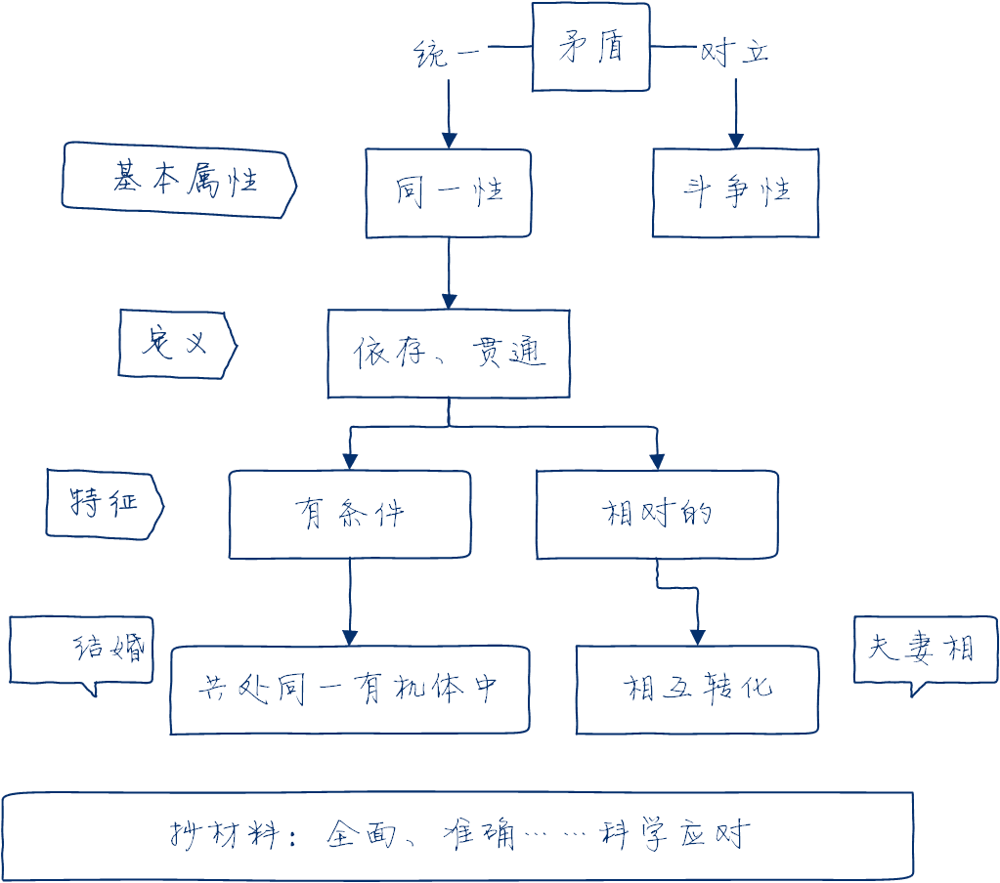

文字版：

- 矛盾是反应事物对立统一关系的哲学范畴。
- 同一性和斗争性是矛盾的两种基本属性。
- 同一性是指矛盾双方相互依存、相互贯通，是有条件的、相对的，共处一个统一体、一定条件下可以相互转化。
- 抄材料：我们要深入分析、全面权衡、准确识变、科学应对、主动求变；发挥**主观能动性**，创造条件使危与机相互转化。

---

**原答案：**

矛盾是反映事物内部和事物之间对立统一关系的哲学范畴。

**同一性和斗争性是矛盾的两种基本属性，是矛盾双方相互联系的两个方面。同一性是指矛盾双方相互依存、相互贯通的性质和趋势。**

它有两个方面的含义：

- **一是矛盾着的对立面相互依存，互为存在的前提，并共处于一个统一体中；**
- **二是矛盾着的对立面之间相互贯通， 在一定条件下相互转化。**

危与机作为矛盾的双方相伴而生、相互依存、相互转化。充分发挥主观能动性，积极创造条件，危机就能够被克服并转化为机遇。

---

### 1.2

**问题**：化危为机为什么要主动求变、准确识变、科学应变？

考点：唯物论 —— 意识观

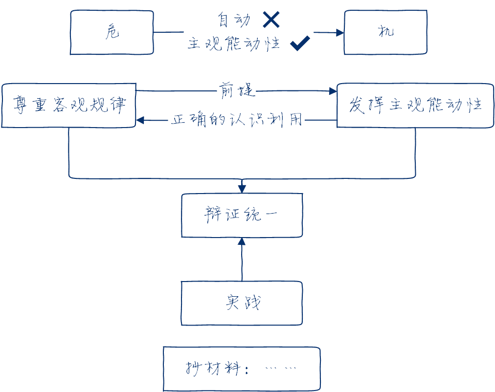

文字版：

- 危与机作为矛盾双方，一定条件下的相互转化不能自动实现，要发挥主观能动性。
- 尊重客观规律是正确发挥主观能动性的前提
- 充分发挥主观能动性才能正确认识和利用客观规律
- 抄题目材料：题目的实践方式体现了尊重客观规律和主观能动性的辩证统一

---

**原答案：**

作为矛盾的双方，危和机在一定条件下可以互相转化，但是这一转化不可能自动实现，需要发挥人的主观能动性，这就要求我们处理好主观能动性和客观规律性的关系。

**首先，尊重客观规律是正确发挥主观能动性的前提。人们只有在认识和掌握客观规律的基础上，才能达到认识世界和改造世界的目的。其次，只有充分发挥主观能动性，才能正确认识和利用客观规律。**

“准确识变、科学应变、主动求变”体现了尊重事物发展规律与发挥人的主观能动性的辩证统一。

---

### 1.3

**问题**：抗议斗争策略调整以及统筹推进疫情防控和经济社会发展工作体现了怎样的辩证思维？

考点：联系和发展、普遍性和特殊性

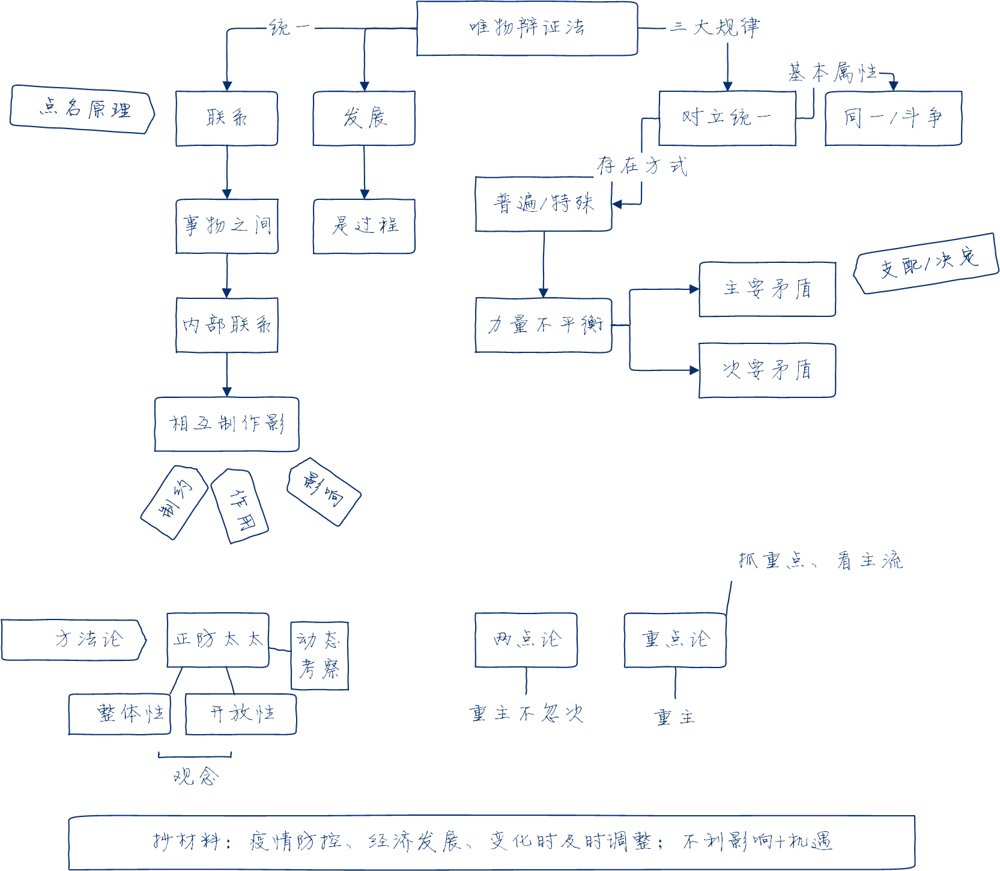

---

**原答案：**

**唯物辩证法要求我们用联系的、发展的、全面的观点看问题**，从事物相互联系、相互作用的关系出发，分析矛盾、抓住关键、找准重点，洞察事物发展规律。

**联系和发展的观点是唯物辩证法的总观点和总特征。要把握事物的普遍联系**，注意事物的系统性、整体性，从全局入手，统筹兼顾疫情防控和经济社会发展； **要坚持事物发展是过程的思想**， 把一切事物如实地看作变化、发展的过程，当疫情防控形势出现变化时就要及时调整应对策略；

**要抓关键、看主流**，主要矛盾是对事物发展起决定作用的矛盾，武汉和湖北作为主战场在抗疫斗争中起着决定性的作用；

**要坚持“两点论”和“重点论” 相结合**，既看到疫情带来的不利影响，也要看到其中蕴藏的机遇。

---

### 2.1

**问题**：如何理解“研究方向的选择要坚持需求导向，从国家急迫需要和长远需求出发，真正解决实际间题……社会一旦有技术上的需要，这种需要就会比十所大学更能把科学推向前进”?

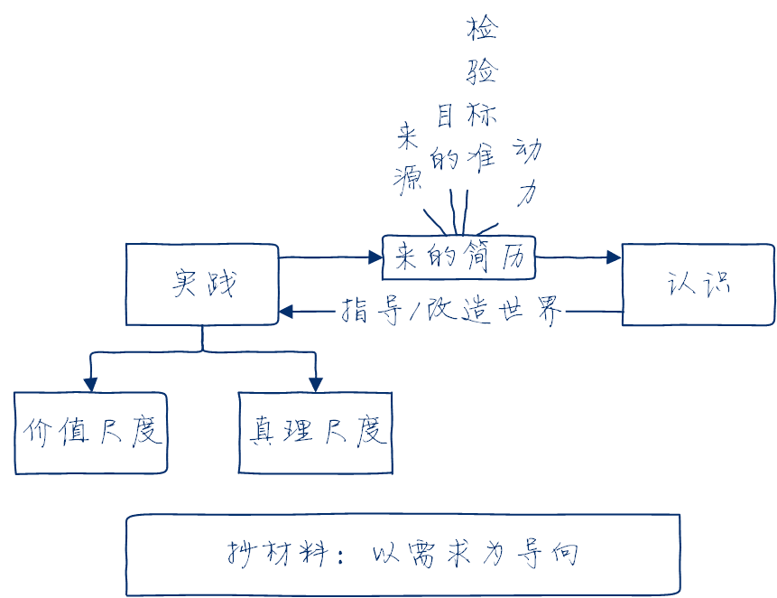

文字版：

- 实践是认识的来源
- 实践是认识的目的
- 实践是检验真理的唯一标准
- 实践是认识的动力
- 科学研究（实践）既要遵循真理尺度也要遵循价值尺度，（材料）即坚持问题和需求导向，真正解决实际问题。

---

**原答案：**

**第一，实践是认识发展的动力。实践的需要推动认识的产生和发展，推动人类的科学发现和技术发明，推动人类的思想进步和理论创新。** 实践的需要是推动认识在深度和广度上不断发展之根本。

**第二，实践是认识的目的。** 认识活动的目的并不在于认识活动本身，而在于更好地改造客体，更有效地指导实践。认识指导实践、为实践服务的过程，即认识价值的实现过程。**实践是认识的起点，也是认识的归宿，认识世界的目的是改造世界。** 因此，科学研究要坚持问题导向和需求导向，真正解决实际间题。

---

### 2.2

**问题**：运用真理的绝对性与相对性原理分析，为什么科技创新要“不迷信学术权威，不盲从既有学说，敢于大胆质疑， 认真实证，不断试验”?

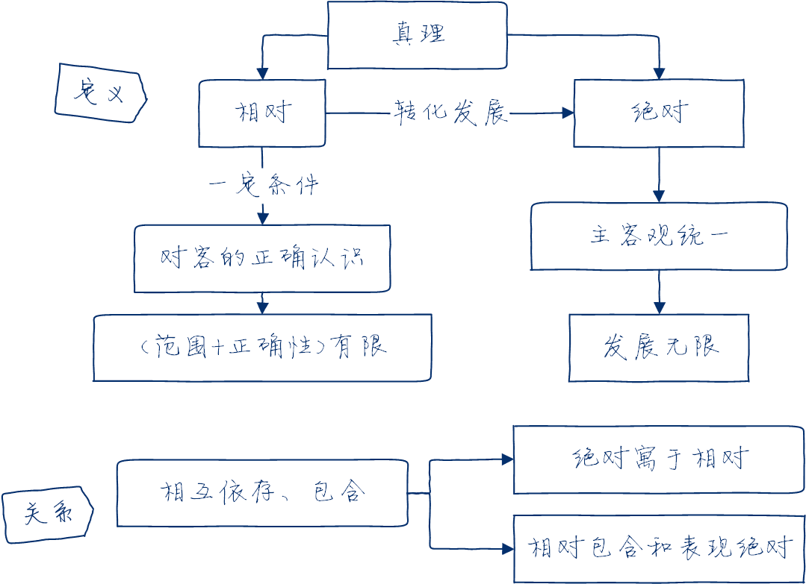

文字版：

真理是发展过程，既是绝对的，又是相对的，永远由相对向绝对转化发展，接近绝对性相对性指人在一定条件下对客观事物及其本质和发展规律的正确认识和正确程度是有限度的。

绝对性指主客观统一，发展无限性。
辩证统一：相互依存、包含。

---

**原答案：**

**真理是个发展过程，既是绝对的，又是相对的。** 真理的绝对性，是指真理主客观统一的确定性和发展的无限性。

**真理的相对性，是指人们在一定条件下对客观事物及其本质和发展规律的正确认识总是有限度的、不完善的。任何特定的真理不仅所反映的对象在范围上是有限的，而且其正确程度也是有限的。**

真理的绝对性和相对性是辩证统一的，二者相互依存、相互包含。

**真理永远处在由相对向绝对的转化和发展中，是从真理的相对性走向绝对性、接近绝对性的过程。**

因此，必须以科学的态度对待一切真理，不把已有的理论看成永恒不变的教条，不盲从既有学说，敢于大胆质疑，认真实证。

---

### 2.3

**问题**：从非理性因素在认识过程中的作用角度分析，为什么“假想和猜想的创新性至关重要？”

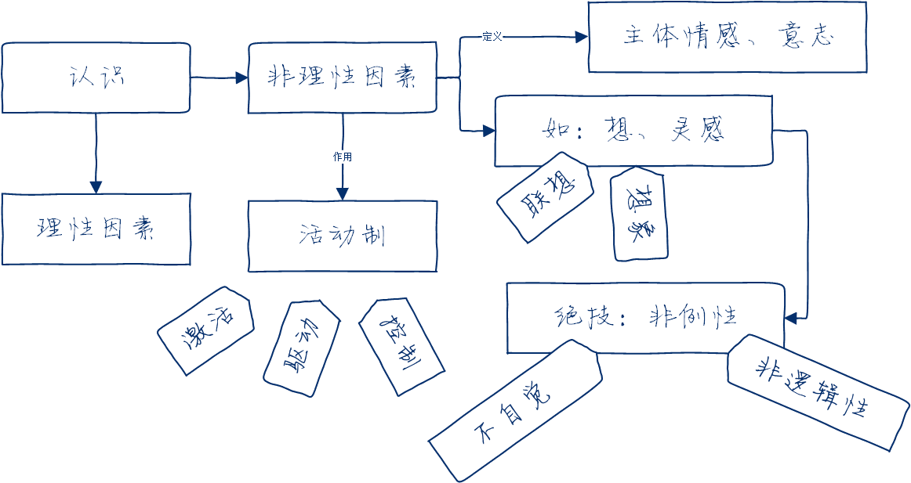

文字版：

- 认识由理性因素和非理性因素协同作用
- 非例性因素指主体情感和意志，包括不自觉、非逻辑性等特点的认识形式，如联想、想象、灵感。

---

**原答案：**

**非理性因素主要是指认识主体的情感和意志。从广义上看， 非理性因素还包括认识能力中具有不自觉、非逻辑性等特点的认识形式**，如联想、想象、猜测、直觉、顿悟、灵感等。

**人的认识过程是理性因素和非理性因素协同作用的结果。非理性因素对于人的认识能力和认识活动具有激活、驱动和控制作用**。

所以，在科学研究中，我们既要注重理性因素的作用，又应当充分发挥假设和猜想等非理性因素的积极作用。

---

### 3.1

**问题**：从实践与认识的辩证运动及其规律（即认识的反复性和无限性）角度分析，为什么国家诊疗方案要在不断的实践探索中“迭代“升级？

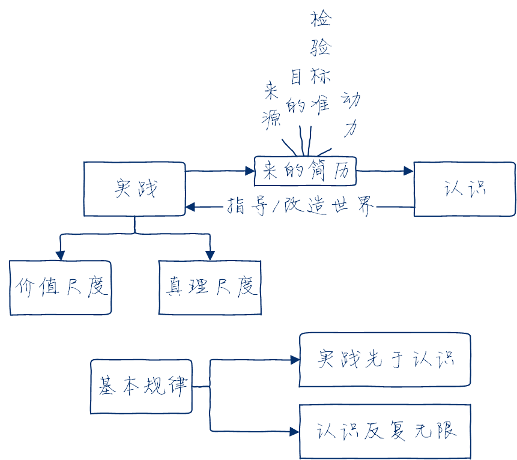

---

**原答案：**

**实践决定认识，实践是认识的基础。实践是认识的来源和认识发展的动力，是检验认识真理性的唯一标准。**

对新冠病毒的认识来自实践，抗疫斗争的发展推动着认识向前发展，对于病毒的认识也要在指导实践中经受检验并进一步完善。

**从实践到认识、从认识到实践，实践、认识、再实践、再认识，认识运动不断反复和无限发展，这是人类认识运动的辩证发展过程，也是人类认识运动的基本规律。**

这个过程既是认识在实践基础上沿着科学性方向不断深化发展的过程，也是实践在认识的指导下沿着合理性方向不断深入推进的过程。国家诊疗方案的“迭代”升级正是实践、认识、再实践、再认识的不断发展完善的过程。

---

### 3.2

**问题**：从辩证法的角度分析，为什么不能采取“一刀切”的做法，而是要“分区分级精准防控”?

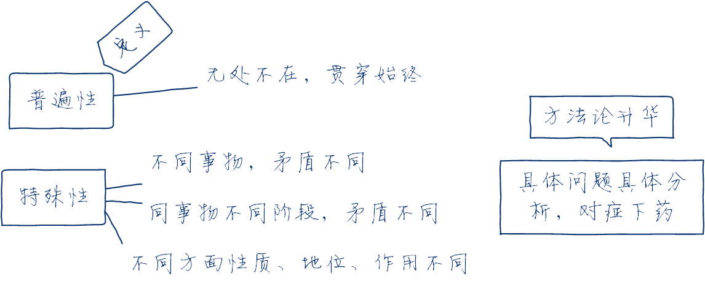

---

**原答案：**

矛盾的普遍性是指矛盾存在于一切事物中，存在于一切事物发展过程始终，即所谓矛盾无处不在，无时不有。

**矛盾的特殊性是指各个具体事物的矛盾及每一个矛盾的各个方面在发展的不同阶段上各有其特点。**

具体表现为三种情形：

- 一是不同事物的矛盾各有其特点；
- 二是同一事物的矛盾在不同发展过程和发展阶段各有不同特点；
- 三是构成事物的诸多矛盾以及每一矛盾的不同方面各有不同的性质、地位和作用。

**只有如实地分析矛盾的特珠性，才能认清事物的本质和发展规律，才能采取正确的方针和办法去解决矛盾**。因此，在疫情防
控中也要做到具体问题具体分析。

---

### 3.3

**问题**：分析“人类是荣辱与共的命运共同体，重大危机面前没有任何一个国家可以独善其身”所体现的辩证法原理。

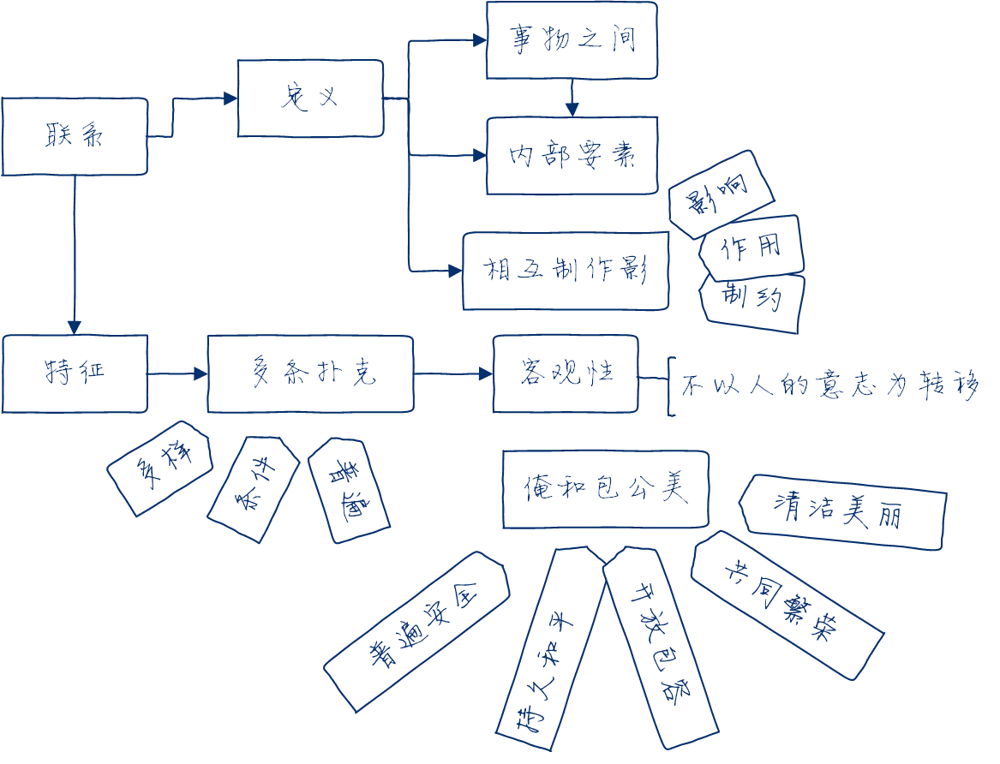

---

**原答案：**

联系的观点是唯物辩证法的总观点和总特征之一。

**联系具有客观性**。事物的联系是事物本身所固有的，不是主观臆想的。

**联系具有普遍性**。**任何事物都不能孤立存在，如同其他事物处于一定的相互联系之中。整个世界是相互联系的统一整体， 每一事物都是世界普遍联系中的一个成分或环节**，并通过它表现出联系的普遍性。

因此，国际社会必须团结起来携手应对疫情。

---

### 4.1

**问题**：运用真理尺度和价值尺度分析中国抗击新冠肺炎疫情的实践为什么会成功？

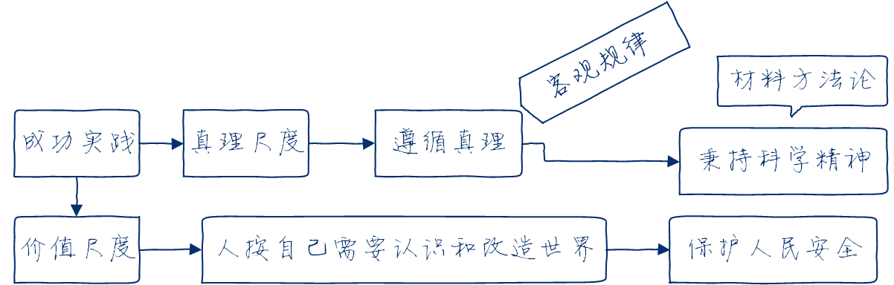

---

**原答案：**

**人们的实践活动总是受着真理尺度和价值尺度的制约。** 实践的真理尺度是指在实践中人们必须遵循正确反映客观事物本质和规律的真理。实践的价值尺度是指在实践中人们都是按照自己的尺度和需要去认识世界和改造世界。

**任何实践活动都是在这两种尺度的共同制约下进行的，任何成功的实践都是真理尺度和价值尺度的统一。**

我国在抗疫斗争伟大实践中秉持科学精神、科学态度，**符合真理尺度**；其目的是保护人民生命安全和身体健康，**符合价值尺度**。抗疫斗争的伟大实践，充分体现了真理尺度与价值尺度的辩证统一。

---

### 4.2

**问题**：运用唯物史观原理分析，为什么说“打赢疫情防控这场人民战争，必须紧紧依靠人民群众”?

---

**原答案：**

**在社会历史发展过程中，人民群众起着决定性的作用。人民群众是社会历史实践的主体，是历史的创造者。**

首先，人民群众是社会物质财富的创造者。其次，人民群众是社会精神财富的创造者。再次，人民群众是社会变革的决定力量。

**唯物史观关于人民群众是历史创造者的原理，要求我们坚持马克思主义群众观点，贯彻党的群众路线。**

因此，必须要广泛发动和依靠群众，才能打赢疫情防控的人民战争。

---

### 4.3

**问题**：如何理解“只有更好平衡人与自然的关系，维护生态系统平衡，才能守护人类健康”?

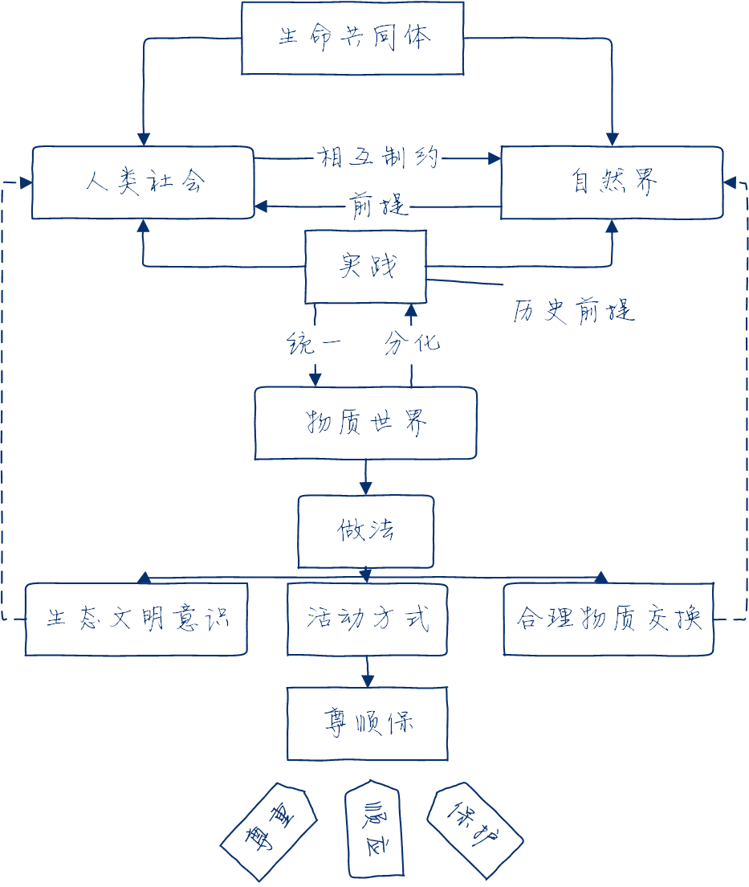

---

**原答案：**

当今世界出现的生态、环境、人口、资源等全球危机问题，并不单纯是自然系统内平衡关系的严重破坏，实际上也是人与自然关系的严重失衡。

**马克思认为，应当合理地调节人与自然之间的物质变换，在最无愧于和最适合人类本性的条件下进行这种物质变换。人与自然是生命共同体。**

人类必须尊重自然、顺应自然、保护自然。人类只有遵循自然规律才能有效防止在开发利用自然上走弯路，人类对大自然的伤害最终会伤及人类自身，这是无法抗拒的规律。

---

## 毛中特

### 1.1

如何理解今年完成脱贫攻坚任务“这对中国和世界都具有重大意义”?

**原答案**：

**对中国的意义在于**：

- 第一，解决了全面建成小康社会的底线任务和标志性指标，确保如期全面建成小康社会、实现第一个百年奋斗目标，为开启全面建设社会主义现代化国家新征程奠定坚实基础。
- 第二，历史性地解决困扰中华民族几千年的绝对贫困问题，在共同富裕道路上迈出坚实一步。
- 第三，兑现了我们党向人民向历史作出的庄严承诺，彰显了中国共产党领导和我国社会主义制度的政治优势。

**对世界的意义在于**：

- 第一，提前 10 年实现联合国 2030 年可持续发展议程的减贫目标，创造了人类反贫困史的中国奇迹，加快了全球减贫进程，增强了全世界消除绝对贫困、实现联合国 2030 年可持续发展目标的信心。
- 第二，反贫困是古今中外治国理政的一件大事，消除贫困是人类共同面临的重大课题。中国脱贫攻坚任务的完成，为全球贫困治理提供中国方案，为人类减贫事业贡献中国智慧。

---

### 1.2

如何理解脱贫摘帽、全面建成小康社会“不是终点，而是新生活、新奋斗的起点”?

**原答案**：

**首先，要巩固脱贫成果，这是打赢脱贫攻坚战必须解决的重要问题。脱贫不返贫才是真脱贫。** 这就要求我们保持现有帮扶政策总体稳定，加快建立防止返贫监测和帮扶机制，将返贫人口和新发生贫困人口及时纳入帮扶，为巩固脱贫成果提供制度保障。

**其次，要推动减贫战略和工作体系平稳转型，统筹纳入乡村振兴战略，接续推进全面脱贫与乡村振兴有效衔接，全力让脱贫群众迈向富裕。** 社会主义的本质要求是最终实现共同富裕。

**全面建成小康社会是我们党制定的“两个一百年”奋斗目标的第一个目标**，党的十九大制定了“两步走”实现第二个百年奋斗目标的战略。党的十九届五中全会在“两个一百年“
历史交汇点上，将“十四五”规划与 2035 年远景目标统筹考虑，提出了第十四个五年规划和 2035 年远景目标的建议。

**“十四五”时期我国将进入新发展阶段，我们可以乘势而上开启全面建设社会主义现代化国家新征程，实现“两个一百年”奋斗目标有机衔接，最终实现中华民族伟大复兴的中国梦。**

---

### 1.3

十九届五中全会为什么要第一次在党的全会文件中写上“全体人民共同富裕取得更为明显的实质性进展”“扎实推动共同富裕”?

**原答案**：

第一，共同富裕是社会主义的本质要求，是人民群众的共同期盼。我们推动经济社会发展，归根结底是要实现全体人民共同富裕。

第二，新中国成立以来特别是改革开放以来，我们党团结带领人民向着实现共同富裕的目标不懈努力。党的十八大以来，我们把脱贫攻坚作为重中之重，使现行标准下农村贫困人口全部脱贫，就是促进全体人民共同富裕的一项重大举措。

第三，虽然促进全体人民共同富裕是一项长期任务，但随着我国全面建成小康社会、开启全面建设社会主义现代化国家新征程，我们必须把促进全体人民共同富裕摆在更加重要的位置，提出一些重要要求和重大举措，向着这个目标更加积极有为地进行努力。

第四，在党的全会文件中第一次这样表述，既指明了前进方向和奋斗目标，也是实事求是、符合发展规律的，兼顾了需要和可能，有利于在工作中积极稳妥把握，在促进全体人民共同富裕的道路上不断向前迈进。

---

### 2.1

如何理解新发展格局“以国内大循环为主体”，但又“决不是封闭的国内循环，而是更加开放的国内国际双循环”?

**原答案**：

**第一，构建以国内大循环为主体、国内国际双循环相互促进的新发展格局，是立足中国自身发展阶段和发展条件，充分考虑经济全球化和外部环境变化所作出的战略抉择，是与时俱进提升我国经济发展水平的战略抉择，也是塑造我国国际经济合作和竞争新优势的战略抉择**。

改革开放以来特别是加入世贸组织后，我国加入国际大循环，市场和资源“两头在外”，形成“世界工厂”发展模式。近几年，逆全球化趋势加剧，有的国家大搞单边主义、保护主义

**传统国际循环明显弱化，我国发展面临的外部环境可能出现重大变化。在这种情况下，必须把发展立足点放在国内，更多依靠国内市场实现经济发展。大国经济的优势就是内部可循环**。

我国有全球最大和最有潜力的消费市场，具有巨大增长空间。要坚持**扩大内需这个战略基点**，形成国民经济良性循环；要坚持**供给侧结构性改革的战略方向**，提升供给体
系对国内需求的适配性。

**第二，新发展格局决不是封闭的国内循环，而是开放的国内国际双循环， 开放是国家进步的前提，封闭必然导致落后**。

当今世界，经济全球化潮流不可逆转，任何国家都无法关起门来搞建设，中国也早已同世界经济和国际体系深度融合。在新发展格局下，中国开放的大门将进一步敞开，增强国内国际经济联动效应，以自身复苏带动世界共同复苏，世界各国都将从中受益。

---

### 2.2

如何理解“十四五”时期经济社会发展以推动高质量发展为主题是“根据我国发展阶段、发展环境、发展条件变化作出的科学判断”?

**原答案**：

**以推动高质量发展为主题，是推动“十四五”时期经济社会发展的必然要求，是顺应发展阶段、发展条件、发展格局变化的必然要求**。

**第一，是适应我国社会主要矛盾变化的需要**。我国社会主要矛盾发生转化，发展中的矛盾和问题集中体现在发展质量上。

**第二，是构建新发展格局的需要**。推动高质量发展与构建新发展格局是内在统一的。

**第三，是深入防范化解重大风险的需要**。当今世界正经历百年未有之大变局，我国发展的外部环境日趋复杂。防范化解各类风险隐患，积极应对外部环境变化带来的冲击挑战，关键在于办好自己的事，提高发展质量，增强国家综合实力和抵御风险能力。

**第四，是顺利开启全面建设社会主义现代化国家新征程的需要**。

---

### 2.3

为什么说大力提升自主创新能力，尽快突破关键核心技术，“这是关系我国发展全局的重大问题，也是形成以国内大循环为主体的关键“? （或：为什么要“坚持创新在我国现代化建设全局中的核心地位，把科技自立自强作为国家发展的战略支撑＂，打好关键核心技术攻坚战？）

**原答案**：

**第一，当前世界新一轮科技革命和产业变革加速演进，科技创新成为百年未有之大变局中的“关键变量”**，只有科技发展的主动才能赢得国家发展的主动，要把科技的自立自强作为国家发展的战略支撑。

**第二，抓创新就是抓发展，谋创新就是谋未来**。我国经济社会发展比过去任何时候都更加需要科学技术解决方案，更加需要增强创新这个第一动力。加快科技创新是推动高质量发展、实现人民高品质生活、构建新发展格局、顺利开启全面建设社会主义现代化国家新征程的需要。

**第三，在单边主义、保护主义上升的大背景下，我国面临着很多“卡脖子”技术问题**。关键核心技术是要不来、买不来、讨不来的，我们必须走出适合国情的创新路子，特别是要把原始创新能力提升摆在更加突出的位置，努力实现更多“从 0 到 1” 的突破，把关键核心技术牢牢掌握在自己手中。

---

### 3.1

如何理解这次新冠肺炎疫情防控是对治理体系和治理能力的“一次大考”，而中国抗击疫情的成功“再次彰显了中国共产党领导和中国特色社会主义制度的显著优势”?

**原答案**：

第一，疫清防控不只是医药卫生间题，而是全方位的工作，必须发动全国人民，打一场疫清防控的人民战争、总体战、阻击战。这是对治理体系和治理能力的一次大考。

第二， 面对突如其来的严重疫情，党中央统揽全局、果断决策，以非常之举应对非常之事，有效遏制了疫情大面积蔓延，最大限度保护了人民生命安全和身体健康。

**抗疫斗争伟大实践再次证明，中国共产党所具有的无比坚强的领导力，是风雨来袭时中国人民最可需的主心骨。**

第三，衡量一个国家的制度是否成功、是否优越，一个重要方面就是看其在重大风险挑战面前，能不能号令四面、组织八方共同应对。在这次抗疫斗争中，**中国特色社会主义制度展现出非凡的组织动员能力、统筹协调能力、贯彻执行能力，发挥出集中力量办大事的独特优势，有力彰显了我国国家制度和国家治理体系的优越性**。

---

### 3.2

为什么要把坚持党的全面领导作为“十四五”时期经济社会发展必须遵循的首要原则？

**原答案**：

这是因为，**坚持党的全面领导是实现“十四五”时期经济社会发展目标最根本的保证**。

第一，**办好中国的事情，关键在党**。由中国共产党来领导中华民族伟大复兴的事业，是历史和人民的选择，具有充分的历史依据、理论依据、现实依据。

第二，**中国共产党领导是中国特色社会主义最本质的特征，是中国特色社会主义制度的最大优势，是推进经济社会发展不能脱离的最大现实**。“十四五”时期乃至更长时期，我国经济社会发展要破解许多难题，将会面临一系列风险挑战。越是这样，就越要坚持和加强党的全面领导。

---

### 3.3

如何理解要统筹发展与安全，“把安全发展贯穿国家发展各领域和全过程”?

**原答案**：

第一，**坚持总体安全观，统筹发展和安全**，增强忧患意识，做到居安思危，是我们党治国理政的一个重大原则。

第二，办好发展、安全两件大事，事关我们事业的成败。**安全是发展的前提，发展是安全的保障，二者相辅相成**。发展是我们党执政兴国的第一要务，国家安全是安邦定国的重要基石。

第三，**当前和今后一个时期是我国各类矛盾和风险易发期，各种可以预见和难以预见的风险因素明显增多。**我们必须把安全发展贯穿国家发展各领域和全过程，有效防范化解各类风险挑战，确保社会主义现代化事业顺利推进。

---

### 4.1

如何理解“绿水青山就是金山银山”? （或：为什么说“人不负青山，青山定不负人”?）

**原答案**：

绿水青山就是金山银山是重要的发展理念，也是推进现代化建设的重大原则。

**绿水青山就是金山银山，阐述了经济发展和生态环境保护的关系，揭示了保护生态环境就是保护生产力、改善生态环境就是发展生产力的道理，指明了实现发展和保护协同共生的新路径。生态环境保护和经济发展不是矛盾对立的关系，而是辩证统一的关系**。

绿水青山既是自然财富、生态财富，又是社会财富、经济财富。要坚持在发展中保护、在保护中发展，把绿水青山建得更美，把金山银山做得更大。

---

### 4.2

如何推动绿色发展，促进人与自然和谐共生？

**原答案**：

第一，坚持绿水青山就是金山银山理念，坚持尊重自然、顺应自然、保护自然，坚持节约优先、保护优先、自然恢复为主，守住自然生态安全边界。

第二，深入实施可持续发展战略，完善生态文明领域统筹协调机制，构建生态文明体系，促进经济社会发展全面绿色转型，推动形成绿色发展方式和生活方式，建设人与自然和谐共
生的现代化。

---

### 4.3

为什么要坚定文化自信，建设社会主义文化强国？

**原答案**：

第一，**文化自信是一个国家、一个民族发展中最基本、最深沉、最持久的力量**。坚定文化自信，是事关国运兴衰、事关文化安全、事关民族精神独立性的大问题。**坚定中国特色社会主义道路自信、理论自信、制度自信、说到底就是要坚持文化自信**。

第二，**文化兴国运兴，文化强民族强**。实现中华民族从站起来、富起来到强起来的伟大飞跃，必然伴随着中华文化大发展大繁荣，必然召唤着建设社会主义文化强国。建设社会主义文化强国 **是我们党团结带领人民长期奋斗追求的重要目标**；**是全面建设社会主义现代化国家的战略人物；是实现中华民族伟大复兴的基础支撑；是推动构建人类命运共同体的必然要求**。

---

## 史纲

### 1.1

如何理解抗美援朝战争是“以正义之师行正义之举”?

**原答案**：

新中国成立之初，百废待兴，百业待举，中国人民无比渴望和平安宁。

1950 年 6 月朝鲜内战爆发。**美国政府从其全球战略和冷战思维出发，作出武装干涉朝鲜内战的决定，并派遣第七舰队侵入台湾海峡**。

1950 年 10 月初，美军不顾中国政府一再警告，悍然越过三八线把战火烧到中朝边境。侵朝美军飞机多次轰炸中国东北边境地区，给人民生命财产造成严重损失，我国安全面临严重威胁。

**帝国主义侵略者将战火烧到了新中国的家门口，将战争强加在了中国人民头上**。值此危急关头，应朝鲜党和政府请求，中国党和政府毅然作出抗美援朝保家卫国的历史性决策。**抗美援朝战争的胜利，是正义的胜利、和平的胜利、人民的胜利**。

----

### 1.2

如何理解“抗美援朝战争伟大胜利，是中国人民站起来后屹立于世界东方的宣言书，是中华民族走向伟大复兴的重要里程碑”?

**原答案**：

伟大的抗美援朝战争，**抵御了帝国主义侵略扩张，捍卫了新中国安全，保卫了中国人民和平生活，稳定了朝鲜半岛局势，维护了亚洲和世界和平**。

经此一战：

- 第一，中国人民粉碎了侵略者陈兵国门、进而将新中国扼杀在摇篮之中的图谋，**打破了美军不可战胜的神话，新中国真正站稳了脚跟**；
- 第二，中国人民彻底扫除了近代以来任人宰割、仰人鼻息的百年耻辱，彻底扔掉了“东亚病夫”的帽子，**中国人民真正扬眉吐气了**；
- 第三， 中国人民打败了侵略者，震动了全世界，奠定了新中国在亚洲和国际事务中的重要地位，**彰显了新中国的大国地位**；
- 第四，人民军队在战争中学习战争，实现了由单一军种向诸军兵种合成军队转变，**极大促进了国防和军队现代化**；
- 第五，第二次世界大战结束后亚洲乃至世界的战略格局得到深刻塑造，全世界被压迫民族和人民争取民族独立和人民解放的正义事业受到极大鼓舞，**有力推动了世界和平与人类进步事业**。

----

### 1.3

为什么说“伟大抗美援朝精神跨越时空、历久弥新”?

**原答案**：

伟大的抗美援朝战争是一部荡气回肠的英雄史诗，伟大的抗美援朝精神：

- 是中国共产党人和人民军队崇高风范的**生动写照**；
- 是中华民族传统美德和优秀品格的**集中展示**，
- 是以爱国主义为核心的民族精神的**具体体现**，

永远是中国人民的宝贵精神财富。我们要铭记抗美援朝战争的艰辛历程和伟大胜利，敢于斗争、善于斗争，把新时代中国特色社会主义伟大业不断推向前进。

----

### 2.1

如何理解“实现中华民族伟大复兴是近代以来中华民族最伟大的梦想”?

**原答案**：

近代中国人民的斗争，主要是以挽救中华民族的危亡为出发点的。**推翻帝国主义、封建主义联合统治的半殖民地半封建的社会制度，争得民族独立和人民解放；改变中国经济技术落后的面貌，实现国家的富强和人民的富裕，这是近代以来中华民族面临的两大历史任务**。完成这两大历史任务，实现中华民族伟大复兴，是近代以来中华民族最伟大的梦想。

----

### 2.2

如何理解抗日战争的胜利是“中华民族从近代以来陷入深重危机走向伟大复兴的历史转折点”?

**原答案**：

**抗日战争是近代以来中国人民反抗外敌入侵第一次取得完全胜利的民族解放斗争**。

抗日战争的伟大胜利：

- 第一，彻底粉碎了日本军国主义殖民奴役中国的图谋，有力捍卫了国家主权和领土完整，彻底洗刷了近代以来抗击外来侵略屡战屡败的民族耻辱。
- 第二，重新确立了中国在世界上的大国地位，中国人民赢得了世界爱好和平人民的尊敬，中华民族赢得了崇高的民族声誉。
- 第三，坚定了中国人民追求民族独立、自由、解放的意志， 开启了古老中国凤凰涅槃、浴火重生的历史新征程。
- 第四，在抗日战争中孕育出的伟大抗战精神，是中国人民弥足珍贵的精神财富，将永远激励中国人民克服一切艰难险阻、为实现中华民族伟大复兴而奋斗。

----

### 2.3

为什么说“任何国家任何人都不能阻挡中华民族实现伟大复兴的历史步伐”?

**原答案**：

第一，**实现中华民族伟大复兴的基本内涵是实现国家富强、民族振兴、人民幸福**。它代表了中华民族和中国人民的整体利益， 是人民的事业、正义的事业，是任何国家任何人都阻挡不了的。

第二，**中国共产党的领导和中国特色社会主义是中国最大的政治优势和制度优势；坚实的综合国力，是实现中华民族伟大复兴的强大底气**。没有任何力量能够撼动社会主义中国的地位，没有任何力量能够阻挡中国人民和中华民族实现民族复兴的前进步伐。

第三，**中国共产党和中国人民清醒地认识到，中华民族伟大复兴绝不是轻轻松松就能实现的，必须进行伟大斗争**。中国共产党和中国人民是在斗争中成长和壮大起来的， 斗争精神贯穿于中国革命、建设、改革各个时期。凡是危害我国实现“两个一百年”奋斗目标、实现中华民族伟大复兴的各种风险挑战，只要来了，我们就必须进行坚决斗争，直至取得胜利。

----

### 3.1

如何理解首个中文全译本《共产党宣言》”为引导大批有志之士树立共产主义远大理想、投身民族解放振兴事业发挥了重要作用“?

**原答案**：

1920 年在中国出版的《共产党宣言》首个中文全译本，**适应了当时中国社会的需要，使马克思主义同中国人民革命的实践发生了联系**。

鸦片战争后，中国陷入内忧外患的黑暗境地。为了民族复兴，无数仁人志士进行了各式各样的尝试。在旧式的农民战争走到尽头，不触动封建根基的自强运动和改良主义屡屡碰壁，资产阶级革命派领导的革命和西方资本主义的其他种种方案纷纷破产的情况下，**十月革命一声炮响，为中国送来了马克思列宁主义，给苦苦探寻救亡图存出路的中国人民指明了前进方向、提供了全新选择**。

**五四运动以后，社会主义思潮在中国蓬勃兴起，马克思主义开始在知识界中得到传播**。《共产党宣言》首个中文全译本帮助一批爱国的进步青年，尤其是那些具有初步共产主义思想的知识分子，**逐步划清了资产阶级民主主义和无产阶级社会主义、科学社会主义和其他社会主义流派的界限，走上了马克思主义的道路**。

----

### 3.2

为什么说“真理的味道有多甘甜，中国共产党和中国人民最有话语权”?

**原答案**：

真理的味道那么香甜，**是因为马克思主义是科学的理论，它为中国革命、建设、改革提供了强大思想武器，深刻改变了中国。100 年前，马克思主义与中国工人运动相结合，产生了中国共产党**。

中国共产党的成立是中华民族发展史上一个开天辟地的大事变。在马克思主义的指导和中国共产党的领导下，中国人民经过长期奋斗，迎来了从站起来到富起来到强起来的伟大飞跃。《共产党宣言》中文首译本出版 100 年来中国大地上发生的翻天覆地的
巨变说明，中国共产党把马克思主义写在自己的旗帜上是完全正确的，历史和人民选择马克思主义是完全正确的。

----

### 3.3

为什么说“面向未来．走好新时代的长征路，我们更需要坚定理想信念、矢志拼搏奋斗”?

**原答案**：

**理想信念是和神之“钙”，信仰马克思主义，树立共产主义远大理想和中国特色社会主义共同理想，就能明确奋斗目标， 提高精神境界，提供前进动力**。

中华民族伟大复兴必须进行伟大斗争。面向未来，走好新时代的长征路，我们更需要认真学习马克思主义理论，坚定理想信念、矢志拼搏奋斗，努力为实现“两个一百年”奋斗目标、实现中华民族伟大复兴的中国梦贡献智慧和力量。

----

### 4.1

如何理解“只要我们党始终为人民执政、依靠人民执政，就能无往而不胜”?

**原答案**：

实现长期执政首先要解决为谁执政、靠谁执政的问题。历史是人民创造的，民心是最大的政治。

**党只有被人民群众当成自己人，得到人民群众的衷心支持和拥护，我们才能取得成功。革命、建设和改革都是如此**。党的根基在人民，血脉在人民，力量在人民。

**人民是我们党执政的最大底气，是我们党执政兴国的根本所在**。只要我们始终坚持以人民为中心，一切为了人民、一切依靠人民，就一定能够不断书写中华民族伟大复兴的精彩华章。

----

### 4.2

中国共产党是如何跳出“兴勃亡忽”的历史周期率的？

**原答案**：

能否成功跳出历史周期率，关键在党。新民主主义革命时期，毛泽东同志提出了“民主新路”，思考的是革命胜利以后将在全国执政的中国共产党如何不变质、如何依靠人民监督来实现长期执政的问题。

党的十八大以来，以习近平同志为核心的党中央**以自我革命的精神推进全面从严治党**，**不断提高党的执政能力和领导水平，不断增强党自我净化、自我完善、自我革新、自我提高的能力，构建起一套行之有效的权力监督制度和执纪执法体系，探索出了一条长期执政条件下解决自身问题、跳出历史周期率的成功道路**。

----

### 4.3

如何理解“实现中华民族伟大复兴，必须坚持中国共产党领导”? （或：如何理解“推进伟大事业，必须坚持中国共产党领导，把党锻造得更加坚强有力”？如何理解中国共产党是“风雨来袭时中国人民最可靠的主心骨”?）

**原答案**：

第一，**办好中国的事情，关键在党**。中国近代以来的历史说明，如果没有中国共产党领导，完成民族独立和解放的任务就可能拖得更久、付出的代价更大，我们的国家更不可取得今天这样的发展成就、更不可能具有今天这样的国际地位。**由中国共产党来领导中华民族伟大复兴的事业，是历史和人民的选择，具有充分的历史依据、理论依据、现实依据**。

第二，**中国共产党领导是中国特色社会主义最本质的特征，是中国特色社会主义制度的最大优势，是推进经济社会发展不能脱离的最大现实。坚持党的全面领导，是国家和民族兴旺发达的根本所在，是全国各族人民幸福安康的根本所在**。

----

## 思修

### 1.1

如何理解“正是这样的家国情怀，陪伴着我们踏实坚定地走过昨天． 走到今天、走向明天”?

**原答案**：

第一，**爱国主义是中华民族的民族心、民族魂，是中华民族最重要的精神财富，是中华民族精神的核心**。中国人自古以来就具有家国情怀。爱国是近代以来我国优秀企业家和科学家的光荣传统。

**第二，家国情怀早已沉淀为中华儿女的内在品格，成为中华优秀传统文化的宝贵财富。中国人坚信“爱家”与“爱国”的一体性，家是最小国，国是千万家；家是国的基础，国是家的延伸；国是第一位的，没有国就没有家**。

第三，当前，我国已站在了“两个一百年”奋斗目标的历史交汇点上。我们只有继续弘扬爱国主义精神，把家国情怀内化于心、外化于行，转化为每个人的行动，才能踏实坚定地走向中华民族伟大复兴的明天。

----

### 1.2

如何理解“世上没有从天而降的英雄，只有挺身而出的凡人”?

**原答案**：

伟大出自平凡，英雄来自人民。**评价人生价值的根本尺度，是看一个人的实践活动是否符合社会发展的客观规律，是否促进了历史的进步**。在今天，一个人只要用自己的劳动和聪明才智为国家和社会真诚奉献，为人民群众尽心尽力服务，就能在平凡的岗位上创造不平凡的~~业绩~~（成就），平凡的人就获得了不平凡的人生。

----

### 1.3

为什么说“幸福是奋斗出来的”,“实现中华民族伟大复兴的中国梦需要一代一代青年矢志奋斗”?

**原答案**：

幸福不会从天而降，梦想不会自动成真。**幸福源自奋斗，奋斗本身就是一种幸福，只有奋斗的人生才称得上幸福的人生。一切伟大成就都是接续奋斗的结果**。一切伟大事业都需要在继往开来中推进。青年是国家和民族的希望。一代一代青年不怕苦、不畏难、不惧牺牲，矢志奋斗，就一定能够实现中华民族伟大复兴的中国梦。

----

### 2.1

怎么理解伟大抗疫精神”是中国精神的生动诠释，丰富了民族精神和时代精神的内涵＂ ？

**原答案**：

**以爱国主义为核心的民族精神和以改革创新为核心的时代精神，构成了中国精神的基本内容。伟大抗疫精神同中华民族长期形成的特质禀赋和文化基因一脉相承，是爱国主义、集体主义、社会主义精神的传承和发展**。

第一，**生命至上**，集中体现了中国人民深厚的仁爱传统和中国共产党人以人民为中心的价值追求；

第二，**举国同心**，集中体现了中国人民万众一心、同甘共苦的团结伟力；

第三，**舍生忘死**，集中体现了中国人民敢于压倒一切困难而不被任何困难所压倒的顽强意志；

第四，**尊重科学**，集中体现了中国人民求真务实、开拓创新的实践品格；

第五，**命运与共**，集中体现了中国人民和衷共济、爱好和平的道义担当。

----

### 2.2

伟大抗疫精神如何“充分展示了中华优秀传统文化的强大力量”?

**原答案**：

**中国人历来抱有家国情怀，崇尚天下为公、克己奉公，信奉天下兴亡、匹夫有责，强调和衷共济、风雨同舟，倡导守望相助、尊老爱幼，讲求自由和自律统一、权利和责任统一**。在这场惊心动魄的抗疫大战中， 14 亿中国人民显示出高度的责任意识、自律观念、奉献精神、友爱情怀，铸就起团结一心、众志成城的强大精神防线，创造了人类同疾病斗争史上又一个英勇壮举。伟大抗疫精神充分展现了中华文明的深厚底蕴，彰显了中华优秀传统文化的强大力量。

----

### 2.3

为什么“站在‘两个一百年’奋斗目标的历史交汇点上，我们要大力弘扬伟大抗疫精神”?

**原答案**：

第一，**当前世界百年未有之大变局加速演进，国内改革发展稳定任务艰巨繁重，在前进道路上，我们仍然会面临各种各样的风险挑战**，同困难作斗争，是物质的角力，也是精神的对垒。

第二，**人无精神则不立，国无精神则不强**。唯有精神上站得住、站得稳， 一个民族才能在历史洪流中屹立不倒、挺立潮头。实现伟大梦想必须进行伟大斗争，只有坚定斗争意志，才能在全面建设社会主义现代化国家的新征程上创造新的更大奇迹。

第三，**在全社会大力弘扬伟大抗疫精神，激发起亿万人民战胜一切风险挑战的斗志，就能使之转化为全面建设社会主义现代化国家、实现中华民族伟大复兴的强大力量**。

----

### 3.1

如何理解“全民战疫，众志成城，守望相助，成为集体主义的生动写照”?

**原答案**：

在社会主义的中国，集体意识与集体精神从未缺席，也永不过时。这是团结一心、同舟共济的伟大团结精神的彰显，充分见证社会主义所特有的道德属性、中华民族所高扬的人文价值。

**集体主义是社会主义道德的原则，无私奉献、一心为公，是集体主义的最高层次**。

**集体主义可以增强一个人恪尽职守、担当任事的责任心，可以激发一个人面对困难和危险不退的战斗力，赋予一个人光辉的人格、英雄的风范**。

----

### 3.2

结合抗疫斗争说明弘扬社会主义核心价值观的重大意义。

**原答案**：

在抗疫斗争中，我们弘扬社会主义核心价值观，全国各族人民风雨同舟、和衷共济，爱国主义、集体主义、社会主义精神广为弘扬，涌现出大批英雄模范，形成了伟大的抗疫精神，为抗疫斗争取得重大战略成果铸就起团结一心、众志成城的强大精神防线。

**抗疫斗争是践行社会主义核心价值观的生动实践，彰显了全体人民共同的价值追求**。

抗疫斗争的实践再次证明，**社会主义核心价值观是当代中国发展进步的精神指引。它是坚持和发展中国特色社会主义的价值遵循；是提高国家文化软实力的迫切要求；是增进社会团结和谐的最大公约数**。

----

### 3.3

结合抗疫斗争说明志愿服务的重要作用。

**原答案**：

抗疫斗争中，广大志愿者弘扬奉献、友爱、互助、进步的志愿精神，以实际行动彰显了理想信念、爱心善意、责任担当，为夺取全国抗疫斗争重大战略成果作出了重要贡献。

参与志愿服务活动，一方面，帮助了他人、服务了社会，推动了社会道德水平的提高；另一方面，也把为社会和他人的服务看作自己应尽的义务和光荣的职责，从服务社会和帮助他人中获得成就感和幸福感。**志愿服务所体现出来的奉献精神，有助于传递社会关爱、弘扬社会正气，形成向上向善、诚信互助的良好社会风尚**。

**志愿服务是社会文明进步的重要标志，是广大志愿者奉献爱心的重要渠道，是培育和弘扬社会主义核心价值观的重要载体**。

----

### 4.1

结合民法典的立法过程，说明民法典为什么是人民美好生活的法治保障？

**原答案**：

**坚持以人民为中心，以保护民事权利为出发点和落脚点，使民法典成为新时代保护人民民事权利的好法典，是编纂民法典的基本原则之一。在编纂民法典过程中，坚持民主立法，公开征求意见，切实回应人民的法治需求**。

民法典调整规范自然人、法人等民事主体之间的人身关系和财产关系，这是社会生活和经济生活中最普通、最常见的社会关系和经济关系，涉及经济社会生活方方面面，同人民群众生产生活密不可分。

**民法典顺应保障人民群众合法权益的需求，构建完整的民事权利体系，体现对生命健康、财产安全、交易便利、生活幸福、人格尊严等各方面权利平等保护，不断增强人民群众的获得感、幸福感安全感，满足人民群众对美好生活新期待**。

民法典实施得好，人民群众权益就会得到法律保障，人与人之间的交往活动就会更加有序，社会就会更加和谐。

----

### 4.2

如何理解“实施好民法典是提高我们党治国理政水平的必然要求”?

**原答案**：

**民法典是全面依法治国的重要制度载体，很多规定同有关国家机关直接相关，直接涉及公民和法人的权力义务关系**。

国家机关履行职责、行使职权必须清楚自身行为和活动的范围和界限。各级党和国家机关开展工作要考虑民法典规定，**不能侵犯人民群众享有得合法民事权利**。同时，有关政府机关、监察机关、司法机关要依法履行职能、行使职权，**保护民事权利不受侵犯、促进民事关系和谐有序**。民法典实施水平和效果，是衡量各级党和国家机关履行为人民服务宗旨的重要尺度，对于以法治方式推进国家治理体系和治理能力现代化，切实维护最广大人民的根本利益，促进社会公平正义具有重要意义。

----

### 4.3

为什么针对网络直播出现的问题要不断完善“自律与他律的制度”!

**原答案**：

**网络空间是虚拟的，但运用网络空间的主体是现实的。因此，网络空间也是公共领域**。直播平台不是法外之地，更不是道德洼地，而应成为责任之地、价值高地。直播平台与现实社会一样，**既要提倡自由，也要遵守秩序，守法律，讲道德**。不能挑战法律底线、违反公序良俗。

**网络空间的治理与国家治理一样，既要靠法治，也要靠德治**。要强化道德对法治的支撑作用，把道德要求贯彻到法治建设中，运用法治手段解决道德领域突出问题。要正确使用网络工具，健康进行网络交往，自觉避免沉迷网络，加强网络道德自律，积极引导网络舆论。

----

## 当代

### 1.1

为什么“要站在历史正确的一边”?

**原答案**：

第一，所谓站在历史正确的一边，就是要遵循历史前进逻辑、顺应时代发展潮流、呼应人民群众期待。

第二，当今世界正经历百年未有之大变局，新一轮科技革命和产业变革蓬勃兴起。同时，国际上保护主义、单边主义上升，世界进入动荡变革期。面对严重危机，人类又一次站在了何去何从的十字路口。

第三，当今世界和平与发展的时代主题没有变，各国人民和平发展合作共赢的期待更加强烈。**从长远看，经济全球化仍是历史潮流，各国分工合作、互利共赢是长期趋势**。

第四，**我们要站在历史正确的一边**，在历史前进的逻辑中前进，在时代发展的潮流中发展，**坚持多边主义和国际关系民主化，坚定不移做多边主义的践行者，积极参与全球治理体系改革和建设**，坚定维护以联合国为核心的国际体系；**坚定不移全面扩大开放，推动建设开放性世界经济；选择合作而不是对抗，开放而不是封闭，互利共嬴而不是零和博弈**，携手前行，推动构建人类命运共同体。

----

### 1.2

如何理解从广交会的“中国制造”到进博会的＂中国市场”，再到服贸会的“中国服务”,“诠释着什么才是站在历史正确的一边”?

**原答案**：

第一，在新冠肺炎疫情全球大流行，全球经济发展遭遇严峻挑战，一些国家筑起保护主义、单边主义高墙的“特殊”时期，中国克服重重困难，如期举办三场盛会，用实际行动表明中国开放走向了全方位，让世界见证了言出必行、造福人类的责任担当，诠释着“在开放中创造机遇，在合作中破解难题”的东方智慧。

第二，开放合作是增强国际经贸活力的重要动力，是推动世界经济稳定复苏的现实要求，是促进人类社会不断进步的时代要求。中国坚定站在历史正确的一边，与世界的积极互动不断加深，**展现的是对历史规律的科学把握，也是对人民根本利益、对世界和平与发展高度负责的大国担当**。

----

### 1.3

站在历史正确的一边，应当如何改革完善全球治理体系?

**原答案**：

第一，要坚待走多边主义道路，维护以联合国为核心的国际体系。

第二，应该秉持共商共建共享原则，推动各国权利平等、机会平等、规则平等，使全球治理体系符合变化了的世界政治经济，满足应对全球性挑战的现实需要，顺应和平发展合作共赢的历史趋势。

第三，应该通过对话协商妥善化解。

第四，国家之间的竞争必须是积极和良性的，要守住道德底线和国际规范。

等五，大国更应该有大的样子，要提供更多全球公共产品，承担大国责任，展现大国担当。

----

### 2.1

如何理解当前世界”更加需要多边主义”,“多边主义必将战胜单边主义”?

**原答案**：

第一，**多边主义是人类历经劫难后的共同选择，是各国享受安宁与发展的重要保障，是联合国宪章宗旨和原则的集中体现**。联合国的 75 年，是多边主义快速发展的 75 年，为世界和平与发展作出了重要贡献。

第二，**人类社会已进入全球化时代，面对全球化，挑战是共同的，责任是共同的，命运也是共同的**。面对日益上升的全球性挑战，需要坚守多边主义的人间正道。

第三，**当前，单边主义不断抬头**，一些国家无视国际协议，自我优先，“退群” “毁约”，拒绝履行国际义务，捍卫多边主义更为紧迫和重要。**多边主义是绝大多数国家特别是中小国家的安身立命之本**。如果没有多边主义，二战以来建立的多边主义机制和国际秩序将受到严重破坏，中小国家将遭受巨大冲击。

第四，多边主义以维护世界和平、促进共同发展为目标，以维护公平正义、推动互利共赢为宗旨，以国际法和公认的国际关系基本准则为基础。**多边主义体现人类历史发展的正确方向**，是多边机制运作和发展的基础，是推进全球治理的必然要求，是维护世界和平、促进共同发展的有效途径。世界是各国人民的世界，世界面临的困难和挑战需要各国人民同舟共济、携手应对。当今世界，任何单边主义、保护主义、极端利己主义，都是根本行不通的。多边主义必将战胜单边主义。

----

### 2.2

中国为何始终坚定维护联合国在国际事务中的核心作用？

**原答案**：

**联合国是支持和践行多边主义的最重要的平台。多边主义正是联合国赖以存在的重要原则**，代表着各国平等参与全球治理、追求国际关系民主化的应有权利。**维护联合国在国际事务中的核心作用，就是维护和践行多边主义，归根结底，就是维护和支持世界和平发展的事业**。

中国是第一个在联合国宪章上签字的国家，是联合国创始会员国，也是安理会常任理事国中唯一一个发展中国家。**中国是维护和践行多边主义的重要力量，将始终做多边主义的践行者**，坚定维护以联合国为核心的国际体系，坚定维护以国际法为基础的国际秩序，坚定维护联合国在国际事务中的核心作用。

----

### 2.3

中国推动、建设和践行多边主义的方案是什么？

**原答案**：

第一，坚待多边主义，应当谋求共同发展。

第二，坚持多边主义，大国应体现责任担当。

第三，坚持多边主义，应当维护国际准则。

第四，坚待多边主义，应当树立共同体意识。

第五，坚待多边主义，应当坚持公平正义，以有效行动实现合作共赢。

----

### 3.1

为什么说“新冠肺炎疫清再次证明，只有构建人类命运共同体才是人间正道”?

**原答案**：

第一，**病毒没有国界，疫情不分种族。疫情面前，任何国家都难以独善其身**，世界各国只有一致行动、携手战斗，才能赢得全球“战疫”的最终胜利。

第二，**在经济全球化时代，像新冠肺炎疫情这样的重大突发事件不会是最后一次**，各种传统安全和非传统安全问题还会不断带来新的考验。这些危机挑战，事关人类前途命运。

第三，**历史与实践已经充分证明，地球是人类的共同家园，人类文明史就是一部全球交融合作的进步史**。人类社会正以前所未有的紧密方式联系在一起，越来越成为“你中有我、我中有你”的命运共同体。

----

### 3.2

中国在抗疫斗争中如何彰显构建人类命运共同体的大国担当？

**原答案**：

第一，面对来势汹汹的疫情，中方秉持人类命运共同体理念，既对本国人民生命安全和身体健康负责，也对全球公共卫生事业尽责，采取了最全面、最彻底、最严格的防控举措，付出巨大代价和牺牲，**阻断了疫情快速扩散流行的危险进程，构建起防止病毒国际传播的强有力第一道防线，有效阻止了疫情在全球范围的蔓延，为世界各国防控疫情争取了宝贵时间，为世界公共卫生事业作出了重要贡献**。

第二，中国本着依法、公开、透明、负责任的态度，**第一时间**向世界卫生组织、有关国家和地区通报疫情，**第一时间**分享新冠病毒基因序列，**第一时间**开展疫情防控国际合作，并毫无
保留地同各方分享防控和救治经验。

第三，中国在自身疫情防控面临巨大压力的清况下，尽己所能为国际社会提供援助，展现了真正负责任的大国担当。

第四，中国作为安理会常任理事国，一直是联合国事业的坚定支持者和全球公共产品的提供者。

----

### 3.3

中国和美国在国际秩序和全球治理问题上的矛盾的实质是什么？

**原答案**：

从本质上看，中国和美国在国际秩序和全球治理问题上的矛盾，绝不是美国一些政客所说的威权专制与自由民主之争，而是**多边主义与单边主义之争、公平正义与霸权强权之争、天下为公和美国优先之争**。

----

### 4.1

如何理解“新冠肺炎疫情不会是人类面临的最后一次危机，我们必须做好携手迎接更多全球性挑战的准备“?

**原答案**：

本世纪以来， “9·11” 恐怖袭击、国际金融危机、新冠肺炎疫情三场危机足以提醒世界，**我们已处于一个传统安全于非传统安全相互交织的时代，人类已经进入互联互通的新时代，各国利益休戚相关、命运紧密相连，是命运共同体**。非传统安全问题使国际社会的共同利益凸显，并以共同利益为基础走上了全面合作的轨道。**过去只靠一国政府来解决所有问题的思维和做法，在全球化时代已经越来越难以奏效，应对非传统安全威胁等全球性挑战是我们共同的责任**。

----

### 4.2

如何认识“谎言和欺骗战胜不了新冠病毒，‘甩锅’推责只能是损人也害己”？

**原答案**：

面对第二次世界大战结束以来最为严峻的全球卫生安全危机，美国的一些政客和媒体仍**从大国战略竞争视角对待中国，甚至把新冠肺炎疫情视为抑制中国崛起的机会，利用新冠肺炎疫情，抹黑和唱衰中国，人为地制造“新冷战”**。

这完全违背中美两国人民的根本利益，完全背离世界发展进步的潮流。事实上，美国真正的敌人不是中国，而是看不见的病毒和越来越多的非传统安全挑战。**进入新世纪发生的多次全球性危机，给美国和世界造成重大损失，但根源都不是传统的大国对抗或地缘政治冲突，而是恐怖主义、金融风险、各种病毒等**。

美方向中国“甩锅＂推责是不公平的，也是不道德的，解决不了任何问题。病毒无国界，疫清面前无赢家。大敌当前，美国应同中国和世界各国一道合作抗疫，共克时艰。

----

### 4.3

如何对全球性威胁和挑战给以全球性应对？

**原答案**：

- 第一，团结互助，共抗疫情；
- 第二，开放合作，共促复苏；
- 第三，秉持正义，维护和平。