# 肖四题目背诵

[annotation]: <id> (1744cef3-705d-4445-92b9-54d8acad7964)
[annotation]: <status> (public)
[annotation]: <create_time> (2020-12-08 22:29:19)
[annotation]: <category> (朝花夕拾)
[annotation]: <tags> ()
[annotation]: <comments> (false)
[annotation]: <url> (http://blog.ccyg.studio/article/1744cef3-705d-4445-92b9-54d8acad7964)

## 马原

<iframe class="video" width="640" height="360" src="https://player.bilibili.com/player.html?aid=800593419&bvid=BV1Cy4y1v7nF&cid=264288904&page=1"></iframe>

### 1.1

**问题**：如何理解危与机共生并存，克服了危机即是机？

考点：同一性和斗争性

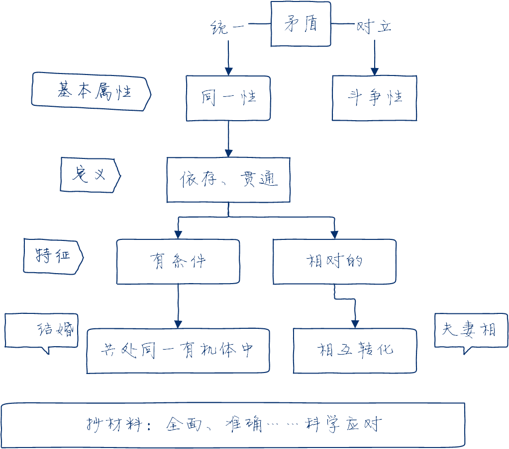

文字版：

- 矛盾是反应事物对立统一关系的哲学范畴。
- 同一性和斗争性是矛盾的两种基本属性。
- 同一性是指矛盾双方相互依存、相互贯通，是有条件的、相对的，共处一个统一体、一定条件下可以相互转化。
- 抄材料：我们要深入分析、全面权衡、准确识变、科学应对、主动求变；发挥**主观能动性**，创造条件使危与机相互转化。

---

**原答案：**

矛盾是反映事物内部和事物之间对立统一关系的哲学范畴。

**同一性和斗争性是矛盾的两种基本属性，是矛盾双方相互联系的两个方面。同一性是指矛盾双方相互依存、相互贯通的性质和趋势。**

它有两个方面的含义：

- **一是矛盾着的对立面相互依存，互为存在的前提，并共处千一个统一体中；**
- **二是矛盾着的对立面之间相互贯通， 在一定条件下相互转化。**

危与机作为矛盾的双方相伴而生、相互依存、相互转化。充分发挥主观能动性，积极创造条件，危机就能够被克服并转化为机遇。

---

### 1.2

**问题**：化危为机为什么要主动求变、准确识变、科学应变？

考点：唯物论 —— 意识观

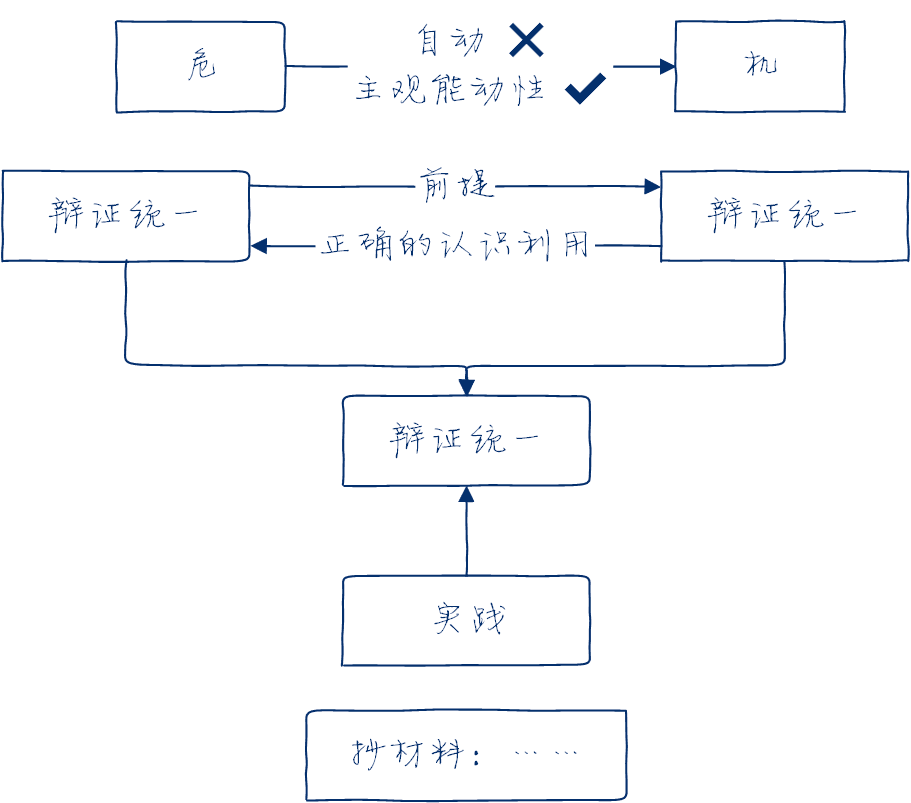

文字版：

- 危与机作为矛盾双方，一定条件下的相互转化不能自动实现，要发挥主观能动性。
- 尊重客观规律是正确发挥主观能动性的前提
- 充分发挥主观能动性才能正确认识和利用客观规律
- 抄题目材料：题目的实践方式体现了尊重客观规律和主观能动性的辩证统一

---

**原答案：**

作为矛盾的双方，危和机在一定条件下可以互相转化，但是这一转化不可能自动实现，需要发挥人的主观能动性，这就要求我们处理好主观能动性和客观规律性的关系。

**首先，尊重客观规律是正确发挥主观能动性的前提。人们只有在认识和掌握客观规律的基础上，才能达到认识世界和改造世界的目的。其次，只有充分发挥主观能动性，才能正确认识和利用客观规律。**

“准确识变、科学应变、主动求变”体现了尊重事物发展规律与发挥人的主观能动性的辩证统一。

---

### 1.3

**问题**：抗议斗争策略调整以及统筹推进疫情防控和经济社会发展工作体现了怎样的辩证思维？

考点：联系和发展、普遍性和特殊性

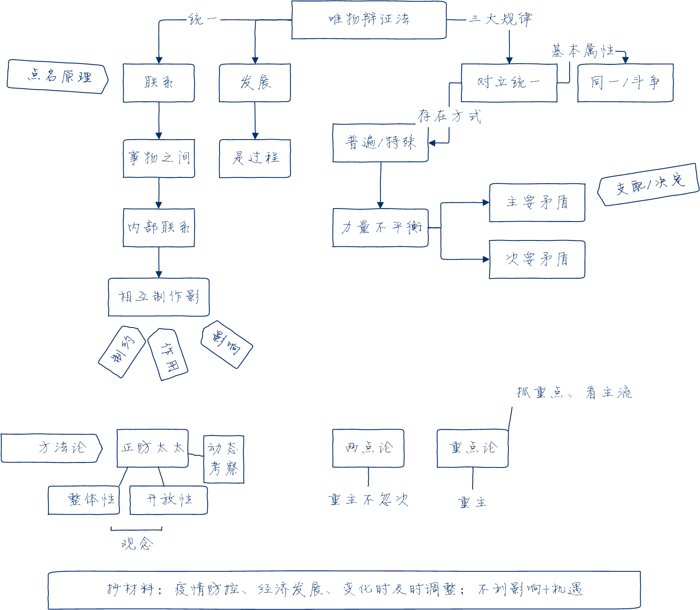

---

**原答案：**

**唯物辩证法要求我们用联系的、发展的、全面的观点看问题**，从事物相互联系、相互作用的关系出发，分析矛盾、抓住关键、找准重点，洞察事物发展规律。

**联系和发展的观点是唯物辩证法的总观点和总特征。要把握事物的普遍联系**，注意事物的系统性、整体性，从全局入手，统筹兼顾疫情防控和经济社会发展； **要坚持事物发展是过程的思想**， 把一切事物如实地看作变化、发展的过程，当疫情防控形势出现变化时就要及时调整应对策略；

**要抓关键、看主流**，主要矛盾是对事物发展起决定作用的矛盾，武汉和湖北作为主战场在抗疫斗争中起着决定性的作用；

**要坚持“两点论”和“重点论” 相结合**，既看到疫情带来的不利影响，也要看到其中蕴藏的机遇。

---

### 2.1

**问题**：如何理解“研究方向的选择要坚持需求导向，从国家急迫需要和长远需求出发，真正解决实际间题……社会一旦有技术上的需要，这种需要就会比十所大学更能把科学推向前进”?

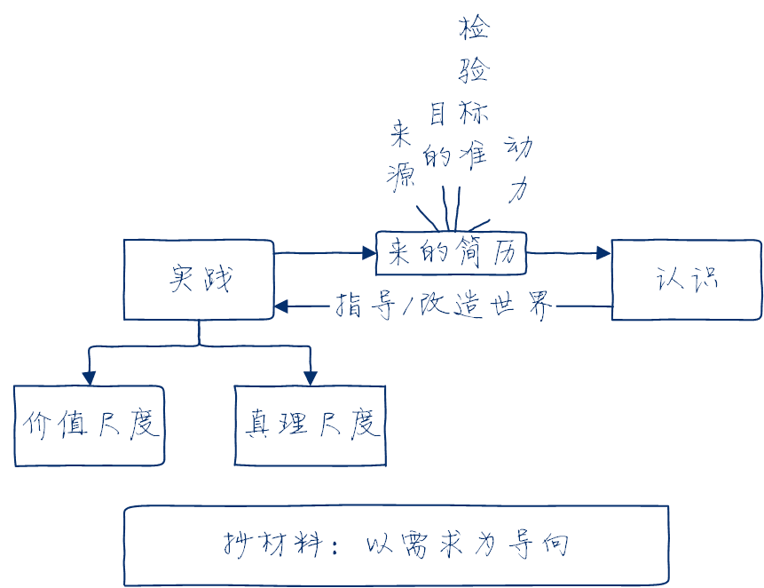

文字版：

- 实践是认识的来源
- 实践是认识的目的
- 实践是检验真理的唯一标准
- 实践是认识的动力
- 科学研究（实践）既要遵循真理尺度也要遵循价值尺度，（材料）即坚持问题和需求导向，真正解决实际问题。

---

**原答案：**

**第一，实践是认识发展的动力。实践的需要推动认识的产生和发展，推动人类的科学发现和技术发明，推动人类的思想进步和理论创新。** 实践的需要是推动认识在深度和广度上不断发展之根本。

**第二，实践是认识的目的。** 认识活动的目的并不在于认识活动本身，而在于更好地改造客体，更有效地指导实践。认识指导实践、为实践服务的过程，即认识价值的实现过程。**实践是认识的起点，也是认识的归宿，认识世界的目的是改造世界。** 因此，科学研究要坚持问题导向和需求导向，真正解决实际间题。

---

### 2.2

**问题**：运用真理的绝对性与相对性原理分析，为什么科技创新要“不迷信学术权威，不盲从既有学说，敢于大胆质疑， 认真实证，不断试验”?

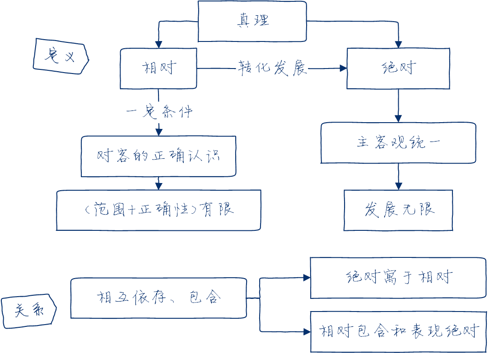

文字版：

真理是发展过程，既是绝对的，又是相对的，永远由相对向绝对转化发展，接近绝对性相对性指人在一定条件下对客观事物及其本质和发展规律的正确认识和正确程度是有限度的。

绝对性指主客观统一，发展无限性。
辩证统一：相互依存、包含。

---

**原答案：**

**真理是个发展过程，既是绝对的，又是相对的。** 真理的绝对性，是指真理主客观统一的确定性和发展的无限性。

**真理的相对性，是指人们在一定条件下对客观事物及其本质和发展规律的正确认识总是有限度的、不完善的。任何特定的真理不仅所反映的对象在范围上是有限的，而且其正确程度也是有限的。**

真理的绝对性和相对性是辩证统一的，二者相互依存、相互包含。

**真理永远处在由相对向绝对的转化和发展中，是从真理的相对性走向绝对性、接近绝对性的过程。**

因此，必须以科学的态度对待一切真理，不把已有的理论看成永恒不变的教条，不盲从既有学说，敢于大胆质疑，认真实证。

---

### 2.3

**问题**：从非理性因素在认识过程中的作用角度分析，为什么“假想和猜想的创新性至关重要？”

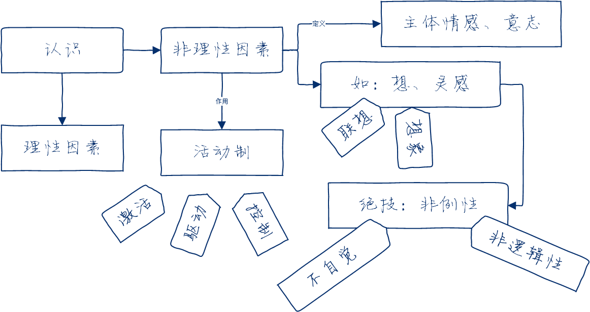

文字版：

- 认识由理性因素和非理性因素协同作用
- 非例性因素指主体情感和意志，包括不自觉、非逻辑性等特点的认识形式，如联想、想象、灵感。

---

**原答案：**

**非理性因素主要是指认识主体的情感和意志。从广义上看， 非理性因素还包括认识能力中具有不自觉、非逻辑性等特点的认识形式**，如联想、想象、猜测、直觉、顿悟、灵感等。

**人的认识过程是理性因素和非理性因素协同作用的结果。非理性因素对于人的认识能力和认识活动具有激活、驱动和控制作用**。

所以，在科学研究中，我们既要注重理性因素的作用，又应当充分发挥假设和猜想等非理性因素的积极作用。

---

### 3.1

**问题**：从实践与认识的辩证运动及其规律（即认识的反复性和无限性）角度分析，为什么国家诊疗方案要在不断的实践探索中“迭代“升级？

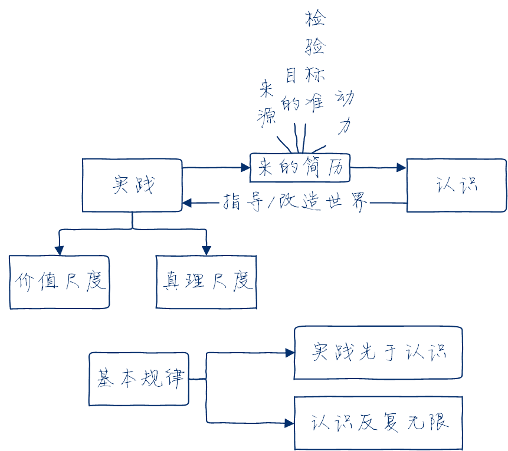

---

**原答案：**

**实践决定认识，实践是认识的基础。实践是认识的来源和认识发展的动动力，是检验认识真理性的唯一标准。**

对新冠病毒的认识来自实践，抗疫斗争的发展推动着认识向前发展，对于病毒的认识也要在指导实践中经受检验并进一步完善。

**从实践到认识、从从识到实践，实践、认识、再实践、再认识，认识运动不断反复和无限发展，这是人类认识运动的辩证发展过程，也是人类认识运动的基本规律。**

这个过程既是认识在实践基础上沿着科学性方向不断深化发展的过程，也是实践在认识的指导下沿着合理性方向不断深入推进的过程。国家诊疗方案的“迭代”升级正是实践、认识、再实践、再认识的不断发展完善的过程。

---

### 3.2

**问题**：从辩证法的角度分析，为什么不能采取“一刀切”的做法，而是要“分区分级精准防控”?

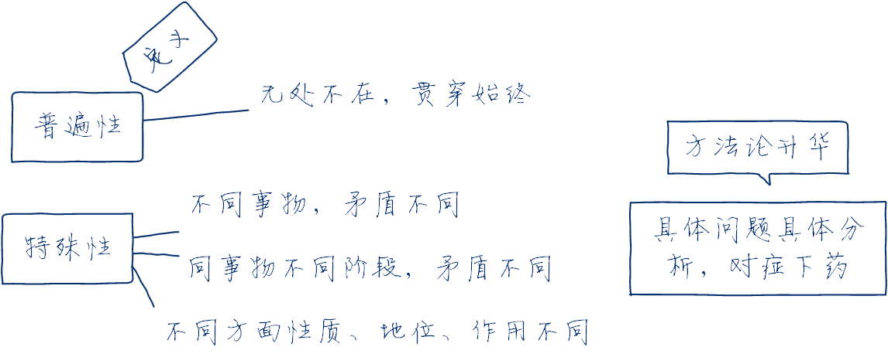

---

**原答案：**

矛盾的普遍性是指矛盾存在于一切事物中，存在于一切事物发展过程始终，即所谓矛盾无处不在，无时不有。

**矛盾的特殊性是指各个具体事物的矛盾及每一个矛盾的各个方面在发展的不同阶段上各有其特点。**

具体表现为三种情形：

- 一是不同事物的矛盾各有其特点；
- 二是同一事物的矛盾在不同发展过程和发展阶段各有不同特点；
- 三是构成事物的诸多矛盾以及每一矛盾的不同方面各有不同的性质、地位和作用。

只有如实地分析矛盾的特珠性，才能认清事物的本质和发展规律，才能采取正确的方针和办法去解决矛盾。因此，在疫情防
控中也要做到具体问题具体分析。

---

### 3.3

**问题**：分析“人类是荣辱与共的命运共同体，重大危机面前没有任何一个国家可以独善其身”所体现的辩证法原理。

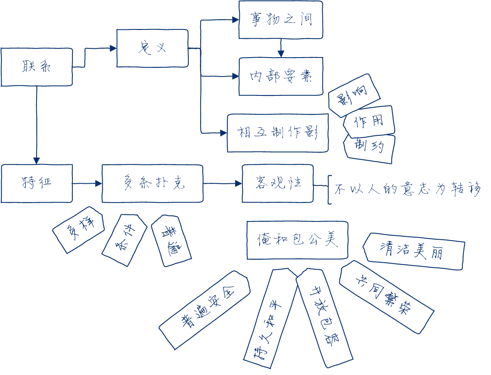

---

**原答案：**

联系的观点是唯物辩证法的总观点和总特征之一。

**联系具有客观性**。事物的联系是事物本身所固有的，不是主观臆想的。

**联系具有普遍性**。**任何事物都不能孤立存在，如同其他事物处于一定的相互联系之中。整个世界是相互联系的统一整体， 每一事物都是世界普遍联系中的一个成分或环节**，并通过它表现出联系的普遍性。

因此，国际社会必须团结起来携手应对疫情。

---

### 4.1

**问题**：运用真理尺度和价值尺度分析中国抗击新冠肺炎疫情的实践为什么会成功？

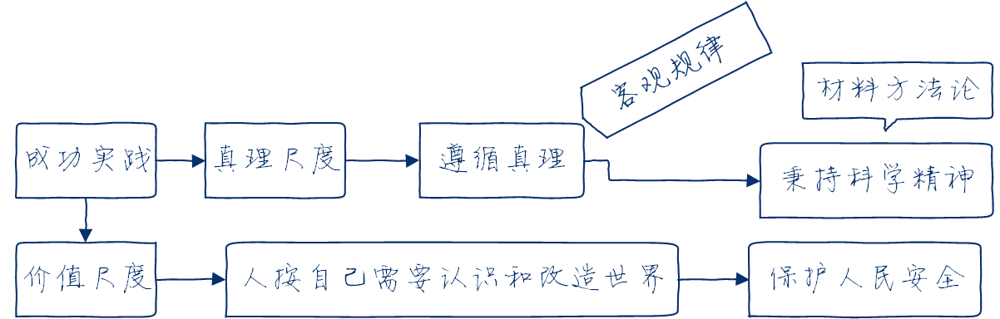

---

**原答案：**

**人们的实践活动总是受着真理尺度和价值尺度的制约。** 实践的真理尺度是指在实践中人们必须遵循正确反映客观事物本质和规律的真理。实践的价值尺度是指在实践中人们都是按照自己的尺度和需要去认识世界和改造世界。

**任何实践活动都是在这两种尺度的共同制约下进行的，任何成功的实践都是真理尺度和价值尺度的统一。**

我国在抗疫斗争伟大实践中秉持科学精神、科学态度，符合真理尺度；其目的是保护人民生命安全和身体健康，**符合价值尺度**。抗疫斗争的伟大实践，充分体现了真理尺度与价值尺度的辩证统一。

---

### 4.2

**问题**：运用唯物史观原理分析，为什么说“打赢疫情防控这场人民战争，必须紧紧依靠人民群众”?

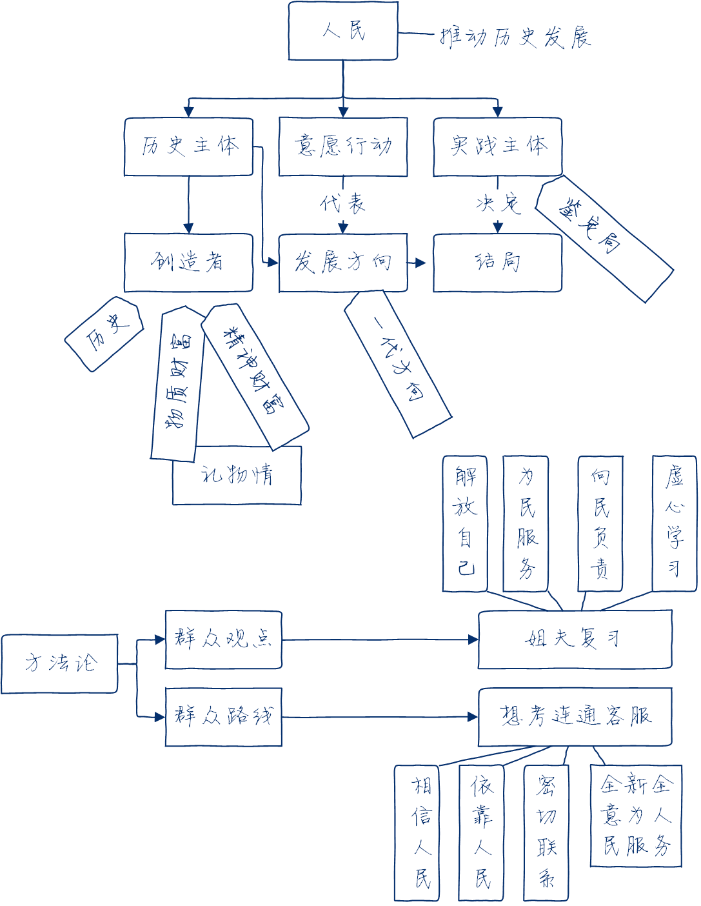

---

**原答案：**

**在社会历史发展过程中，人民群众起着决定性的作用。人民群众是社会历史实践的主体，是历史的创造者。**

首先，人民群众是社会物质财富的创造者。其次，人民群众是社会精神财富的创造者。再次，人民群众是社会变革的决定力量。

**唯物史观关于人民群众是历史创造者的原理，要求我们坚持马克思主义群众观点，贯彻党的群众路线。**

因此，必须要广泛发动和依靠群众，才能打赢疫情防控的人民战争。

---

### 4.3

**问题**：如何理解“只有更好平衡人与自然的关系，维护生态系统平衡，才能守护人类健康”?

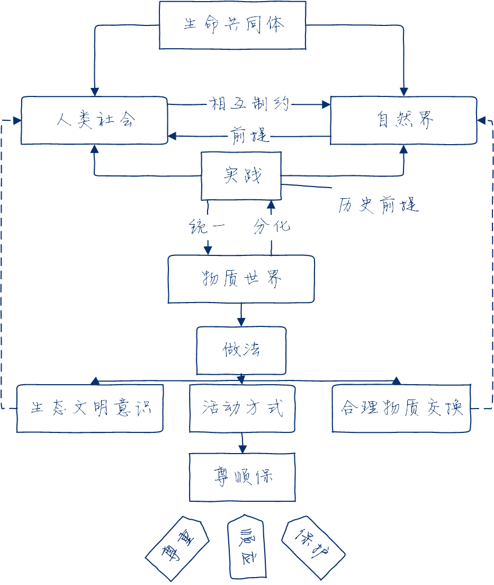

---

**原答案：**

当今世界出现的生态、环境、人口、资源等全球危机问题，并不单纯是自然系统内平衡关系的严重破坏，实际上也是人与自然关系的严重失衡。

**马克思认为，应当合理地调节人与自然之间的物质变换，在最无愧于和最适合人类本性的条件下进行这种物质变换。人与自然是生命共同体。**

人类必须尊重自然、顺应自然、保护自然。人类只有遵循自然规律才能有效防止在开发利用自然上走弯路，人类对大自然的伤害最终会伤及人类自身，这是无法抗拒的规律。

---
