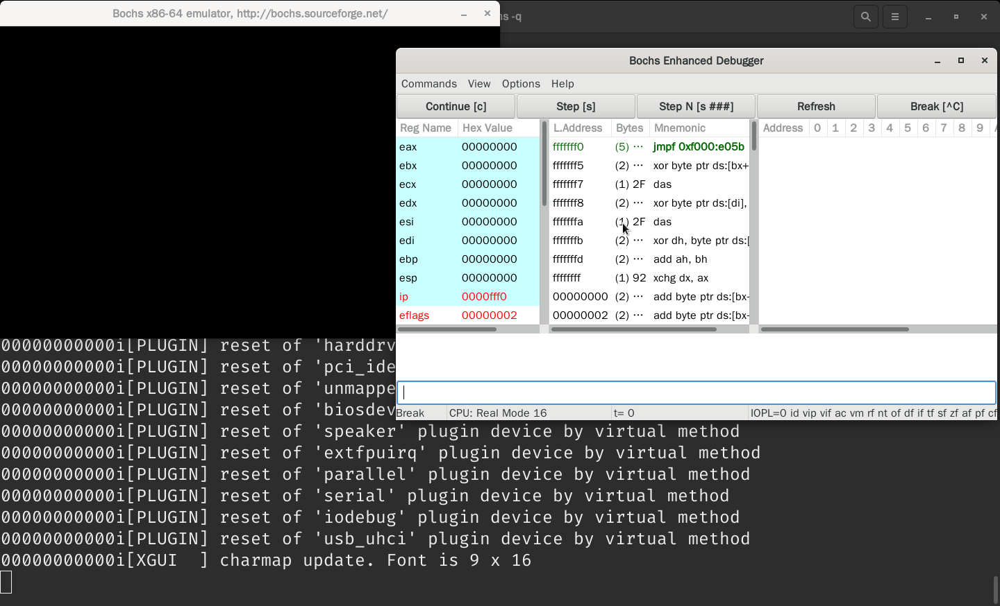
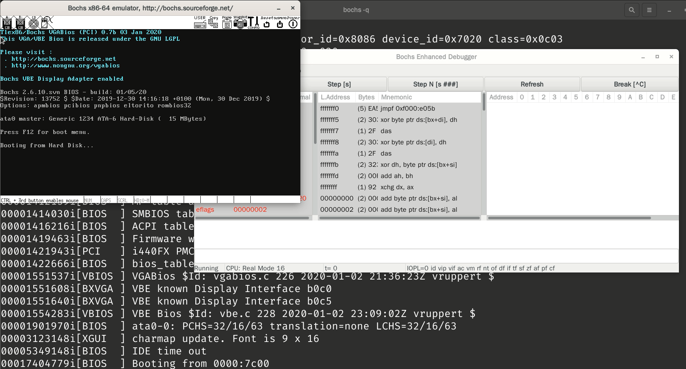

# x86 汇编语言 - 01 配置开发环境

[annotation]: <id> (eedcc300-35f4-4174-9622-c336aa8d7881)
[annotation]: <status> (public)
[annotation]: <create_time> (2021-03-10 14:34:27)
[annotation]: <category> (计算机技术)
[annotation]: <tags> (汇编语言)
[annotation]: <comments> (false)
[annotation]: <topic> (x86 汇编语言)
[annotation]: <index> (1)
[annotation]: <url> (http://blog.ccyg.studio/article/eedcc300-35f4-4174-9622-c336aa8d7881)

Bochs X86体系的模拟器，是一个虚拟机，用于调试操作系统，当然也可以用于学习 X86 汇编语言。

## 安装 Bochs

在 **Archlinux** 中可以执行以下的命令来安装 Bochs

```sh
pacman -S bochs
```

## 配置 Bochs

直接在命令行输入 `bochs` 得到如下的结果

```txt
You can also start bochs with the -q option to skip these menus.

1. Restore factory default configuration
2. Read options from...
3. Edit options
4. Save options to...
5. Restore the Bochs state from...
6. Begin simulation
7. Quit now
```

然后输入 `4` 然后输入文件名 `bochsrc` 直接将配置文件保存。

然后输入 `7` 退出 bochs，以下为刚刚保存的配置文件的内容。

```bochsrc
# configuration file generated by Bochs
plugin_ctrl: unmapped=true, biosdev=true, speaker=true, extfpuirq=true, parallel=true, serial=true, iodebug=true
config_interface: textconfig
display_library: x
memory: host=32, guest=32
romimage: file="/usr/share/bochs/BIOS-bochs-latest", address=0x00000000, options=none
vgaromimage: file="/usr/share/bochs/VGABIOS-lgpl-latest"
boot: floppy
floppy_bootsig_check: disabled=0
# no floppya
# no floppyb
ata0: enabled=true, ioaddr1=0x1f0, ioaddr2=0x3f0, irq=14
ata0-master: type=none
ata0-slave: type=none
ata1: enabled=true, ioaddr1=0x170, ioaddr2=0x370, irq=15
ata1-master: type=none
ata1-slave: type=none
ata2: enabled=false
ata3: enabled=false
optromimage1: file=none
optromimage2: file=none
optromimage3: file=none
optromimage4: file=none
optramimage1: file=none
optramimage2: file=none
optramimage3: file=none
optramimage4: file=none
pci: enabled=1, chipset=i440fx
vga: extension=vbe, update_freq=5, realtime=1
cpu: count=1:1:1, ips=4000000, quantum=16, model=bx_generic, reset_on_triple_fault=1, cpuid_limit_winnt=0, ignore_bad_msrs=1, mwait_is_nop=0
cpuid: level=6, stepping=3, model=3, family=6, vendor_string="AuthenticAMD", brand_string="AMD Athlon(tm) processor"
cpuid: mmx=true, apic=xapic, simd=sse2, sse4a=false, misaligned_sse=false, sep=true
cpuid: movbe=false, adx=false, aes=false, sha=false, xsave=false, xsaveopt=false, avx_f16c=false
cpuid: avx_fma=false, bmi=0, xop=false, fma4=false, tbm=false, x86_64=true, 1g_pages=false
cpuid: pcid=false, fsgsbase=false, smep=false, smap=false, mwait=true
print_timestamps: enabled=0
debugger_log: -
magic_break: enabled=0
port_e9_hack: enabled=0
private_colormap: enabled=0
clock: sync=none, time0=local, rtc_sync=0
# no cmosimage
log: -
logprefix: %t%e%d
debug: action=ignore
info: action=report
error: action=report
panic: action=ask
keyboard: type=mf, serial_delay=250, paste_delay=100000, user_shortcut=none
mouse: type=ps2, enabled=false, toggle=ctrl+mbutton
speaker: enabled=true, mode=system
parport1: enabled=true, file=none
parport2: enabled=false
com1: enabled=true, mode=null
com2: enabled=false
com3: enabled=false
com4: enabled=false
```

然后我们创建虚拟磁盘，输入命令

```sh
bximage -q -hd=16 -mode=create -sectsize=512 -imgmode=flat master.img
```

这样就可以创建一个 $16M$ 的硬盘。

其中输出的最下面输出了以下内容：

```txt
The following line should appear in your bochsrc:
  ata0-master: type=disk, path="master.img", mode=flat
```

也就是说要将上面这样代码写到 `bochsrc` 中，

然后将 `display_library: x` 改成 `display_library: x, options="gui_debug"` 
以支持 GUI 的调试方式。

将 `boot: floppy` 改成 `boot: disk`，以支持从硬盘启动。

最后改完的内容如下：

```bashsrc
# configuration file generated by Bochs
plugin_ctrl: unmapped=true, biosdev=true, speaker=true, extfpuirq=true, parallel=true, serial=true, iodebug=true
config_interface: textconfig
display_library: x, options="gui_debug"
memory: host=32, guest=32
romimage: file="/usr/share/bochs/BIOS-bochs-latest", address=0x00000000, options=none
vgaromimage: file="/usr/share/bochs/VGABIOS-lgpl-latest"
boot: disk
floppy_bootsig_check: disabled=0
# no floppya
# no floppyb
ata0: enabled=true, ioaddr1=0x1f0, ioaddr2=0x3f0, irq=14
ata0-master: type=disk, path="master.img", mode=flat
ata0-slave: type=none
ata1: enabled=true, ioaddr1=0x170, ioaddr2=0x370, irq=15
ata1-master: type=none
ata1-slave: type=none
ata2: enabled=false
ata3: enabled=false
optromimage1: file=none
optromimage2: file=none
optromimage3: file=none
optromimage4: file=none
optramimage1: file=none
optramimage2: file=none
optramimage3: file=none
optramimage4: file=none
pci: enabled=1, chipset=i440fx
vga: extension=vbe, update_freq=5, realtime=1
cpu: count=1:1:1, ips=4000000, quantum=16, model=bx_generic, reset_on_triple_fault=1, cpuid_limit_winnt=0, ignore_bad_msrs=1, mwait_is_nop=0
cpuid: level=6, stepping=3, model=3, family=6, vendor_string="AuthenticAMD", brand_string="AMD Athlon(tm) processor"
cpuid: mmx=true, apic=xapic, simd=sse2, sse4a=false, misaligned_sse=false, sep=true
cpuid: movbe=false, adx=false, aes=false, sha=false, xsave=false, xsaveopt=false, avx_f16c=false
cpuid: avx_fma=false, bmi=0, xop=false, fma4=false, tbm=false, x86_64=true, 1g_pages=false
cpuid: pcid=false, fsgsbase=false, smep=false, smap=false, mwait=true
print_timestamps: enabled=0
debugger_log: -
magic_break: enabled=0
port_e9_hack: enabled=0
private_colormap: enabled=0
clock: sync=none, time0=local, rtc_sync=0
# no cmosimage
log: -
logprefix: %t%e%d
debug: action=ignore
info: action=report
error: action=report
panic: action=ask
keyboard: type=mf, serial_delay=250, paste_delay=100000, user_shortcut=none
mouse: type=ps2, enabled=false, toggle=ctrl+mbutton
speaker: enabled=true, mode=system
parport1: enabled=true, file=none
parport2: enabled=false
com1: enabled=true, mode=null
com2: enabled=false
com3: enabled=false
com4: enabled=false
```

然后输入 `bochs -q` 运行 bochs，就会出现如下的状态



> 注：图片只是样例

不过目前我们还没有写任何的代码，这样只是说明 bochs 能用。

## 基本代码

```s
mov ax, 0xb800
mov ds, ax

mov byte [0], 'T'

halt:
    jmp halt

times 510 - ($ - $$) db 0
db 0x55, 0xaa
```

将代码保存到 `hello.asm` 文件

## 编译代码

然后运行

```sh
nasm -f bin hello.asm -o hello.bin
```

编译生成 `hello.bin` 文件

## 运行程序

运行

```sh
dd if=hello.bin of=master.img bs=512 count=1 conv=notrunc
```

将程序写入主引导扇区，然后运行 `bochs -q` 运行代码，点击 Debugger 上的 `Continue` 然后我们就可以看到如下内容 



然后在终端点击 `CTRL + C` 终止调试。
