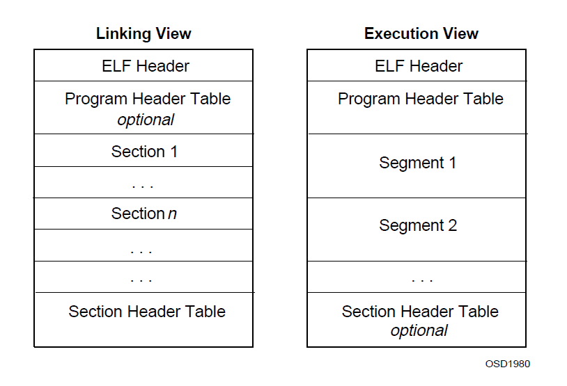

# ELF 文件格式

[annotation]: <id> (6973d37d-4f3f-4d3e-baa1-682f23a741c0)
[annotation]: <status> (public)
[annotation]: <create_time> (2021-03-04 18:32:44)
[annotation]: <category> (计算机技术)
[annotation]: <tags> (文件格式)
[annotation]: <comments> (false)
[annotation]: <url> (http://blog.ccyg.studio/article/6973d37d-4f3f-4d3e-baa1-682f23a741c0)

## ELF 文件简介

ELF 文件是用来干什么的呢？实际上它和 `.exe` 文件类型差不多，都是用来存储可执行程序的，不过 ELF 文件广泛应用于 **Linux** 操作系统，而非 **Windows**。不过 Windows 的可执行文件内省准确的说是 PE 文件，而 .exe 只不过是文件名后缀。

ELF 的全称是 **Executable and Linking Format** 也就是可执行和链接的格式，那么这种格式的文件主要有三种类型：

1. 可重定位的文件 (Relocatable file)  
    也就是静态链接库，是由汇编器汇编产生的 `.o` 文件，可以用来生成动态链接库，或者可执行文件。
2. 可执行的文件 (Executable file)：就是一般的程序
3. 可被共享的文件 (Shared object file)：
   就是所谓的动态链接库，即 `.so` 文件，静态库可以用来生成程序或者动态链接库，那么动态链接库的主要作用是，如果好多程序都用到了一段公共的代码，那么这部分公共的代码如果都写入每个程序里，那么就会占用额外的空间；那么就可以把这部分代码抽出来，放到操作系统的公共的地方，然后所有的程序都去调用这部分代码。这就是动态链接库的作用。

## ELF 文件格式



ELF 文件由四部分组成：

- ELF 头 (ELF header)
- 程序头部表 (Program header table)
- 节 (Sections)
- 节头部表 (Section header table)

实际上一个文件中不一定全部包含这些内容，而且它们的位置也不一定，只有 ELF 头的位置是固定的，在文件的头部；其余各部分的位置、大小等信息由 ELF 头中的各项值来决定。


程序头部表：如果存在的话，告诉系统如何创建进程映像，一个可执行文件必须有一个**程序头部表**；重定位文件不需要程序头部表；

节头部表：包含描述文件节的信息，每个节在表中有一个入口；每个入口包含一些关于节的信息，比如名称、大小等等。可链接文件必须有一个节头部表；其他的文件可能有也可能没有。

---

由于 ELF 文件力求支持从 8 位到 32 位不同架构的处理器，所以才定义了下表中这些数据类型，而且，ELF 还可能扩展到更大的架构；因此文件中有一些控制数据，从而让文件格式与机器无关。使得文件可以以一种通用的方式来表示内容。剩下的内容用来给目标处理器编码，无关文件是在什么机器上创建的。

| 名称          | 大小 | 对齐 | 用途               |
| ------------- | ---- | ---- | ------------------ |
| Elf32_Addr    | 4    | 4    | 无符号程序地址     |
| Elf32_Half    | 2    | 2    | 无符号中等大小整数 |
| Elf32_Off     | 4    | 4    | 无符号文件偏移     |
| Elf32_Sword   | 4    | 4    | 有符号大整数       |
| Elf32_Word    | 4    | 4    | 无符号大整数       |
| unsigned char | 1    | 1    | 无符号小整数       |

----

ELF header 的格式如下代码所示。

```c
#define EI_NIDENT (16)

typedef struct
{
  unsigned char	e_ident[EI_NIDENT];	/* Magic number and other info */
  Elf32_Half	e_type;			/* Object file type */
  Elf32_Half	e_machine;		/* Architecture */
  Elf32_Word	e_version;		/* Object file version */
  Elf32_Addr	e_entry;		/* Entry point virtual address */
  Elf32_Off	e_phoff;		/* Program header table file offset */
  Elf32_Off	e_shoff;		/* Section header table file offset */
  Elf32_Word	e_flags;		/* Processor-specific flags */
  Elf32_Half	e_ehsize;		/* ELF header size in bytes */
  Elf32_Half	e_phentsize;		/* Program header table entry size */
  Elf32_Half	e_phnum;		/* Program header table entry count */
  Elf32_Half	e_shentsize;		/* Section header table entry size */
  Elf32_Half	e_shnum;		/* Section header table entry count */
  Elf32_Half	e_shstrndx;		/* Section header string table index */
} Elf32_Ehdr;
```

- **e_ident**：最开头的16字节，其中包含用以表示 ELF 文件的字符，及其它与机器无关的信息。
- **e_type**：它标识的是改文件的类型，具体类型如下：

    | 名称      | 值     | 含义               |
    | --------- | ------ | ------------------ |
    | ET_NONE   | 0      | 无文件类型         |
    | ET_REL    | 1      | 可重定位文件       |
    | ET_EXEC   | 2      | 可执行文件         |
    | ET_DYN    | 3      | 可共享文件         |
    | ET_CORE   | 4      | 核心文件           |
    | ET_LOPROC | 0xff00 | Processor-specific |
    | ET_HIPROC | 0xffff | Processor-specific |

    ET_LOPROC 和 ET_HIPROC 之间的取值用来标识与处理器相关的文件格式

- **e_machine**：表示文件的体系结构

    | 名称           | 值    | 含义                    |
    | -------------- | ----- | ----------------------- |
    | ET_NONE        | 0     | No machine              |
    | EM_M32         | 1     | AT&T WE 32100           |
    | EM_SPARC       | 2     | SPARC                   |
    | EM_386         | 3     | Intel Architecture      |
    | EM_68K         | 4     | Motorola 68000          |
    | EM_88K         | 5     | Motorola 88000          |
    | EM_860         | 7     | Intel 80860             |
    | EM_MIPS        | 8     | MIPS RS3000 Big-Endian  |
    | EM_MIPS_RS4_BE | 10    | MIPS RS4000 Big-Endian  |
    | RESERVED       | 11-16 | Reserved for future use |

- **e_version**：文件版本，一般为常数 1
- **e_entry**：程序的入口地址
- **e_phoff**：程序头部表在文件中的偏移量（以字节计数）
- **e_shoff**：节头部表在文件中的偏移量（以字节计数）
- **e_flags**：ELF 标志位，用来标识一些 ELF 文件平台相关的属性。
- **e_ehsize**：ELF header 的大小（以字节计数）
- **e_phentsize**：程序头部表中每一个条目的大小
- **e_phnum**：程序头部表中有多少个条目
- **e_shentsize**：节头部表中每一个条目的大小
- **e_shnum**：节头部表中有多少个条目
- **e_shstrndx**：包含节名称的字符串表是第几个节（从零开始数）

## 节 Section

```c
typedef struct
{
  Elf32_Word	sh_name;		/* Section name (string tbl index) */
  Elf32_Word	sh_type;		/* Section type */
  Elf32_Word	sh_flags;		/* Section flags */
  Elf32_Addr	sh_addr;		/* Section virtual addr at execution */
  Elf32_Off	sh_offset;		/* Section file offset */
  Elf32_Word	sh_size;		/* Section size in bytes */
  Elf32_Word	sh_link;		/* Link to another section */
  Elf32_Word	sh_info;		/* Additional section information */
  Elf32_Word	sh_addralign;		/* Section alignment */
  Elf32_Word	sh_entsize;		/* Entry size if section holds table */
} Elf32_Shdr;
```

- sh_name: 节名称，值是字符串表的索引。
- sh_type: 节类型

    | 名字         | 值         | 描述                                   |
    | ------------ | ---------- | -------------------------------------- |
    | SHT_NULL     | 0          | 不可用                                 |
    | SHT_PROGBITS | 1          | 程序定义的                             |
    | SHT_SYMTAB   | 2          | 符号表                                 |
    | SHT_STRTAB   | 3          | 字符串表                               |
    | SHT_RELA     | 4          | 有附加的可重定位入口表，可能有多个     |
    | SHT_HASH     | 5          | 符号哈希表 动态链接必须有              |
    | SHT_DYNAMIC  | 6          | 动态链接信息                           |
    | SHT_NOTE     | 7          | 一些信息，暂缺                         |
    | SHT_NOBITS   | 8          | 不占用文件空间，                       |
    | SHT_REL      | 9          | 无附加的可重定位入口表                 |
    | SHT_SHLIB    | 10         | 保留                                   |
    | SHT_DYNSYM   | 11         | 符号表                                 |
    | SHT_LOPROC   | 0x70000000 | 这个范围内的值为特定于处理器的语义保留 |
    | SHT_HIPROC   | 0x7fffffff | 同上                                   |
    | SHT_LOUSER   | 0x80000000 | 此值指定为应用程序保留的索引范围的下界 |
    | SHT_HIUSER   | 0xffffffff | 同上，上界                             |

- sh_flags: 
    
    - SHF_WRITE: 可写
    - SHF_ALLOC: 占用内存
    - SHF_EXECINSTR: 包含可执行指令
    - SHF_MASKPROC: 掩码中包含的所有位都为特定于处理器的语义保留

- sh_addr: 如果该节出现在进程的内存映像中，则该成员给出该节的第一个字节应该驻留的地址。否则，成员为 0
- sh_offset: 该节的从文件开头的偏移值
- sh_size: 该节的尺寸
- sh_link: 节头表的索引链接，
- sh_info: 额外的信息，依赖于节类型
- sh_addralign: 一些节有对齐的限制，
- sh_entsize: 有些 section 保存着一个由固定大小的条目组成的表，比如符号表。对于这样的 section，该成员给出每个条目的大小(以字节为单位)。如果 section 没有包含固定大小的表项，则成员包含0。

### 特殊的节

| 名称      | 类型         | 属性                      |
| --------- | ------------ | ------------------------- |
| .bss      | SHT_NOBITS   | SHF_ALLOC+SHF_WRITE       |
| .comment  | SHT_PROGBITS | none                      |
| .data     | SHT_PROGBITS | SHF_ALLOC + SHF_WRITE     |
| .data1    | SHT_PROGBITS | SHF_ALLOC + SHF_WRITE     |
| .debug    | SHT_PROGBITS | none                      |
| .dynamic  | SHT_DYNAMIC  | see below                 |
| .hash     | SHT_HASH     | SHF_ALLOC                 |
| .line     | SHT_PROGBITS | none                      |
| .note     | SHT_NOTE     | none                      |
| .rodata   | SHT_PROGBITS | SHF_ALLOC                 |
| .rodata1  | SHT_PROGBITS | SHF_ALLOC                 |
| .shstrtab | SHT_STRTAB   | none                      |
| .strtab   | SHT_STRTAB   | see below                 |
| .symtab   | SHT_SYMTAB   | see below                 |
| .text     | SHT_PROGBITS | SHF_ALLOC + SHF_EXECINSTR |

- .bss / 包含了未初始化的数据，通常用于缓存。
- .comment / 版本控制信息
- .data .data1 / 包含已经初始化的数据
- .debug / 用于程序调试
- .dynamic / 包含动态链接信息和一些属性，SHF_WRITE 由操作系统和处理器来决定
- .hash / 包含符号哈希表
- .line / 包含了行信息用于调试，描述了源码和机器码之间的关系。
- .note / 一些辅助信息 #TODO 暂缺
- .rodata, .rodata1 / 包含了只读的数据
- .shstrtab / 保存节名称
- .strtab / 保存字符串，大多数情况下字符串用于表示与符号表相关的名称
- .symtab / 保存符号表
- .text / 代码

> 节名称前面加点 `.` 表示该节是系统保留的，如果满意的话应用程序依然可能使用这些节。应用程序可能使用没有前缀的名字来避免名字冲突。目标文件永续定义上面列表中没有的名字，而且同一个名字的节允许有多个。

## 字符串表

字符串表保存了 `\0` 结尾的字符序列，一般称之为字符串。用于表示符号和节的名称。

## 符号表

目标文件的符号表保存了需要定位和重定位的程序符号和引用。符号表索引是一个数组的索引。索引 0 指定了符号表的入口，预留了未定义的符号。初始的符号将在索引 0 之后。

```c
typedef struct {
    Elf32_Word st_name;
    Elf32_Addr st_value;
    Elf32_Word st_size;
    unsigned char st_info;
    unsigned char st_other;
    Elf32_Half st_shndx;
} Elf32_Sym;
```

- st_name : 保存了符号字符串表索引，保存了符号的名称
- st_value : 给出了符号关联的数据，依赖于上下文，可能是绝对值，一个地址等等
- st_size : 很多符号有关联的尺寸，例如一个数据对象的尺寸是这个对象包含的字节数，如果为 0 则表示没有尺寸或者尺寸未知。
- st_info : 指定了符号类型和绑定的属性，下面的代码指明了如可操作。

```cpp
#define ELF32_ST_BIND(i) ((i)>>4)
#define ELF32_ST_TYPE(i) ((i)&0xf)
#define ELF32_ST_INFO(b,t) (((b)<<4)+((t)&0xf))
```

- st_other : 目前没有意义
- st_shndx : 每个符号表入口与某些 section 有关联；这个属性确定了关联的 section 头在头表中的索引。

### 符号绑定

| 名称       | 值  |
| ---------- | --- |
| STB_LOCAL  | 0   |
| STB_GLOBAL | 1   |
| STB_WEAK   | 2   |
| STB_LOPROC | 13  |
| STB_HIPROC | 15  |

- STB_LOCAL: 本地符号对于外部目标文件不可见，多个目标文件中可能存在同名的本地符号，但是并不会相互影响。
- STB_GLOBAL: 全局符号对于所有的目标文件在组合时都是可见的，不同文件可能使用同一个符号，该符号定义在一个特定的目标文件中。
- STB_WEAK: 弱符号比较像全局符号，但是他们有更低的优先级。例如，可以在库文件中定义弱符号，应用程序可以定义全局符号来覆盖这个弱符号，如果应用程序没有定义，那么就会自动使用库文件中的符号。

在每个符号表中，所有带有 `STB_LOCAL` 绑定的符号的优先级都位于弱符号和全局符号之前。符号的类型为关联的实体提供了一般的分类。

### 符号类型

| 名称        | 值  |
| ----------- | --- |
| STT_NOTYPE  | 0   |
| STT_OBJECT  | 1   |
| STT_FUNC    | 2   |
| STT_SECTION | 3   |
| STT_FILE    | 4   |
| STT_LOPROC  | 13  |
| STT_HIPROC  | 15  |

- STT_NOTYPE : 符号类型未定义
- STT_OBJECT : 符号与一个数据对象关联，比如 变量，数组等等
- STT_FUNC : 符号与一个函数或者可执行的代码关联
- STT_SECTION : 符号与一个 section 关联。符号表书体，这种类型的符号表项，主要是为了重定位而存在的，通常由 `STB_LOCAL` 绑定
- STT_FILE : 文件符号有 `STB_LOCAL` 绑定，它的 section 索引是 `SHN_ABS`，并且它优先于其他文件中的 `STB_LOCAL` 符号，如果存在的话。

---

- `SNH_ABS`: 该符号有绝对的值，不会因重定位而修改
- `SNH_COMMON`: 该符号有一个 `common` 块，还没有分配，符号值给出了对齐约束，与 `sh_addralign` 成员类似，链接器将为符号在某个地址分配存储空间，对齐到 `st_value`，符号的尺寸说明需要多少个字节。
- `SNH_UNDEF`: 这个 section 表索引表示符号未定义，当链接器从其他对象文件中找到该符号，在组合的时候，就会链接到实际的定义。

---

### st_value

符号表的 `st_value` 对于不同的目标文件类型有着不同的意义。

- 在可重定位文件中 `st_value`，符号的 section index 是 `SHN_COMMON` 保存了对齐约束
- 在可重定位文件中 `st_value`，保存了定义的符号的 section 的偏移，也就是说，`st_value` 是从 section 开始用 `st_shndx` 定位的偏移
- 在可执行文件和动态链接文件中，`st_value` 保存了虚拟地址，使得文件的符号对动态链接器更有用。section 偏移 给出了一种方式，与 section 相关的 虚拟地址。

但是，符号表 values 对不同的目标文件有着相似的意义，通过适当的程序，数据允许更有效率的访问。

### 重定位

重定位是一个过程，这个过程将符号引用与符号定义链接起来。例如，当一个程序调用一个函数，关联的 `call` 指令的地址，必须转换成适当的地址，才可执行。换句话说，重定位文件必须得到信息来描述如何修改 `section` 的内容，因此，允许可执行文件和动态链接库文件为进程的程序映像存储正确的信息。重定位入口就是这样的信息。

```cpp
typedef struct {
    Elf32_Addr r_offset;
    Elf32_Word r_info;
} Elf32_Rel;

typedef struct {
    Elf32_Addr r_offset;
    Elf32_Word r_info;
    Elf32_Sword r_addend;
} Elf32_Rela;
```

- `r_offset`: 给出了需要执行重定位操作的地址，对于一个可重定位文件，值是从 `section` 开头到存储单元受重定位影响的字节偏移值，对于可执行文件和动态链接库文件，值是存储单元受重定位影响的虚拟地址。
- `r_info`: 该成员给出了必须进行重定位的符号表索引，以及要应用的重定位类型。例如，`call` 指令的重定位表项将保存被调用函数的符号表索引。如果索引是 `STN_UNDEF`，即未定义的符号索引，则重定位使用 `0` 作为“符号值”。“重定位类型是特定于处理器的;对它们行为的描述出现在处理器补充文件中。当处理器补充中的文本指向重定位表项的重定位类型或符号表索引时，它表示分别对重定位表项的 `r_info` 成员应用 `ELF32_R_TYPE` 或 `ELF32_R_SYM` 的结果。

```cpp
#define ELF32_R_SYM(i) ((i)>>8)
#define ELF32_R_TYPE(i) ((unsigned char)(i))
#define ELF32_R_INFO(s,t) (((s)<<8)+(unsigned char)(t))
```

- `r_addend`: 该成员指定一个常量加数，用于计算要存储到可重定位字段中的值。

如上所示，只有 `Elf32_Rela` 项包含显式加数。`Elf32_Rel` 类型的条目在要修改的位置中存储了一个隐式加数。根据处理器体系结构的不同，一种形式或另一种形式可能是必要的或更方便的。因此，特定机器的实现可以只使用一种形式，也可以根据上下文使用任意一种形式。

重定位节引用另外两个节:一个符号表和一个要修改的节。`section` 头中的 `sh_info` 和 `sh_link` 成员(如上面的“`Sections`”所述)指定了这些关系。不同目标文件的重定位表项对 `r_offset` 成员的解释略有不同。

- 在可重定位文件中，`r_offset` 保存了一个 `section` 偏移量。也就是说，重定位节本身描述了如何修改文件中的另一个节，重定位偏移量指定第二节中的存储单元。
- 在可执行和动态链接库文件中，`r_offset` 保存了一个虚拟地址。为了使这些文件的重定位表项对动态连接器更有用，节偏移量(文件解释)让位给虚拟地址(内存解释)。

尽管对不同的目标文件的 `r_offset` 的解释发生了变化，以允许相关程序有效地访问，但重定位类型的含义保持不变。

## 程序头部表

一个可执行或共享的目标文件的程序头表是一个结构数组，每个结构描述一个段或其他信息，系统需要准备程序的执行。一个目标文件段包含一个或多个节。程序头只对可执行和共享的目标文件有意义。文件通过 ELF 头的 `e_phentsize` 和 `e_phnum` 成员来指定它自己的程序头大小。

```cpp
typedef struct {
    Elf32_Word p_type;
    Elf32_Off p_offset;
    Elf32_Addr p_vaddr;
    Elf32_Addr p_paddr;
    Elf32_Word p_filesz;
    Elf32_Word p_memsz;
    Elf32_Word p_flags;
    Elf32_Word p_align;
} Elf32_Phdr;
```

实际上程序头部表描述的是，系统准备运行所需的一个段或其他信息。其中各项意义如下：

- p_type：当前程序头部表所描述的段的类型

    | 名称       | 值         | 含义                 |
    | ---------- | ---------- | -------------------- |
    | PT_NULL    | 0          | 未使用               |
    | PT_LOAD    | 1          | 可加载的段           |
    | PT_DYNAMIC | 2          | 动态链接信息         |
    | PT_INTERP  | 3          | 解释器信息           |
    | PT_NOTE    | 4          | 辅助信息             |
    | PT_SHLIB   | 5          | 预留                 |
    | PT_PHDR    | 6          | 程序头部表自己的信息 |
    | PT_LOPROC  | 0x70000000 | 预留低位             |
    | PT_HIPROC  | 0x7fffffff | 预留高位             |

- p_offset：段的第一个字节在文件中的偏移
- p_vaddr：段的第一个字节在内存中的虚拟地址
- p_paddr：在物理地址定位相关的系统中，此项是为物理地址保留的
- p_filesz：段在文件中的长度
- p_memsz：段在内存中的长度
- p_flags：与段相关的标志
- p_align：根据此项值来确定段在文件以及内存中如何对齐

程序头部表买描述的是一个段在文件中的位置、大小以及它被放进内存后所在的位置和大小。如果我们想把一个文件加载进内存的话，需要的正是这些信息。

一些条目描述程序段;另一些则提供补充信息，并不对进程映像作出贡献。

- `PT_NULL`: 未定义，仅作占位使用
- `PT_LOAD`: 数组元素指定一个可加载段，由 `p_filesz` 和 `p_memsz` 描述。文件中的字节被映射到内存段的开头。如果段的内存大小(`p_memsz`)大于文件大小(`p_filesz`)，则定义“额外的”字节来保存值 `0` 并跟随段的初始化区域。文件大小不能大于内存大小。程序头表中的可加载段项按 `p_vaddr` 成员的升序排列。
- `PT_DYNAMIC`: 元素指定动态链接信息
- `PT_INTERP`: 数组元素指定要作为解释器调用的以空结束的路径名的位置和大小。
- `PT_NOTE`: 数组元素指定辅助信息的位置和大小
- `PT_SHLIB`: 此段类型是保留的，但具有未指定的语义。
- `PT_PHDR`: 如果存在，则指定程序头表本身在文件和程序的内存映像中的位置和大小。此段类型在一个文件中只能出现一次。而且，只有当程序头表是程序的内存映像的一部分时才可能发生。如果它存在，它必须在任何可加载段项之前。请参阅第三卷末尾附录中的“程序解释器”以获得更多信息。

### Note 节

有时，供应商或系统构建者需要用特殊信息标记目标文件，其他程序将检查其一致性、兼容性等。`SHT_NOTE` 类型的 `section` 和 `PT_NOTE` 类型的程序头元素可以用于此目的。`section` 和程序头元素中的注释信息包含任意数量的条目，每个条目都是目标处理器格式的 4 字节单词数组。

## 程序加载

操作系统创建或者添加一个进程，从逻辑上拷贝文件的段到一块虚拟内存。

## UNIX System V Release 4

以下内容为 UNIX System V 操作系统特有的内容，以及其兼容机。

### 节

下面的节是 System V 特有的：

- `SHT_SYMTAB` / `SHT_DYNSYM` ： 这个节保存符号表。
- `SHT_STRTAB` : 一个对象文件可能有多个字符串表
- `SHT_HASH` : 对象文件想要参与动态链接的话就必须有一个符号哈希表。
- `SHT_DYNAMIC` : 动态链接

节头中有两个成员 `sh_link` 和 `sh_info`，保存着特殊的信息，依赖于节类型，符号表节的 `sh_info` 保存着符号表第一个非本地符号的索引。

`sh_link` 和 `sh_info` 的解释

| `sh_type`                       | `sh_link`    | `sh_info`              |
| ------------------------------- | ------------ | ---------------------- |
| `SHT_SYMTAB` </br> `SHT_DYNSYM` | 关联字符串表 | 第一个非本地符号的索引 |

### 特殊的节

下面的节保存着程序和控制信息，指示类型和属性，大多数节用于链接的过程。为动态链接提供信息的节有 `.dynsym`, `.dynstr`, `.interp`, `.hash`, `.dynamic`, `.rel`, `.rela`, `.got`, `.plt`，这些节实际的内容是处理器相关的，例如 `.plt` 和 `.got`，但他们都支持相同的链接模型。

`.init` 和 `.fini` 节用于进程初始化和结束的代码。

特殊的节

| 名字        | 类型         | 属性                      |
| ----------- | ------------ | ------------------------- |
| `.dynstr`   | SHT_STRTAB   | SHF_ALLOC                 |
| `.dynsym`   | SHT_DYNSYM   | SHF_ALLOC                 |
| `.fini`     | SHT_PROGBITS | SHF_ALLOC + SHF_EXECINSTR |
| `.init`     | SHT_PROGBITS | SHF_ALLOC + SHF_EXECINSTR |
| `.interp`   | SHT_PROGBITS | 见下文                    |
| `.relname`  | SHT_REL      | 见下文                    |
| `.relaname` | SHT_RELA     | 见下文                    |

- `.dynstr`: 此节保存了动态链接需要的字符串，大多数字符串用于表示符号表的入口名称
- `.dynsym`: 此节保存了动态链接符号表
- `.fini`: 此节保存了用于程序结束的代码，程序正常退出时，系统执行这段代码。
- `.init`: 此节保存了用于程序初始化的代码，当程序开始执行，跳入主入口地址前，系统执行这段代码。
- `.interp`: 此节保存了程序解释器的路径，如果文件有一个可加载的段在这个节中，这个节的属性将包含 `SHF_ALLOC` 位，反之，此位为空。
- `.relname` / `.relaname`：此节保存了重定位信息，如果文件有一个可加载的段包含重定位，节的属性将包含 `SHF_ALLOC` 位，反之，此位为空。通常，`name` 用于节重定位，因此一个重定位节，比如 `.text` 通常会有名为 `.rel.text` 或者 `.rela.text` 的节。

### 符号表

`st_name` 如果此值不为 0，则表示一个字符串表的索引，给出了此符号的名字，反之，此符号表入口没有名字。

函数符号（类行为 `STT_FUNC`）在动态链接文件中有着特殊的意义。当另一个对象文件从一个动态链接文件中引用一个函数时，链接器将为此引用符号自动创建一个过程链接表入口，共享对象符号除 `STT_FUNC` 类型以外的符号不会在过程链接表中自动引用。

全局符号和弱符号有两个主要的不同点：

- 当链接器组合几个可重定位文件时，不允许多个全局符号(`STB_GLOBAL`)有相同的名字，另一方面，如果定义全局符号存在，有相同名字的弱符号存在的话不会引发错误，链接器将使用全局符号而忽略弱符号，类似的，如果一个 `common` `SHN_COMMON` 符号存在，链接器也会使用 `common` 符号，而忽略弱符号。
- 链接器搜索静态库，提取含有未定义的全局符号的静态库成员，成员定义可能是一个全局符号或者弱符号，链接器不会提取未定义的弱符号，未定义的弱符号的值将会是 0。

### 程序头

**基地址**

程序头中的虚拟地址可能并不会表示实际的虚拟地址，可执行文件通常包含绝对地址代码，为了使得程序正确运行，段必须被加载到正确的虚拟地址。另一方面，共享对象文件段通常包含位置无关的代码，这就使得段虚拟地址可以改成其他的地址，而不改变程序执行的行为。尽管系统为每个进程选择独立的虚拟地址，它维护段的相对位置。因为位置无关的代码在段间使用相对位置。内存虚拟地址的不同必须与文件中的虚拟地址匹配。这里的不同是基地址，动态链接的时候使用基地址来解析程序内存镜像。

可执行文件或动态链接文件的基地址，将由程序执行的时候计算得到。它来自与三个地方，加载的内存虚拟地址，最大页尺寸，和可加载段的最小虚拟地址。为了计算基地址。加载过程与页的大小相关。

### 动态链接


## 参考资料

- [ELF.pdf](https://refspecs.linuxfoundation.org/elf/elf.pdf)
- [ELF文件格式解析](https://blog.csdn.net/mergerly/article/details/94585901)