# 安装 ArchLinux 到U盘（三）新建虚拟机

[annotation]: <id> (206f744b-1d67-4afa-b25b-76d66c78e95f)
[annotation]: <create_time> (2018-01-14 18:40:00)
[annotation]: <category> (计算机技术)
[annotation]: <tags> (操作系统|Linux)
[annotation]: <status> (public)
[annotation]: <topic> (安装 ArchLinux 到U盘)
[annotation]: <index> (3)
[annotation]: <comments> (true)

## 新建虚拟机

打开VMware，选择菜单 File > New Virtual Machine

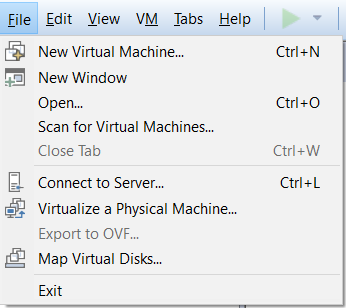

选择Custom（Advanced）点击Next

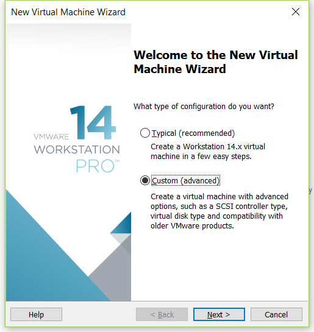

点击 Next

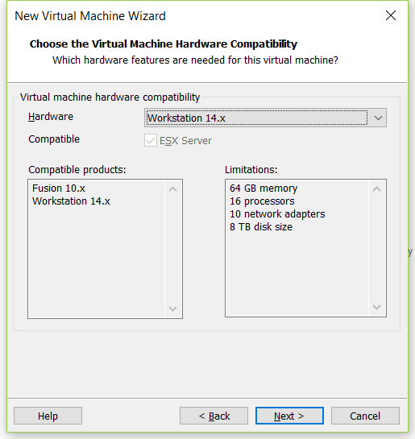

点击 Installer disc image file, 并且选择下载好的Archlinux镜像 点击 Next

选择 Linux , Other Linux 3.x or later kernel 60-bit， 点击 Next

输入虚拟机名称和选择安装位置，点击 Next

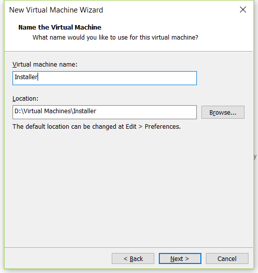

选择CPU数量，点击 Next

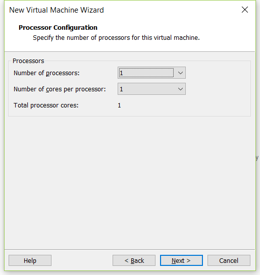

选择内存容量，点击 Next

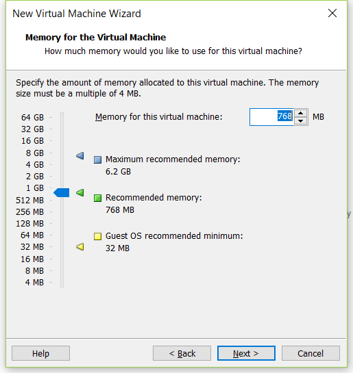

选择网络接入方式，点击 Next

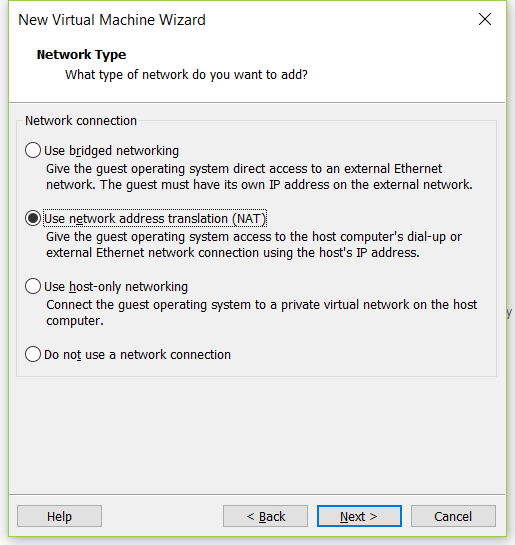

新建磁盘，点击 Next

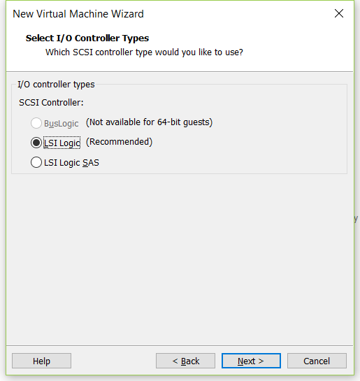

选择磁盘类型，点击 Next

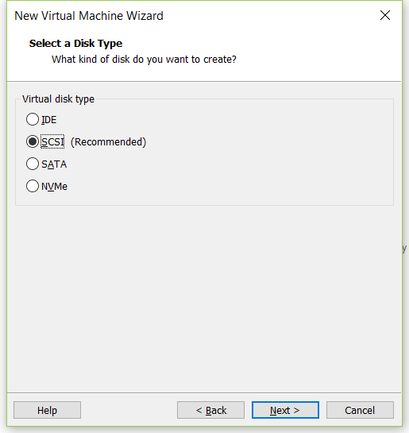

选择 Create a new virtual disk，点击 Next

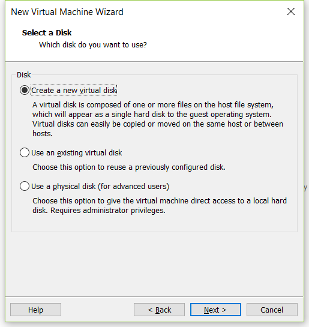

选择磁盘容量，点击 Next

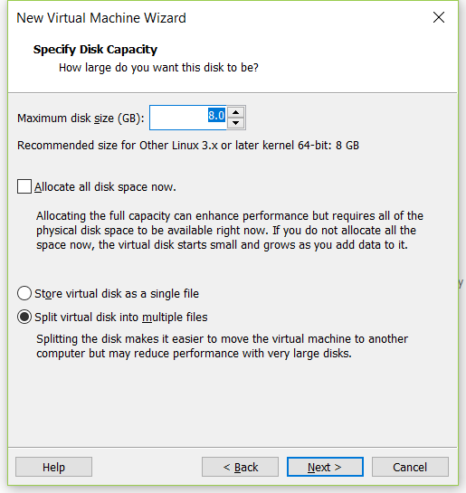

点击 Next

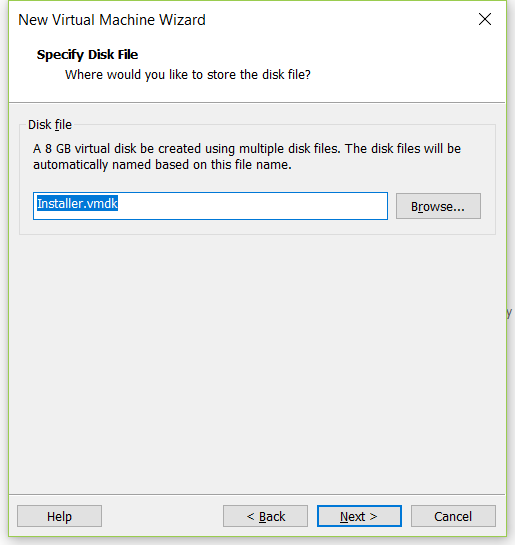

点击 Finish，完成新建虚拟机

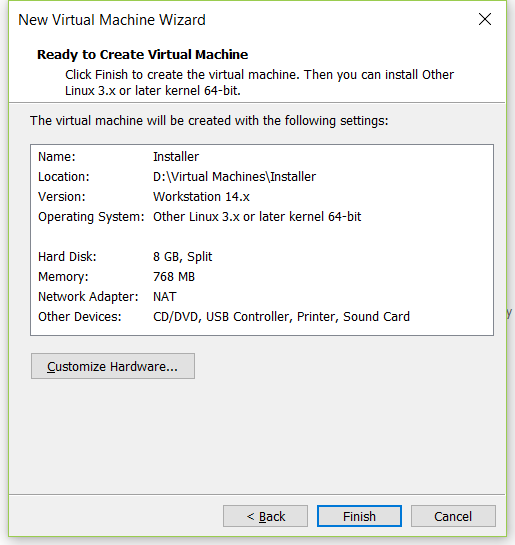

## 必要的配置

如果U盘支持USB 3.0，请点击菜单 VM > Settings

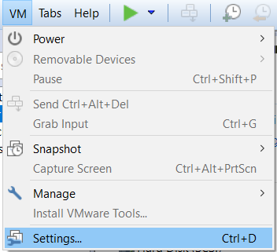

在Hardware选项卡中选择 USB Controller，然后再右面选择USB 3.0，点击OK，确认设置

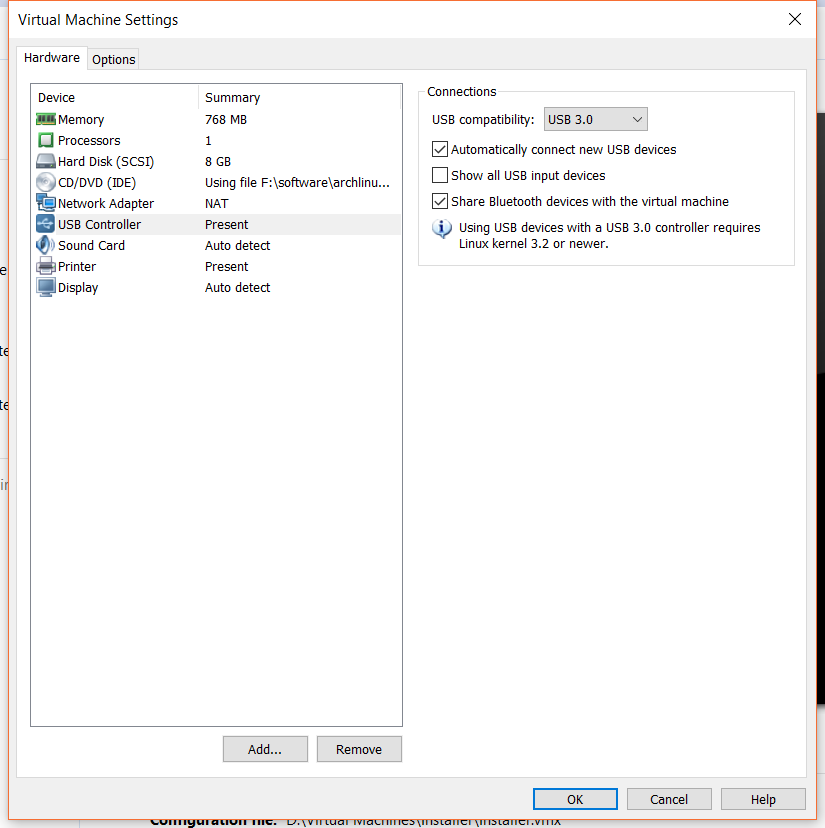

因为VMWare默认设置是 USB 2.0，否则U盘将无法使用。如果没有该选项，请下载安装最新版VMWare，然后再试。