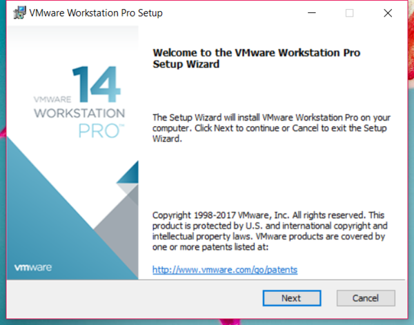
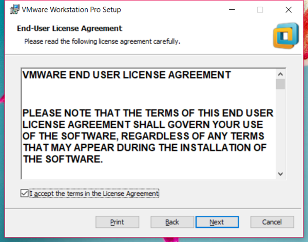
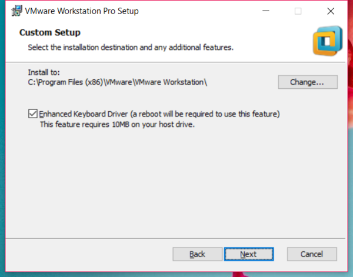
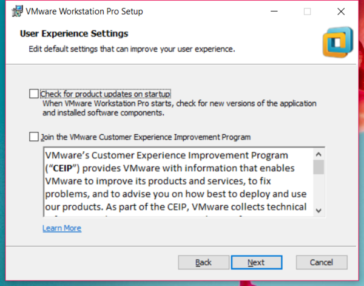
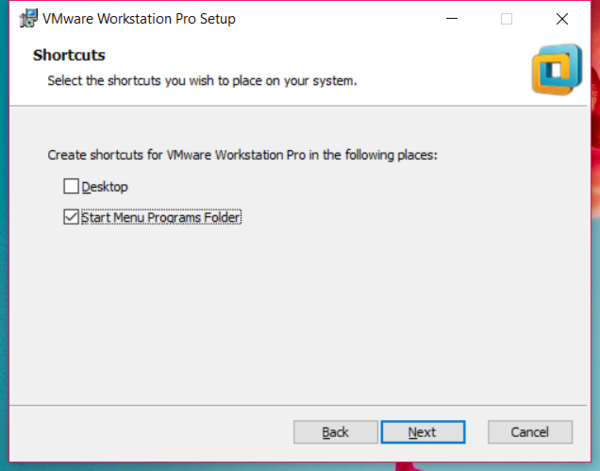
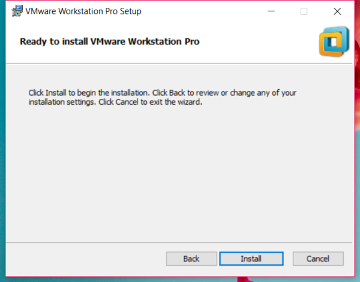
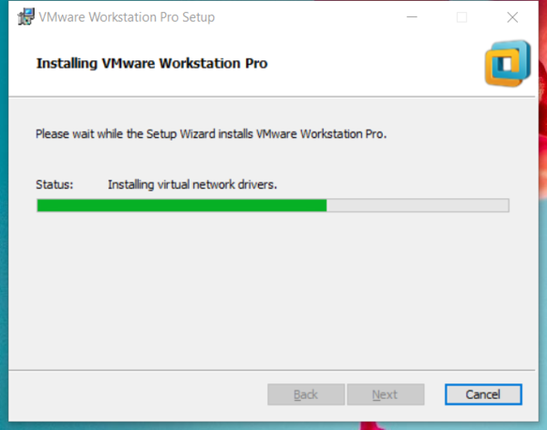
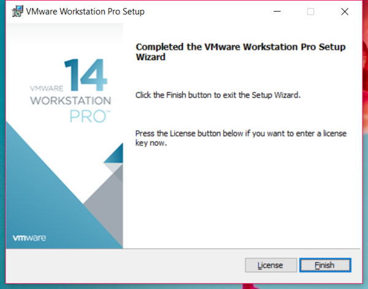
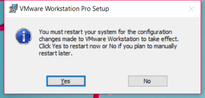

# 安装 ArchLinux 到U盘（二）安装注册VMware

[annotation]: <id> (e4f4c621-b53d-4775-ae2a-e0f380788fce)
[annotation]: <create_time> (2018-01-14 18:06:00)
[annotation]: <category> (计算机技术)
[annotation]: <tags> (操作系统|Linux)
[annotation]: <status> (public)
[annotation]: <topic> (安装 ArchLinux 到U盘)
[annotation]: <index> (2)
[annotation]: <comments> (true)

经过上一篇文章的描述 [准备工作](./55ffae4e-64e2-4b8e-bb9d-3ae759b3e223)，应该已经下载了Vmware，这篇文章就写一下如何安装 Vmware， 如果已经安装好了 VMware 请移步 [新建虚拟机](./206f744b-1d67-4afa-b25b-76d66c78e95f)

这里默认大家使用的是Windows系统，以下相同，不再赘述。

## 安装VMWare

打开刚刚下载好的VMware软件，出现如下对话框，然后点击 Next

勾选同意用户协议，然后点击 Next

选择安装位置和勾选键盘增强驱动，然后点击 Next

下面两项可以选择勾选，然后点击 Next

选择安装快捷方式的位置，然后点击 Next

点击 Install

等待安装完成

点击 Finish

如果出现下面的对话框，说明VMWare在使用之前需要重启系统，根据需要自行选择。

## 注册VMWare

对于软件注册，这个大家可以去官网购买，或者使用下面的注册码进行注册 VMWare 14

>FF31K-AHZD1-H8ETZ-8WWEZ-WUUVA

如果无法使用，还请另行寻找。
