# 安装 ArchLinux 到U盘（四）安装Archlinux

[annotation]: <id> (4f6cfa0a-ad98-4adb-af08-79a8a5b1d674)
[annotation]: <create_time> (2018-01-14 18:09:00)
[annotation]: <category> (计算机技术)
[annotation]: <tags> (操作系统|Linux)
[annotation]: <status> (public)
[annotation]: <topic> (安装 ArchLinux 到U盘)
[annotation]: <index> (4)
[annotation]: <comments> (true)

> 再次重申：安装过程会格式化U盘，内有资料，请先备份，如有遗失，概不负责！！！

## 启动虚拟机

点击 Power on this virtual machine 启动 Installer 虚拟机

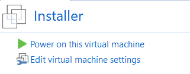

点击 Enter 启动Archlinux安装镜像

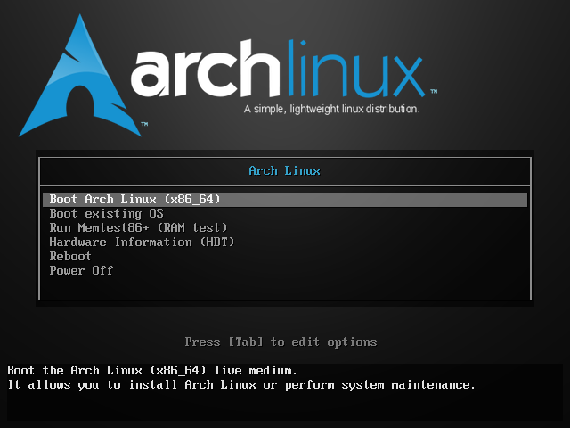

等待启动完毕，输入 `lsblk` 应该显示下面的内容

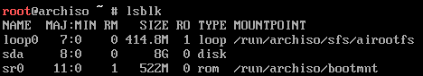

****

## 连接U盘到虚拟机

这时候U盘还没有连接至虚拟机，点击菜单VM > Removable Devices > USB Device > Connect(Disconnect from Host)，将U盘连接至虚拟机，其中 **USB Device** 是U盘的名称，U盘不同名称应该也是不同的。

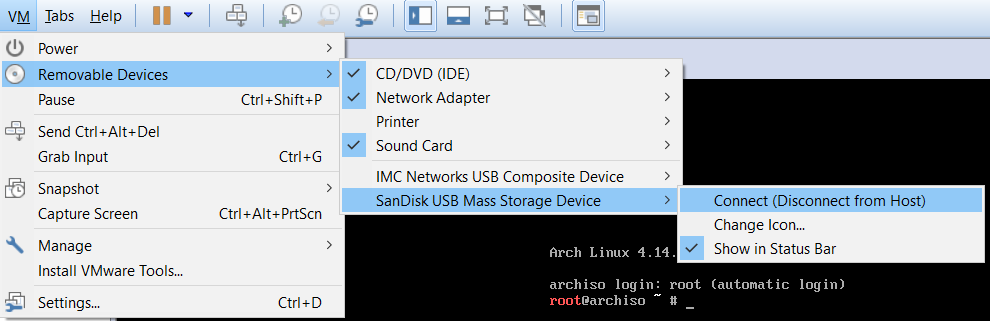

然后输入 `lsblk` 应该显示下面的内容，可以看到已经有 `sdb` 这个磁盘了

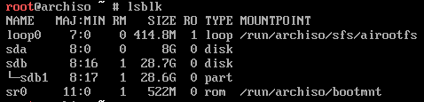

****

## 温馨提示（非必要）

如果觉得 Vmware 输入命令无法粘贴，特别无聊，如果Windows主机有 ssh 客户端的话，可以如下操作。否则可直接跳过。不过亦然**建议使用该方法**，**防止命令敲错**的可能发生。

---

输入 `systemctl start sshd` 启动 ssh 服务

输入 `passwd` 修改镜像系统 root 密码，然后**输入密码两次**，分别回车，注意输入密码时屏幕没有回显。

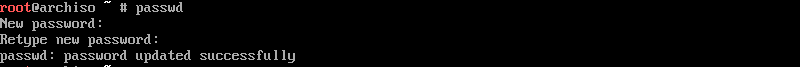

输入 `ifconfig` 找到 **192.168.xxx.xxx** 的那个IP地址，这里是 **192.168.111.135**，然后记住IP地址，以备在 SSH 客户端中使用。

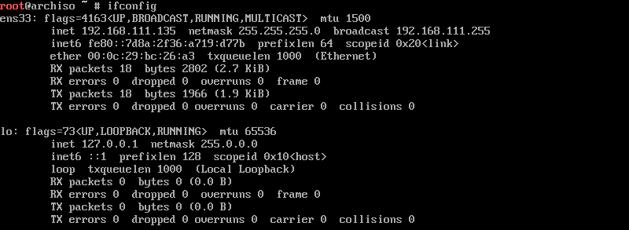

然后打开 ssh 客户端，这里以 xshell 为例，输入 ip 地址，用户名 root，以及刚才修改好的密码，就能连接了。

主机IP地址设置：

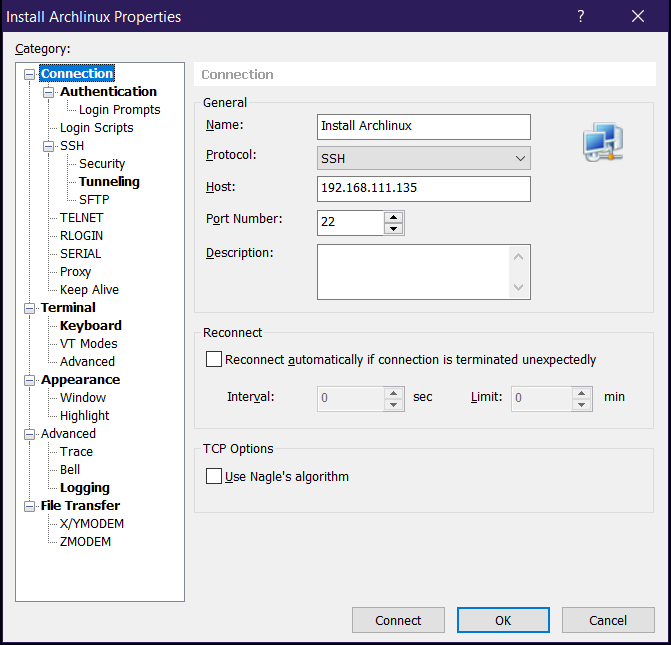

认证方式（用户名密码）设置：

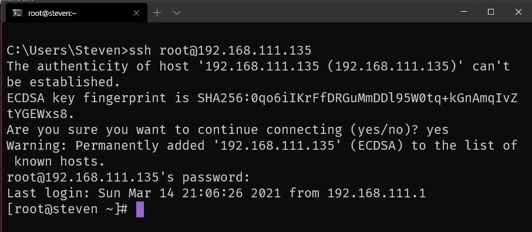

连接以后，选择 **Accept Once**

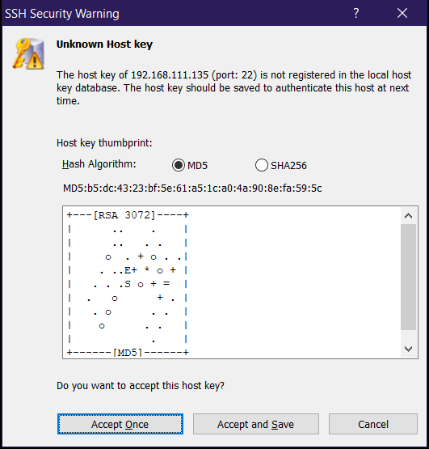

然后就能在 ssh 客户端中输入命令了，这时候就可以随意的复制粘贴了，不过复制粘贴的过程中**注意命令和自身系统的适用性**，可能不同系统中的网卡名称、磁盘名称并不一样。

---

## U盘分区

以下的内容基于Archlinux官网的wiki，如果有不明白的地方可以参考[官方Wiki](https://wiki.archlinux.org/index.php/Beginners%27_Guide)

这里我们选择分三个区：

- EFI分区，用于UEFI启动，必选，否则系统可能会在最新的计算机中无法启动
- 根分区，用于安装Archlinux
- U盘分区，可当作U盘使用，便于在Windows系统中安全的移除U盘

输入 `fdisk /dev/sdb` 进入分区程序

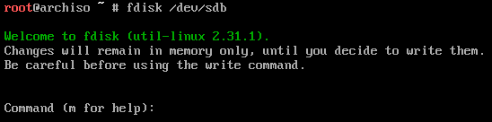

输入 `o` 开始分区

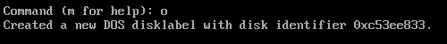

输入 `n` 新建EFI分区

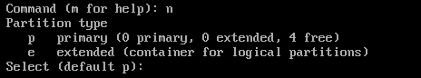

点击 `Enter` 选择默认分区序号

点击 `Enter` 选择默认起始扇区

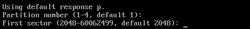

输入 `+128M` 新建EFI分区大小为128M

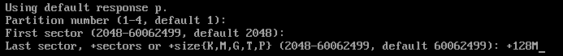

输入 `n` 新建根分区

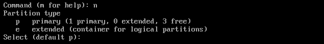

点击 `Enter` 选择默认分区序号

点击 `Enter` 选择默认起始扇区

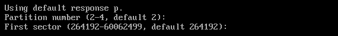

输入 `+20G` 新建根分区大小为20G，该分区容量可根据U盘容量自行决定，不一定非得是20G

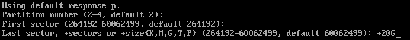

输入 `n` 新建根分区

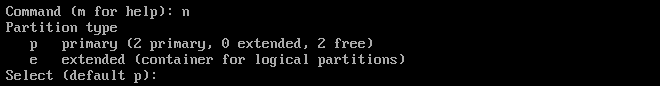

点击 `Enter` 选择默认分区序号

点击 `Enter` 选择默认起始扇区

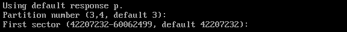

点击 `Enter` 选择默认容量，剩余全部未分配分区

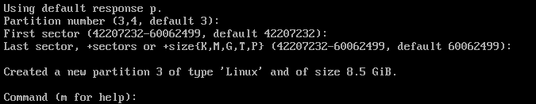

输入 `p` 查看分区信息

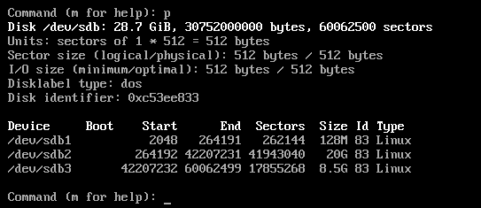

输入 `w` 写入分区信息

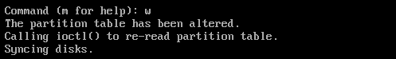

输入 `lsblk` 可以看到已经有 `sdb` 磁盘，下面有 `sdb1`，`sdb2`，`sdb3` 三个分区

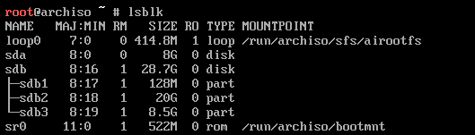

****

## 格式化分区

输入 `mkfs.fat -F 32 /dev/sdb1` 格式化 `sdb1` 为FAT32格式

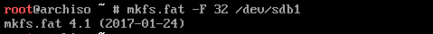

输入 `mkfs.fat -F 32 /dev/sdb3` 格式化 `sdb3` 为FAT32格式

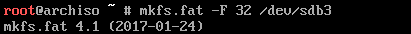

输入 `mkfs.ext4 /dev/sdb2` 格式化 `sdb2` 为ext4格式，如果出现 *Proceed anyway?*，输入y继续格式化

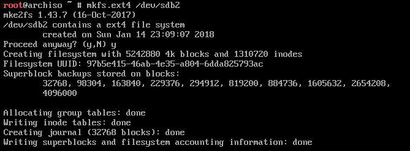

****

## 挂载分区

输入 `mount /dev/sdb2 /mnt` 挂载 `sdb2` 到 `/mnt`

输入 `mkdir -p /mnt/boot/efi` 创建 `/mnt/boot/efi` 目录

输入 `mount /dev/sdb1 /mnt/boot/efi` 挂载 `sdb1` 到 `/mnt/boot/efi`

`sdb3` U盘分区无需挂载

****

> 关于文件编辑器：文章中所有的编辑器一律采用 `nano` 作为编辑器，主要是 nano 编辑器足够简单，防止一些人可能不是特别会使用其他的编辑器，例如 `vim`。

## 选择镜像

> 这步非必选，可以直接跳转至下一步进行安装，如果发现下载速度不是很快，可以再回到这里编辑镜像，然后再试。

输入 `cd /etc/pacman.d` 选择目录

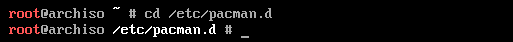

输入 `cp mirrorlist mirrorlist.bk` 将 mirrorlist 拷贝到 mirrorlist.bk

输入 `cat mirrorlist.bk | grep China -A 1 | grep -v '-' > mirrorlist` 将所有中国的镜像写入 mirrorlist

输入 `nano mirrorlist` 编辑镜像列表

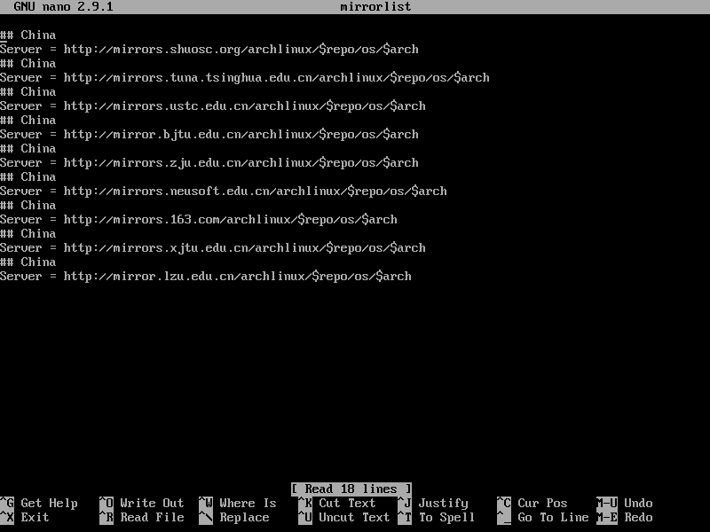

经测试，清华和163的镜像是最快的，这里可以根据实际测试来决定选择哪一个。可以在 Server 前面写入 `#` 来注释掉该镜像。

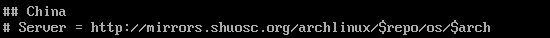

编辑完成之后 点击 `CTRL + X` 退出编辑

点击 `y`

点击 `Enter`，保存文件

****

## 安装系统 <small>2019-12-16 更新</small>

> <i class="ui pop heart circular small pink icon"></i>
经某位北京理工大学的同学邮件提醒，安装过程出现了异常，现已修正，特此感谢！<small>2019-12-16</small>  温馨提示：安装过程中如有异常发生，还请评论或邮件告知。如不能及时回复，以下为官方安装指导 <https://wiki.archlinux.org/index.php/Installation_guide>  

输入 `pacstrap -i /mnt base base-devel linux linux-firmware` 安装系统，然后点击 `Enter`

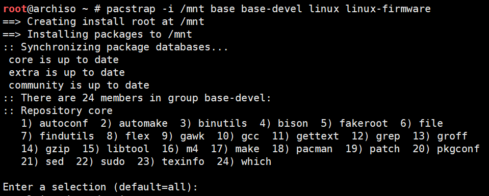

点击 `Enter`

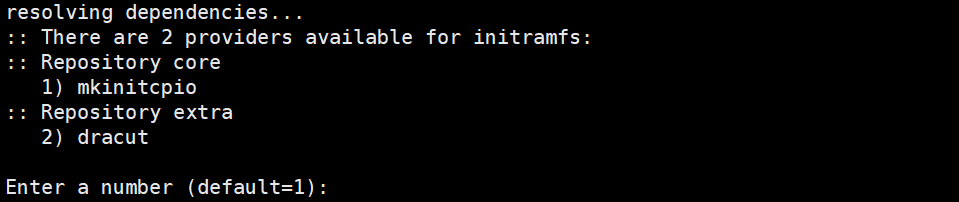

点击 `Enter`

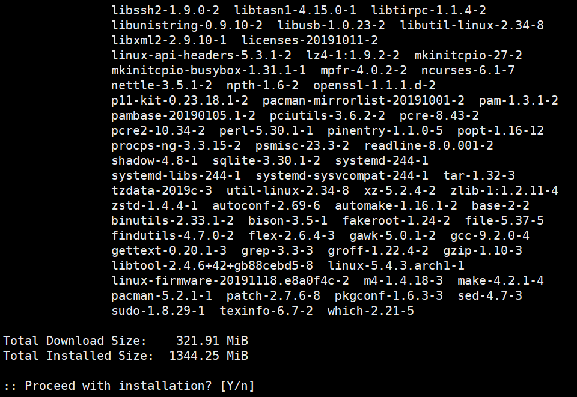

然后静静地等待安装完成。

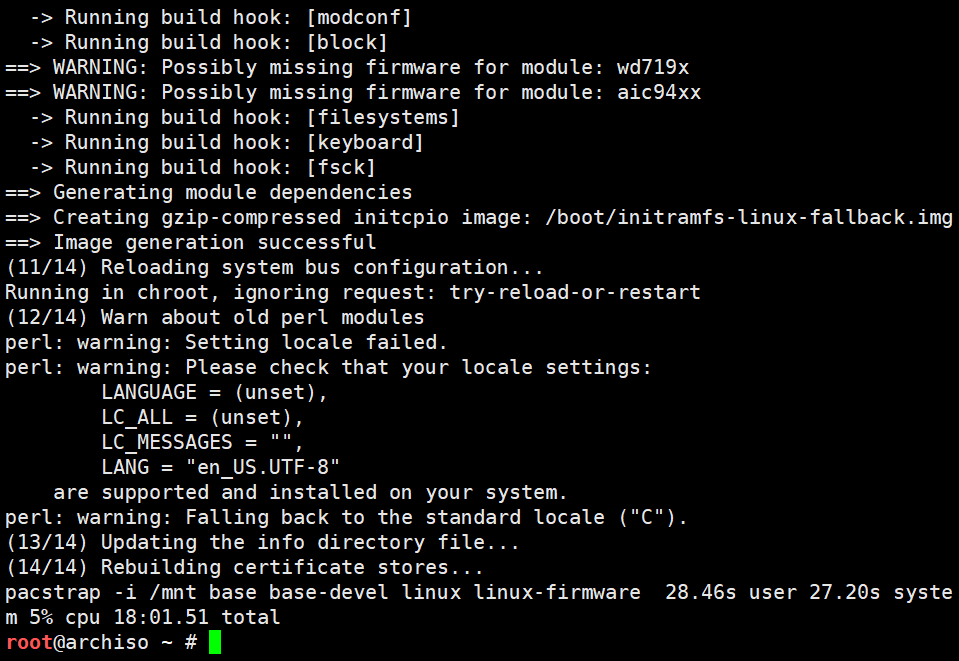

****

## 配置系统

### 基本配置

输入 `genfstab -U -p /mnt > /mnt/etc/fstab` 生成文件系统表

输入 `arch-chroot /mnt` 进入新系统

输入 `nano /etc/locale.gen` 选择文字编码

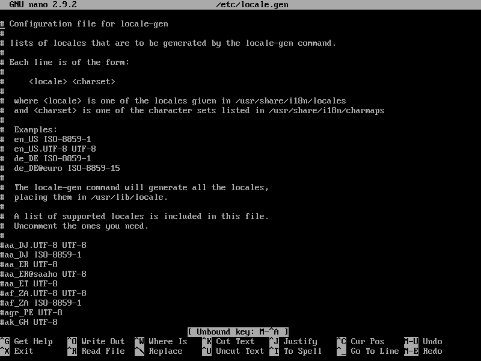

将 zh_CN 开头的行全部取消注释，再找到 en_US.UTF-8 UTF-8也取消注释。 编辑完成之后保存。nano 的使用方法不再赘述

输入 `locale-gen`

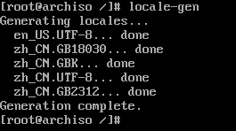

输入 `nano /etc/locale.conf` 在文件中写入 `LANG=en_US.UTF-8` 保存

输入 `rm /etc/localtime` 删除原 UTC 时区

输入 `ln -s /usr/share/zoneinfo/Asia/Shanghai /etc/localtime`
设置计算机系统时区为上海

输入 `hwclock --systohc --localtime` 设置硬件时间为本地时间

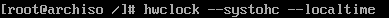

输入 `echo steven > /etc/hostname` 将主机名配置成 steven，这个名称可以自行更改

输入 `nano /etc/mkinitcpio.conf` 找到下面这行

将 `block` 写到 `udev` 之后，然后保存，这样做就是为了让usb在启动的之后首先加载

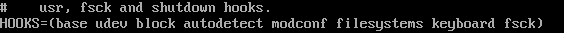

输入 `mkinitcpio -p linux` ，生成启动镜像

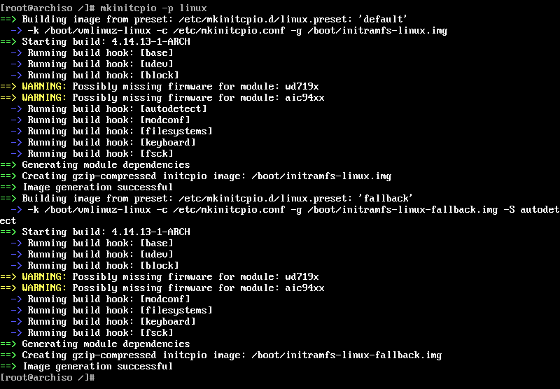

输入 `passwd` 设置 root 用户的密码，注意输入密码时没有回显。

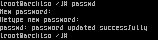

输入 `pacman -S ntfs-3g` 安装 ntfs 文件系统，以便访问 Windows 磁盘

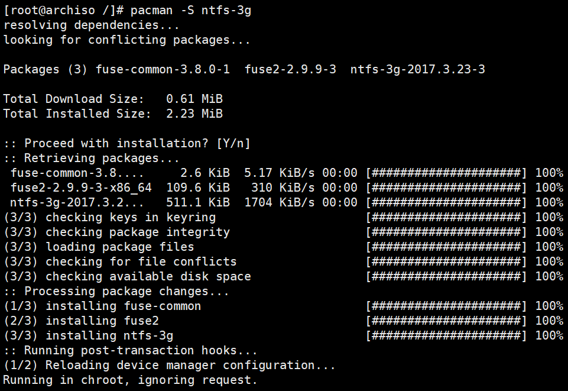

### 配置网络

输入 `pacman -S zd1211-firmware` 安装无线网卡驱动

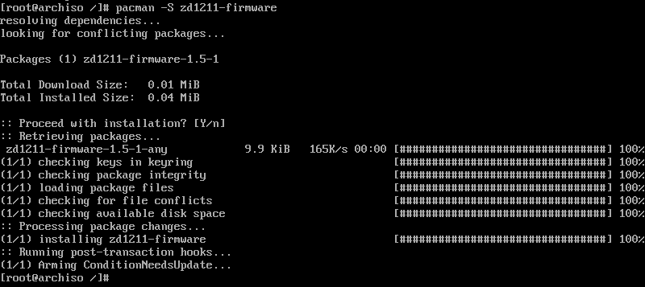

输入 `pacman -S iw wpa_supplicant wireless_tools net-tools` 安装网络工具

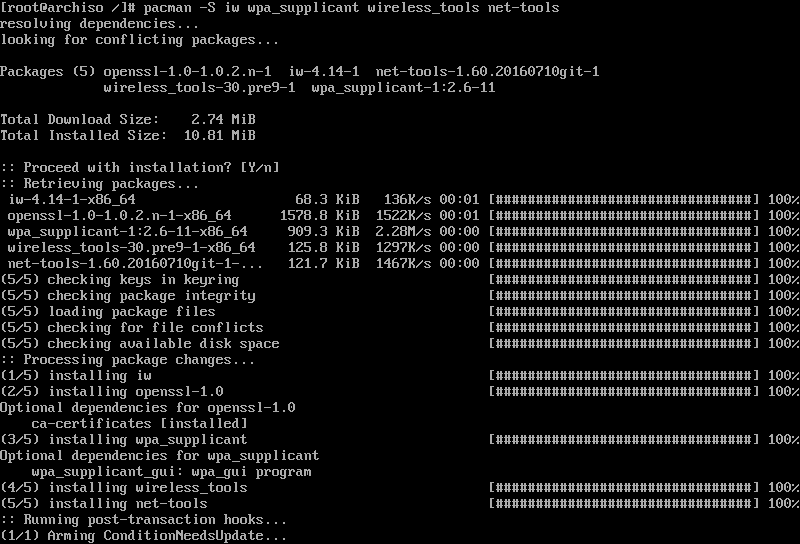

输入 `pacman -S dialog` 安装终端对话框

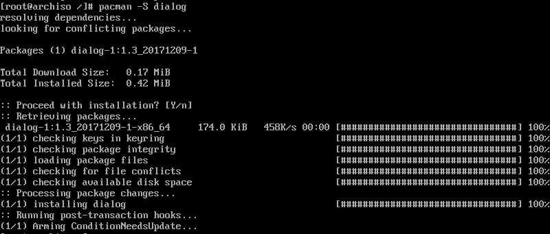

## 配置引导

### 配置BIOS(legacy)引导

输入 `pacman -S grub` 安装引导程序

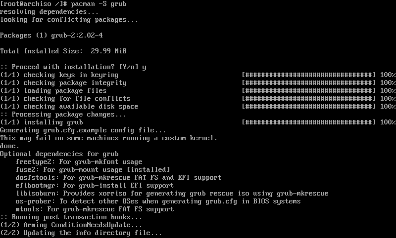

输入 `grub-install --target=i386-pc /dev/sdb` 安装BIOS引导

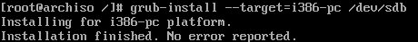

输入 `blkid` , 将 sdb2 的 UUID 记下来 

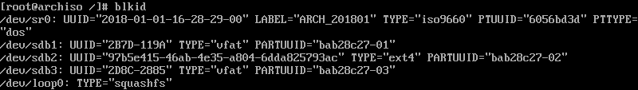

这里 UUID 是 97b5e415-46ab-4e35-a804-6ddaez5793ac，每个分区的UUID应该都是不同的，下面具体根据自己的UUID来做修改，这是为了用 UUID 做标识来启动操作系统，否则换了电脑硬盘标签变化就不能启动了

输入 `nano /boot/grub/grub.cfg` , 修改grub配置文件

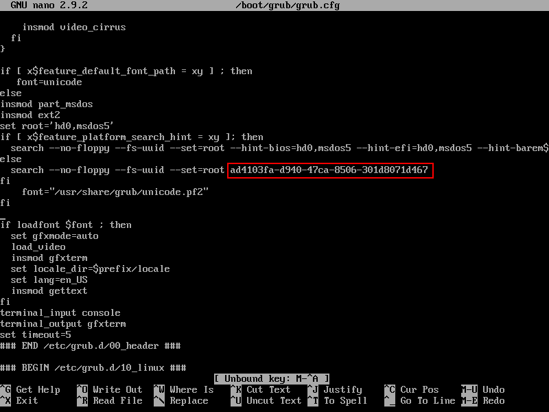

将所有出现的UUID全部改成 sdb2 的UUID，过程略复杂，谨慎修改，然后保存

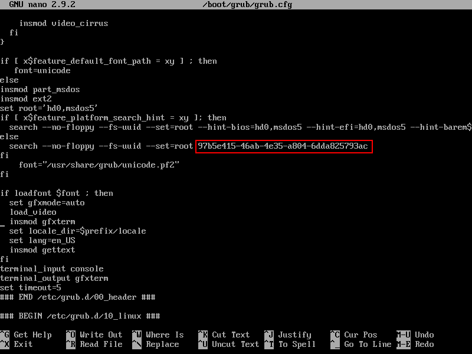

### 测试BIOS(legacy)引导

输入 `exit` 退出新系统

输入 `shutdown -h now` 关闭 Installer 虚拟机

#### 新建测试虚拟机

参考[新建虚拟机](./206f744b-1d67-4afa-b25b-76d66c78e95f)

选择安装源时，选 I will install the operating system later.

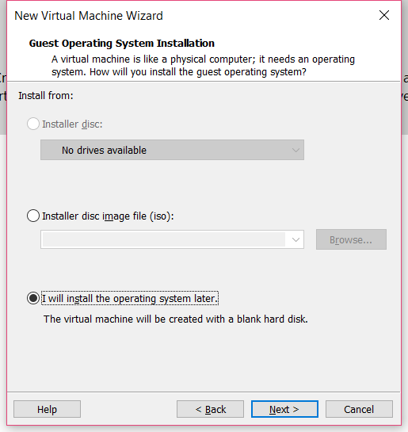

名称写成 Boot，或者可以自定义

选择磁盘时，选择 Use a physical disk(for advanced users)

然后选择 PhysicalDrive1，选择Use individual partitions

勾选前两个分区

如果发现分区信息不对，可以返回上一步，重新选择另一个PhysicalDrive，然后再试

点击 Power on this virtual machine 启动测试虚拟机

启动之后

这时候输入 用户名 `root` 和 passwd 设置的密码就可以登陆了

如果有USB的无线网卡，挂到虚拟机里，输入 `wifi-menu` 就可以选择无线网络了

输入 `shutdown -h now` 关闭测试虚拟机

>如果没有，可以去任何支持BIOS(legacy)引导的实体机试试，开机的时候狂按F2键，进入BIOS修改启动项，将U盘设置为第一个，然后重启，应该就可以进入U盘中的系统了

>进入BIOS的功能不同的厂家生产的机器应该时不相同的，这个根据实际情况进项操作

如果关机之后，Windows 出现如下对话框，请点击 取消(Cancel)

### 配置UEFI引导

编辑 Installer 虚拟机，点击 Edit virtual machine settings

在Options选项卡，Advanced选项右侧，将Firmware type 改为UEFI，**不要勾选 Enable Secure Boot**，然后保存

和前文一样

- 启动 Installer 虚拟机
- 输入 `mount /dev/sdb2 /mnt`，挂载根分区
- 输入 `mount /dev/sdb1 /mnt/boot/efi`，挂载EFI分区
- 输入 `arch-chroot /mnt` 进入新系统

输入 `grub-install --target=x86_64-efi --efi-directory=/boot/efi --removable` 安装UEFI启动项

### 测试UEFI引导

输入 `shutdown -h now` 关闭 Installer 虚拟机

和前文一样，修改 Boot 虚拟机的启动模式为 UEFI，**不要勾选 Enable Secure Boot**

启动 Boot 虚拟机，这时应该可以启动了，然后关闭 Boot 虚拟机

> 可以去支持UEFI启动的实体机上试试，不过一定要关闭Secure Boot

### Secure Boot

很遗憾，目前为止，我还没有找到解决 Secure Boot 的方法，所以只能先关闭Secure Boot 再启动U盘中的 Archlinux。

网上所有我见过的解决Secure Boot的方法，都无法解决U盘移动后，磁盘信息可能会发生变化的情况，而且一般情况下不同计算机中的磁盘信息显然都是不同的。

经测试，Secure boot 安装在硬盘中是可以使用的，具体参考 [安装ArchLinux到硬盘](./0cd4748b-b63c-4c7c-8fae-a862cbcc0698)

****

如果BIOS(legacy)和UEFI两种启动方式，都可以启动，那么说明Archlinux已经安装成功。这时 Installer 虚拟机就失去了它的作用，可以删除了。

## 实体机测试

普通PC可以在开机的时候狂按 F2 、F12、Enter 来调整启动的顺序，理论上就可以进入了。

MAC 机器在开机的时候，按住option键，出现启动选项之后，选择 EFI boot 就可以了。