# 使用 mermaid 绘制流程图

[annotation]: [id] (06f8ac82-1352-4264-bbd8-3f362e13557b)
[annotation]: [status] (public)
[annotation]: [create_time] (2021-06-11 15:40:35)
[annotation]: [category] (计算机技术)
[annotation]: [tags] ()
[annotation]: [comments] (false)
[annotation]: [url] (http://blog.ccyg.studio/article/06f8ac82-1352-4264-bbd8-3f362e13557b)

## 流程图

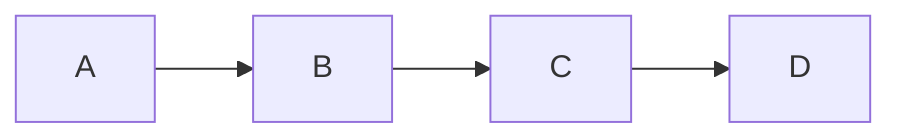

---

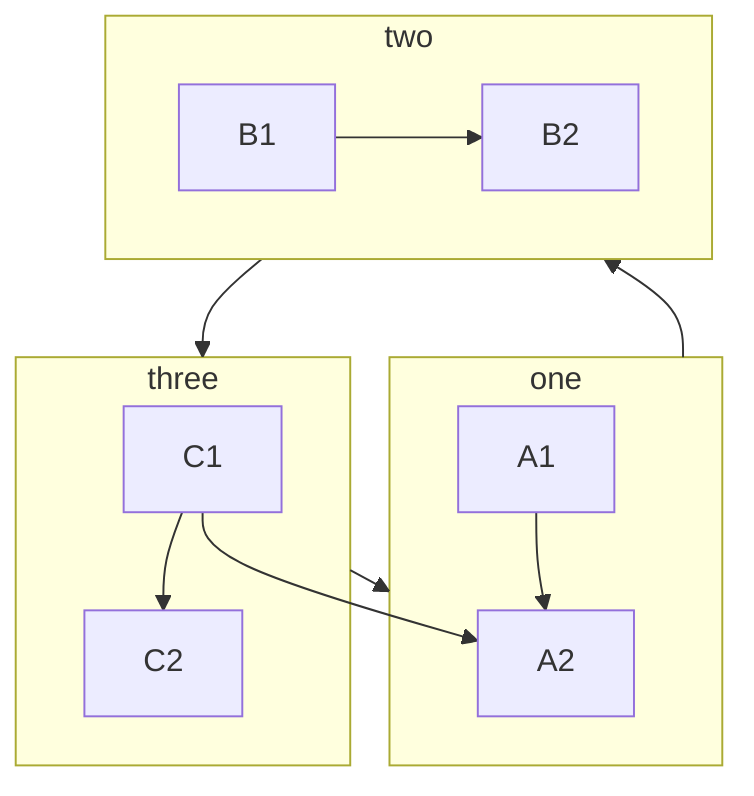

---

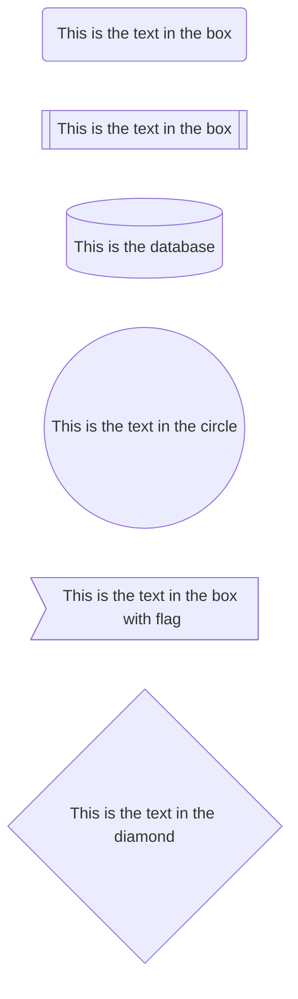

---

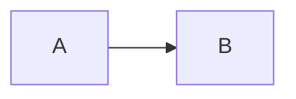

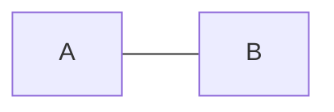

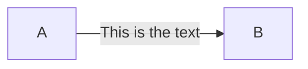

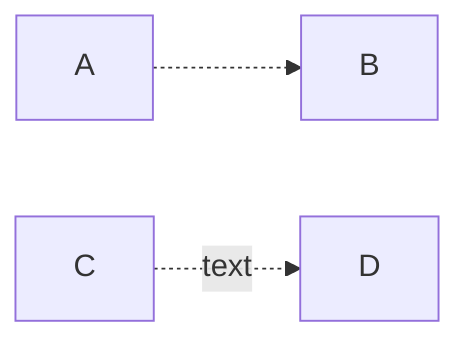

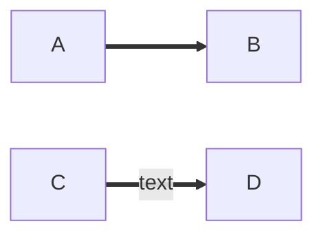

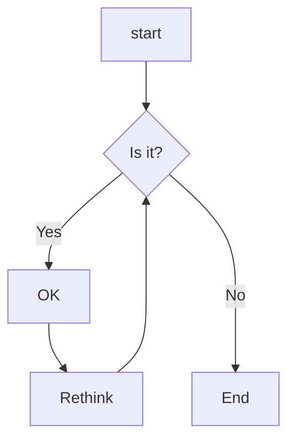

---

## 饼图

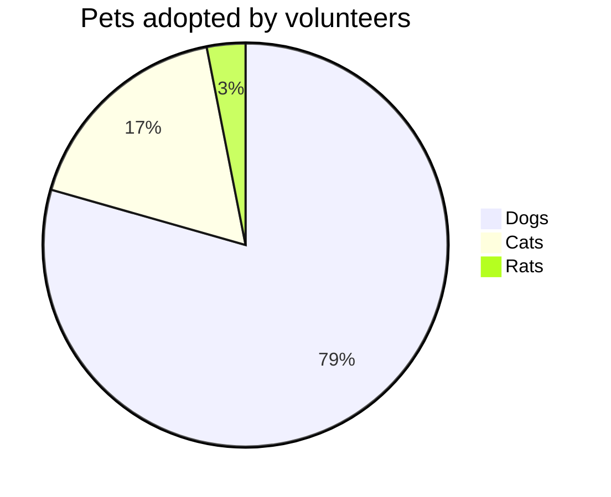

## Journey

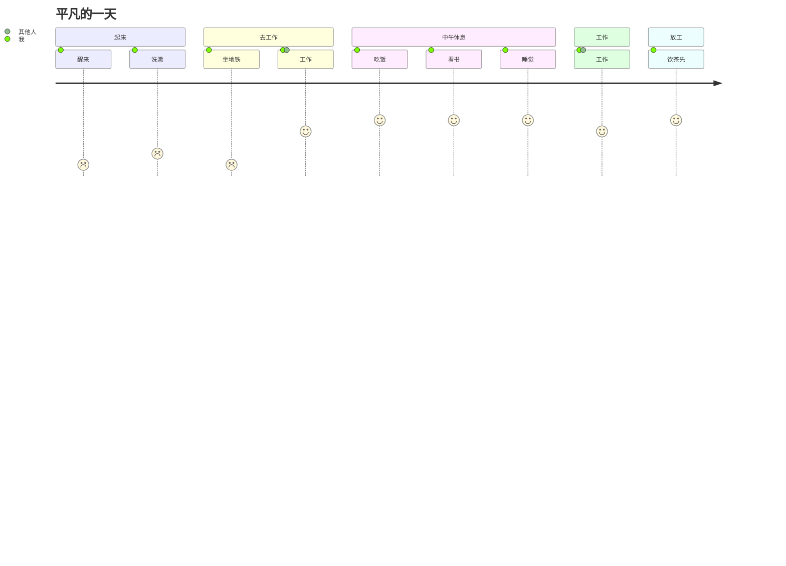

## 参考资料

- <https://mermaid-js.github.io/mermaid/>