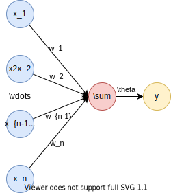
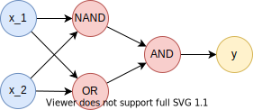

# 人工智能概述

[annotation]: [id] (8237954e-327c-4efe-9b5d-14299a55c189)
[annotation]: [status] (public)
[annotation]: [create_time] (2021-10-21 22:20:35)
[annotation]: [category] (计算机科学)
[annotation]: [tags] (神经网络|人工智能|深度学习)
[annotation]: [comments] (true)
[annotation]: [url] (http://blog.ccyg.studio/article/8237954e-327c-4efe-9b5d-14299a55c189)

> 这里说的都是我的一派胡言，不足为信！

---

> 如果相对简单的方法可以工作，那么请坚持这种方法！

## 基础概念

我们希望通过某种方式，来获得一个函数，这个函数可以从数据中自动获得函数的对应关系；

比如：假设我们想要做一个识别图片是猫🐱还是狗🐕的程序，此时图片就是输入，而是不是猫，或者是不是狗就是输出；而图片可以是一些列像素点的集合，可以以某种二进制的形式来表示，于是这一长串二进制数就是定义域，而值域只有两个值 0 和 1，意味着是不是猫，因为不是猫那就是狗；

再比如：假设要识别单独的手写数字，那么值域就变成了 0 ~ 9；

- 特征：需要标记的东西
- 标签：需要识别的分类
- 样本：标记好的特征和标签的东西
- 训练集：一组样本
- 测试集：另一组样本
- 模型：一种从输入到输出的函数
- 表达能力：模型因训练数据能够逼近某种函数的程度
- 泛化能力：模型对测试数据的精度

### 深度学习

所谓 “深度” 是指原始数据进行非线性特征转换的次数，如果把一个表示学习系统看作是一个有向图结构，深度也可以看作是从输入节点到输出节点所经过的最长路径的长度。

### 神经网络

人类大脑是一个可以产生意识、思想和情感的器官。受到人脑神经系统的启发，早期的神经科学家构造了一种模仿人脑神经系统的数学模型，称为人工神经网络，简称神经网络。在机器学习领域，神经网络是指由很多人工神经元构成的网络结构模型，这些人工神经元之间的连接强度是可学习的参数。

### 机器学习

机器学习也常被称为 **模式识别**

----

## 感知机

感知机接受多个信号，输出一个信号，来自于对生物神经元的模拟；假设每个信号是一个实数，那么记为 $x_1, x_2 \dots, x_n$，所有这些信号组成一个向量记为 $X = (x_1, x_2 \dots, x_n)$，每个信号带有一个权重记为 $w_1, w_2, \cdots, w_n$，所有这些权重组成一个向量记为 $W=(w_1, w_2, \cdots, w_n)$，我们将输入及权重乘积的和称为输入加权和：

$$S = w_1x_1 + w_2x_2 + \cdots w_nx_n = X \cdot W$$

> 你可能会怀疑为什么需要将这么多的输入表示成向量，我觉得这么干的主要好处是简洁，对于线性代数不是那么好的人来说；

只有加权和 $S$ 大于某个值 $\theta$ 时，感知机会产生输出，否则将不产生输出，输出为 1，不输出则为 0；

于是感知机可以表示成如下形式的函数：

$$f(X, W) = \left\{\begin{aligned}
0 & & (S \leqslant \theta)\\
1 && (S > \theta)
\end{aligned}\right.$$

上面还有一个值 $n$ 我们没有解释，显然这是感知机输入的数量，这是一个超参，超参的意思是，自己随便定一个数；

感知机通常被表示成如下的形式：



---

### 与门

下面我们假设感知机有两个输入 $X = (x_1, x_2)$，我们来模拟一下与门，与门有如下的真值表：

| $x_1$ | $x_2$ | $f$ |
| ----- | ----- | --- |
| $0$   | $0$   | $0$ |
| $0$   | $1$   | $0$ |
| $1$   | $0$   | $0$ |
| $1$   | $1$   | $1$ |

只要输入和输出与上表一致，那么这种逻辑就是与逻辑。

为了实现以上的逻辑，这里我们有三个参数需要确定，$w_1, w_2, \theta$，怎么确定呢？

实际上以上真值表可以在直角坐标系中画出图像，我们要找到的参数，就是在坐标系中找出一个平面，来分开函数值 $f$ 的 $0$ 和 $1$，使得平面的一侧都是 $0$，另一侧都是 $1$，这种方式就是线性分类；

若 $(w_1, w_2, \theta) = (1, 1, 2)$ 时，满足条件，显然这种参数具有无穷个，再比如 $(w_1, w_2, \theta) = (0.5, 0.5, 0.7)$ 时同样也成立；如下图所示：

分类平面将会是 $x_1 + x_2 = 2$

<div class='geogebra' data-url="./images/and-gate.ggb" format='3d'></div>

> 问题：这里有没有最优的平面？一种直观的感觉就是，可以找到最佳的平面，使得平面与函数点的集合两侧的距离相等；

这里我们可以使用 Python 来实现一下与门

```python
def AND(x1, x2):
    s = x1 * 1 + x2 * 1
    if s >= 2:
        return 1
    else:
        return 0
```

这里的参数 $w_1, w_2, \theta$ 是我们手动确定的，而且与门也足够简单，我们处于上帝视角，完全知道这个函数的内部逻辑，意味着我们不用线性函数模拟，照样可以用分支语句写出与门的逻辑，

比如下面这样：

```python
def AND(x1, x2):
    return int(x1 and x2)
```

这里我么实现的更加简介，但是这样是不行的，上面说了，我们希望通过线性函数来拟合非线性函数，就是这样，这里只是一个简单的应用；

而在实际的参数 $w_1, w_2, \theta$ 是由机器通过训练样本自动找到的，这里我们先手动来确定参数，感受一下参数确定的方式！

---

### 或门

或门的真值表如下：

| $x_1$ | $x_2$ | $f$ |
| ----- | ----- | --- |
| $0$   | $0$   | $0$ |
| $0$   | $1$   | $1$ |
| $1$   | $0$   | $1$ |
| $1$   | $1$   | $1$ |

显然 $(w_1, w_2, \theta) = (1, 1, 1)$ 成立！

或门的代码如下：

```python
def OR(x1, x2):
    s = x1 * 1 + x2 * 1
    if s >= 1:
        return 1
    else:
        return 0
```

<div class='geogebra' data-url="./images/or-gate.ggb" format='3d'></div>

--- 

### 与非

与非门真值表如下，就是先与再非：

| $x_1$ | $x_2$ | $f$ |
| ----- | ----- | --- |
| $0$   | $0$   | $1$ |
| $0$   | $1$   | $1$ |
| $1$   | $0$   | $1$ |
| $1$   | $1$   | $0$ |

显然 $(w_1, w_2, \theta) = (-1, -1, -1)$ 成立！

与非门的实现如下：

```python
def NAND(x1, x2):
    s = x1 * (-1) + x2 * (-1)
    if s >= -1:
        return 1
    else:
        return 0
```

<div class='geogebra' data-url="./images/and-not-gate.ggb" format='3d'></div>

---

### 异或门

异或门的真值表如下：

| $x_1$ | $x_2$ | $f$ |
| ----- | ----- | --- |
| $0$   | $0$   | $0$ |
| $0$   | $1$   | $1$ |
| $1$   | $0$   | $1$ |
| $1$   | $1$   | $0$ |

下面我们按理来说应该想上面那样手动确定参数的值，但是遗憾的是，我们无法通过一个感知机来模拟异或门，为什么呢？

<div class='geogebra' data-url="./images/xor-gate-1.ggb" format='3d'></div>

> 注意这里由于参数的选择，我们绘制出的平面必须平行于 $z$ 轴；

异或门的函数图像可以画出来，显然 $0$ 和 $1$ 分别组成了单位正方形的一条对角线；对于一个平面来说，我们无论如何都不可能将 $0$ 和 $1$ 分到平面的两侧，那么怎么办呢？

既然一个平面分不开，那么就用两条，两个平面可以将空间分成三个部分，其中两部分是 $0$，另一部分是 $1$；或者交叉的两个平面将空间分成 $4$ 个部分，也可以分开，无论那种方式，只要能够将 $0$ 和 $1$ 分开就可以了。

> 这意味着，我们需要两层感知机来实现异或逻辑。

---

回到数字逻辑，异或可以通过基础逻辑与，或，非，来实现，实现的方式如下：

$$\begin{aligned}
S =& A \overline{B} + \overline{A}B \\
=& (A + B) (\overline{A} + \overline{B}) \\
\xlongequal{德摩根律}& (A + B)\overline{AB}
\end{aligned}$$

很显然，异或的名字就可以用这个表示来准确的表现，先异再或，就称之为异或。

下面实现异或门，实现如下：

```python
def XOR(x1, x2):
    s1 = NAND(x1, x2)
    s2 = OR(x1, x2)
    return AND(s1, s2)
```

这个实现也是相当的直观，那么如果我们把这里所有模块化的函数全部去掉，就会使如下这种形式：



如果还用上面的参数，那么平面将会是下面这样：

<div class='geogebra' data-url='./images/xor-gate.ggb' format='3d'></div>

---

于是只需要两个平面的和大于 $1$，就可以了，最后形成的平面不太好展现 …… 这是个遗憾吧。但是总之我们就是在寻找这种可以将不同类别的输入划分到两侧的函数。

---

### 与非门与计算机

人们一般会认为计算机内部进行的处理非常复杂，而令人惊讶的是，实际上只需要通过与非门的组合，就能再现计算机进行的处理。

这一令人吃惊的事实说明了什么呢？说明使用感知机也可以表示计算机。

## 参考引用

- [日] 斋藤康毅 - 《深度学习入门》
- [英] 塔里克·拉希德 - 《Python 神经网络编程》
- 邱锡鹏 - 《神经网络与深度学习》
