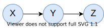

# 高级人工智能

[annotation]: [id] (f59b6767-f0b4-4960-9fc8-37195acfbf64)
[annotation]: [status] (public)
[annotation]: [create_time] (2021-12-26 13:13:31)
[annotation]: [category] (计算机科学)
[annotation]: [tags] (人工智能|机器学习|强化学习|神经网络|数理逻辑)
[annotation]: [comments] (true)
[annotation]: [url] (http://blog.ccyg.studio/article/f59b6767-f0b4-4960-9fc8-37195acfbf64)

## 人工智能概述

> 智能：个体适应环境并能在不同环境中实现其目标的能力

概念性定义：

- 机器智能：使机器具备计算和判别的行为能力
- 类脑智能：仿生智能，让机器像人或生物一样思考
- 群体智能：社会智能的机器重现与利用、涌现智能

### 人工智能的起源

- 萌芽期：
    - 机械自动化
    - 逻辑推理
- 孕育期（文艺复兴以来）：
    - 理性主义
    - 数理逻辑学课
    - 计算思维：巴贝奇：差分机，图灵机
- 形成期(1956-1961)：
    - 1956 年，首次人工智能研讨会
    - IBM 的西洋跳棋程序，文法体系、逻辑推理机
- 发展期 (60 年代)：
    - 研究领域拓展
    - 1969 年，第一届国际人工智能联合会议 (IJCAI)
    - 1970 年，《人工智能》国际杂志创刊
- 寒冬期 (60s-70s)：
    - 1966 年，美国政府取消了机器翻译项目的所有投资
    - 英国政府取消了几乎所有人工智能研究投入
    - 神经网络的研究经费缩减到几乎没有
- 艰难前行 (70s)：
    - 弱方法：构建搜索机制，试图找出完全解，下棋：搜索解空间
    - 强方法：构建领域知识库 --> 专家系统
- 走向工业 (80s)：
    - 1982 年，第一个商用专家系统RI
    - 1981 年，日本启动“第五代计算机”计划，运行 prolog 语言的智能计算机
    - 美国、英国恢复对人工智能的投入
- 今天：
    - 大数据、计算能力提升、网络泛在化
    - 神经网络复兴：多层感知机，反向传播，隐马尔可夫模型(语音识别)，贝叶斯网络
    - 专家系统逐渐成熟，知识发现、数据挖掘兴起

### 图灵测试

### 达特茅斯会议

首次提出 **人工智能** 一词

### 人工智能三大学派

- 符号主义：逻辑学派，认为 **人的认知基元是符号，认知过程即符号操作过程**
    - 规则驱动的确定性智能
    - 逻辑
    - 专家系统
    - 知识库
- 联接主义：仿生学派或生理学派，认为 **人的思维基元是神经元**
    - 数据驱动的不确定性智能
    - 人工神经网络
    - 认知科学
    - 类脑计算
- 行为主义：进化主义或控制论学派，认为 **智能取决于感知和行动**
    - 交互驱动的涌现智能
    - 主张 **利用机器对环境作用后的相应或反馈为原型** 来实现智能
    - 控制论(维纳)
    - 多智能体
    - 强化学习

### 人工智能研究的课题

三大层次

- 基础理论：数学、思维科学、认知科学等
- 原理技术：启发式搜索、演化计算
- 工程应用：模式识别、计算机视觉、自然语言处理、问答系统

四大问题：

- 知识科学
- 问题求解
- 机器学习
- 系统构成

> 许多尖端的人工智能由于应用广泛，已经不再被称为人工智能。因为，人们一旦觉得某些东西非常有用并广泛使用，就不再称之为人工智能了。 —— 尼克·博斯特罗姆

## 搜索问题

搜索问题构成：

- 状态空间
- 后继函数
- 初始状态和目标测试

> **解** 是一个行为序列，将初始状态转换成目标状态

例子：野人过河问题

有三个传教士(Missionary) 和三个野人(Cannibal) 要过河，只有一条能装下两个人的船(Boat)，在河的任何一方或者船上，如果野人的人数大于传教士的人数，那么传教士就会有危险，你能不能找出一种或多种安全的渡河方法呢？

- 状态空间：$\{(M, C, B)\}$
- 后继函数：$\{P01, P10, P02, P20, P11, Q01, Q10, Q02, Q20, Q11\}$
- 初始状态：$(3, 3, 1)$
- 目标状态：$(0, 0, 0)$

其中后继函数表示 $Pmc$ 表示从左岸滑向右岸，$Qmc$ 表示从右岸滑向左岸。

状态空间图：


该问题的解：最短路径有 4 条，由 11 次操作构成

- (P11、Q10、P02、Q01、P20、Q11、P20、Q01、P02、Q01、P02)
- (P11、Q10、P02、Q01、P20、Q11、P20、Q01、P02、Q10、P11)
- (P02、Q01、P02、Q01、P20、Q11、P20、Q01、P02、Q01、P02)
- (P02、Q01、P02、Q01、P20、Q11、P20、Q01、P02、Q10、P11)

### 无信息搜索

**状态空间图和搜索树**

- 状态空间图中，每种状态只出现一次
- 扩展出潜在行动
- 维护所考虑行动的边缘结点
- 试图扩展尽可能少的树结点

**搜索算法特性**：

- 完备性：当问题有解时，保证能找到可行解
- 最优性：当问题有解时，保证能找到最优解
- 时间复杂度
- 空间复杂度

**深度优先搜索**

策略：利用栈处理边缘结点

- 时间复杂度：$O(b^m)$，其中 $b$ 为每次扩展的结点数，$m$ 为树的高度
- 空间复杂度：$O(bm)$
- 完备性：树高 $m$ 可能无穷大，除非我们防止循环搜索
- 最优性：不具备，找到的是最左侧的解，而不关心深度和代价

**广度优先搜索**

策略：利用队列处理边缘节点

- 时间复杂度：$O(b^d)$，其中 $b$ 为每次扩展的结点数，$d$ 为找到解的高度
- 空间复杂度：$O(b^d)$
- 完备性：如果解存在，那么 $d$ 必须是有限的，所以具备完备性
- 最优性：如果所有搜索代价都是相等的，那么是可以找到最优解的

**代价一致搜索**

策略：优先扩展代价最低的结点，数据结构优先队列

- 时间复杂度：$O(b^{C^* / \varepsilon})$，其中 $b$ 为每次扩展的结点数，$C^*$ 为找到解的代价，$\varepsilon$ 为最少的弧代价
- 空间复杂度：$O(b^{C^* / \varepsilon})$
- 完备性：具备
- 最优性：具备
- 缺点：在每一个方向上进行搜索，没有关于目标的信息。

### 启发式搜索

启发策略：

- 估计一个当前状态到目标距离的函数
- 问题给算法额外的信息，为特定的搜索问题设计特定的算法

启发函数：

- 通常，可采纳的启发函数是 **松弛问题** 的解的代价（耗散）

贪婪搜索：

- 策略：扩展离目标最近的结点
- 只是用启发函数 $f(n) = h(n)$ 来评价结点
- 通常情况：很快到达目标
- 最坏情况：类似于 DFS

$A^*$ 搜索：

- 策略：结合代价一致搜索和贪婪搜索
- 代价一致，为后向代价 $g(n)$
- 贪婪，为前向代价 $h(n)$
- 启发函数 $f(n) = g(n) + h(n)$
- 只有目标出队列时才停止

启发函数 $h$ 时可采纳的，那么必须满足：

$$0 \leqslant h(n) \leqslant h^*(n)$$

其中 $h^*$ 时到最近目标的真实代价，而 $h$ 时估计代价，想到启发函数 $h$ 时 $A^*$ 算法的重点。

$A^*$ 树搜索的最优性的证明

最优性：设 $A$ 是最优目标结点，$B$ 是次优目标结点，$h$ 是可采纳的代价函数，那么 $A$ 在 $B$ 之前离开边缘集合。

假设 $B$ 在边缘集合上，$A$ 的某个祖先结点 $A_p$ 也在边缘集合上，那么有 $f(A_p) \leqslant f(A)$，

由于 $A$ 是最优解，而 $B$ 是次优解，所以有 $f(A_p) \leqslant f(A) < f(B)$；

归纳地可得，$A$ 的所有祖先结点在 $B$ 之前扩展，$\Rightarrow$ $A$ 在 $B$ 之前扩展；

故 $A^*$ 是最优的；

### 局部搜索

局部搜索：改进单一选项直到不能再改善为止，没有边缘结合

新的后继函数：局部改变

通常更快，内存使用更有效，但不完备，次优，对于很难找到最优解的问题，通常次优解也是不错的选择。

爬山法：

- 可在任意位置开始
- 重复：移动到最好的相邻状态
- 如果没有比当前更好的相邻状态，则结束

模拟退火算法：

- 避免局部极大值（允许向山下移动）
- 静态分布 $p(x) \propto e^{E(x) \over kT}$
- 如果温度下降的足够慢，将收敛到最优解

遗传算法：

- 基于 **适应度函数**，再每步中保留 $N$ 个最好状态
- 配对杂交操作
- 产生可选的变异

## 神经网络和深度学习

- 联接主义学派或生理学派
    - 认为人的思维基元是神经元，而不是符号处理过程
    - 认为人脑不同于电脑
- 核心：智能的本质是联接机制
- 原理：神经网络及神经网络间的联接机制和学习算法

所谓人工神经网络是基于模仿生物大脑的结构和功能而构成的一种信息处理系统。

### 生物学启示


- 神经元的组成：
    - 细胞体
    - 轴突
    - 树突
    - 突触
- 神经元之间通过突触两两相连，信息的传递通过动作电位发生在突触；
- 突触记录了神经元间联系的强弱；
- 只有达到一定的兴奋程度，神经元才向外输出信息；

---

M-P 模型 <sup>[[ref]](#mp)</sup>：

$y = f(\xi) = f(g(x))$

其中：

- $f$ 为激活函数 (Activation Function)
- $g$ 为组合函数 (Combination Function)

加权和

$\displaystyle \xi = g(x) = \sum_{i = 1}^n w_ix_i - \theta$

其中：

- $w_i$ 为权重
- $\theta$ 为偏置，一般用 $b$ (bias) 表示

----

激活函数：

Sigmoid 函数 

$$\text{sigmoid}(\xi) = {1 \over 1 + e^{-\alpha \xi}}$$

ReLU 函数

$$\text{relu}(\xi) = \max\{0, \xi \}$$

多个神经元按照特定的网络结构联接在一起，就构成了一个人工神经网络，神经网络的目标就是将输入转换成有意义的输出。

### 感知机

> 感知机收敛定理：若训练集是线性可分的，则感知机模型收敛；

证明：

记 $\hat{w} = [w^T b]^T$, $\hat{x} = [x^T 1]^T$，则分离的超平面为 $\hat{w}^T \hat{x} = 0$

如果数据集线性可分，那么存在 $\hat{w}^*(\parallel \hat{w}^* \parallel = 1), \gamma > 0$，使得 $y_t \hat{w}^* x_t \geqslant \gamma$

令最终的分离超平面参数为 $\hat{w}^*$ 且其范数为 $1$

$$\begin{aligned}
\hat{w}_k \hat{w}^* =& (\hat{w}_{k - 1} + \hat{x}_t y_t) \hat{w}^* \geqslant \hat{w}_{k - 1} \hat{w}^* + \gamma \geqslant \cdots \geqslant k \gamma \\
\parallel \hat{w}_k \parallel^2 =& \parallel \hat{w}_{k - 1} + \hat{x}_t y_t \parallel^2 = \parallel \hat{w}_{k - 1} \parallel^2 + 2 \hat{w}_{k-1}^T \hat{x}_ty_t + \parallel \hat{x}_t \parallel^2 \\
\leqslant & \parallel \hat{w}_{k - 1} \parallel^2 + \parallel \hat{x}_t \parallel^2 \\
\leqslant & \parallel \hat{w}_{k - 1} \parallel^2 + R^2 \\
\leqslant & \cdots \\
\leqslant & kR^2 \\
\end{aligned}$$

于是 $k\gamma \leqslant \hat{w}_k \cdot \hat{w}^* \leqslant \parallel \hat{w}_k \parallel \cdot \parallel \hat{w}^* \parallel \leqslant \sqrt{k}R$ 

故 $\displaystyle k \leqslant {R^2 \over \gamma^2}$

解读：给定训练集 $D = \{(x^{(n)}, y^{(n)})\}_{n = 1}^N$，令 $R$ 是训练集中最大的特征向量的模，即：


$$R = \max_n \parallel x^{(n)} \parallel$$

如果训练集 $D$ 线性可分，两类感知机的参数学习算法的权重更新次数不会超过 $\displaystyle {R^2 \over \gamma^2}$

---

反向传播算法：利用链式法则，梯度下降

梯度消失：深层网络遇到的问题，如果梯度小于 1 那么多层之后由于计算机精度有限，就会变为 0；

### 深度学习

- 深层结构具有更强表达能力
- 深层结构可产生层次化特征表达

AutoEncoder 自动编码器


Hopfield 网络


玻尔兹曼机

---

受限玻尔兹曼机 Restricted Boltzmann Machine (RBM)

- 一个可见层
- 一个隐藏层
- 层内无连接

----

深度信念网络 Deep Belief Networks(DBN)

深度信念网络（DBN）是一种多层网络，每两层网络受限于波兹曼机（RBM）。可以假设 DBN 是由众多 RBM 堆积而成的。

在 DBN 中，每个隐含层可以理解为是输入特征的抽象表示。它执行分类任务，其输出层是不同的。在 DBN 中可执行两个任务，无监督预训练和监督微调。

无监督预训练：在 RBM 中训练以重建输入。每一层接收来自前一层的输入。

监督微调：在这个过程中，利用标签和反向传播算法的梯度下降进行训练。

---

Deep Boltzmann Machine(DBM)

## 卷积神经网络

卷积神经网络是一种特殊的深层神经网络模型

- 它的神经元间的连接是非全连接的
- 同一层中某些神经元之间的连接的权重是共享的

局部感受野：

- 图像的空间联系也是局部的像素联系较为紧密，而距离较远的像素相关性则较弱
- 减少了需要训练的权值数目


参数共享

- 图像的一部分的统计特性与其他部分是一样的。
- 在输入的不同位置检测同一种特征
- 平移不变性

* 卷积
* 边缘填充
* 步长
* 池化
* Dropout

### 卷积神经网络实例

- ImageNet
- VGG Net
- ResNets
- Inception Net
- GoogleLeNet

## 循环神经网络

循环神经网络 (Recurrent Neutral Networks, RNN)，学习序列数据，常常需要转换输入序列到不同领域的输出序列

GRU 单元 (Gated Recurrent Unit)

LSTM

BRNN

Deep RNN

## 生成对抗神经网络

- 生成器 $G$
- 判别器 $D$
- 纳什均衡

$$\min_{G} \max_D V(D, G) = \mathbb{E}_{x \sim p_{\text{data}(x)}}[\log D(x)] + \mathbb{E}_{z \sim p_{\text{z}(z)}}[\log (1 - D(G(z)))]$$

生成对抗神经网络的类型：

- 典型的生成对抗神经网络
- 条件生成对抗神经网络
- 无监督条件生成对抗神经网络

## 图神经网络

- 谱方法：在谱域上定义卷积
- 空间方法：在顶点域上定义卷积

## 命题逻辑的语义推论

- 知识库(Knowledge Base, KB)：形式语言句子的集合；

1. 声明式的构建一个系统，将想要知道的都告诉它；
2. 然后问它问题，答案将会从知识库中得到；
3. 使得推理变成一个机械的过程；

- **逻辑**：表示信息以便得出结论的形式语言
- **语法**：定义语言中的句子
- **语义**：定义句子的含义；

----

### 逻辑研究的内容

- 语义：蕴含 entailment，逻辑推导
- 语法：演绎 inference，形式推演


- 可靠性(Soundness)：若句子 $S$ 可以用逻辑规则推演得到，那么 $S$ 为真
- 完备性(Completeness)：若句子 $S$ 为真，那么 $S$ 一定可以用逻辑规则推演得到
- 蕴含：$KB\vDash \alpha$，可以理解为 $KB$ 是 $\alpha$ 的充分条件，也可以理解为 $KB$ 是 $\alpha$ 的子集；

### 命题逻辑

- 命题：一个可以判断真假的句子
- 原子命题：不包含其他命题作为其组成部分的命题
- 文字：原子命题或者原子命题的否定

---

**命题逻辑的语法**

设 $S, S_1, S_2$ 为句子，那么

- 否定：$\neg S$ 为非 $S$
- 合取：$S_1 \wedge S_2$ 为 $S_1$ 或 $S_2$
- 析取：$S_1 \vee S_2$ 为 $S_1$ 与 $S_2$
- 蕴涵：$S_1 \Rightarrow S_2$，为如果 $S_1$，则 $S_2$
- 等价：$S_1 \Leftrightarrow S_2$，为 $S_1$ 和 $S_2$ 等价

**语义逻辑等价**

$$\begin{aligned}
A \wedge B &\equiv B \wedge A \\
A \vee B &\equiv B \vee A \\
(A \wedge B) \wedge C &\equiv A \wedge (B \wedge C) \\
(A \vee B) \vee C &\equiv A \vee (B \vee C) \\
\neg (\neg A) &\equiv A \\
A \Rightarrow B &\equiv \neg B \Rightarrow \neg A \\
A \Rightarrow B &\equiv \neg A \vee B \\
A \Leftrightarrow B &\equiv (A \Rightarrow B) \wedge (B \Rightarrow A) \\
\neg(A \wedge B) &\equiv \neg A \vee \neg B \\
\neg(A \vee B) &\equiv \neg A \wedge \neg B \\
A \wedge (B \vee C) &\equiv (A \wedge B) \vee (A \wedge C) \\
A \vee (B \wedge C) &\equiv (A \vee B) \wedge (A \vee C) \\
\end{aligned}$$

-----

- 真假赋值：是以所有命题符号的集为定义域，以真假值的集 $\{1,0\}$ 为值域的映射；
- 可满足性：$\Sigma$ 是可满足的，当且仅当有真假赋值 $v$ ，使得 $\Sigma^v = 1$，当 $\Sigma^v = 1$ 时，称 $v$ 满足 $\Sigma$；
- 重言式：$A$ 是重言式，当且仅当对于任意真假赋值 $v$ 都有 $A^v = 1$；
- 矛盾式：$A$ 是矛盾式，当且仅当对于任意真假赋值 $v$ 都有 $A^v = 0$；

## 命题逻辑的形式推演

### 形式推演的规则

----

合取范式：形如 $C_1 \wedge \cdots \wedge C_m$ 的式子，其中子句 $C_i$ 的形式为 $l_1 \vee \cdots \vee l_k$

**归结原理** <sup>[[ref]](#resolution)</sup>

$$l_1 \vee \cdots \vee l_k, \qquad m_1 \vee \cdots \vee m_n \over l_1 \vee \cdots \vee l_{i - 1} \vee l_{i + 1} \cdots  \vee l_k \vee m_1 \vee \cdots \vee m_{j - 1} \vee m_{j + 1} \vee \cdots \vee m_n$$

其中 $l_i$ 与 $m_j$ 是互补的文字，也就是说 $l_i \equiv \neg m_j$；

> 归结原理对命题逻辑是及 **可靠(sound)** 又 **完备(complete)** 的；

---

证明：归结原理是可靠的，即证明：

$$\begin{aligned}
& (l_1 \vee \cdots \vee l_k) \wedge (m_1 \vee \cdots \vee m_n)\\
\vDash& (l_1 \vee \cdots \vee l_{i - 1} \vee l_{i + 1} \cdots  \vee l_k \vee m_1 \vee \cdots \vee m_{j - 1} \vee m_{j + 1} \vee \cdots \vee m_n)
\end{aligned}$$

通过检查真值表，容易证明可靠性；

----

归结原理同样是可靠的：

- 归结终止集合 (Resolution Closure) $RC(S)$ 是子句 $S$ 的一个集合，是由归结派生出的所有子句和 $S$ 中所有句子的集合；
- 命题逻辑中子句的终值是 $RC(S)$
- $RC(S)$ 是有限的，故一阶谓词总是

> 归结定理：
> 
> - 如果 $S$ 是不可满足的，那么 $RC(S)$ 包含一个空子句；
> - 如果 $RC(S)$ 不包含空子句，那么 $S$ 是可满足的

证明：针对 $S$ 中的原子命题 $R_1, R_2, \cdots, R_1$，构造如下的模型：

首先，因为 $RC(S)$ 中不包含空集，即 $RC(S)$ 中不包含永假的子句；

从 $i = 1$ 到 $l$，顺序指派 $R_1, R_2, \cdots, R_l$ 的真值：

如果 $RC(S)$ 中包含一个子句，此子句包含 $\neg R_i$，且此子句的其他文字都被指派为 `False`，或不包含其他文字，则把 $R_i$ 指派为 `False`；否则，把 $R_i$ 指派为 `True`；

我们用反证法证明：

这个真值指派使得 $RC(S)$ 中的子句都为真

假设，在此过程的第 $i$ 步，我们这样来指派 $R_i$ 使得某个子句 $C$ 为 `False`，且假设这是 **首次** 出现 `False` 的子句；此时，子句 $C$ 只能是如下两种形式之一：

$$\begin{aligned}
& \text{ False } \vee \text{ False } \cdots \vee \text{ False } \vee R_i \\
& \text{ False } \vee \text{ False } \cdots \vee \text{ False } \vee \neg R_i \\
\end{aligned}$$

显然，如果 $RC(S)$ 中只包含以上两个子句之一，子句 $C$ 是不会在此真值指派中为 `False` 的，因此 $RC(S)$ 此时应该同时包含了以上两个子句。

以上两个子句显然是满足归结条件的，也就是说，它归结后的子句也应该再 $RC(S)$ 中，同时，该子句已经被指派为 `False` 了，这与我们之前的假设 **首次** 矛盾。

----

Modus Ponens 规则：

$$a_1, \cdots, a_n, \quad a_1, \cdots, a_n \Rightarrow b \over b$$

----

证明：Modus Ponens 规则是可靠的，即

$$a_1 \wedge \cdots \wedge a_n \wedge ( a_1 \wedge \cdots \wedge a_n \Rightarrow b) \vDash b$$


文字：布尔变量 $x$ 和布尔变量的非 $\neg x$ 称为文字，前者为正文字，后者为负文字；

子句：$l_1 \vee \cdots \vee l_k$ 形式的式子称为子句，其中∨是逻辑上的析取连接词，$l_i$ 是文字；子句也常被表示为文字的集合

CNF公式：$C_1 \wedge \cdots \wedge C_m$ 为 CNF 公式，其中∧是逻辑上的合取连接词，$C_i$ 是子句； CNF 公式也常被表示为子句的集合；

霍恩(Horn) 子句：是带有最多一个正文字的子句，例如 $\neg l_1 \vee \neg l_2 \vee \cdots \vee \neg l_k \vee l$，可以转化成 $(l_1 \wedge l_2 \wedge \cdots \wedge l_k) \Rightarrow l$ 的形式；

确定(definite) 子句：霍恩子句中恰有一个正文字的子句

若 $KB \vDash \alpha$，则 $KB \vdash \alpha$，$KB$ 中仅包含确定(definite)子句，$\vdash$ 仅使用 Modus Ponens 规则，且 $\alpha$ 是一个正文字；

$RC(KB)$ 是由 MP 规则派生的所有子句和 $KB$ 中原来的子句构成的集合；

证明：

1. 构造如下真值赋值(指派 assignment) $m$，对任意符号 $a$，$a$ 赋值为 `True`，当且仅当 $a \in RC(KB)$ 

2. 接下来，证明：在 $m$ 下，$KB$ 为真

反证法：

若此时 $KB$ 为 `False`，那么必存在一个确定子句，在 $m$ 下为 `False`；

若该子句为 $a_1 \wedge \cdots \wedge a_k \Rightarrow b$，也就是说，在 $m$ 中，$a_1,\cdots, a_k$ 均为 `True`，且 $b$ 为 `False`

根据 1. 中的定义，$a_i \in RC(KB), (i = 1, \cdots, k)$

又根据 MP 规则，$b \in RC(KB)$

根据 1. 中的定义，在 $m$ 中，$b$ 为 `True` 推出矛盾

若该子句为 $b$，在 $m$ 下，$b$ 为 `False`，则 $b \notin RC(KB)$，矛盾；

3. 若 $KB \vDash \alpha$，根据蕴含的定义，在 $m$ 中，$\alpha$ 为真；

则根据 1. 中的定义，$\alpha \in RC(KB)$

也就是说 $KB \vdash \alpha$

---

## 一阶谓词逻辑

一阶谓词逻辑包含：

- 对象：人，房子，数字，理论，颜色，篮球，战争、国家 ……
- 关系：红色，圆的，素数，假的，……
- 函数：$X$ 的爸爸，最好的朋友 ……

----

一阶谓词逻辑的基本元素：

- 常量：KingJohn, 2 , UCB ……
- 谓词：兄弟，大于
- 函数：sqrt, LeftLegOf, ……
- 变量：$x, y, a, b$ ……
- 连接词：$\wedge, \vee, \neg, \Rightarrow, \Leftrightarrow$
- 相等：$=$
- 量词：$\exists, \forall$

----

项(Term)，是一个常量，或变量，或函数的值；

原子公式：$\text{Atom}$ 谓词(项, ..., 项)

公式的集：$\text{Form}$

复杂的句子可以用连接词将原子公式连接起来；

一阶谓词逻辑的蕴含可以通过枚举模型来计算；

----

全称量词：$\forall \text{ variables sentence}$

例如：伯克利的每个人都很聪明

$$\forall x, \text{At}(x, Berkeley) \Rightarrow \text{Smart}(x)$$

存在量词：$\exists \text{ variables sentence}$

例如：斯坦福有人很聪明

$$\exists x, \text{At}(x, Standford) \Rightarrow \text{Smart}(x)$$

### 归结原理

一阶谓词逻辑：

$$l_1 \vee \cdots \vee l_k, \qquad m_1 \vee \cdots \vee m_n \over (l_1 \vee \cdots \vee l_{i - 1} \vee l_{i + 1} \cdots  \vee l_k \vee m_1 \vee \cdots \vee m_{j - 1} \vee m_{j + 1} \vee \cdots \vee m_n) \theta$$

其中：$UNIFY(l_i, \neg m_j) = \theta$

例如：

$$\neg Rich(x) \vee Unhappy(x), \quad Rich(Ken) \over Unhappy(Ken)$$

其中： $\theta = \{x /Ken \}$

## 模糊知识表达推理

### 模糊集的定义

定义：设 $U$ 是给定论域，$\mu_F$ 是把任意 $u \in U$ 映射为 $[0, 1]$ 上某个实值的函数，即

$$\mu_F : U \mapsto [0, 1]$$

则称 $\mu_F$ 为定义在 $U$ 上的一个隶属函数，由  $\mu_F(u)$（对所有 $u \in U$）所构成的集合 $F$ 称为 $U$ 上的一个模糊集，$\mu_F(u)$ 称为 $u$ 对 $F$ 的隶属度。

模糊集 $F$ 完全是由隶属函数 $\mu_F$ 来刻画的， $\mu_F$ 把 $U$ 中的每一个元素 $u$ 都映射为 $[0,1]$ 上的一个值 $\mu_F(u)$

$\mu_F(u)$ 的值表示 $u$ 隶属于 $F$ 的程度，其值越大，表示 $u$ 隶属于 $F$ 的程度越高。当 $\mu_F(u)$ 仅取 $0$ 和 $1$ 时，模糊集 $F$ 便退化为一个普通集合。

---

- 模糊性: 事件发生的程度，而不是一个事件是否发生；
- 随机性: 描述事件发生的不确定性，即，一个事件发生与否

---

### 模糊集的运算

定义：设 $F$，$G$ 分别是 $U$ 上的两个模糊集，对任意 $u \in U$，都有 $\mu_F(u) = \mu_G(u)$ 成立，则称 $F$ 等于 $G$，记为 $F = G$。 

设 $F$, $G$ 分别是 $U$ 上的两个模糊集，对任意 $u \in U$，都有 $\mu_F(u) \leqslant \mu_G(u)$ 成立，则称 $F$ 包含 $G$，记为 $F \subseteq G$。

定义  设F、G分别是U上的两个模糊集，则F∪G、F∩G分别称为F与G的并集、交集，它们的隶属函数分别为： 

$$\begin{aligned}
F \cup G: \mu_{F \cup G}(u) = \max_{u \in U} \{\mu_F(u), \mu_G(u) \} \\
F \cap G: \mu_{F \cap G}(u) = \min_{u \in U} \{\mu_F(u), \mu_G(u) \} \\
\end{aligned}$$

定义 设F为U上的模糊集，称﹁F为F的补集，其隶属函数为： 

$$\neg F: \mu_{\neg F} (u) = 1 - \mu_F(u)$$

两个模糊集之间的运算实际上就是逐点对隶属函数作相应的运算。 

### 模糊关系的定义

笛卡尔积：设 $V$ 与 $W$ 是两个普通集合，$V$ 与 $W$ 的笛卡尔乘积为

$$V \times W = \{(v, w): v \in V, w \in W\}$$

从 $V$ 到 $W$ 的关系 $R: V \times W$ 上的一个子集，即 $R \subseteq V \times W$
记为 

$$V \xrightarrow{R} W$$

对于 $V \times W$ 中的元素 $(v,w)$，若 $(v,w)\in R$，则称 $v$ 与 $w$ 有关系 $R$；若 $(v,w)  \notin R$，则称 $v$ 与 $w$ 没有关系。 

### 模糊关系的合成

定义 设 $R_1$ 与 $R_2$ 分别是 $U \times V$ 与 $V \times W$ 上的两个模糊关系，则 $R_1$ 与 $R_2$ 的合成是从 $U$ 到 $W$ 的一个模糊关系，记为 $R_1 \circ R_2$。其隶属函数为 

$$\mu_{R_1 \circ R_2} (u, w) = \vee\{ \mu_{R_1}(u, v) \wedge \mu_{R_2}(v, w)\}$$

其中，$\wedge$ 和 $\vee$ 分别表示取最小和取最大。

例子：设有以下两个模糊关系 

$$\begin{aligned}
R_1 &= \begin{bmatrix}
0.4 & 0.5 & 0.6 \\
0.8 & 0.3 & 0.7 \\
\end{bmatrix} \\
R_2 &= \begin{bmatrix}
0.7 & 0.9 \\
0.2 & 0.8 \\
0.5 & 0.3 \\
\end{bmatrix} \\
\end{aligned}$$

则 $R_1$ 与 $R_2$ 的合成是 

$$R = R_1 \circ R_2 = \begin{bmatrix}
0.5 & 0.5 \\
0.7 & 0.8 \\
\end{bmatrix}$$

把 $R_1$ 的第 $i$ 行元素分别与 $R_2$ 的第 $j$ 列的对应元素相比较，两个数中取最小者，然后再在所得的一组最小数中取最大的一个，并以此数作为 $R_1 \circ R_2$ 的元素 $R(i, j)$。

### 模糊逻辑

模糊逻辑：定义模糊谓词、模糊量词、模糊修饰语等

----

模糊谓词

设 $x \in U$，$F$ 为模糊谓词，即 $U$ 中的一个模糊关系，则模糊命题可表示为

$$x \text{ is } F$$

其中的模糊谓词 $F$ 可以是大、小、年轻、年老、冷、暖、长、短等。

---

模糊量词

模糊逻辑中使用的模糊量词，如极少、很少、几个、少数、多数、大多数、几乎所有等。

---

模糊修饰语

设 $m$ 是模糊修饰语，$x$ 是变量，$F$ 谓模糊谓词，则模糊命题可表示为 $x \text{ is } mF$，模糊修饰语也称为程度词，常用的程度词有“很”、“非常”、“有些”、“绝对”等。

---

模糊修饰语的四种主要运算：

1. 求补：表示否定，如“不”、“非”等，其隶属函数的表示为

$$\mu_{\neg F}(u) = 1 - \mu_F(u), u \in [0, 1]$$

2. 集中：表示“很”、“非常”等，其效果是减少隶属函数的值：

$$\mu_{\text{非常 } F}(u) = \mu_F^2(u), u \in [0, 1]$$

3. 扩张  表示“有些”、“稍微”等，其效果是增加隶属函数的值：

$$\mu_{\text{有些 } F}(u) = \mu_F^{1 \over 2}(u), u \in [0, 1]$$

4. 加强对比：表示“明确”、“确定”等，其效果是增加 $0.5$ 以上隶属函数的值，减少 $0.5$ 以下隶属函数的值：

$$\mu_{\text{确实 } F}(u) = \begin{cases}
2 \mu_F^2(u), & 0 \leqslant \mu_F(u) \leqslant 0.5 \\
1 - 2( 1 - \mu_F^2(u))^2, & 0.5 < \mu_F(u) \leqslant 1 \\
\end{cases}$$

例如：

- 大多数成绩好的学生学习都很刻苦
- 很少有成绩好的学生特别贪玩

## 演化计算

演化计算（Evolutionary Computation,EC）：

在基因和种群层次上模拟自然界生物进化过程与机制的问题求解技术和计算模型。

思想源于生物遗传学和适者生存的自然规律，基于达尔文（Darwin）的进化论和孟德尔（Mendel）的遗传变异理论

典型代表：

- 遗传算法（Genetic Algorithm，GA）
- 进化策略（Evolutionary Strategy,ES）
- 进化规划（Evolutionary Programming,EP）
- 遗传规划（Genetic Programming,GP）

达尔文的自然选择学说是一种被人们广泛接受的生物进化学说：

- 生物要生存下去，就必须进行生存斗争。
- 具有有利变异的个体容易存活下来，并且有更多的机会将有利变异传给后代；具有不利变异的个体就容易被淘汰，产生后代的机会也少的多。
- 适者生存，不适者淘汰：自然选择。
- **遗传和变异**是决定生物进化的内在因素。（相对稳定+新的物种）

演化计算：一种模拟自然界生物进化过程与机制进行问题求解的自组织、自适应的随机搜索技术。

演化规则：“物竞天择、适者生存”

演化操作：

- 繁殖（Reproduction）
- 变异（Mutation）
- 竞争（Competition）
- 选择（Selection）

遗传算法的基本思想是从初始种群出发，采用优胜劣汰、适者生存的自然法则选择个体，并通过杂交、变异来产生新一代种群，如此逐代进化，直到满足目标为止

基本概念：

- 种群（Population）：多个备选解的集合。
- 个体（Individual）：种群中的单个元素，通常由一个用于描述其基本遗传结构的数据结构来表示。例如，长度为 $L$ 的 0、1 串
- 适应度（Fitness）函数：用来对种群中各个个体的环境适应性进行度量的函数，函数值是遗传算法实现优胜劣汰的主要依据
- 遗传操作（Genetic Operator）：作用于种群而产生新的种群的操作。
    - 选择（Selection）
    - 交叉（Cross-over）
    - 变异（Mutation）

----

### 遗传算法

遗传算法主要由 **染色体编码**、**初始种群设定**、**适应度函数设定**、**遗传操作设计** 等几大部分所组成；

算法基本步骤：    

1. 选择编码策略，将问题搜索空间中每个可能的点用相应的编码策略表示出来，即形成染色体；
2. 定义遗传策略，包括种群规模 $N$，交叉、变异方法，以及选择概率 $P_r$、交叉概率 $P_c$、变异概率 $P_m$ 等遗传参数；
3. 令 $t=0$，随机选择 $N$ 个染色体初始化种群 $P(0)$；
4. 定义适应度函数 $f$；
5. 计算 $P(t)$ 中每个染色体的适应值；
6. $t=t+1$；
7. 运用选择算子，从 $P(t-1)$ 中得到 $P(t)$；
8. 对 $P(t)$ 中的每个染色体，按概率 $P_c$ 参与交叉；
9. 对染色体中的基因，以概率Pm参与变异运算；
10. 判断群体性能是否满足预先设定的终止标准，若不满足返回 5.


### 遗传编码

二进制编码：

- 优点：易于理解和实现，可表示的模式数最多
- 缺点: **海明悬崖**，例如，7 和 8 的二进制数分别为 0111 和 1000，当算法从 7 改进到 8 时，就必须改变所有的位。

---

格雷编码（Gray encoding）

要求两个连续整数的编码之间只能有一个码位不同，其余码位都是完全相同的。有效地解决了海明悬崖问题。

基本原理：

二进制码 --> 格雷码（编码）：从最右边一位起，依次将每一位与左边一位异或(XOR)，作为对应格雷码该位的值，最左边一位不变；

格雷码 --> 二进制码（解码）：从左边第二位起，将每位与左边一位解码后的值异或，作为该位解码后的值，最左边一位依然不变；

---

符号编码（Symbol encoding）

个体染色体编码串中的基因值取自一个无数值含义、而只有代码含义的符号集。

例如，对于旅行商(TSP)问题，采用符号编码方法，按一条回路中城市的次序进行编码，一般情况是从城市 $w_1$ 开始，依次经过城市 $w_2, \cdots, w_n$，最后回到城市 $w_1$，我们就有如下编码表示：

$$w_1, w_2, \cdots, w_n$$

- 由于是回路，记 $w_{n+1}= w_1$；
- 它其实是 $1, \cdots, n$ 的一个循环排列；
- 要注意 $w_1, w_2, \cdots, w_n$ 是互不相同的；

### 适应度函数

适应度函数是一个用于对个体的适应性进行度量的函数。个体的适应度值越大，它被遗传到下一代种群中的概率越大

**常用的适应度函数**

原始适应度函数: 直接将待求解问题的目标函数 $f(x)$ 定义为遗传算法的适应度函数。

- 例如：求最大值 $\displaystyle \max_{x\in [a, b]} f(x)$时，$f(x)$ 即为 $x$ 的原始适应度函数。
- 优点：能够直接反映出待求解问题的最初求解目标，
- 缺点：有可能出现适应度值为负的情况

TSP 的目标是路径总长度为最短，路径总长度可作为 TSP 问题的适应度函数：

$$f(w_1, w_2, \cdots, w_n) = {1 \over \displaystyle  \sum_{j = 1}^n d(w_j, w_{j + 1})}$$

---

标准适应度函数

在遗传算法中，一般要求适应度函数非负，并其适应度值越大越好。这就往往需要对原始适应函数进行某种变换，将其转换为标准的度量方式，以满足进化操作的要求，这样所得到的适应度函数被称为标准适应度函数 $f_{\text{Normal}}(x)$

---

### 基本遗传操作

选择(selection)操作: 根据选择概率按某种策略从当前种群中挑选出一定数目的个体，使它们能够有更多的机会被遗传到下一代中：

- 比例选择：各个个体被选中的概率与其适应度大小成正比
- 轮盘赌选择：个体被选中的概率取决于该个体的相对适应度

---

交叉(crossover)操作: 按照某种方式对选择的父代个体的染色体的部分基因进行交配重组，从而形成新的个体。

- 二进制交叉：二进制编码情况下所采用的交叉操作
- 单点交叉：先在两个父代个体的编码串中随机设定一个交叉点，然后对这两个父代个体交叉点前面或后面部分的基因进行交换，并生成子代中的两个新的个体
- 两点交叉：先在两个父代个体的编码串中随机设定两个交叉点，然后再按这两个交叉点进行部分基因交换，生成子代中的两个新的个体。
- 均匀交叉：先随机生成一个与父串具有相同长度的二进制串（交叉模版），然后再利用该模版对两个父串进行交叉，即将模版中 1 对应的位进行交换，而 0 对应的位不交换，依此生成子代中的两个新的个体。

---

变异(Mutation)操作: 对选中个体的染色体中的某些基因进行变动，以形成新的个体。遗传算法中的变异操作增加了算法的局部随机搜索能力，从而可以维持种群的多样性。

- 变异虽然可以带来群体的多样性，但因其具有很强的破坏性，因此一般通过一个很小的变异概率来控制它的使用。
- 根据个体编码方式的不同，变异操作可分为二进制变异和实值变异两种类型。

---

精英主义 （Elitism）

仅仅从产生的子代中选择基因去构造新的种群可能会丢失掉上一代种群中的很多信息。也就是说当利用交叉和变异产生新的一代时，我们有很大的可能把在某 个中间步骤中得到的最优解丢失。

使用精英主义（Elitism）方法，在每一次产生新的一代时，我们首先把 **当前最优解原封不动的复制到新的一代** 中，其他步骤不变。这样任何时刻产生的一个最优解都可以存活到遗传算法结束。

上述各种算子的实现是多种多样的，而且许多新的算子正在不断地提出，以改进 GA 某些性能。

---

## 群体智能

群体智能指的是 **无智能** 或者仅具有 **相对简单智能** 的 主体 通过 **合作涌现** 出更高智能行为的特性

单个复杂个体可以实现的功能，同样可以由大量简单的个体通过群体合作实现，后者的优势在于它更健壮、灵活和经济。

群体智能利用群体优势，在没有中心控制的条件下，寻找解决复杂问题的新思路。


- 集群智能：众多无智能的个体，通过相互之间的简单合作所表现出来的智能行为
- 博弈：具备一定智能的理性个体，按照某种机制行动，在群体层面体现出的智能
- 众包：设计合适的机制，激励个体参与，从而实现单个个体不具备的社会智能

集群智能是 **分布式**、**自组织** 的（自然/人造）系统表现出的一种群体智能

集群智能系统一般由一群简单的智能体构成，智能体按照简单的规则彼此进行局部交互，智能体也可以环境交互；

集群智能的特点：

- 分布式：无中心控制
- 随机性：非确定性
- 自适应：个体根据环境进行策略调整
- 正反馈：个体好的尝试会对个体产生正反馈
- 自发涌现：会在群体层面涌现出一种智能

### 蚁群优化算法

Ant Colony Optimization (ACO) <sup>[[ref]](#ant)</sup>：

- 一种解空间搜索方法
- 适用于在图上寻找最优路径

形式化：

- 每个蚂蚁对应一个计算智能体
- 蚂蚁依概率选择侯选位置进行移动
- 在经过的路径上留下 **信息素(Pheromone)**
- 信息素随时间挥发
- 信息素浓度大的路径在后续的选择中会以更高的概率被选取

-----

旅行商问题 (Traveling Salesman Problem, TSP)：

- $n$ 个城市的有向图 $G = (V, E)$
- 城市之间的距离表示为 $d_{ij}$，表示结点 $i$ 和 $j$ 之间的距离
- 目标函数 $\displaystyle f(w) = \sum_{l = 1}^n d_{i_l i_{l + 1}}$，$w = (i_1, i_2, \cdots, i_n)$，为旅行商问题的任意可行解，其中 $i_{n + 1} = i_1$

算法：

首先将 $m$ 只蚂蚁随机放置在 $n$ 个城市，位于城市 $i$ 的第 $k$ 只蚂蚁选择下一个城市 $j$ 的概率为：

$$p_{ij}^k(t) = \begin{cases}
{[\tau_{ij}(t)]^\alpha[\eta_{ij}(t)]^\beta \over \sum_{k \in \text{allowed}} [\tau_{ik}(t)]^\alpha [\eta_{ik}(t)]^\beta}, & j \in \text{allowed} \\
0, & \text{otherwise}
\end{cases} \quad (1)$$

其中：

- $\tau_{i, j}(t)$ 表示边 $(i, j)$ 上的信息素浓度；
- $\eta_{i, j}(t) = {1 \over d_{ij}}$，是根据距离定义的启发信息
- $\alpha, \beta$ 反映了信息素与启发信息的相对重要性。

当所有蚂蚁完成周游后，按一下公式进行信息素更新：

$$\begin{aligned}
\Delta \tau_{ij}^k &= f(x) = \begin{cases}
{Q \over L_k}, & (i, j) \in w_k \\
0, & \text{otherwise}
\end{cases}  \quad (2)\\
\tau_{ij} (t + 1) &= \rho \cdot \tau_{i j} (t) + \Delta \tau_{ij} \\
\Delta \tau_{ij} &= \sum_{k = 1}^m \Delta \tau_{ij}^k
\end{aligned}$$

其中：

- $Q$ 为常数
- $w_k$ 表示第 $k$ 只蚂蚁在本轮迭代中走过的路径
- $L_k$ 为路径长度
- $\rho$ 为小于 $1$ 的常数，反应信息素的挥发速度

TSP 问题蚁群算法流程：

```ruby
1. 初始化，随机防止蚂蚁
2. 迭代过程
k = 1
while k <= count do:
    for i = 1 to m do:
        for j = 1 to n - 1 do:
            根据式 (1) 采用轮盘赌方法在窗口外选择下一个城市 j;
            将 j 置入禁忌表，蚂蚁转移到 j;
        end for
    end for
    计算每只蚂蚁的路径长度;
    根据式(2)更新所有蚂蚁路径上的信息量;
    k += 1;
end while
3. 输出结果，结束算法;
```

- 蚁群大小：一般情况下，蚁群的蚂蚁个数不超过 TSP 图中结点的个数
- 终止条件：
    - 设定迭代轮数
    - 设定最优解连续保持不变的迭代轮数
- 思想：
    - 局部随机搜索 + 子增强
    - 鲁迅：世界上本无路，走的人多了便有了路；
- 缺点：
    - 收敛速度慢
    - 易于陷入局部最优
    - 对于解空间为连续的优化问题不适用
    - 图中有环可能会陷入环中，环中的信息素不断增强；

### 粒子群算法

粒子群优化算法是一种基于种群寻优的启发式搜索算法。在 1995 年由Kennedy 和 Eberhart 首先提出来的。

它的主要启发来源于对鸟群群体运动行为的研究。我们经常可以观察到鸟群表现出来的同步性，虽然每只鸟的运动行为都是互相独立的，但是在整个鸟群的飞行过程中却表现出了高度一致性的复杂行为，并且可以自适应的调整飞行的状态和轨迹。

鸟群具有这样的复杂飞行行为的原因，可能是因为每只鸟在飞行过程中都遵循了一定的行为规则，并能够掌握邻域内其它鸟的飞行信息。

粒子群优化算法借鉴了这样的思想，每个粒子代表待求解问题搜索解空间中的一个潜在解，它相当于一只鸟，“飞行信息”包括粒子当前的位置和速度两个状态量。

每个粒子都可以获得其邻域内其它个体的信息，对所经过的位置进行评价，并根据这些信息和位置速度更新规则，改变自身的两个状态量，在“飞行”过程中传递信息和互相学习，去更好地适应环境。

随着这一过程的不断进行，粒子群最终能够找到问题的近似最优解。

-----

PSO: Particle Swarm Optimization <sup>[[ref]](#particle)</sup>：

- 一种随机优化方法
- 通过粒子群在解空间中进行搜索，寻找最优解（适应度最大的解）

构成要素形式化：

- 粒子群：
    - 每个粒子对应求解问题的一个可行解
    - 粒子通过其位置和速度表示
    - 粒子 $i$ 在第 $n$ 轮的位置：$x_n^{(i)}$
    - 粒子 $i$ 在第 $n$ 轮的速度：$v_n^{(i)}$
- 记录：
    - $p_{best}^{(i)}$ 粒子 $i$ 的历史最好位置
    - $g_{best}$ 全局历史最好位置
- 计算适应度函数：$f(x)$

算法过程描述：

- 初始化:
    - 初始化粒子群：每个粒子的位置和速度，即 $x_n^{(i)}$ 和 $v_n^{(i)}$
    - $p_{best}^{(i)}$ 和 $g_{best}$
- 循环直至结束：
    - 计算每个粒子的适应度：$f(x_n^{(i)})$
    - 更新每个粒子历史最好适应度及其相应的位置
    - 更新当前全局最好适应度及其相应的位置
    - 以下列公式更新每个粒子的速度和位置

$$\begin{aligned}
v_{n + 1}^{(i)} &= v_n^{(i)} + c_1 \cdot r_1 \cdot \left( p_{best}^{(i)} - x_n^{(i)}\right) + c_2 \cdot r_2 \cdot \left( g_{best} - x_n^{(i)}\right)\\
x_{n + 1}^{(i)} &= x_n^{(i)} + v_{n + 1}^{(i)}
\end{aligned}$$

其中：

- $v_n^{(i)}$ 表示惯性，粒子会以原速度保持不变的倾向；
- $p_{best}^{(i)} - x_n^{(i)}$：记忆项，粒子回到历史最好位置的倾向；
- $g_{best} - x_n^{(i)}$：社会项，走向粒子群全局最好位置的倾向；
- $c_1, c_2$，为权重参数，一般取值为 $2$
- $r_1, r_2$，为 $[0, 1]$ 之间的随机数

算法终止条件：

- 迭代的轮数
- 最佳位置连续未更新的轮数
- 适应度函数的值达到预期要求

速度更新参数分析，又称加速度参数，用来控制粒子当前最优解位置 $p_{best}^{(i)}$ 和粒子全局最优解位置 $g_{best}$ 对飞行速度的影响；

- $c_1 > 0, c_2 = 0$：每个粒子执行局部搜索；
- $c_1 = 0, c_2 > 0$：算法转化为一个随机爬山法；
- $c_1 = c_2 > 0$：粒子逐渐移向 $\vec{p}_g$ 和 $\vec{p}_i$ 的加权均值；
- $c_1 < c_2$：算法比较适合于单峰优化问题；
- $c_1 > c_2$：算法比较适合于多峰优化问题；

和遗传算法相比：

- 遗传算法强调 **适者生存**，适应度低的个体在竞争中被淘汰；PSO 强调 **协同合作**，适应度低的个体通过学习适应度好的个体，向好的方向转变；
- 遗传算法中最好的个体通过产生更多的后代来传播基因；PSO 中的最好个体通过吸引其他个体向他靠拢来施加影响；
- 遗传算法的选择概率只与上一代群体相关，而与历史无关，群体的信息变化过程是一个马尔可夫链过程；而 PSO 的个体除了有位置和速度外，还有这过去的历史信息 $p_{best}, g_{best}$；

优点：

- 易于实现
- 可调参数较少
- 所需种群或微粒群规模较小；
- 计算效率高，收敛速度快；
- 适用于连续空间的求解；

缺点：和其他演化计算算法类似，不具有最优性；


## 强化学习

目标：学习 **从环境状态到行为的映射(策略)**，智能体选择能够获得环境**最大奖赏**的行为，使得外部环境对学习系统在某种意义下的评价为最佳；

- 监督学习是从**标注**中学习；
- 强化学习是从**交互**中学习；

两种反馈：

- 评价性反馈：Evaluative feedback  
    - 当智能体采取某个行动时，对该行为给出一个评价，但不知道哪个行为是最好的；
    - 强化学习使用评价性反馈
- 指导性反馈：Instructive feedback
    - 直接给出某个状态下的正确或最好的行为
    - 独立于智能体当前采取的行为
    - 监督学习使用的是指导性反馈

两大特征：用于判断某一问题是否适用于强化学习求解

- 试错搜索
- 延迟奖励


强化学习的要素：

- 主体：智能体和环境
    - 状态
    - 行为
    - 奖励
- 要素：
    - 策略：状态到行为的映射，包括确定策略和随机策略两种
    - 奖励：关于状态和行为的函数，通常具有一定的不确定性
    - 价值：累计奖励或长期目标
    - 环境模型：刻画环境对行为的反馈


### 多臂赌博机

一台赌博机有**多个摇臂**，每个摇臂摇出的 **奖励(reward)** **大小不确定**，玩家希望摇 **固定次数** 的臂所获得的 **期望累积奖励最大**；

多臂赌博机形式化：

- 行为：摇哪个臂
- 奖励：每次摇臂获得的奖金
- $A_t$ 表示第 $t$ 轮的行为，$R_t$ 表示第 $t$ 轮获得的奖励
- 第 $t$ 轮采取行为 $a$ 的期望奖励为： $q_*(a) \doteq \mathbb{E}[R_t | A_t = a]$

----

贪心策略：

- 一般情况下，$q_*(a)$ 对玩家而言是未知的或具有不确定性；
- 玩家在 $t$ 轮时只能依赖于当时对 $q_*(a)$ 的估值 $Q_t(a)$ 进行选择；
- 此时，贪心策略在第 $t$ 轮选择 $Q_t(a)$ 最大的 $a$

利用和探索：

利用：Exploitation：

- 按照贪心策略进行选择，即选出 $Q_t(a)$ 最大的行为 $a$
- 优点：最大化即时奖励
- 缺点：由于 $Q_t(a)$ 只是对 $q_*(a)$ 的估计，估计的不确定性导致按照贪心策略选择的行为不一定是 $q_*(a)$ 最大的行为；

探索：Exploration

- 选择贪心策略之外的行为
- 缺点：短期奖励会比较低
- 优点：长期奖励会比较高，通过探索可以找到奖励更大的行为，供后续选择

每步选择在 利用 和 探索 中二选一，如何平衡 利用 和 探索 是关键；

----

贪心策略形式化地表示为：

$$A_t \doteq \underset{a}{\text{arg max }} Q_t(a)$$

当有多个行为的 $Q_t(a)$ 同时为最大时，随机选择一个；

---

$\varepsilon$ 贪心策略：

- 以概率 $1 - \varepsilon$ 按照贪心策略进行行为选择 - exploitation
- 以概率 $\varepsilon$ 在所有行为中随机选择一个 - exploration
- $\varepsilon$ 的取值取决于 $q_*(a)$ 的方差，方差越大 $\varepsilon$ 取值应越大；

---

行为估值方法：

根据历史观测样本的均值对 $q_*(a)$ 进行估计

$$Q_t(a) \doteq {\displaystyle \sum_{i = 1}^{t - 1} R_i \cdot 1_{A_i = a}  \over  \displaystyle \sum_{i = 1}^{t - 1} 1_{A_i = a}}$$

其中：

- 分母：表示在 $t$ 之前选择行为 $a$ 的次数
- 分子：表示在 $t$ 之前因行为 $a$ 获得的奖励的总和
- 约定：当分母为 0 时，$Q_t(a) = 0$
- 当分母区域无穷大时，$Q_t(a)$ 收敛到 $q_*(a)$

---

行为估值的实现：

行为估值时，一个行为被选择了 $n$ 次后的估值记为：

$$Q_n \doteq {R_1 + R_2 + \cdots + R_{n - 1} \over n - 1}$$

该估值方式需要记录 $n - 1$ 个奖励值

---

行为估值增量式实现：

$$\begin{aligned}
Q_{n + 1} =& {1 \over n} \sum_{i = 1}^n R_i \\
=& {1 \over n} \left(R_n + \sum_{i = 1}^{n - 1} R_i \right) \\
=& {1 \over n} \left(R_n + (n - 1) \cdot {1 \over n - 1}\sum_{i = 1}^{n - 1} R_i \right) \\
=& {1 \over n} (R_n + (n - 1) Q_n) \\
=& {1 \over n} (R_n + nQ_n - Q_n) \\
=& Q_n + {1 \over n} (R_n - Q_n) \\
\end{aligned}$$

于是，只需要记录 $Q_n$ 和 $n$ 两个值

----

更具一般性的行为估值：

$$新估计 \leftarrow 旧估计 + 步长 \times [目标 - 旧估计]$$

目标 - 旧估计 表示估计误差，

- 对于贪心策略增量实现而言：步长 $= {1 \over n}$
- 更一般的情况：步长用参数 $\alpha$ 或 $\alpha_t(a)$ 表示

---

平稳问题：

- $q_*(a)$ 是稳定的，不随实践变化
- 随着观测样本的增加，平均估值方法最终收敛于 $q_*(a)$

非平稳问题：

- $q_*(a)$ 是关于实践的函数
- 对 $q_*(a)$ 的估计需要更关注最近的观测样本

---

非平稳情形下的行为估值：

行为估值的更新公式：

$$Q_{n + 1} \doteq Q_n + \alpha [R_n - Q_n]$$

递推得到：


$$\begin{aligned}
Q_{n + 1} \doteq & Q_n + \alpha [R_n - Q_n] \\
=& \alpha R_n + (1 - \alpha)Q_n \\
=& \alpha R_n + (1 - \alpha) [\alpha R_{n - 1} + (1 - \alpha) Q_{n - 1}] \\
=& \alpha R_n + (1 - \alpha)\alpha R_{n - 1} + (1 - \alpha)^2\alpha R_{n - 2} + \\
& \cdots + (1 - \alpha)^{n - 1}\alpha R_{1} + (1 - \alpha)^n Q_1 \\
=& (1 - \alpha)^n Q_1 + \sum_{i = 1}^ n \alpha(1 - \alpha)^{n - i} R_i
\end{aligned}$$

更新步长的选择：

并不是所有的步长选择 $\{\alpha_n(a)\}$ 都保证收敛

- $\alpha_n(a) = {1 \over n}$ 收敛
- $\alpha_n(a) = a$ 不收敛

收敛条件

$$\sum_{n = 1}^\infty \alpha_n(a) = \infty \quad \text{and}\quad \sum_{n = 1}^\infty \alpha^2_n(a) < \infty$$

- 第一个条件保证步长足够大，克服初值或随机扰动的影响
- 第二个条件保证步长最终会越来越小，小到保证收敛

---

行为选择策略：

- 贪心策略：选择当前估值最好的行为
- $\varepsilon$ 贪心策略：以一定的概率随机选择非贪心行为，但是对于非贪心行为不加区分；
- 平衡 exploitation 和 exploration，应对行为估值的不确定性
- 关键：确定每个行为被选择的概率

乐观初值法：

- 为每个行为赋一个高的初始值
- 好处：初期每个行为都有较大的机会被选择

(Upper-Confidence-Bound, UCB) 行为选择策略：

$$A_t \doteq \underset{a}{\text{arg max }} \left[Q_t(a) + c\sqrt{\ln t \over N_t(a)}\right]$$

$N_t(a)$ 表示时刻 $t$ 之前行为 $a$ 被选择的次数；

公式解读：

- 选择潜力大的行为：依据估值的置信上界进行行为选择
- 第一项表示当前估值要高，接近贪心选择
- 第二项表示不确定性要高，被选择的次数少，估的就不准确，不确定性就高
- 参数 $c$ 用来控制探索的程度

UCB 策略一般会优于 $\varepsilon$ 贪心策略，不过最初几轮相对较差；

---

梯度赌博机算法：

和前面的确定策略不同，梯度赌博机是一种随机策略

- 使用 $H_t(a)$ 表示在第 $t$ 轮对行为 $a$ 的偏好程度
- 根据行为选择后获得的奖励大小更新 $H_t(a)$

在第 $t$ 轮选择行为 $a$ 的概率为

$$Pr\{A_t = a\} \doteq {e^{H_t(a)} \over \displaystyle \sum_{b = 1}^k e^{H_t(b)} } \doteq \pi_t(a)$$

更新公式

$$\begin{aligned}
H_{t + 1}(A_t) \doteq & H_t(A_t) + \alpha(R_t - \overline{R}_t)(1 - \pi_t(A_t)) \\
H_{t + 1}(a) \doteq & H_t(a) - \alpha(R_t - \overline{R}_t) \pi_t(a) \\
\end{aligned}$$

等价于随机梯度上升

优化目标：第𝑡轮的期望奖励大小

$$\mathbb{E}[R_t] = \sum_b \pi_t(b) q_*(b)$$

### 马尔科夫决策过程

形式化记号:

- 智能体在时间步 $t$ 所处的状态记为 $S_t \in S$
- 智能体在时间步𝑡所采取的行为记为 $A_t \in A(s)$
- 采取行为 $A_t$ 后智能体转到状态 $S_{t + 1}$，并获得奖励 $R_{t + 1} \in R$
- 马尔科夫决策过程产生的序列记为

$$S_0, A_0, R_1, S_1, A_1, R_2, S_2, A_2, R_3, \cdots$$


----

有限马尔科夫决策过程的建模

模型

$$p(s', r | s, a) \doteq Pr\{ S_t = s', R_t = r | S_{t -1} = s, A_{t - 1} = a\}$$

这里 $p: S \times R \times S \times A \to [0, 1]$，满足s

$$\sum_{s' \in S}\sum_{r \in R} p(s', r | s, a) = 1, \quad \text{for all } s \in S, a \in A(s)$$

表示所有的概率和为 $1$

状态转移概率：

$$p(s' | s, a) \doteq Pr\{ S_t = s' | S_{t -1} = s, A_{t - 1} = a\} = \sum_{r \in R} p(s', r | s, a) $$

状态-行为 对期望的奖励：

$$r(s, a) \doteq \mathbb{E}[R_t | S_{t - 1} = s, A_{t - 1} = a] = \sum_{r \in R} r \sum_{s' \in S} p(s', r | s, a)$$

状态-行为-下一状态的奖励：

$$r(s,a,s') \doteq [R_t | S_{t - 1} = s, A_{t - 1} = a, S_t = s'] = \sum_{r \in R} r {p(s', r|s, a) \over p(s' | s, a)}$$

----

累计奖励：

$$G_t \doteq R_{t + 1} + R_{t + 2} + \cdots + R_T$$

$T$ 表示最后一步，对应的状态被称为终止态；

具有终止态的马尔科夫决策过程被称为 **多幕式** 任务

没有终止态的任务称之为连续式任务，其累计奖励记为：

$$G_t \doteq R_{t + 1} + \gamma R_{t + 2} + \cdots = \sum_{k = 0}^ \infty \gamma^k R_{t + k + 1}$$

其中：$0 \leqslant \gamma \leqslant 1$ 表示折扣率（衰减因子）

----

累计奖励的递推公式：

$$\begin{aligned}
G_t \doteq& R_{t + 1} + \gamma R_{t + 2} + \gamma^2 R_{t + 3} + \gamma^3 R_{t + 4} + \cdots \\
=& R_{t + 1} + \gamma (R_{t + 2} + \gamma R_{t + 3} + \gamma^2 R_{t + 4} + \cdots )\\
=& R_{t + 1} + \gamma G_{t + 1}\\
\end{aligned}$$

求和公式：

$$G_t \doteq \sum_{k=t + 1}^T \gamma^{k - t - 1} R_k$$

注意：$\gamma = 1$ 和 $T = \infty$ 不能同时出现；

### 贝尔曼方程

策略和状态估值函数

策略：

- 状态到行为的映射
- 随机式策略：$\pi(a|s)$
- 确定式策略：$a = \pi(s)$

给定策略 $\pi$，状态估值函数(State Value Function)定义为：

$$v_\pi(s) \doteq \mathbb{E}_\pi[G_t | S_t = s] = E_\pi\left[\sum_{k = 0}^\infty \gamma^k R_{t + k + 1} \bigg| S_t =s \right], \text{ for all } s \in S$$

给定策略 $\pi$，行为估值函数(Action Value Function)定义为：

$$q_\pi(s, a) \doteq \mathbb{E}_\pi[G_t | S_t = s, A_t = a] = \mathbb{E}_\pi \left[ \sum_{k = 0}^\infty \gamma^k R_{t + k + 1} \bigg | S_t = s, A_t = a\right]$$

估值函数的贝尔曼方程：

$$\begin{aligned}
v_\pi(s) \doteq & \mathbb{E}_\pi[G_t | S_t =s ] \\
=& \mathbb{E}_\pi[R_{t + 1} + \gamma G_{t + 1} | S_t =s ] \\
=& \sum_a \pi(a | s) \sum_{s'} \sum_r p(s', r | s, a) \left[r + \gamma \mathbb{E}_\pi [G_{t + 1} | S_{t + 1} = s'] \right] \\
=& \sum_a \pi(a | s) \sum_{s', r} p(s', r | s, a) \left[r + \gamma  v_\pi(s') \right], \text{ for all } s \in S \\
\end{aligned}$$


贝尔曼方程定义了状态估值函数的依赖关系：

- 给定策略下，每个状态的估值视为一个变量
- 所有状态（假如有 $n$ 个）的估根据贝尔曼方程形成了 **一个具有 $n$ 个方程和 $n$ 个变量的线性方程组**
- 求解该方程组即可得到该策略下每个状态的估值

----

状态估值函数定义了策略空间上的一个偏序，给定两个策略 $\pi$ 和 $\pi'$，如果对于所有状态 $s$，都有 $v_\pi(s) \geqslant v_{\pi'}(s)$，则我们说 $\pi \geqslant \pi'$

最优策略 $\pi_*$ 对应于如下状态估值函数：

$$v_*(s) = \max_{\pi} v_\pi(s)$$

最优策略可以有多个，对应的状态估值函数都一样

最优策略对应的行为估值函数：

$$q_*(s, a) = \max_\pi q_\pi(s, a)$$

状态估值函数的贝尔曼最优性方程：

$$\begin{aligned}
v_*(s) =& \max_{a \in A(s)} q_{\pi_*}(s, a) \\
=& \max_{a} \mathbb{E}_{\pi_*}[G_t | S_t = s, A_t = a] \\
=& \max_{a} \mathbb{E}_{\pi_*}[R_t + \gamma G_{t + 1} | S_t = s, A_t = a] \\
=& \max_{a} \mathbb{E}[R_t + \gamma v_*(S_{t + 1}) | S_t = s, A_t = a] \\
=& \max_{a} \sum_{s', r} p(s', r| s, a)[r + \gamma v_*(s')] \\
\end{aligned}$$

行为估值函数的贝尔曼最优方程：

$$\begin{aligned}
q_*(s, a) =& \mathbb{E} [R_{t + 1} | \gamma \max_{a'} q_*(S_{t + 1} , a')| S_t = s, A_t = a] \\
=& \sum_{s', r}p(s', r | s, a) [r + \gamma \max_{a'} q_*(s', a')] \\
\end{aligned}$$

基于状态估值函数的贝尔曼最优性方程

- 第一步：求解状态估值函数的贝尔曼最优性方程得到最优策略对应的状态估值函数
- 第二步：根据状态估值函数的贝尔曼最优性方程，进行一步搜索找到每个状态下的最优行为
    - 注意：最优策略可以存在多个
    - 贝尔曼最优性方程的优势，可以采用贪心局部搜索即可得到全局最优解

基于行为估值函数的贝尔曼最优性方程
- 直接得到最优策略

求解贝尔曼最优性方程寻找最优策略的局限性

- 需要知道环境模型
- 需要高昂的计算代价和内存（存放估值函数）
- 依赖于马尔科夫性

----

**贝尔曼最优性方程**

给定策略 $\pi$，状态估值函数的贝尔曼方程：

$$v_\pi(s) = \sum_a \pi(a|s) \sum_{s', r} p(s', r| s, a)[r + \gamma v_\pi(s')], \text{ for all } s \in S$$

状态估值函数的贝尔曼最优性方程

$$\begin{aligned}
v_*(s) =& \max_a \mathbb{E}[R_{t + 1} + \gamma v_*(S_{t + 1}) | S_t = s, A_t = a] \\
=& \max_a \sum_{s', r} p(s', r | s, a)[r + \gamma v_*(s')]
\end{aligned}$$

### 动态规划方法

给定策略 $\pi$，的状态估值函数的更新规则：

$$v_\pi(s) \Leftarrow \sum_a \pi(a|s) \sum_{s', r} p(s', r| s, a)[r + \gamma v_\pi(s')], \text{ for all } s \in S$$

最优状态估值函数的更新规则

$$\begin{aligned}
v_*(s) \Leftarrow& \max_a \mathbb{E}[R_{t + 1} + \gamma v_*(S_{t + 1}) | S_t = s, A_t = a] \\
=& \max_a \sum_{s', r} p(s', r | s, a)[r + \gamma v_*(s')]
\end{aligned}$$

其中 $\Leftarrow$ 表示赋值操作，而不是等于符号。

----

给定策略 $\pi$，该策略下的状态估值函数满足：

$$\begin{aligned}
v_\pi(s) \doteq& \mathbb{E}_\pi [G_t | S_t = s] \\
=& \mathbb{E}_\pi [R_{t + 1} + \gamma G_{t + 1} | S_t = s] \\
=& \mathbb{E}_\pi [R_{t + 1} + \gamma v_\pi(S_{t + 1}) | S_t = s] \\
=& \sum_{a} \pi(a | s) \sum_{s', r} p(s', r | s, a) [r + \gamma v_\pi(s')] \\
\end{aligned}$$

假如环境 $p(s', r | s, a)$ 已知，状态估值函数的求解方式有：

- 求解线性方程组，但是计算开销大
- 寻找不动点，迭代策略估值

---

迭代策略估值的更新规则

$$\begin{aligned}
v_{k + 1}(s) \doteq& \mathbb{E}_\pi[R_{t + 1} + \gamma v_k(S_{t + 1}) | S_t = s] \\
=& \sum_{a} \pi(a | s) \sum_{s', r} p(s', r|s, a) [r + \gamma v_k(s')]
\end{aligned}$$

又被称为 **期望更新**

> 状态 $s$ 新一轮的估值是基于 $s$ 所有可能的下一状态 $s'$ 的期望计算得到的（注意：不是基于某一次采样）

----

迭代策略估值的实现，两种实现方式：

- 同步更新：两个数组存放 新 和 旧 的状态估值
- 异步跟新：收敛速度快一些，尽早利用了新信息，使用一个数据组，原地更新；

---

策略估值的目标是为了寻找更优的策略（策略提升）

- 策略估值根据策略 $\pi$ 计算其估值函数 $v_\pi$

策略提升：

- 根据当前策略的估值函数，寻找更优的策略（如果存在），逐步寻找到最优策略，根据策略 $\pi$ 的估值函数 $v$ 寻找更优策略 $\pi'$

提升方法

- 给定一个确定策略 $\pi$，在状态 $s$ 下选择行为 $a$，后续按照策略 $\pi$ 行动所得的估值 $q_\pi(s, a)$ 是否高于完全按照策略 $\pi$ 行动得到的估值 $v_\pi(s)$

$$\begin{aligned}
q_\pi(s, a) \doteq& \mathbb{E} [R_{t + 1}, \gamma v_\pi(S_{t + 1}) | S_t = s, A_t = a] \\
=& \sum_{s', r} p(s', r | s, a) [r + \gamma v_\pi(s')]
\end{aligned}$$

---

策略提升定理

对于两个确定式策略 $\pi$ 和 $\pi'$，如果对于所有状态 $s$ 均满足

$$q_\pi(s, \pi'(s)) \geqslant v_\pi(s)$$

则策略 $\pi'$ 优于策略 $\pi$，即

$$v_{\pi'}(s) \geqslant v_\pi(s)$$

> 注意：策略提升方法是策略提升定理的一个特例

给定策略 $\pi$，按照贪心方式得到更优策略 $\pi'$

$$\begin{aligned}
\pi'(s) \doteq& \underset{a}{\text{arg max }} q_\pi(s, a) \\
=& \underset{a}{\text{arg max }} \mathbb{E} [R_{t + 1} + \gamma v_\pi(S_{t + 1}) | S_t=s, A_t=a] \\
=& \underset{a}{\text{arg max }} \sum_{s', r} p(s', r|s, a) [r + \gamma v_\pi(s')]\\
\end{aligned}$$

从初始策略 $\pi_0$ 开始，迭代进行 “策略估值(E)” 和 “策略提升(I)”，最终得到最优策略 $\pi_*$

$$\pi_0 \xrightarrow{E} v_{\pi_0} \xrightarrow{I} \pi_1 \xrightarrow{E} v_{\pi_1} \xrightarrow{I} \pi_2 \xrightarrow{E} \cdots \xrightarrow{I} \pi_* \xrightarrow{E} v_{\pi_*}$$

----

策略迭代分析：

策略迭代过程中，策略估值需要多次扫描更新状态估值，精确估计出当前策略的状态估值，耗费了大量计算时间

- 是否可以在不精确的状态估值下，进行策略提升呢？譬如：状态估值进行一轮扫描更新后，便进行策略提升

$$\begin{aligned}
v_{k + 1}(s) \doteq& \max_a \mathbb{E} [R_{t + 1} + \gamma v_k(S_{t + 1}) | S_t = s, A_t = a] \\
=& \max_a \sum_{s',r} p(s', r|s, a)[r + \gamma v_k(s')] \\
\end{aligned}$$

不显式给出当前的策略，而是直接根据当前估值按照 **贪心策略** 估计下一轮的值；

估值迭代：从初始状态估值 $v_0$ 开始，进行估值迭代，找到最优状态估值 $v_*$，进而根据 $v_*$ 按照贪心方式得到最优策略 $\pi_*$

todo:code..

---

迭代进行两个阶段：

- 策略估值：让新的估值和当前的策略保持一致
- 策略提升：根据当前估值，得到相应的贪心策略

动态规划方法小结

- 动态规划方法只不过是把贝尔曼方程转变为更新规则
    - 四个贝尔曼方程对应着四个更新规则 $(v_\pi, v_*, q_\pi, q_*)$
- 动态规划方法是一种“自举”(bootstrapping)方法
- 优势：动态规划方法计算效率高
- 缺点：动态规划方法需要知道关于环境的完整模型

---

### 蒙特卡洛方法

- 从真实或者模拟的经验(experience)中计算状态（行动）估值函数
- 不需要关于环境的完整模型

状态估值：从某个状态 $s$ 出发，使用当前策略 $\pi$ 通过蒙特卡洛模拟的方式生成多个 episode，使用这些episode 的平均收益 (return) 近似状态估值函数 $v_\pi(s)$

todo:code...

收敛速度大约为： $1 \over \sqrt{n}$（$n$ 表示蒙特卡洛模拟次数）

---

- 在完整的环境模型未知时，仅有状态估值 $v_\pi(s)$ 无法得出策略 $\pi$
- 大多数情况下，直接使用蒙特卡洛方法计算行为估值函数 $q_\pi(s, a)$，进而采用贪心方法得到策略 $\pi$


部分“状态-行为”在蒙特卡洛模拟中可能不出现

解决方法

- Exploring Start：每个“状态-行为”对都以一定的概率作为蒙特卡洛模拟的起始点

两种方法：

On-policy方法：

- 在每个状态 $s$ 下保持对所有行为 $A(s)$ 进行探索的可能性，譬如采用 $\varepsilon$ 贪心策略，以 $\displaystyle 1 - \varepsilon + {\varepsilon \over |A(s)|}$ 选择贪心行为，以 $\displaystyle {\varepsilon \over |A(s)|}$的概率选择任意非贪心行为
- 缺点：最终得到的最优策略仅仅是 $\varepsilon$ 最优策略（$\varepsilon$-soft policy）
- 放弃了最优性来换取对策略的探索

Off-policy方法
- 使用两个策略：目标策略 $\pi$ 和行为策略 $b$
- 目标策略是待优化的策略，以贪心方式进行
- 行为策略保证在每个状态下对所有行为进行探索的可能性

保证寻找最优策略，在优化目标策略 $\pi$ 时，用行为策略 $b$ 进行策略探索

- 行为策略需要确保对行为的覆盖度（coverage），对于所有 $\pi(a | s) > 0$，需要有 $b(a | s) > 0$
- 缺点：方差比较大，收敛慢
- 行为策略的选择影响收敛速度和方差，通过重要度采样方式对蒙特卡洛模拟结果进行加权

---

### 时序差分方法

非平稳情形下的蒙特卡洛方法（恒定步长）

$$v(S_t) \leftarrow v(S_t) + \alpha [G_t - v(S_t)]$$

其中：

- $G_t$ 表示第 $t$ 轮蒙特卡洛模拟的收益
- $v(S_t)$ 表示第 $t$ 轮对状态 $S_t$ 的估值

时序差分方法（Temporal Difference: TD）

$$v(S_t) \leftarrow v(S_t) + \alpha [R_{t + 1} + \gamma v(S_{t + 1}) - v(S_t)]$$

不需要根据完整的 episode 计算 $G_t$，只需要模拟几步（这里是 1 步）之后更新状态估值；

---

- 一种在线的从经验中进行策略学习的方法
- 一般直接学习行为估值函数完成策略学习
- 适用于状态和行为空间比较小的问题

---

### 参数化近似方法

当状态空间或行为空间比较大时，采用表格方式存放状态估值或行为估值不可行，需要对状态估值或行为估值进行参数化近似(parametrized approximation)

参数化的函数形式

- 广义线性模型，参数是特征的权重
- 决策树，参数是叶子节点的取值，和树节点分裂的阈值
- 神经网络，每层的连接权重

一般要求：参数个数要小于状态（或状态-行为）的个数

---

参数化近似方法的参数学习

训练样本形式

- 动态规划方法

$$s \mapsto \mathbb{E}_\pi [R_{t + 1} + \gamma \hat{v}(S_{t + 1}, w_t) | S_t = s]$$

- 蒙特卡洛方法

$$S_t \mapsto G_t$$

- 时序差分方法

$$S_t \mapsto R_{t + 1} + \gamma \hat{v} (S_{t + 1}, w_t)$$

哪些监督学习方法适合于强化学习的参数学习呢？
- 能够进行在线训练，应对目标函数的不平稳或训练样本标注的不平稳
- 不能依赖于对训练样本的多次扫描

---

## 博弈

策略本质上涉及与他人的相互影响，其他人在同一时间、对同一情形也在进行类似的思考

博弈论就是分析这样的 **交互式决策**，是关于相互作用情况下的理性行为的科学

理性行为

- 明白自己的目的和偏好，同时了解自己行动的限制和约束，以精心策划的方式选择自己的最佳行动
- 博弈论对理性行为赋予的新含义：与其他同样具有理性的决策者进行相互作用

在博弈中真的总能获胜吗？有必胜策略吗？注意：对手和你一样聪明的

----

博弈的类型：

- 静态博弈：所有局中人同时进行策略选择，譬如剪刀-石头-布
- 动态博弈：局中人按照顺序进行策略选择，譬如下棋

* 竞争博弈：炒股
* 合作博弈：结盟

- 完全信息博弈：每个局中人对于所有局中人的策略及其效用充分了解；反之，称之为不完全信息博弈

---

博弈的要素

局中人（Player）

- 在博弈中有权决定自己行动方案的博弈参加者
- 局中人不一定是具体的人，如球队、军队、企业
- 博弈中利益完全一致的参与者只能看成一个局中人，如桥牌中的南北方和东西方

重要假设：局中人是自私的理性人

- 不存在侥幸心理
- 不可能利用其它局中人的失误来扩大自己的利益
- 以最大化个人利益为目的

策略集合(Strategy Set)

- 策略：博弈中可供局中人选择的行动方案
- 参加博弈的局中人 $i$ 的策略集合记为 $A_i$
- 所有局中人的策略形成的策略组，称为局势，记作 $S$
- 多人博弈中假定有 $n$ 个局中人，每个局中人从自己的策略集合中选择一个策略 $s_i$，$s_i \in A_i$，这样就形成了一个局势 $S = \{s_1, s_2, \cdots, s_n\}$

效用函数(Payoff)

- 通常用 $U$ 来表示
- 对每个参与博弈的局中人，都有一个相应的效用函数
- 效用函数在静态博弈中一般是局势的函数
- 在动态博弈中效用函数可能是局势的函数，也可能还有其它因素，比如时间
- 每个局中人的目的都是最大化自己的效用

### 纳什均衡

最佳应对

- 假设 $s$ 是局中人1的一个选择策略，$t$ 是局中人2的一个选择策略；$U_1(s, t)$ 是局中人1从这组决策中获得的收益，$U_2(s, t)$ 是局中人2从这组决策中获得的收益
- 针对局中人2的策略 $t$，若局中人1用策略 $s$ 产生的收益大于或等于其任何其他策略，则称策略 $s$ 是局中人1对局中人2的策略 $t$ 的最佳应对，$U_1(s, t) \geqslant U_1(s', t)$，$s'$ 是局中人1除 $s$ 外的其它策略
- 如果一个局中人的某个策略对其它局中人的任何策略都是最佳应对，那么这个策略就是该局中人的占优策略

纳什均衡

- 定义：如果一个局势下，每个局中人的策略都是相对其他局中人当前策略的最佳应对，则称该局势是一个纳什均衡
- 纳什均衡就是博弈的一个均衡解
- 是一个僵局
    - 即给定其他人不动，没有人有动的积极性
    - 谁动谁吃亏

---

混合策略：每个局中人以某个概率分布在其策略集合中选择策略

混合策略下的纳什均衡
- 定义和纯策略纳什均衡一致：基于最佳应对定义
- 必要条件：给定其他局中人的策略选择概率分布的情况下，当前局中人选择任意一个（纯）策略获得的期望效用相等

---

任何有限博弈都至少存在一个纳什均衡，不一定是纯策略纳什均衡，例如剪刀-石头-布

寻找博弈的纳什均衡是困难的，至少从算法角度来讲是这样

---

帕累托最优

- 以意大利经济学家维尔弗雷多·帕累托的名字命名
- 对于一组策略选择（局势），若不存在其他策略选择使所有参与者得到至少和目前一样高的回报，且至少一个参与者会得到严格较高的回报，则这组策略选择为帕累托最优

社会最优

- 使参与者的回报之和最大的策略选择（局势）
- 社会最优的结果一定也是帕累托最优的结果
- 帕累托最优不一定是社会最优

### 拍卖

拍卖活动：一个卖家向一群买家拍卖一件商品的活动

拍卖的基本假设

- 每个竞争者对被拍卖的商品有各自的估值
- 这个估值是竞拍者对商品实际所值的估计
- 如果商品售价不高于这个估值，竞拍者会购买，否则不会购买

拍卖类型

- 增价拍卖，又称英式拍卖：拍卖者逐渐提高售价，竞拍者不断退出，直到只剩一位竞拍者，该竞拍者以最后的报价赢得商品
- 减价拍卖，又称荷式拍卖：拍卖者逐渐降低售价，直到有竞拍者出价购买
- 首价密封报价拍卖：竞拍者同时向拍卖者提交密封报价，拍卖者同时打开这些报价，出价最高的竞拍者以其出价购买该商品
- 次价密封报价拍卖：竞拍者同时向拍卖者提交密封报价，出价最高的竞拍者赢得商品但以第二高出价购买该商品
- 双方出价：股票市场

----

首价密封报价拍卖

纳什均衡：每个竞拍者的报价低于其对商品的估价

解读

- 共有 $n$ 个竞拍者，竞拍者𝑖的估价记为 $v_i$，报价记为 $b_i$，其他竞拍者的估价服从 $[a, b]$ 区间上的均匀分布，且诚实出价
- $b_i < a$ 时，竞标失败，收益为 $0$
- 竞拍者 $i$ 赢得竞拍的概率为 $\displaystyle \left({b_i - a \over b - a}\right)^{n - 1}$
- 竞拍者的期望收益是

$$f(b_i) = (v_i - b_i) \left({b_i - a \over b - a}\right)^{n - 1}$$

- 期望收益关于报价 $b_i$ 的梯度为

$$\begin{aligned}
f'(b_i) =& -\left({b_i - a \over b - a}\right)^{n - 1} + (n - 1) (v_i - b_i) \left({b_i - a \over b - a}\right)^{n - 2} {1 \over b - a} \\
=& \left({b_i - a \over b - a}\right)^{n - 2} \left({-nb_i + a + (n - 1)v_i \over b - a}\right)
\end{aligned}$$

- 最优报价为

$$b_i^* = {a + (n - 1)v_i \over n}$$

- 最优报价低于估价
- 竞拍者越多，报价越接近于估价

----

次价密封报价拍卖

纳什均衡：每个竞拍者会倾向于采用其对商品的估价进行报价

解读

- 给定一个竞拍者，其估价记为 $v$，报价记为 $b$，其他竞拍者的最高报价记为 $b^*$
- 理性行为假设下，报价不会高于估价，即 $b \leqslant v$
- 此时，根据 $b^*$ 的取值有三种情形
    - $b^* > v$：收益为 $0$；将报价从 $b$ 提高到 $v$，收益不变
    - $b^* < b$：收益为 $v - b^*$；将报价从 $b$ 提高到 $v$，收益不变
    - $b \leqslant b^* \leqslant v$：收益为$0$；将报价从 $b$ 提高到 $v$，收益变为 $v - b^*$

----

### 讨价

卖家和买家之间的博弈：讨价的对象是双方对商品估价之差

假设所有因素都体现在估价中，时间、情感、眼缘等

例子：
- 衣服进价 80，标价 200
- 卖家对衣服的估价在 80 和 200 之间，譬如 120
- 买家的估价假如为 160
- 讨价的对象是双方的估价之差，即 160-120=40

后续的讨论中，将讨价对象视为整体 1

---

常见的讨价情形：Take-it-or-counteroffer：要么接受，要么还价

过程

- 第一阶段：甲方报价：$1-p$, $p$
- 第二阶段：乙方要么接受报价，要么还价 $\delta \cdot (1 - q)$, $\delta \cdot q$
- 第三阶段：甲方决定要么接受乙方的还价，要么交易失败

约束条件：

- 时间成本：𝛿刻画可用于分配的总收益随时间衰减 $(0 \leqslant \delta \leqslant 1)$

---

Take-it-or-counteroffer 过程推演

- 第一阶段之后等同于 take-it-or-leave-it 讨价
- 假如第一阶段乙方没有接受甲方的报价，那么在接下来的 take-it-or-leave-it 过程中，甲方的收益将趋近于 $0$
- 因此，甲方在第一阶段报价时，分配给乙方的收益不少于乙方拒绝报价后所得到的收益

$$p \geqslant \delta (1 - q) \approx \delta$$

其中：

- $p$：甲方第一轮报价中，乙方获得的收益
- $\delta$：甲方第一轮报价被拒绝后，乙方报价时将获得的收益

---

Take-it-or-counteroffer 过程推演的启示

- 在时间成本约束下，甲乙双方会尽可能在第一轮达成交易，以使共同分割的收益总和最大
- 甲方在第一轮报价时，需根据时间成本来决定报价
- 乙方获得收益依赖于对时间成本的容忍度
- 最终的分配比例是：
    - 甲方：$1 - \delta$
    - 乙方：$\delta$

> 蛋糕融化得越慢，乙方分的越多

---

当时间成本较高（即 $\delta$ 较小）时，甲方有先发优势，例如：炎热的夏天，蛋糕融化得快

当时间成本较低（即 $\delta$ 较大）时，乙方可后发制人，例如：寒冷的冬天，蛋糕融化得慢

> 启示：博弈规则决定最终的结果

### 两种策略

minmax 策略：最大化自己最坏情况时的效用（收益）

$$\underset{s_i}{\text{arg max}}\min_{s_{-i}} u_i(s_i, s_{-i})$$

其中：

- $s_i$ 表示局中人 $i$ 的策略
- $s_{-1}$ 表示除 $i$ 之外其他局中人的策略
- $u_i$ 表示局中人 $i$ 的效用函数

maxmin 策略：最小化对手的最大收益（收益）

$$\underset{s_i}{\text{arg min}}\max_{s_{j}} u_j(s_i, s_{j})$$

其中：

- $s_i$ 表示局中人 $i$ 的策略
- $s_{j}$ 表示对手 $j$ 的策略
- $u_j$ 表对手 $j$ 的效用函数

---

零和博弈情况下
- minmax 和 maxmin 是对偶的
- minmax 策略和 maxmin 策略等价于纳什均衡策略

### 匹配市场

生活中有很多匹配问题

- 分宿舍：学生和宿舍之间的匹配
- 结婚：男性和女性的匹配
- 大作业分组：搭档匹配

完全匹配：对于两类节点集合大小一样的二部图，选择数目和节点个数一样的边，使得每类节点中的任意一个节点在另一类节点中都有唯一的对应者

匹配定理：对于左右两部节点数相同的二部图，如果其不存在完全匹配，那么该二部图一定包含一个受限集。

受限集：假设 $S$ 是二部图某部节点集的子集，$N(S)$ 是 $S$ 的邻居节点集合（注意：该集合的节点一定来自二部图的另一部节点集合），如果 $N(S)$ 中的节点个数 $|N(S)|$ 小于 $S$ 中的节点个数 $|S|$，即$|N(S)| < |S|$，则称 $S$ 为受限集

---

市场结清(Market-Clearing)：每个卖方和买方都成交了

给定买方报价的情况下，如果卖方的某种价格使得对应的 **买方偏好图中存在完全匹配**，则称卖方的这组价格为市场结清价格

市场结清价格的性质

- 最优性：市场结清价格所对应的买方偏好图中得到的完全匹配是最优匹配
- 存在性：对于任意买方估价，市场结清价格一定存在

寻找市场结清价格的过程

- 步骤1：初始时，所有卖方的价格为 $0$
- 步骤2：构建买方偏好图，检查其是否存在完全匹配
    - 如果存在，当前价格是市场结清价格
    - 如果不存在，从图中找到一个受限集 $S$（一定是买方）及其邻居 $N(S)$，让 $N(S)$ 中的每个卖家的价格增加1
- 回到步骤2（当所有价格都为正时，可以通过让所有价格减去最低价格，使最低价格为 $0$，此操作不影响结果）

收敛性

- 买卖双方的总收益有限
- $|N(S)| < |S|$，总收益下降，但不会小于 $0$

---

### 中介市场

中介市场博弈规则

- 中介向买方、卖方报价
- 买方和卖方根据中介报价选择是否交易

中介市场的均衡态
- 买方和卖方的策略是确定的(首价竞拍），且为中介所知
- 中介之间进行博弈

----

- 中介存在于市场竞争不充分的情况下
- 买方和卖方通过中介交易
- 竞争不充分的地方，中介垄断价格
- 竞争充分的地方，中介的收益可以趋近于 $0$

---

### 议价权

节点在网络中所处的位置不同，导致其在博弈中的权利不同

有备选项的议价

- $A$ 和 $B$ 二人议价，确定分配比例
- $A$ 的备选项收益为 $𝑥$
- $B$ 的备选项收益为 $𝑦$
- 要求：$𝑥+𝑦\leqslant 1$；否则 $A$ 和 $B$ 达不成交易

议价的对象：如何分配“剩余价值” $s=1−𝑥−𝑦$

纳什议价解

- $A$ 的收益是：

$$x+{s \over 2}={1 + x - y \over 2}$$

- $B$ 的收益是：

$$y+{s \over 2}={1 + y - x \over 2}$$

均衡结局 (balanced outcome)

给定一个结局，如果结局中的任意一个参与配对的边都满足纳什议价解的条件，则称该结局是均衡结局

注意：均衡结局一定是稳定结局，因此，在寻找均衡结局时，可以先寻找稳定结局，进而确定均衡结局

## 统计中的因果推断

### 为什么学习因果推断？

克服传统方法的不足

- 相关不意味着因果
- 缺少从数据中解读因果关系的有效数学语言或工具
- 统计无法回答反事实问题

### 辛普森悖论

**总体数据** 上得出的统计结论和 **分组数据** 上的统计结论相反

关于某种药物治疗效果的数据

治疗效果：服药后是否康复
|      | 服药                    | 不服药                  |
| ---- | ----------------------- | ----------------------- |
| 男   | 87人中81人康复（93%）   | 270人234人康复（87%）   |
| 女   | 263人中192人康复（73%） | 80人中55人康复（69%）   |
| 合计 | 350人中273人康复（78%） | 350人中289人康复（83%） |

- 总体数据来看，服药的康复率低于不服药的康复率
- 按照性别分组，每个分组上服药的康复率均高于不服药的康复率

我们只观测到了数据，对数据背后的产生机制不清楚，假如我们了解如下机制：

> 雌性激素对于康复有副作用：女性比男性不易康复

解读

- 总体上，服药的康复率低于不服药的康复率，女性更愿意服药，样本中女性比例更高（相对于随机）
- 按性别分组后，服药的康复率高于不服药的康复率，排除了雌性激素的影响

> 问题所在：性别是导致服药和康复的共同原因

### 因果模型

结构因果模型用于描述数据的产生机制

结构因果模型的构成

- 外生变量集合：$U$，外生变量不依赖于其他变量
- 内生变量集合：$V$，内生变量至少依赖一个变量
- 确定内生变量取值的函数集合：$F$

例：结构因果模型

$$\begin{aligned}
U &= \{X, Y\} \\
V &= \{Z \} \\
F &= \{f_Z\} \\
f_Z&: Z = 2X + 3Y \\
\end{aligned}$$

其中：

- $X$ 受教育年数
- $Y$ 工作年数
- $Z$ 薪资水平
- $f_Z$ 刻画了薪资水平和受教育年数、工作年数的关系


- 因果模型图中，节点表示变量，边表示变量间的依赖关系
- 因果模型图是一个有向无环图（DAG：Directed Acyclic Graphs）

* 每个结构因果模型对应一个因果模型图
* 因果模型图刻画了变量间的关系，但没有给出依赖关系的具体形式（$f_Z$）
* 因果模型图的优点
    * 提供了对因果关系更直观的理解！
    * 能用来非常有效地表示联合分布！

---

通过因果模型图及乘积分解法则，可以有效地表示变量联合分布

> 乘积分解法则：
> 
> $$P(x_1, x_2, \cdots, x_n) = \prod_{i} P(x_i | pa_i)$$
>
> - $pa_i$ 表示变量 $x_i$ 的所有父节点

例子：



$$P(X= x, Y =y, Z=z) = P(X= x) P(Y = y| X=x) P(Z = z |Y = y)$$

可将”高维”分布估计问题转为一些“低维”分布估计问题，避免“维数灾难”

---

链结构


例子：

- $X$ 开关
- $Y$ 电路
- $Z$ 灯泡状态

链结构中的条件独立性：$X \bot Z | Y$

- $X = F_X(U_X)$
- $Z = F_Z(Y, U_Z)$
- 给定 $Y$ 时，$Z$ 只受 $U_Z$ 影响，$X$ 只受 $U_X$ 影响，故 $X, Z$ 独立（已知外生变量 $U_X$ 和 $U_Z$ 独立）

---

分叉结构


例子：

- $X$ 温度
- $Y$ 冰激凌销量
- $Z$ 犯罪率

分叉结构中的条件独立性：$Y \bot Z | X$

- $Y = F_Y(X, U_Y)$
- $Z = F_Z(X, U_Z)$
- 给定 $X$ 时，$Y$ 只受 $U_Y$ 影响，$Z$ 只受 $U_Z$ 影响，故 $Y, Z$ 独立（已知外生变量 $U_Y$ 和 $U_Z$ 独立）


---

对撞结构


例子：

- $X$ 音乐天赋
- $Y$ 学业成绩
- $Z$ 奖学金

分叉结构中的条件独立性：$X \bot Y$

但在给定 $Z$ 或 $Z$ 的子孙时，$X$ 与 $Y$ 不独立

- 某大学为两类学生提供奖学金（𝑍）：具有音乐天赋（𝑋）或学业成绩优秀（𝑌）
- 已知某学生获得了奖学金（𝑍=1），如果这个人缺乏音乐天赋（𝑋=0）那么必然学业成绩优秀（𝑌=1）

----

**𝒅-分离** 用于确定因果模型图中任意一对节点是否独立

一条路径会被一组节点 𝒁 阻断，当且仅当：

- 路径 𝑝 包含链结构 𝐴→𝐵→𝐶 或分叉结构 𝐴←𝐵→𝐶，且中间节点 𝐵 在 𝑍 中；或
- 路径 𝑝 包含一个对撞结构 𝐴→𝐵←𝐶，且对撞节点 𝐵 及其子孙节点都不在 𝑍 中。

如果一组节点 𝒁 阻断了 𝑿 和 𝒀 间的每一条路径，则 𝑿 和 𝒀 在 𝒁 的条件下是 𝒅-分离的，即 $X\bot Y | Z$

### 干预

很多统计研究问题本质上是预测某种干预措施的效果

- 通过让患者服用某种新癌症药物（实施干预），病人的病情会如何变化？
- 减少儿童接触暴力电视节目的干预措施，能否降低儿童的攻击性？
- 通过控制吸烟，是否能有效降低肺癌的患病率？

干预（Intervention）的定义

- 将变量其固定为某个值，限制了该变量随其他变量而变化的自然趋势
- 记为 $do(X = x)$，在因果模型图中即为去掉所有指向 $X$ 的边

对变量进行干预：$P(Y = y | do(X = x))$

- 通过干预使 $X = x$ 时 $Y = y$ 的概率
- 如果群体中的每个个体均将变量 $X$ 的值固定为 $x$ 时，$Y$ 的总体分布
- 改变了世界（系统）本身

以变量为条件：$P(Y = y | X = x)$

- 在 $X = x$ 的条件下 $Y = y$ 的概率
- 在变量 $X$ 的取值都为 $x$ 的这些个体上，$Y$ 的总体分布
- 关注问题的子集，**改变的仅是我们对世界的看法**

----

校正公式

在只有观测数据的情况下，计算干预操作的效果

$$\begin{aligned}
& P(Y = y | do(X = x)) \\
\xlongequal{定义} & P_m(Y = y | X = x) \\
\xlongequal{全概率公式} & \sum_Z P_m(Y = y | X = x, Z = z) P_m(Z = z | X = x) \\
\xlongequal{条件独立性} & \sum_Z P_m(Y = y | X = x, Z = z) P_m(Z = z) \\
\xlongequal{函数不变性} & \sum_Z P(Y = y | X = x, Z = z) P(Z = z) \\
\end{aligned}$$

### 反事实

## 参考文献

1. <t id='mp'/> McClloch and Pitts, A logical calculus of the ideas immanent in nervous activity, 1943
2. <t id='infer'/>Judea Pearl, Madelyn Glymour, Nicholas P. Jewell Causal Inference in Statistics, Wiley 2016
3. <t id='resolution'/> J. A. Robinson. A machine-oriented logic based on the resolution principle.  Journal of the ACM, 1965, 12(1):23-41
4. <t id='ant'/>  A. Colorni, M. Dorigo et V. Maniezzo, Distributed Optimization by Ant Colonies, actes de la première conférence européenne sur la vie artificielle, Paris, France, Elsevier Publishing, 134-142, 1991.
5. <t id='particle'/> James Kennedy and Russell Eberhart. Particle swarm optimization. Proceedings of the IEEE International Conference on Neural Networks, pp. 1942–1948, Piscataway, NJ, 1995. 


