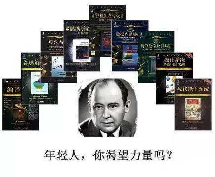

# 这里是计算机的一些书籍

[annotation]: <id> (1720e5f4-e0bb-441f-8ded-ec82af01a102)
[annotation]: <status> (public)
[annotation]: <create_time> (2019-04-22 11:08:31)
[annotation]: <category> (计算机科学)

事实上计算机科学的一些内容的确比较枯燥，这里整理了一些相关的书籍，并且会不断地更新。

## 2019-04-22

- [深入理解计算机系统](https://book.douban.com/subject/1896753/)
- [计算机程序的构造和解释](https://book.douban.com/subject/1148282/)
- [计算机组成与体系结构：性能设计](https://book.douban.com/subject/6398113/)