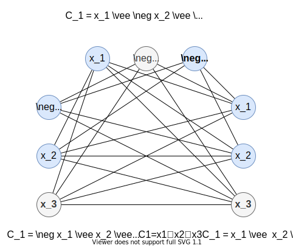

# NP 完全性

[annotation]: [id] (a2584fca-7a71-451a-8bac-3ae31d43c827)
[annotation]: [status] (public)
[annotation]: [create_time] (2021-11-28 22:21:13)
[annotation]: [category] (计算机科学)
[annotation]: [tags] (算法)
[annotation]: [comments] (true)
[annotation]: [url] (http://blog.ccyg.studio/article/a2584fca-7a71-451a-8bac-3ae31d43c827)

## 关于算法的描述

所谓一个问题是指一个有待回答、通常含有几个取值还未确定的自由变量的一个一般性提问。

它由两部分构成：

- 一是对其关于参数的一般性描述；
- 二是对该问题的答案所应满足的某些特性的说明。

而一个问题的某个实例则可通过指定问题中所有参数的具体取值来得到。以下用 $Π$ 表示某个问题，用 $Ι$ 表示其实例。

所谓一个问题实例的大小是指 **为描述或表示它而需要的信息量**。

所谓算法是指用来求解某一问题的、带有一般性的一步一步的过程。它是用来描述可在许多计算机上实现任一计算流程的抽象形式，其一般性可以超越任何具体实现时的细节。

一个算法的严格定义直到 1936 年才出现，丘奇和图灵分别在他们的文章中给出。丘奇使用称为 $λ$ 演算的记号系统来定义算法，图灵用抽象机器图灵机来定义算法，后来证明两者是等价的。

此前，希尔伯特的第 10 问题就是要设计一个算法来测试多元多项式是否有整数根。不过他不用“算法”这个词，而是用一句短语：“**通过有限次运算就可以决定的过程**”。我们这里采用图灵的定义,即借用图灵机计算模型来给出算法的精确定义。

----

## NP 完全性

> 定理：若 $\Pi \in NP$，则存在一个多项式 $p$，使得 $\Pi$ 可以用一个复杂性为 $O(2^{p(n)})$ 的确定性算法来求解；

直观上我们有理由认为多项式时间不确定性算法要比多项式时间确定性算法的速度快得多，能够在多项式时间内求解后者所不能够求解的许多其它问题。由此及许多其它理由，在目前已知知识背景下，人们普遍认为 $P$ 是 $NP$ 的真子集。关于这方面的研究基本上有两条线路：

1. 证明 $NP$ 类中的某些问题是难解的，从而得到 $P \neq NP$。但是这同原问题的难度几乎相当，也许只有建立一套全新的数学论证方法才有希望解决。
2. 考虑 $NP$ 类中问题之间的关系，从中找到一些具有特定性质的、与 $P$ 中问题有显著不同的问题。沿此路线人们已经证明了在 $NP$ 类中存在一个称为 $NP$ 完全的子类，并由此发展出一套著名的 $NP$ 完全理论。而证明一个问题是 $NP$ 完全的通常被认为一个告诉我们应该放弃寻找、设计求解该问题的有效算法（多项式时间算法）的强有力证明。

## NP 完全问题

欧拉回路是指一个能通过图 $G$ 中每一条边依次的圈，可以确定是否一个图在 $O(E)$ 的时间内仅有一个欧拉回路；

哈密顿回路是指图 $G=(V, E)$ 包含 $V$ 中每个顶点的简单回路；

P 类为题就是多项式时间内可以解决的问题；

NP 类问题是指那些在多项式时间内可以被验证的问题。

我们暂时可以相信 $P \subseteq NP$，但 $P$ 是否是 $NP$ 的真子集，目前还是一个开放问题。

对于一个函数 $f:\{0, 1\}^* \to \{0, 1\}^*$，如果存在一个多项式时间的算法 $A$，它对任意给定的输入 $x \in \{0, 1\}^*$，都能产生输出 $f(x)$，则称该函数是一个 **多项式时间可计算的函数**；

## NP 完全性的证明

> 引理：如果语言 $L$ 是一种满足对任意 $L'\in NPC$ 都有 $L'\leqslant_p L$ 的语言，则 $L$ 是 $NP$ 难度的，此外， 如果 $L \in NP$，则 $L \in NPC$

证明：

由于 $L'$ 是 $NP$ 完全语言，根据假设 $L'\leqslant_p L$，所以对所有 $L'' \in NP$，都有 $L''\leqslant_p L'$，因此根据传递性，有 $L'' \leqslant_p L$，这说明 $L$ 是 $NP$ 难度的。如果 $L \in NP$，则也有 $L \in NPC$；

---

换句话说，通过把一个已知为 $NP$ 完全的语言 $L'$ 归约为 $L$，就可以把 $NP$ 中的每一种语言都隐式地归约为 $L$。

因此，上述引理提供了证明某种语言 $L$ 是 $NP$ 完全语言的一种方法：

1. 证明 $L \in NP$；
2. 选取一种已知的 $NP$ 完全语言 $L'$；
3. 描述一种可计算函数 $f(x)$ 的算法，其中 $f$ 可将 $L'$ 中每一个实例 $x \in \{0 , 1\}^*$ 映射为 $L$ 中的实例 $f(x)$；
4. 证明函数 $f$ 满足 $x \in L'$ 当且仅当对于所有的 $x \in \{0 , 1\}^*$ 都有 $f(x) \in L$；
5. 证明计算函数 $f$ 的算法具有多项式运行时间；

## 一些 NP 完全问题

### 团问题

无向图 $G = (V, E)$ 中的团是一个顶点子集 $V'\subseteq V$ 其中每一对顶点之间都由 $E$ 中的一条边来连接，换句话说，一个团是 $G$ 的一个**完全子图**，完全图的意思是图中任意两个顶点之间都有边连接；

团的规模是指它所包含的顶点数。

团问题是关系于寻找途中规模最大的团的最优化问题；

也就是找出图中顶点最多的完全子图；

> 定理：团问题是 NP 完全的；

证明

为了证明 CLIQUE $\in NP$，对一个给定的图 $G=(V,E)$，用团中顶点集 $V' \subseteq V$ 作为 $G$ 的一个证书。对于任意一对顶点 $u, v \in V'$，通过检查边 $(u, v)$ 是否属于 $E$ ,就可以在多项式时间内确定 $V'$ 是否是团。

下一步来证明 3-CNF-SAT $\leqslant_P$ CLIQUE, 以此来说明团问题是 $NP$ 难度的。从某种意义来说，我们能证明这一结论是令人惊奇的，因为从表面上看，逻辑公式与图几乎没有什么联系。

该归约算法从一个 3-CNF-SAT 的实例开始。设 $\varphi＝C_1  \wedge C_2 \wedge \cdots \wedge C_k$ 是 3-CNF 形式中一个具有 $k$ 个子句的布尔公式。对 $r= 1, 2, \cdots ,k$，每个子句 $C_r$ 中恰好有 $3$ 个不同的文字 $l_1^r, l_2^r$ 和 $l_3^r$。我们将构造一个图 $G$ 使得 $\varphi$ 是可满足的，当且仅当 $G$ 包含一个规摸为 $k$ 的团。

我们按照以下要求构造图 $G$：对 $\varphi$ 中的每个子句 $G_r= (l_1^r \vee l_2^r \vee l_3^r)$，我们把 $3$ 个顶点 $v_1^r, v_2^r$ 和 $v_3^r$ 组成的三元组放入 $V$ 中。如果下列两个条件同时满足，就用一条边连接顶点 $v_i^r$ 和 $v_j^s$

- $v_i^r$ 和 $v_j^r$；处于不同的三元组中，即 $r \neq s$；
- 它们的相应 **文字** 是一致的，即 $l_i^r$ 不是 $l_j^s$ 的非；

根据 $\varphi$ 可以很轻易地在多项式时间内计算出该图。通过以下例子来说明这一构造过程。如果有：

$$\varphi = (x_1 \vee \neg x_2 \vee \neg x_3) \wedge (\neg x_1 \vee x_2 \vee x_3) \wedge (x_1 \vee x_2 \vee x_3)$$

该公式的一组可满足赋值为 $x_2 = 0$, $x_1 = 1$，$x_1$ 为 $0$ 或者 $1$。这一赋值以 $\neg x_2$ 满足 $C_1$，以 $x_3$ 满足 $C_2$ 和 $C_3$ ，与浅阴影顶点所构成的团集相对应。

我们必须证明从 $\varphi$ 到 $G$ 的转换过程是一种归约过程。首先，假定 $\varphi$ 有一个可满足性赋值。那么，每个子句 $C_r$ 至少包含一个文字 $l_i^r$， 将此文字赋值为 $1$，并且把每个这样的文字对应于一个顶点 $v_i^r$。从上述的每个子句中挑选出一个这样的 **真** 文字，就得到 $k$ 个顶点组成的集合 $V'$。可以断言 $V'$ 是一个团。对于任意的两个顶点 $v_i^r, v_j^r \in V' (r \neq s)$，根据给定的可满足性赋值，两个顶点相应的文字 $l_i^r$ 和 $l_j^r$ 都被映射为 $1$，这两种文字不可能是互补的关系。因此，根据 $G$ 的构造，边 $(v_i^r, v_j^r) \in E$。

反之，假定 $G$ 有一个规模为 $k$ 的团 $V'$。$G$ 中没有连接同一个三元组中的顶点的边，因此，$V'$ 中恰好包含每个三元组的一个顶点。我们可以把每个满足 $v_i^r \in V'$ 的文字 $l_i^r$ 赋值为 $1$，并且不必担心会出现一个文字与其补同时为 $1$ 的情况，这是因为在 $G$ 中，不一致文字之间不存在连线。由于每个子句都是可满足的，因此 $\varphi$ 也是可满足的。（不与团之中顶点相对应的变量可以随意设置。）

在上图的例子中，$\varphi$ 的一个可满足性赋值为 $x_2 = 0$, $x_3 = 1$。规模为 $3$ 的相应团由对应于第一个子句中的 $\neg x_2$、第二个子句中的 $x_3$ 和第三个子句中的 $x_3$ 的顶点所组成。由于该团不包含对应于 $x_1$ 或 $\neg x_1$ 的顶点，因此，在这个可满足性赋值中，可以将 $x_1$ 设置为 $0$ 或 $1$。

注意在定理的证明中，我们将 3-CNF-SAT 的任意一个实例归约成了具有某种特定结构的 CLIQUE 的实例。从表面上看来，似乎是我们仅证明了 CLIQUE 在有些图中是NP难度的。在这些图中，顶点被限制为以三元组形式出现，且同一三元组中的顶点之间没有边。事实上，我们的确仅证明了 CLIQUE 在这种受限的情况下才是 NP 难度的，但是，这一证明足以证明在一般的图中，CLIQUE 也是 NP 难度的。这是为什么呢？如果有一个能在一般的图上解决 CLIQUE 问题的多项式时间算法，那么它就能在受限的图上解决 CLIQUE 问题。

另一方面，将带有某种特殊结构的 3-CNF-SAT 的实例归约为一般性的 CLIQUE 的实例还不够。为什么这么说呢？有可能我们选择来进行归约的 3-CNF-SAT 的实例比较容易，因而无法将一个 NP 难度的问题归约为 CLIQUE。

另外，还要注意一下 3-CNF-SAT 的实例中所用到的归约，而不仅是它的解决方案。如果多项式时间的归约的前提是已经知道公式 $\varphi$ 是否是可满足的，则会导致错误，因为我们并不知道如何在多项式时间内判定 $\varphi$ 是否是可满足的。

---

### 顶点覆盖问题

无向图 $G=(V, E)$ 的顶点覆盖(Vertex Cover) 是一个子集 $V' \subseteq V$，满足如果有 $(u, v) \in E$，则 $u \in V'$ 或 $v \in V'$。也就是说，每个顶点 **覆盖** 与其相连的边，并且 $G$ 的顶点覆盖是 $E$ 中所有边的顶点组成的集合。顶点覆盖的 **规模** 是指它所包含的顶点数。例如下图中 $b$ 中有一个规模为 $2$ 的顶点覆盖 $\{w, z\}$。

**顶点覆盖问题** 是指在一个给定的图中，找出具有最小规模的顶点覆盖。把这一最优化问题重新表述成为一个判定问题，即确定一个图是否具有一个给定规模 $k$ 的顶点覆盖，作为一种语言，我们定义：

$$VC = \{<g, k>: 图 G 有一个规模为 k 的顶点覆盖 \}$$

> 定理：顶点覆盖问题是 NP 完全的。

**证法一**

首先来证明 $VC \in NP$。假定已知一个图 $G=(V,E)$ 和整数 $k$，我们选取的证书是顶点覆盖 $V'\subseteq V$自身。验证算法可证实 $|V'| = k$，然后对每条边 $(u, v) \in E$，检查是否有 $u \in V'$ 或 $v \in V'$。我们可以很容易在多项式时间内验证这一问题，于是 $VC \in NP$。

我们通过证明 $CLIQUE \leqslant_p VC$ 来证明顶点覆盖问题是 NP 难度的。这一归约过程是以 “补图” 的概念为基础的。给定一个无向图 $G= (V, E)$， 定义 $G$ 的补图 $\overline{G} = (V, \overline{E})$，其中 $\overline{E} = \{ (u, v): u, v \in V, u \neq v, (u, v) \notin E \}$。换句话说，$\overline{G}$ 是正好包含不在 $G$ 中的那些边的图。上图显示出了一个图与其补图，并说明了从 CLIQUE 到 VC 的归约过程。

归约算法的输人是团问题的实例 $<G, k>$。它计算出补图 $\overline{G}$，这很容易在多项式时间内完成。归约算法的输出是顶点覆盖问题的实例 $<\overline{G}, |V| - k>$。为了完成证明，下面来说明该变换的确是一个归约过程：图 $G$ 具有一个规模为 $k$ 的团，当且仅当图 $\overline{G}$ 有一个规模为 $|V| - k$ 的顶点覆盖。

假设 $G$ 包含一个团 $V' \subseteq V$，其中 $|V'| =k$。我们断言：$V - V'$ 是 $\overline{G}$ 中的一个顶点覆盖。

设 $(u, v)$ 是 $\overline{E}$ 中的任意边，则有$(u, v) \notin E$ ，这证明了 $u$ 或 $v$ 中至少有一个不属于 $V'$，这是由于 $V'$ 中每一对顶点间都至少有一条 $E$ 中的边与其相连。

等价地，$v$ 或 $u$ 中至少有一个属于 $V - V'$，这意味着边 $(u, v)$ 是被 $V - V'$ 所覆盖。由于 $(u, v)$ 是从 $\overline{E}$ 中任意选取的边，所以 $\overline{E}$ 的每条边都被 $V—V'$ 中的一个顶点所覆盖。因此，规模为 $|V|-k$ 的集合 $V-V'$ 形成了 $\overline{G}$ 的一个顶点覆盖。

反之，假设 $\overline{G}$ 具有一个顶点覆盖 $V' \subseteq V$，其中 $|V'| = |V| - k$。

那么，对所有 $u, v \in V$，如果 $(u, v) \in \overline{E}$，则 $u \in V'$ 或 $u \in V'$ 或两者同时成立。

与此相对，对所有 $u, v \in V$，如果 $u \notin V'$ 且 $v \notin V'$，则 $(u, v) \in E$。换句话说， $V-V'$ 是一个团，其规模为 $|V| - |V'| =k$。

---

**证法二**

选 3SAT 作为归约，设 3SAT 为 $\Pi'$ 中 变量为 $U = \{u_1, u_2, \cdots, u_n\}$，子句为 $C = \{ c_1, c_2, \cdots, c_m \}$，为 3SAT 的一个一般性的例子。

我们要构造一个图 $G = (V, E)$ 和一个正整数 $k \leqslant |V|$，使得 $G$ 有一个顶点数不超过 $k$ 的覆盖，当且仅当 $C$ 是可满足的。

对每个变量 $u_i \in U$，定义变量图 $T_i = (V_i, E_i)$，其中 $V_i = \{u_i, \overline{u}_i\}$，$E_i=\{(u_i, \overline{u}_i)\}$

对于每个子句 $c_j \in C$，设 $c_j = x_j \vee y_j \vee z_j$，构造一个子句三角形 $S_j = (V'_j， E'_j)$；其中

$$\begin{aligned}
V'_j =& \{A_1(j), A_2(j), A_3(j)\} \\
E'_j =& \{(A_1(j), A_2(j)), (A_1(j), A_3(j)), (A_2(j), A_3(j))\} \\
\end{aligned}$$

并且从三角形到变量，构造新的边集：

$$E''_j = \{(A_1(j), x_j), (A_2(j), y_j), (A_3(j), z_j)\}$$

合取范式 $C = (u_1 \vee \overline{u}_2 \vee \overline{u}_3) \wedge \cdots \wedge (u_3 \vee \overline{u}_4 \vee u_n)$ 的构造，如下图所示：

其中 $v_i = \overline{u}_i, i =1,2, \cdots, n$，令：

$$\begin{aligned}
V =& \left(\bigcup_{i = 1}^n V_i\right) \cup \left(\bigcup_{j = 1}^m V'_j\right) \\
E =& \left(\bigcup_{i = 1}^n E_i\right) \cup \left(\bigcup_{j = 1}^m E'_j\right) \cup \left(\bigcup_{j = 1}^m E''_j\right) \\
G =& (V, E) \\
k =& n + 2m
\end{aligned}$$

换句话说，就是上面这张图的形式化表示。

由于 $|V| = 2n + 3m$，$|E| = n + 3m + 3m = n + 6m$，以及 $k$ 均为有限制，上述构造的过程一定在多项式时间内完成。

以下证明：$C$ 是可满足的当且仅当图 $G$ 有一个顶点数不超过 $k$ 的覆盖。

设 $V' \subseteq V$ 是图 $G$ 的一个 **顶点覆盖**，$|V'| \leqslant k$，由图 $G$ 的构造，$V'$ 必然包含每个 **变量图** $T_i$ 中至少一个顶点，和每个 **子句三角形** $S_j$ 至少两个顶点，这已经给出了至少 $k = n + 2m$ 个顶点；

故 **顶点覆盖** $V'$ 必然含有每个 **变量图** $T_i$ 中恰好一个顶点和每个 **子句三角形** $S_i$ 中恰好两个顶点。

据此给出 **变量集合** $U$ 的一个真赋值 **映射** $t: U \to \{T, F\}$ 规则如下：

- 当 $u_i \in V'$ 时， $t(u_i) = T$
- 当 $\overline{u}_i \in V'$ 时， $t(u_i) = F$

为了说明该赋值满足每个子句 $c_j \in C$，考虑 $E''_j$ 中的三条边。这些边中恰有两条可被 $V'_j \cap V'$ 中的（三角形）顶点覆盖，剩下的一条边必由属于 $V'$ 的某个 $V_i$ 中的一个（变量）顶点覆盖。但这意味着子句 $c_j$ 中的相应变量要么是 $u_i$ 或者是 $\overline{u}_i$，在赋值规则 $t$ 之下取值为真，从而 $c_j$ 可由规则 $t$ 满足。

反之，如果映射 $t: U \to \{T, F\}$ 为 $C$ 的一个可满足性真赋值，我们构造图 $G$ 的一个顶点覆盖如下：

对于 $V_i$ 中的顶点，如果 $t(u_i) = T$，选取 $u_i$，如果 $t(u_i) = F$ 则选取 $\overline{u}_i$；对于 $V'_j (1 \leqslant j\leqslant m)$ 中的顶点，由于 $c_j = x_j \vee y_j \vee z_j$ 中至少有一个取真值 $T$，不妨设 $t(x_j) = T$，则前面诸 $V_i$ 中顶点的选取中，$x_j$ 必然被选取，此时我们在 $V'_j$ 中只需选取顶点 $A_2(j), A_3(j)$ 即可。

上述方法选出的顶点集显然是 $G$ 的覆盖，而且顶点数恰好为 $k = n + 2m$
