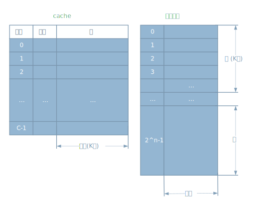

# 计算机 cache 存储器

[annotation]: <id> (ebdf0ad2-dc01-47e6-b203-43d8d37baab7)
[annotation]: <status> (public)
[annotation]: <create_time> (2019-04-22 11:46:41)
[annotation]: <category> (计算机科学)
[annotation]: <tags> (组成原理)
[annotation]: <comments> (true)

> 原文链接：<http://blog.ccyg.studio/article/ebdf0ad2-dc01-47e6-b203-43d8d37baab7>

---

以前在上学的时候，期末考试时，计算机组成原理这门课中 cache 存储器的分值占到了100分中40分，当时就意识到了这部分内容的重要性，但是对于计算机来说最重要的内容莫过于中央处理器了，但是中央处理器对于考试来说，不太好考，于是考试具有区分性的压力就来到了cache 存储器上面。

下面讨论以下 cache 存储器，首先了解一个很重要的原理。

> CPU 在访问存储器时，无论是存取指令还是数据，所访问的存储单元都趋于聚集在一个较小的连续趋于中，这个原理叫做**局部性原理**

通常，在处理器即将要访问的主存位置极有可能是刚刚访问过的某个位置，所以高速缓存会自动保存一些来自近期使用过的副本。如果cache设计的合理，那么绝大多数的时候处理器所需要的存储器数据便已经在cache中。

计算机中存储器的限制可以归纳为3个问题：

- 容量有多大？
- 速度有多快？
- 价格有多贵？

计算机存储器的层次结构，或者说优先级吧，类似于下面整个列表：

1. 处理器内部寄存器
2. 高级缓存
3. 主存储器
4. 外部存储器
5. 可移动存储器

整个列表的优先级由高到低，价格也由高到低，访问速度也是由高到低。容量由低到高。

## cache 存储器原理

cache存储器的目的是使存储器的速度逼近可用的最快的存储器的速度，同时以较便宜的半导体存储器的价格提供一个大的存储器容量。

一般来说，一个相对大而慢的主存，加一个小而快的 cache。cache 中存放了主存储器的部分副本。当CPU试图访问主存中的某个字时，首先检查这个字是否在 cache 中，如果是，则把这个字传送给CPU；如果不是，则将主存中包含这个字固定大小的块读入 cache 中，然后再将该字传送给CPU。因为访问的局部性原理，当把某一块数据存入cache，以满足某次访问存储器的访问时，CPU将来还有很大的可能接着访问同一个位置的数据。

一样可以使用多级cache，多级cache的使用，其中各级cache逐级访问速度递减，成本递减，容量递增。

下图描述了cache/主存系统的结构。主存储器由 $2^n$个可寻址的字组成，每一个字有唯一的n位地址，为了实现映射，我们将主存储器看成是由许多定长的块组成，每块有K个字。即有 $M = {2^n}/{K}$ 个块。而 cache 包含 m 个块，称为**行**，每行包括K个字和几位标记。每行还包括控制位（图中没有画出），例如，用作判断装入 cache 中的行是否被修改的控制位。行的长度，不包含标记和控制位，称为**行大小**。行大小可以小到32位，其每个字就是单个字节，此时行大小时4个字节。行的数量远远小于主存储器块的数量（m << M）。任何时候只有主存储器块的一部分驻留在 cache 行中。如果要读取主存储器块中的某个字，则包含该字的块将被传送到 cache 的一个行中。由于块比行多，所以单个行不可能永久的被某块专用。因此，每行都有一个**标记**，用来识别当前存储的是哪一块。这个标记通常是主存储器地址的一部分。

## cache 的设计要素

许多研究人员已经发现，HPC(High Performance Computing) 应用在使用了 cache 的计算机体系结构商性能会变差。

### cache 地址

虚拟内存时一种内存扩容技术，这种技术不会使主存物理地址空间大小发生变化，但允许程序在逻辑上访问更多的地址。当使用虚拟内存时，机器指令的地址区域包含虚拟地址。为了从主存中进行读写操作，硬件存储器管理单元，将每个虚拟地址翻译成主存中的物理地址。

当使用虚拟地址时，系统设计人员可能选择将 cache 置于处理器和**MMU**之间，或者置于 MMU 和主存之间。逻辑 cache，也称为虚拟cache，使用虚拟地址存储数据，处理器可以直接访问逻辑cache，而不需要通过MMU。而物理cache使用主存的物理地址来存储数据。

逻辑 cache 的一个明显优势时其访问速度比物理cache快，因为该cache能够在 MMU 执行地址翻译之前作出反应。而其不足之处在于大多数虚拟存储系统为每一个应用程序提供相同的虚拟内存空间。也就是说，每个应用程序都可以从地址0的虚拟内存开始。因此，相同的虚拟地址在两个不同的应用程序中涉及不同的物理地址。所以 cache 存储器必须用每一个应用程序的上下文开关对其进行完全刷新，或者为 cache 的每一行增加额外的几位来标记与该地址相关的虚拟地址。

### cache 容量

我们希望 cache 的容量足够小，以至于整个存储系统的平均价格接近于单个主存储器的价格，同事我们也希望 cache 足够大，从而使得整个存储系统的平均存取时间接近于单个cache的存取时间。还有几个减小cache容量的动机。cache越大，寻址所需要电路门就会越多，结果是大的cache比小的稍慢，即使是采用相同的集成电路技术制造并放在芯片的电路板的同一位置。cache 容量也受芯片和电路板面积的限制，因为cache 的性能对工作负载的性能十分敏感，所以不可能有“最优”的cache容量。

## 映射功能

由于cache的行比主存储器的块要少，因此需要一种算法来实现主存块到cache行的映射。还需要一种方法来确定当前那一块占用了 cache 行，映射方法的选择决定了 cache 的组织结构，通常采用三种方法：

**直接映射**

直接映射是最简单的映射技术，将主存中的每个快映射到一个固定可用的cache 行中，直接映射可表示为：

>$$i = j\ mod\ m$$

其中:
- i = cache 行号
- j = 主存储器的块号
- m = cache 的行数。

直接映射技术简单，实现花费少。主要缺点是：对于任意给定的块，它所对应的 cache 位置时固定的。因此，如果一个程序恰巧重复访问两个需要映射到同一行中且来自不同块的字，则这两个块将不断地被交换到cache中。cache的命中率将会降低（一种所谓的抖动现象）

**全相联映射**

全相连映射克服了直接映射的缺点，它允许每一个主存块装入cache中的任意行。这种情况下，cache 控制逻辑将存储地址简单地表示为一个标记域加一个字域。标记域用来唯一标识一个主存块。为了确定某块是否在 cache 中，cache 控制逻辑必须同时对每一行中的标记进行检查，看其是否匹配。地址中无对应行号的字段，所以cache中的行号不由地址格式决定。

对于全相联映射，当新的块读入 cache 中时，替换旧的一块很灵活。全相联映射的主要缺点时需要复杂的电路来并行检查所有的cache行标记。

主存中的一个地址可被映射进任意cache 行，问题是：当寻找一个地址是否已经被 cache 时，需要遍历每一个cache 行来寻找，这个代价很高。就像停车位可以大家随便停一样，停的时候简单，找车的时候需要一个一个停车位的找了。

全相联映射方式比较灵活，主存的各块可以映射到 cache 的任一块中，cache 的利用率高，块冲突概率低，只要淘汰 cache 中的某一块，即可调入主存的任一块。但是，由于 cache 比较电路的设计和实现比较困难，这种方式只适合于小容量 cache 采用。

**组相联映射**

组相连映射是一种折中的方法，它既体现了直接映射和全相联映射的有点，又避免了两者的缺点。

主存和 cache 都分组，主存中一个组内的块数与 cache 中的分组数相同，组间采用直接映射，组内采用全相联映射。主存块存放到哪个组是固定的，至于存到该组哪一块则是灵活的。即主存的某块只能映射到cache的特定组中的任意一块。

在组相联映射中，cache 分为 v 个组，每组包含k个行，他们的关系为：

>$$
\begin{aligned}
m &= v \times k \\
i &= j\ mod\ v \\
\end{aligned}
$$

其中:
- i = cache 行号
- j = 主存储器的块号
- m = cache 的行数
- v = 组数
- k = 每组中的行数

这被称为 k 路组相联映射。

常采用的组相联结构 cache，每组内有2、4、8、16块，称为2路、4路、8路、16路组相联 cache。以上为2路组相联 cache。组相联结构 cache 是前两种方法的折中方案，适度兼顾二者的优点，尽量避免二者的缺点，因而得到普遍采用。

### 替换算法

一旦 cache 行被占用，当新的数据块装入 cache 中时，原存在的块必须被替换掉。对于直接映射，任意特殊块都只有唯一的一行可以使用，没有选择的可能。对于全相联和组相联映射技术，则需要一种替换算法。为了获得高速度，这种算法必须由硬件来实现。人们尝试过许多算法，下面介绍最常用的4中算法。

- **最近最少使用算法(LRU)**：这是最有效的算法，替换掉那些在cache中最长时间未被访问的块。对于二路组相联这种方法很容易实现，每行包含一个USE位，当某行被引用时，其USE位被置为1，而这一组中另一行的USE位被置为0。当把一块读入到这一组中时，就会替换掉USE位为0的行。由于我们假定越是最近使用的存储单元越有可能被访问，因此，LRU会给出最佳的命中率。多余全相联 cache，LRU也相对容易实现。告诉缓存机制会为cache中的每行保留一个单独的索引表。当某一行被访问时，它就会移动到表头，而在表尾的行将被替换掉。因为实现简单，LRU是目前使用最为广泛的替换算法。

- **先进先出算法(FIFO)**：替换掉在cache中停留时间最长的块，FIFO采用时间片轮转法或者环形缓冲技术很容易实现。

- **最不经常使用算法(LFU)**：替换掉 cache 中被访问次数最少的块，LFU可以用与每行相关的计数器来实现。

- **随机化算法**：在候选行中任意选取，然后替换。看似荒唐，但是实际实验表明，性能上只稍逊与基本使用情况的算法。

### 写策略

这里涉及到了，缓存同步的问题，当驻留在 cache中的某块要被替换时，必须考虑两点。如果 cache 中的原块没有被修改过，那么可以直接替换掉，而不需要事先写回主存。如果 cache 某行中至少在一个字上进行过写操作，那么在替换掉该块之前必须将该行写回主存对应的块，以进行主存更新，保证数据同步。各种可行的写策略都对性能和价格进行了权衡。首先，有一个以上的设备已经访问了主存储器。例如，输入输出模块可能直接读写存储器，如果一个字只在 cache 修改过，那么相应的存储器字就是无效的。进一步，如果某I/O设备修改了主存储器，则 cache 中的字是无效的。当多个处理器连接到同一总线上，并且每个处理器都有自己局部的 cache 时，则出现了更加复杂的问题。因此如果在一个 cache 中修改了一个字，那么可以设想在其他cache中的该字是无效的。

最简单的计数称为**写直达**，采用这种计数，所有的写操作都同时对主存和 cache 进行，以保证主存中的数据总是有效的。任何其他处理器、高速缓存模块监视对主存的访问，都是维护它自己 cache 的一致性。这一计数的主要缺点是产生了大量的存储通信。可能引起瓶颈问题。

另一种计数称为**写回法**，它减少了主存的写入，使用写回计数时，只更新 cache 中的数据。当更新操作发生时，需要设置该行相关的脏位或使用位。然后当一个块被替换掉时，当且仅当脏位被置位时才将它写回主存。写回的缺点是，部分主存数据是无效的，因此I/O模块的存取只允许cache进行，这就使得电路设计更加复杂而且存在潜在的瓶颈问题。经验表明，写操作占存储器操作的 15%。然而 对HPC 应用，这个值可接近33%，甚至高达 50%（矩阵转置）。

不止一个设备有 cache 且共享主存的总线结构出现了一个新的问题。如果某个cache中的数据被修改，则它不但会使主存中的相应数据失效，而且也会使其他 cache 中的相应数据失效。即使使用写直达策略，其他 cache 也可能包含无效的数据。防止这个问题的系统是在维护系统 cache 的一致性。保证 cache 一致性的方法有：

- **写直达的总线检测**：每个 cache 监控器监视这地址线，以检测总线的其他主控者对主存的写操作。如果有另一个总线主控者向共享存储单元写入数据，而这个单元内容同时驻留在 cache 中，则该 cache 控制器中的这一项无效。这一策略要求所有的 cache 控制器都使用写直达策略。

- **硬件透明**：使用附加的硬件来保证所有通过 cache 对主存的修改反映到cache中。因此，如果某个处理器修改了自己 cache 中的一个字，则同时会修改主存对应单元，任何其他 cache 中相同的字也会同时被修改。

- **非 cache 存储器**：著有一部分主存为多个处理器共享，这称为 **非cache**。在这样的系统中，所有对共享存储器的访问都会导致 cache 缺失，因为共享存储器中的数据不会复制到 cache 中。非 cache 存储器能采用片选逻辑或者高地址位来标识。

### 多级 cache

最初引入 cache 时，系统通常只有一个 cache。近年来使用多个 cache 已经变得相当普遍。由于集成度的提高，将 cache 与处理器置于统一芯片称为可能。与通过外部总线连接的cache相比，片内 cache 减少了 处理器在外部总线上的活动，从而减少了执行时间，全面提高了系统性能。当所需的指令或数据在片内 cache 中时，消除了对总线的访问。因为与总线长度相比，处理器内部的数据路径较短，访问片内 cache 甚至比零等待状态的总线周期还要快，而且，在这段时间内总线是空闲的，可用于其他数据的传送。

片内 cache 导致了另一个问题：是否需要使用一个片外或者外部的 cache。通常，答案是肯定的，多数当代的设计既包含了片内 cache，又包含外部 cache。这种组织方式中最简单的是两级 cache，其中片内cache为第一级(L1)，外部cache为第二级(L2)。包含 L2 cache 的理由如下：如果没有L2 cache 并且处理器要访问的地址不在 cache 中时，则处理器必须通过总线访问主存。因为通常总线的速度较慢且存储器存取时间较长，这就导致了较低的性能。另一方面，如果使用了 L2 SRAM cache。则经常缺失的信息能够很快取来。如果 SRAM 的速度快到能与总线相匹配，则数据能够用零等待状态来存取，这是总线传输最快的一种类型。

当代多级 cache 设计的两个特点值得注意：第一，对于片外 L2 cache，许多设计都不是用系统总线作为L2 cache 和处理器之间的传送路径，而是使用单独的数据路径，以便减轻系统总线的负担。第二随着处理器部件持续缩小，现在已有许多处理器将 L2 cache 结合到处理器芯片上，改善了性能。

若想使用 L2 cache，则取决于 L1 和 L2 的命中率。一些研究表明，使用两级 cache 通常确实可以提高性能。然而，多级 cache 的使用也使得关于 cache 设计的所有问题变得复杂。包括 cache容量，替换算法和写策略等等。

随着适用于 cache 的芯片面积的可用性的提高，大多数处理器 已将 L2 cache 移到 处理器芯片上，并添加了一个 L2 cache，最初 L2 cache 是越过外部总线存取的。而最近，大多数处理器已经集成到 L3 cache 上。无论哪种情况，加入 L3 cache 都使得性能得到了明显的提升。

### cache 的统一和分离

当 cache 首次出现时，许多设计都采用单个 cache，即存放数据，有存放指令。近年来通常把 cache 分为两个部分：一个专门用于指令，另一个专门用于数据。这两种 cache 被置于同一级，通常作为两个 L1 cache。当处理器试图从主存中读取指令时，它首先查看指令 L1 cache; 而当处理器试图从储存中取数据时，它会先查看数据L1 cache。

统一的 cache 有两个潜在的优点：

- 对于给定的cache容量，统一 cache 较独立 cache 有更高的命中率，因为它在获取指令和数据的负载之间自动进行平衡。也就是说，如果执行方式取指令比取数据要多得多，则 cache 倾向于被指令填满。如果执行方式中读取数据相对较多，则会出现相反的情况。
- 只需要设计一个 cache

尽管统一的 cache 有这些优点，但分立 cache 是一种趋势，特别是对于**超标量机器**，例如 Pentium 和 PowerPC，它们强调并行指令执行和带预测的指令预取。分立cache 设计的主要优点是消除了 cache 在指令的取指/译码单元和执行单元之间的竞争，这在任何基于**指令流水线**设计中都是重要的。通常处理器会提前回去指令，并把将要执行的指令装入缓冲区或流水线。假设，现在有统一指令/数据 cache，当执行单元执行存储器访问来存取数据时，这一请求被提交给统一 cache。如果同时指令预取器为取指令向 cache 发出读者请求，则后一请求会暂时阻塞，以便 cache 能够先为执行单元提供服务，使它能完成当前的指令执行。这种 cache 的竞争会降低性能，因为它干扰了指令流水线的有效使用。分立 cache 结构解决了这一问题。

## 参考资料

- [计算机组成与体系结构：性能设计](https://book.douban.com/subject/6398113/)