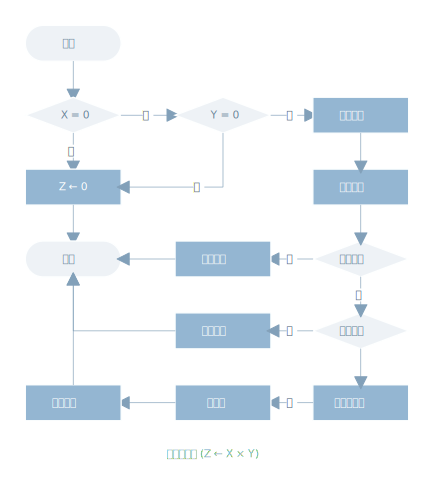
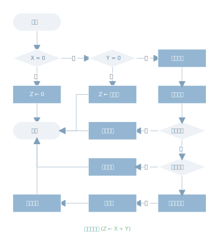

# 计算机浮点算术

[annotation]: <id> (c9779274-c8e5-47ed-8fee-9cb8f7eebf84)
[annotation]: <status> (protect)
[annotation]: <create_time> (2019-04-17 22:17:15)
[annotation]: <category> (计算机科学)
[annotation]: <tags> (组成原理)

在阅读这篇文章之前，强烈建议阅读 [计算机浮点数表示法](http://blog.ccyg.studio/article/f3800a51-4236-46d2-85c9-d983e4e95968)，以理解计算机中浮点数的表示方式。

对于加减法必须保证两个操作数具有相同的阶。这可能需要移动一个操作数的小数点以达到对齐。乘除法反而更简单些。

浮点运算可能会产生下面几种特殊的情况：

- **阶值上溢**：一个正阶值超出了最大允许的阶值。某些系统将其设置为 $+ \infty$ 或 $- \infty$
- **阶值下溢**：一个负阶值小于允许的阶值。这意味这那个数太小无法表示，一般可报告成为0
- **有效值上溢**：两个数相加时可能导致最高位进位，这可以通过重新对齐来修补
- **有效值下溢**：处理有效值对齐时，可能数字被移除右端最低位而丢失

## 浮点数加法和减法

浮点算数中，加、减法要比乘除法更复杂，因为它需要对齐。加减法有4个基本阶段：

1. 检查 0 
2. 对齐有效值
3. 加或减有效值
4. 规格化结果

如下图所示，下面逐步说明加、减法所需要的主要操作。假定格式类似于 IEEE 754格式。为了加减操作，两个操作数必须传送到算数逻辑单元的寄存器中，若格式包括一个隐藏的有效位，则此位要先变成显式再操作。

**检查0** 因为加法和减法除了符号不同外基本上都是相同的，因此若是一个减法，过程一开始就要改变减数的符号，接着若有一个操作数为0，那么另一个操作数就是结果。

**对其有效位** 下一步是操纵两个数使这两个数阶值相等。

要说明为什么需要这样做，可以参考十进制加法：

$$(123 \times 10 ^ 0) + (456 \times 10 ^ {-2})$$

很明显，不能仅加有效值，数字首先要设置成对等位置。第二个数的4需要与第一个数的3对齐。两个数的阶值在相等的条件下才能相加，这是数学的基本要求。于是有

$$(123 \times 10 ^ 0) + (4.56 \times 10 ^ 0) = 127.56 \times 10 ^ 0 $$

实现有效值对齐，或右移较小的数，或左移较大的数。无论哪种操作都可能导致数字丢失，一般来说右移较小的数而丢失的数字，所造成的影响要相对小些，因此对齐通过重复右移较数有效值的的幅值部分1位，并且将其阶值加1，直到两个阶值相等。

若此过程导致有效值变为0，则另一个数即为结果，于是，若两个数的阶值差别非常大，则较小的数丢失。

**加法** 将两个数的有效值相加，相加时要考虑他们的符号。因为符号可能不同，结果有可能是0.这里也可能出现有效值上溢 1个数字，若是这样，则需要有效值右移，阶值加1，阶值加1又可能发生上溢；如果发生阶值上溢，此时应终止操作并报告错误。

**规格化** 左移有效值直到最高有效数字为非零，每次左移都引起阶值相应减1，这种情况有可能出现阶值下溢。最后必须对结果进行舍入，然后报告结果。

## 浮点数乘法和除法

浮点乘除法要比加减法简单，首先来看乘法，其过程如下图所示：

对于乘法无论那个操作数是0，乘积即为0。下一步是阶值相加。若阶值是移码表示的形式，两个阶值的和将会包含两倍的偏移量，所以应该减去一个偏移量。阶值相加可能会出现阶值上溢或下溢，此时应该结束乘法并报错。

若阶值在一个恰当的范围内，则下一步是有效值相乘，考虑到有效值的符号，有效值相乘与整数乘法的完成方式相同。此例中我们使用的是 符号幅值表示法。不过对于补码表示法，其细节也是类似的。积的长度将是被乘数和乘数长度的两倍，多余的位将在舍入期间丢失掉。

得出乘积之后，下一步则是结果的规格化和舍入处理，同加、减法所做的一样。注意规格化可能导致阶值下溢。

下面来看除法，如下图所示：

第一步是测试0，如果除数为0，则报错，或者认为商是无穷大，这取决于具体的实现。若被除数是0，则结果是0。下一步是被除数的阶值减去除数的阶值。这个过程把偏移量剪掉了，所以必须再加上偏移量。然后检查阶值是否出现了溢出。

下一步是有效值相除，然后规格化和舍入处理。

## 关于浮点算术的精度

### 保护位

如前所知，在浮点运算之前，每个操作数的阶值和有效值要装入算术逻辑单元的寄存器中。有效值的装入情况是，寄存器的长度几乎总是大于有效值位长与一个隐藏位（若使用）之和。寄存器包含的这些附加位叫做**保护位**，有效值装入时，这些位以0填充，用于扩展有效值的右端。

使用保护胃的理由是，对于IEEE 745格式的数，它有24位有效值，包括了二进制小数点左边的一个隐藏位。$x=1.00\cdots00 \times 2^1$ 和 $x=1.11\cdots11 \times 2^0$ 是两个值很靠近的数。x - y 时，较小的数y必须右移一位以对齐阶位。此过程中，y丢失了一位有效数字；结果是 $2^{-22}$。重复同样的过程，此时附加有4位保护位。现在，最低有效值位不会由于对齐而丢失，结果是 $2^{-23}$，与前一答案相比查了一半。当基数是16时，精度的损失可能更大。结果差了 16 倍。

### 舍入处理

影响结果精度的另一个细节是舍入策略。对于有效值操作的结果通常保存在更长的寄存器中。当结果转换回浮点格式时，必须要去掉多余位。

IEEE 754 标准已列出4种可供原则的方法：

- **就近舍入**
- **朝 $+\infty$ 舍入**
- **朝 $-\infty$ 舍入**
- **朝0舍入**

就近舍入是标准列出的默认舍入方式，其定义如下：**最靠近无线精度结果的可以表示的值将被提交**。

>总之，只要有舍入就会有精度损失，除了扩展精度意外，还应该特别注意数值计算方法。能不用浮点数计算的时候，尽可能避免使用浮点数。

## 参考资料

- [Computer Organization and Architecture, 9th Edition - William Stallings]()
