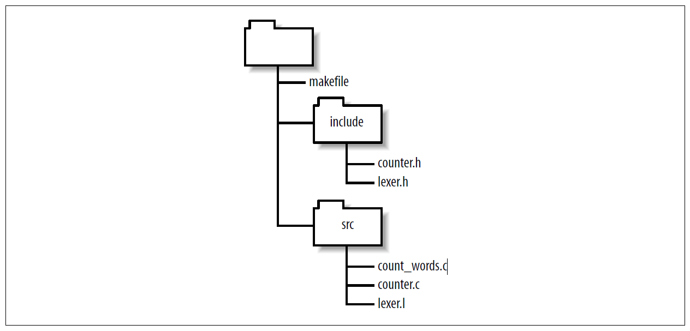

# GNU Make 项目管理 第二章 规则

[annotation]: <id> (09443028-3ef7-4314-8998-5593c2b8c8c8)
[annotation]: <status> (public)
[annotation]: <create_time> (2021-04-18 17:40:01)
[annotation]: <category> (读书笔记)
[annotation]: <tags> (Make|Makefile|GNU)
[annotation]: <topic> (GNU Make 项目管理)
[annotation]: <index> (2)
[annotation]: <comments> (true)
[annotation]: <url> (http://blog.ccyg.studio/article/09443028-3ef7-4314-8998-5593c2b8c8c8)

在上一章中，我们编写了一些规则来编译和链接我们的单词计数程序。这些规则中的每一个都定义一个目标，即要更新的文件。每个目标文件都依赖于一组文件。当要求更新目标时，如果任何依赖文件比目标修改时间最近，make 将执行规则的命令脚本。由于一个规则的目标可以作为另一条规则的依赖来引用，因此目标和依赖的集合形成了依赖关系链或图。构建并处理此依赖关系图以更新需要的目标是 make 的全部目的。

由于规则在 make 中是如此重要，因此存在许多不同种类的规则。与上一章中的规则一样，显式规则指出了要更新的特定目标，如果该目标的任何依赖已过时。这是您将要编写的最常见的规则类型。模式规则使用通配符而不是显式文件名。这样，只要需要更新与该模式匹配的目标文件，make 便可以应用该规则。隐式规则是在内置的规则数据库中找到的模式规则或后缀规则。具有内置的规则数据库使编写 makefile 更加容易，因为对于许多常见任务而言，他们已经知道文件类型，后缀和用于更新目标的程序。静态模式规则类似于常规模式规则，但它们仅适用于目标文件的特定列表。

GNU make 可以用作许多其他版本的 make 的替代，并包括一些专门用于兼容性的功能。后缀规则是编写一般规则的原始方法。 GNU make包含对后缀规则的支持，由于被更清晰，更通用的模式规则所取代，它们被认为已过时。

## 显式规则

您将编写的大多数规则都是将特定文件指定为目标和依赖的显式规则。一条规则可以有多个目标。这意味着每个目标都具有与其他目标相同的依赖。如果目标已过期，则将执行同一组操作来更新每个目标。例如：

```makefile
vpath.o variable.o: make.h config.h getopt.h gettext.h dep.h
```

这表明 `vpath.o` 和 `variable.o` 都依赖于同一组 C 头文件。该行与以下内容具有相同的作用：

```makefile
vpath.o: make.h config.h getopt.h gettext.h dep.h
variable.o: make.h config.h getopt.h gettext.h dep.h
```

这两个目标是独立处理的。如果任何一个目标文件相对于其任何依赖都过期（也就是说，任何头文件的修改时间都比该目标文件的更新时间晚），make 将通过执行与该规则关联的命令来更新该目标文件。

规则不必一次全部定义。每次 make 看到目标文件时，它都会将目标和依赖添加到依赖关系图中。如果在关系图中已经看到目标并且该目标已存在，则任何其他依赖都将附加到 make 的依赖关系图的目标文件条目中。在简单的情况下，这对于打断长行以提高 makefile 的可读性很有用：

```makefile
vpath.o: vpath.c make.h config.h getopt.h gettext.h dep.h
vpath.o: filedef.h hash.h job.h commands.h variable.h vpath.h
```

在更复杂的情况下，依赖列表可以由管理方式非常不同的文件组成：

```makefile
# Make sure lexer.c is created before vpath.c is compiled.
vpath.o: lexer.c
...

# Compile vpath.c with special flags.
vpath.o: vpath.c
    $(COMPILE.c) $(RULE_FLAGS) $(OUTPUT_OPTION) $<

...
# Include dependencies generated by a program.
include auto-generated-dependencies.d
```

第一条规则说，只要更新 `lexer.c` 就必须更新 `vpath.o` 目标（可能是因为生成 `lexer.c` 具有其他副作用）。该规则还可以确保在更新目标之前始终更新依赖。（请注意，规则具有双向性。在向前的方向上，规则表示如果 `lexer.c` 已更新，请执行操作以更新 `vpath.o`。在向后的方向上，规则表示如果需要 make 或使用 `vpath.o`，请首先确保lexer.c是最新的。）此规则可能放在管理 `lexer.c` 的规则附近，因此提醒开发人员这种微妙的关系。随后，将 `vpath.o` 的编译规则放在其他编译规则中。该规则的命令使用三个 make 变量。您会看到很多这样的东西，但是现在您只需要知道变量是 $ 符号后跟一个字符，还是 $ 符号后跟一对括号。 （我将在本章后面的内容中进行更多的解释，而在第三章中将进行详细的解释。）最后，`.o/.h` 依赖关系包含在 makefile 中，它是由外部程序管理的独立文件。

### 通配符

makfile 通常包含很长的文件列表。为了简化此过程，make 支持通配符。 make 的通配符与 **Bourne Shell (sh)** 的通配符相同：`~`，`*`，`?`，`[...]` 和 `[^...]` 。例如，`*.*` 扩展到包含句点的所有文件。一个问号代表任何单个字符，而 `[...]` 代表一个字符类别。要选择 **相反（否定）** 字符类，请使用 `[^...]`。

此外，波浪号 `~` 可以用来表示当前用户的主目录。`~` 后跟用户名代表该用户的主目录。

只要通配符出现在目标，依赖或命令脚本上下文中，通配符就会通过 make 自动展开。在其他情况下，通配符可以通过调用函数来显式扩展。通配符对于创建更具适应性的 makefile 非常有用。例如，您可以使用通配符 `*` 而不是显式列出程序中的所有文件（在更受控的环境中，使用通配符选择程序中的文件被认为是不好的做法，因为流氓源文件可能会意外地链接到程序中）：

```makefile
prog: *.c
    $(CC) -o $@ $^
```

但是，请务必注意通配符。如以下示例所示，很容易滥用它们：

```makefile
*.o: constants.h
```

目的很明确：所有目标文件都依赖于头文件 `constants.h`，但是请考虑如何在没有任何目标文件的干净目录中扩展它：

```makefile
: constants.h
```


这是一个合法的 make 表达式，不会自行产生错误，但也不会提供用户所需的依赖关系。实施此规则的正确方法是对源文件执行通配符（因为它们始终存在）并将其转换为目标文件列表。我们将在第四章中讨论 make 函数时，介绍这种技术。

最后，值得注意的是，当模式作为目标或依赖出现时，通配符扩展是由 make 执行的。但是，当模式出现在命令中时，扩展由子 shell 执行。这有时可能很重要，因为 make 会在读取 makefile 时立即扩展通配符，但是 shell 将在执行命令后更晚地扩展命令中的通配符。当完成许多复杂的文件操作时，两个通配符扩展可能会大不相同。

### 伪目标

到现在为止，所有目标和依赖都是要创建或更新的文件。通常是这种情况，但是对于目标来说，只是代表命令脚本的标签通常会很有用。例如，前面我们注意到，在许多 makefile 文件中，一个标准的第一个目标称为 `all`。不代表文件的目标称为伪目标。另一个标准的伪造目标是 `clean` ：

```makefile
clean:
    rm -f *.o lexer.c
```

通常，由于与规则关联的命令不会创建目标名称，因此始终会执行伪造目标。

If by chance the name of a phony target exists as a file, make will associate the file with the phony target name in its dependency graph. If, for example, the file clean happened to be created running make clean would yield the confusing message:

重要的是要注意，make 无法区分文件目标和假目标。如果不幸伪目标的名称作为文件存在，make 将在其依赖关系图中将文件与伪目标名称相关联。例如，如果碰巧创建了文件 clean，则运行 make clean 会产生令人困惑的消息：

```text
$ make clean
make: `clean' is up to date.
```

由于大多数虚假目标没有依赖，因此干净目标总是被认为是最新的，并且永远不会执行。

为避免此问题，GNU make 包含一个特殊的目标 `.PHONY`，以告知 make 目标不是真实文件。可以通过将任何目标包含为 `.PHONY` 的依赖来声明其为伪目标：

```makefile
.PHONY: clean
clean:
    rm -f *.o lexer.c
```

现在，即使存在一个名为 clean 的文件，make 仍将始终执行与 clean 相关的命令。除了将目标标记为始终过期之外，指定目标为伪目标还可以使此文件不遵循从源文件创建目标文件的正常规则。因此，make 可以优化其常规规则搜索以提高性能。

However, it is often useful to give phony targets prerequisites. For instance, the all target is usually given the list of programs to be built:

使用伪造的目标作为真实文件的依赖几乎没有任何意义，因为伪造总是过时的，并且总是会导致目标文件被重新制作。但是，给伪目标加依赖通常是有用的。例如，通常为 all 目标提供要构建的程序列表：

```makefile
.PHONY: all
all: bash bashbug
```

这里，all 目标都创建了 bash 程序和 bashbug 错误报告工具。

伪目标也可以看作是嵌入在 makefile 中的 shell 脚本。使一个伪目标成为另一个目标的依赖将在创建实际目标之前调用该伪目标脚本。假设我们的磁盘空间紧张，在执行磁盘密集型任务之前，我们要显示可用的磁盘空间。我们可以这样写：

```makefile
.PHONY: make-documentation
make-documentation:
    df -k . | awk 'NR = = 2 { printf( "%d available\n", $$4 ) }'
    javadoc ...
```

这里的问题是，我们最终可能会在不同的目标下多次指定 df 和 awk 命令，这是一个维护问题，因为如果在另一个格式不同的系统上遇到df，则必须更改每个实例。相反，我们可以将 df 行放置在其自己的伪目标中：

```makefile
.PHONY: make-documentation
make-documentation: df
    javadoc ...
.PHONY: df
df:
    df -k . | awk 'NR = = 2 { printf( "%d available\n", $$4 ) }'
```

通过使 `df` 成为 `make-documentation` 的依赖，我们可以使 make 在生成文档之前调用 `df` 目标。这很有效，因为 make 文档也是一个伪目标。现在，我可以轻松地在其他目标中重用 df 了。

伪目标还有许多其他很好的用途。

make 的输出可能会混淆阅读和调试。造成这种情况的原因有很多：makefile 是自顶向下编写的，但命令是由 make 自底向上执行的；同样，也没有迹象表明当前正在评估哪个规则。如果在 make 输出中注释了主要目标，则可以使 make 的输出更易于阅读。伪目标是实现此目标的有用方法。这是取自 bash makefile 的示例：

```makefile
$(Program): build_msg $(OBJECTS) $(BUILTINS_DEP) $(LIBDEP)
    $(RM) $@
    $(CC) $(LDFLAGS) -o $(Program) $(OBJECTS) $(LIBS)
    ls -l $(Program)
    size $(Program)

.PHONY: build_msg
build_msg:
    @printf "#\n# Building $(Program)\n#\n"
```

由于 `printf` 位于伪目标中，因此在更新任何依赖之前，将立即打印该消息。如果将构建消息放置为 `$(Program)` 命令脚本的第一个命令，则它将在所有编译和依赖项生成之后执行。重要的是要注意，因为伪目标总是过时的，所以伪目标 `build_msg` 即使没有过时也会重新生成 `$(Program)`。在这种情况下，这似乎是一个合理的选择，因为大多数计算是在编译目标文件时执行的，因此始终只执行最终链接。

伪目标也可以用于改善 Makefile 的“用户界面”。目标通常是包含目录路径，其他文件名组件（例如版本号）和标准后缀的复杂字符串。这会使在命令行上指定目标文件名成为一个挑战。可以通过添加一个简单的伪目标来避免该问题，该伪目标的依赖是实际的目标文件。

按照惯例，许多 makefile 包含一组或多或少的标准伪目标。表2-1列出了这些标准伪目标。

**表 2-1 标准伪目标**

| 目标      | 功能                               |
| --------- | ---------------------------------- |
| all       | 执行所有任务以构建应用程序         |
| install   | 从编译的二进制文件安装程序         |
| clean     | 删除从源生成的二进制文件           |
| distclean | 删除所有不在原始源代码中的生成文件 |
| TAGS      | 创建标签表供编辑人员使用           |
| info      | 从其 Texinfo 源创建 GNU 信息文件   |
| check     | 运行与此应用程序相关的任何测试     |

目标 TAGS 并不是真正的伪目标，因为 ctags 和 etags 程序的输出是一个名为 TAGS 的文件。它包含在此处是因为它是我们所知道的唯一标准非伪目标。

### 空目标

空目标与伪目标类似，因为目标本身被用作一种利用 make 能力的设备。伪目标总是过时的，因此它们总会执行，并且依赖它们的目标总会被重新构建。但是，假设我们有一些命令，没有输出文件，只需要偶尔执行一次，并且我们不希望依赖他的目标得到更新。为此，我们可以制定一条规则，其目标是一个空文件（有时称为 cookie）：

```makefile
prog: size prog.o
    $(CC) $(LDFLAGS) -o $@ $^

size: prog.o
    size $^
    touch size
```

请注意，size 规则将会在命令完成后使用 touch 创建一个名为 size 的空文件。此空文件用它自己的时间戳，以便仅在 prog.o 更新后，make 才会执行 size 规则。而且，除非 prog 的目标文件也较新，否则 prog 的 size 依赖不会强制更新 prog。

空文件与自动变量 `$?` 结合使用时特别有用。我们将在 “自动变量” 部分讨论自动变量，但是先看一看自动变量不会有任何问题。在规则的命令脚本部分中，make 定义变量 `$?`。是比目标更新的依赖集合。这是打印自上次执行 make print 以来更改过的所有文件的规则：

```makefile
print: *.[hc]
    lpr $?
    touch $@
```

通常，空文件可用于标记特定事件的上次发生时间。

## 变量

让我们看一下我们在示例中一直使用的一些变量。最简单的语法如下：

```makefile
$(variable-name)
```

这表明我们要扩展名为 variable-name 的变量。变量名几乎可以包含任何文本，变量名称可以包含大多数字符，包括标点符号。例如，包含C 编译命令的变量是 `COMPILE.c`。通常，变量名必须用 `$()` 括起来才能被 make 识别。在特殊情况下，单个字符变量名称不需要括号。

一个 makefile 通常会定义许多变量，但也有许多由 make 自动定义的特殊变量。用户可以将某些设置为控制 make 的行为，而其他则可以通过 make 与用户的 makefile 进行通信。

### 自动变量

规则匹配后，由 make 设置自动变量。它们提供对目标和依赖列表中元素的访问，因此您不必显式指定任何文件名。它们对于避免代码重复非常有用，但是在定义更一般的模式规则（稍后讨论）时很关键。

有六个“核心”自动变量：

- `$@` 代表目标的文件名
- `$%` 仅当目标是函数库文件时，表示规则中的目标成员名。
- `$<` 第一个依赖的文件名
- `$?` 比目标更新的所有依赖的名称，用空格分隔
- `$^` 所有依赖的文件名，用空格分隔。此列表已删除重复的文件名，因为对于大多数用途（例如编译，复制等），不需要重复的文件名。
- `$+` 与 `$^` 类似, 这是用空格分隔的所有依赖的名称，除了 `$+` 包含重复项。该变量是为特定情况创建的，例如链接器的参数，其中重复的值具有含义。
- `$*` 目标文件名的主干。词干通常是没有后缀的文件名。（稍后，在“样式规则”部分中，我们将讨论如何计算词干。）不建议在样式规则之外使用该词干。

此外，上述每个变量都有两个变体，以便与其他 make 兼容。一个变体仅返回值的目录部分。这是通过在符号后追加一个 `D`，`$(@D)`，`$(<D)$` 等等。另一个变体仅返回值的文件部分。。这是通过在符号后追加一个 `F`，`$(@F)`，`$(<F)$` 等等。请注意，这些变量名称的长度超过一个字符，因此必须用括号括起来。 GNU make 使用 dir 和 notdir 函数提供了更具可读性的替代方法。我们将在第四章中讨论此功能。

在规则与其目标和依赖匹配之后，由 make 设置自动变量，因此这些变量仅在规则的命令脚本中可用。

这是我们的 makefile，其显式文件名已替换为适当的自动变量。

```makefile
count_words: count_words.o counter.o lexer.o -lfl
    gcc $^ -o $@

count_words.o: count_words.c
    gcc -c $<

counter.o: counter.c
    gcc -c $<

lexer.o: lexer.c
    gcc -c $<

lexer.c: lexer.l
    flex -t $< > $@
```

## 使用 VPATH 和 vpath 查找文件

到目前为止，我们的示例非常简单，因此 makefile 和源代码都位于一个目录中。现实世界中的程序更加复杂（什么时候是您上一次时什么时候处理的单个目录的项目？）。让我们重构我们的示例并创建一个更真实的文件布局。我们可以通过将 main 重构为一个称为 counter 的函数来修改我们的单词计数程序。

```cpp
#include <lexer.h>
#include <counter.h>
void counter( int counts[4] )
{
    while ( yylex( ) )
    ;
    counts[0] = fee_count;
    counts[1] = fie_count;
    counts[2] = foe_count;
    counts[3] = fum_count;
}
```

可重用的库函数应该在头文件中有一个声明，因此让我们创建包含声明的头文件 `counter.h`：

```cpp
#ifdef COUNTER_H_
#define COUNTER_H_

extern void
counter( int counts[4] );

#endif
```

我们还可以将 `lexer.l` 符号的声明放置在 `lexer.h` 中：

```cpp
#ifndef LEXER_H_
#define LEXER_H_

extern int fee_count, fie_count, foe_count, fum_count;
extern int yylex( void );

#endif
```

在传统的源代码树布局中，头文件放置在 include 目录中，而源文件放置在 src 目录中。我们也这样做，并将我们的 makefile 放在父目录中。现在，我们的示例程序的布局如图所示。



由于我们的源文件现在包括头文件，因此这些新的依赖关系应记录在我们的 makefile 中，以便在修改头文件时，更新相应的目标文件。

```makefile
count_words: count_words.o counter.o lexer.o -lfl
    gcc $^ -o $@

count_words.o: count_words.c include/counter.h
    gcc -c $<

counter.o: counter.c include/counter.h include/lexer.h
    gcc -c $<

lexer.o: lexer.c include/lexer.h
    gcc -c $<

lexer.c: lexer.l
    flex -t $< > $@
```

现在，当我们运行 makefile 时，我们得到：

```text
$ make
make: *** No rule to make target `count_words.c', needed by `count_words.o'. Stop.
```

糟糕，发生了什么事？该 makefile 正在尝试更新 `count_words.c`，但这是源文件！让我们来“玩玩” make。我们的第一个依赖是`count_words.o`。我们看到文件丢失，并寻找创建它的规则。创建 `count_words.o` 的显式规则引用 `count_words.c`。但是为什么找不到源文件？因为源文件位于 `src` 目录中，而不是当前目录中。除非另有说明，否则 make 将在当前目录中查找其目标和依赖。我们如何在 `src` 目录中查找源文件？或更笼统地说，我们如何分辨源代码在哪里？

您可以告诉 make 使用 VPATH 和 vpath 的功能在不同的目录中查找其源文件。为了解决当前的问题，我们可以将 VPATH 赋值并添加到 makefile 中：

```makefile
VPATH = src
```

这表明，如果 make 所需的文件不在当前目录中，则 make 应该在目录 src 中查找。现在，当我们运行 makefile 时，我们得到：

```text
$ make
gcc -c src/count_words.c -o count_words.o
src/count_words.c:2:21: counter.h: No such file or directory
make: *** [count_words.o] Error 1
```

注意，make 现在可以成功尝试编译第一个文件，并正确填写源的相对路径。这是使用自动变量的另一个原因：如果对文件名进行硬编码，make 将无法使用源的适当路径。不幸的是，编译失败了，因为 `gcc` 找不到包含文件。我们可以通过使用适当的 `-I` 选项 “自定义” 隐式编译规则来解决此最新问题：

```makefile
CPPFLAGS = -I include
```

现在构建成功：

```text
$ make
gcc -I include -c src/count_words.c -o count_words.o
gcc -I include -c src/counter.c -o counter.o
flex -t src/lexer.l > lexer.c
gcc -I include -c lexer.c -o lexer.o
gcc count_words.o counter.o lexer.o /lib/libfl.a -o count_words
```

`VPATH` 变量由目录列表组成，在 make 需要文件时将在这些目录中进行搜索列表中目标和依赖，但不搜索命令脚本中提到的文件。目录列表在 Unix 上可以用空格或冒号分隔，而在 Windows 上可以用空格或分号分隔。我更喜欢使用空格，因为它可以在所有系统上使用，并且我们可以避免整个 冒号/分号 的出现。同样，目录之间用空格分隔时更易于阅读。

`VPATH` 变量很好，因为它解决了上面的搜索问题，但是它同样是一个很大的问题。 make 将在每个目录中搜索所需的任何文件。如果同名文件存在于 `VPATH` 列表中的多个位置，则 make 会取第一个文件。有时这可能是个问题。

`vpath` 指令是实现我们目标的一种更精确的方法。该指令的语法为：

```makefile
vpath pattern directory-list
```

因此，我们以前的 `VPATH` 用法可以重写为：

```makefile
vpath %.c src
vpath %.h include
```

现在我们告诉 make 它应该在 `src` 目录中搜索 `.c` 文件，并且我们还添加了一行来在 `include` 目录中搜索 .`h` 文件（因此我们可以从头文件的依赖中删除 `include/` ） 。在更复杂的应用程序中，此控件可以节省很多麻烦和调试时间。

在这里，我们使用 `vpath` 来处理查找分布在多个目录中的源代码的问题。有一个构建程序时相关但不同的问题，如何构建应用程序以使目标文件写入“二进制树”，而源文件位于单独的“源代码树”中。正确使用 `vpath` 也可以帮助解决这个新问题，但是任务很快就变得复杂了，仅凭 `vpath` 是不够的。我们将在后面的部分中详细讨论此问题。

## 模式规则

我们一直在看的 makefile 示例有些冗长。对于一个包含十几个文件或更少文件的小型程序，我们可能并不在乎，但是对于具有成百上千个文件的程序，指定每个目标，依赖和命令脚本将变得不可行。此外，命令本身代表我们 makefile 中的重复代码。如果命令包含错误或有任何更改，我们将必须更新所有这些规则。这可能是主要的维护问题，也可能是错误的来源。

读取一种文件类型并输出另一种文件类型的许多程序都符合标准约定。例如，所有 C 编译器都假定后缀为 `.c` 的文件包含 C 源代码，并且可以通过将 `.c` 后缀替换为 `.o`（对于某些 Windows 编译器为 `.obj`）来得到对象文件名。在上一章中，我们注意到 `flex` 输入文件使用 `.l` 后缀，而 `flex` 生成 .`c` 文件。

这些约定允许 make 通过识别常见文件名模式来简化规则的创建，并且提供内置规则来处理它们。例如，通过使用这些内置规则，我们的 17 行 makefile 可以减少为：

```makefile
VPATH = src include
CPPFLAGS = -I include

count_words: counter.o lexer.o -lfl
count_words.o: counter.h
counter.o: counter.h lexer.h
lexer.o: lexer.h
```

内置规则是模式规则的所有实例。模式规则看起来像您已经看到的普通规则，只是文件的茎（后缀前的部分）用 `%` 字符表示。由于三个内置规则，此 makefile 才起作用。第一个指定如何从 `.c` 文件编译 `.o` 文件：

```makefile
%.o: %.c
    $(COMPILE.c) $(OUTPUT_OPTION) $<
```

The second specifies how to make a .c file from a .l file:


第二个参数指定如何从 `.l` 文件生成 `.c` 文件

```makefile
%.c: %.l
    @$(RM) $@
    $(LEX.l) $< > $@
```

最后，有一个特殊规则来从 .c 文件生成不带后缀的文件（始终是可执行文件）：

```makefile
%: %.c
    $(LINK.c) $^ $(LOADLIBES) $(LDLIBS) -o $@
```

我们将详细讨论该语法的细节，但首先让我们仔细检查 make 的输出，然后了解 make 如何应用这些内置规则。

在运行我们的这两行 makefile 时，输出为：

```text
$ make
gcc -I include -c -o count_words.o src/count_words.c
gcc -I include -c -o counter.o src/counter.c
flex -t src/lexer.l > lexer.c
gcc -I include -c -o lexer.o lexer.c
gcc count_words.o counter.o lexer.o /lib/libfl.a -o count_words
rm lexer.c
```

首先，由于未指定命令行目标，因此 make 读取 makefile 并将默认目标设置为 count_words。查看默认目标，make识别四个依赖项：`count_words.o`（该依赖在 makefile 中没有，但由隐式规则提供），`counter.o`，`lexer.o` 和 `-lfl`。然后，它尝试依次更新每个依赖项。

当 make 检查第一个依赖 `count_words.o` 时，make 不会找到任何显式规则，而找到了隐式规则。在本地目录中查找，make 无法找到源代码，因此它开始搜索 `VPATH` 并在 src 中找到匹配的源文件。由于 `src/count_words.c` 没有依赖，因此 make 可以随时更新`count_words.o`，因此它可以运行隐式规则的命令。 `counter.o` 是相似的。当 make 考虑更新 `lexer.o` 时，它找不到对应的源文件（即使在 `src` 中），因此它假定该源文件（不存在）是中间文件，并寻找一种从其他源文件生成 `lexer.c` 的方法。它发现从 `.l` 文件创建 `.c` 文件的规则，并注意到 `lexer.l` 存在。不需要执行任何操作来更新 `lexer.l`，因此它将移至用于更新`lexer.c` 的命令，这将产生 flex 命令行。接下来，make 从 C 源代码更新目标文件。使用这样的规则序列来更新目标称为规则序列。

接下来，make 检查库规范 `-lfl`。它在系统标准库目录中搜索，并发现了 `/lib/libfl.a`。

现在 make 具有更新 count_words 的所有依赖，因此它执行最终的 gcc 命令。最后，make 意识到它创建了一个不需要保留的中间文件，因此可以清理它。

如你所见，在 makefile 文件中使用规则可以省略很多细节。规则可以具有复杂的交互作用，从而产生非常强大的行为。特别的，具有通用规则的内置数据库使许多类型的 Makefile 文件非常简单。

可以通过更改命令脚本中变量的值来自定义内置规则。典型的规则有很多变量，从要执行的程序开始，包括设置命令行选项（例如输出文件，优化，调试等）的变量。您可以查看 make 的默认规则集（和变量），方法是运行 `make --print-data-base`。

### 模式

模式规则中的 `%` 字符大致相当于Unix shell中的 `*` 。它代表任意数量的任何字符。`%` 可以放在模式中的任何位置，但只能出现一次。下面 `%` 的一些有效用法：

```makefile
%,v
s%.o
wrapper_%
```

除 % 以外的其他字符在文件名中实际匹配。模式可以包含前缀或后缀或两者都有。在 make 搜索以应用模式规则时，它首先查找匹配的模式规则目标。模式规则目标必须以前缀开头，并以后缀结尾（如果存在）。如果找到匹配项，则前缀和后缀之间的字符将作为名称的词干。接下来，通过将词干替换为依赖模式来研究模式规则的依赖。如果结果文件名存在或可以通过应用其他规则来创建，则进行匹配并应用该规则。词干必须至少包含一个字符。

也可以使用仅包含 % 字符的模式。此模式最常见的用途是构建 Unix 可执行程序。例如，以下是 GNU make 的用于构建程序的几种模式规则：

```makefile
%: %.mod
    $(COMPILE.mod) -o $@ -e $@ $^

%: %.cpp
    $(LINK.cpp) $^ $(LOADLIBES) $(LDLIBS) -o $@

%: %.sh
    cat $< >$@
    chmod a+x $@
```

这些模式将分别用于从 Modula 源文件，预处理的 C 源文件和 Bourne shell 脚本生成可执行文件。我们将在 “隐式规则数据库” 部分中看到更多隐式规则。

### 静态模式规则

静态模式规则是仅适用于特定目标列表的规则。

```makefile
$(OBJECTS): %.o: %c
    $(CC) -c $(CFLAGS) $< -o $@
```

此规则与普通模式规则之间的唯一区别是初始 `$(OBJECTS)`：规范。这将规则限制为  `$(OBJECTS)` 变量中列出的文件。

这与模式规则非常相似。`$(OBJECTS)` 中的每个目标文件都与模式 `%.o` 匹配，并且提取了其词干。然后将词干替换为模式 `%.c`，以产生目标的依赖。如果目标模式不存在，make 将发出警告。

只要比通过后缀或其他模式标识目标文件更容易显式列出目标文件，请使用静态模式规则。

### 后缀规则

后缀规则是定义隐式规则的原始（和过时）的方法。由于其他版本的 make 可能不支持 GNU make 的模式规则语法，因此您仍然会在旨在多环境的 makefile 中看到后缀规则，所以能够阅读和理解该语法非常重要。为此，尽管为目标系统编译 GNU make 是使 makefile 具有可移植性的首选方法，但是在极少数情况下，您可能仍需要编写后缀规则。

后缀规则由一个或两个后缀组成，并被用作目标：

```makefile
.c.o:
    $(COMPILE.c) $(OUTPUT_OPTION) $<
```

这有点令人困惑，因为依赖后缀排在第一位，目标后缀排在第二位。该规则与以下目标和依赖相同：

```makefile
%.o: %.c
    $(COMPILE.c) $(OUTPUT_OPTION) $<
```

后缀规则通过删除目标后缀来形成文件的词干。它通过将目标后缀替换为依赖后缀来构成依赖。仅当两个后缀在已知后缀列表中时，make 才能识别后缀规则。

上面的后缀规则被称为双后缀规则，因为它包含两个后缀。也有单后缀规则。如你所想一个后缀规则仅包含一个后缀，即源文件的后缀。这些规则用于创建可执行文件，因为 Unix 可执行文件没有后缀：

```makefile
.p:
    $(LINK.p) $^ $(LOADLIBES) $(LDLIBS) -o $@
```

此规则从 Pascal 源文件生成可执行映像。这完全类似于模式规则：

```makefile
%: %.p
    $(LINK.p) $^ $(LOADLIBES) $(LDLIBS) -o $@
```

后缀列表是已知语法中最奇怪的部分。特殊目标 `.SUFFIXES` 用于设置已知后缀的列表。这是默认的 `.SUFFIXES` 定义的第一部分：

```makefile
.SUFFIXES: .out .a .ln .o .c .cc .C .cpp .p .f .F .r .y .l
```

您只需添加一个 `.SUFFIXES` 规则到您的 makefile 中，即可添加自己的后缀：

```makefile
.SUFFIXES: .pdf .fo .html .xml
```

如果要删除所有已知的后缀（因为它们会干扰您的特殊后缀），则无需指定任何依赖：

```makefile
.SUFFIXES:
```

您还可以使用命令行选项 `--no-builtin-rules (-r)`。

在本书的其余部分中，我们不会使用这种旧语法，因为 GNU make 的模式规则更清晰，更常规。

## 隐式规则数据库

GNU make 3.80 具有大约 90 个内置的隐式规则。隐式规则可以是模式规则，也可以是后缀规则（我们将在后面简要讨论）。有针对 `C`，`C++`，`Pascal`，`FORTRAN`，`ratfor`，`Modula`，`Texinfo`，`TEX`（包括 `Tangle` 和 `Weave` ），`Emacs` `Lisp`，`RCS` 和 `SCCS` 的内置模式规则。此外，还有支持这些语言的程序的规则，例如 `cpp`，`as`，`yacc`，`lex`，`tangle`，`weave` 和 `dvi` 工具。

如果您使用这些工具中的任何一个，则可能会在内置规则中找到大部分所需的工具。如果您使用的是 `Java` 或 `XML` 等不受支持的语言，则必须编写自己的规则。但请放心，您通常只需要一些规则即可支持一种语言，而且它们很容易编写。

要检查 make 中内置的规则数据库，请使用 `--print-data-base (-p)` 命令行选项。这将产生大约一千行输出。在版本和版权信息之后，make 会在每个变量定义之前打印其变量定义，并在注释中注明该定义的“来源”。例如，变量可以是环境变量，默认值，自动变量等。在变量之后，就是规则。 GNU make 使用的实际格式为：

```makefile
%: %.C
# commands to execute (built-in):
    $(LINK.C) $^ $(LOADLIBES) $(LDLIBS) -o $@
```

对于由 makefile 定义的规则，注释将包括文件和定义规则的行：

```makefile
%.html: %.xml
# commands to execute (from `Makefile', line 168):
    $(XMLTO) $(XMLTO_FLAGS) html-nochunks $<
```

### 使用隐式规则

更新目标时，如果没有明确的规则可对其进行更新，都会应用内置的隐式规则。因此，使用隐式规则很容易：将目标添加到 Makefile 中时，只需不指定命令脚本即可。这导致 make 搜索其内置数据库以匹配目标。通常，这恰好满足您的要求，但是在极少数情况下，在您的开发环境可能会引发问题。例如，假设您有一个由 Lisp 和 C 源代码组成的混合语言环境。如果文件 `editor.l` 和 `editor.c` 都存在于同一目录中（例如，一个是另一种访问的低级实现），则将认为 Lisp 文件实际上是一个 flex 文件（调用 flex 文件使用 `.l` 后缀）并且  C源代码是 flex 命令的输出。如果 `editor.o` 是目标，且 `editor.l` 比 `editor.c` 更新，则 make 将尝试使用 flex 的输出“更新” C 文件，从而覆盖您的源代码。卧槽！

要解决此特殊问题，您可以从内置规则库中删除关于 flex 的两个规则，如下所示：

```makefile
%.o: %.l
%.c: %.l
```

没有命令脚本的模式会从 make 的数据库中删除规则。实际上，这种情况很少见。但是，记住内置规则数据库中包含的规则将以您可能无法预期的方式与自己的 makefile 进行交互，这一点很重要。

我们已经看到了几个示例，这些示例说明了 make 在尝试更新目标时如何将规则“链接”在一起。这可能会导致一些复杂性，我们将在此处进行检查。当 make 考虑如何更新目标时，它将在隐式规则中搜索与手中目标匹配的目标模式。对于与目标文件匹配的每个目标模式，make 将寻找现有的匹配依赖。也就是说，匹配目标模式后，make 立即查找必备的源文件。如果找到依赖，则使用该规则。对于某些目标模式，有许多可能的源文件。例如，`.o` 文件可以由 `.c`，`.cc`，`.cpp`，`.p`，`.f`，`.r`，`.s`和 `.mod` 文件制成。但是，如果在搜索所有可能的规则后找不到源，该怎么办？在这种情况下，make 将再次搜索规则，这一次是假定匹配的源文件应被视为更新的新目标。通过递归执行此搜索，make 可以找到允许更新目标的规则链。我们在 `lexer.o` 示例中看到了这一点。make 可以从 `lexer.l` 中更新 `lexer.o` 目标，即使中间文件 `.c` 丢失，依然可以从 `.l` 生成 `.c`。

此处显示了 make 可以从其数据库自动生成的更令人印象深刻的序列之一。首先，我们通过创建一个空的 yacc 源文件并使用 ci 向 RCS 注册来启动实验（即，我们希望得到一个控制版本的 yacc 源文件）：

```text
$ touch foo.y
$ ci foo.y
foo.y,v <-- foo.y
.
initial revision: 1.1
done
```

现在，我们问一下 make 如何创建可执行文件 foo。 `--just-print (-n)` 选项告诉 make 在不实际运行的情况下将执行的操作打印出来。注意，我们没有makefile，也没有源代码，只有 RCS 文件：

```text
$ make -n foo
co foo.y,v foo.y
foo.y,v --> foo.y
revision 1.1
done
bison -y foo.y
mv -f y.tab.c foo.c
gcc -c -o foo.o foo.c
gcc foo.o -o foo
rm foo.c foo.o foo.y
```

按照隐式规则和依赖链，make 确定它可以创建可执行文件 `foo`，如果有目标文件 `foo.o`。如果它具有 C 源文件 `foo.c`，则可以创建 `foo.o`。如果它具有 `yacc` 源文件 `foo.y`，则可以创建 `foo.c`。最终，它意识到可以通过从 `RCSfile` 实际拥有的 `foo.y`，检出文件来创建 `foo.y`。一旦 make 制定了这个计划，它就会通过用 `co` 签出 `foo.y`，用 `bison` 将其转换为 `foo.c`，使用 `gcc` 将其编译为 `foo.o` 以及与 gcc 再次链接以形成 foo 的方式来执行该计划。所有这些都来自隐式规则数据库。太牛逼了

由链接规则生成的文件称为中间文件，make 对其进行特殊处理。首先，由于中间文件不会出现在目标中(否则它们就不是中间文件)，make 永远不会简单地更新中间文件。其次，由于 make 本身创建中间文件是更新目标的副作用，make将在退出之前删除中间文件。您可以在示例的最后一行中看到这一点。

### 规则结构

内置规则有一个标准结构，旨在使它们易于定制。让我们简要回顾一下结构，然后讨论定制。下面是更新 C 源文件的规则(现在已经很熟悉了):

```makefile
%.o: %.c
    $(COMPILE.c) $(OUTPUT_OPTION) $<
```

该规则的定制完全由其使用的变量集控制。这里有两个变量，但是` COMPILE.c` 是用其他几个变量定义的:

```makefile
COMPILE.c = $(CC) $(CFLAGS) $(CPPFLAGS) $(TARGET_ARCH) -c
CC = gcc
OUTPUT_OPTION = -o $@
```

可以通过改变 CC 变量的值来改变 C 编译器。其他变量用于设置编译选项 `(CFLAGS)`、预处理器选项 `(CPPFLAGS)` 和特定于体系结构的选项 `(TARGET_ARCH)`。

内置规则中的变量为了使自定义规则尽可能容易。因此，在 makefile 中设置这些变量时一定要非常小心。如果以一种简单的方式设置这些变量，就会破坏最终用户自定义它们的能力。例如，在 makefile 中给定以下赋值:

```makefile
CPPFLAGS = -I project/include
```

如果用户想要在命令行中添加一个 CPP 定义，他们通常会像这样调用 make:

```text
$ make CPPFLAGS=-DDEBUG
```

但是在这样做的时候，他们可能会意外地删除编译所需的 -I 选项。在命令行设置的变量会覆盖对该变量的所有其他赋值。(关于命令行赋值的更多细节，请参阅第三章的“变量从何而来”一节)。因此，在 makefile 中不恰当地设置 CPPFLAGS “破坏”了大多数用户期望的作用。与其使用简单的赋值，不如考虑重新定义编译变量，以包含你自己的变量:

```makefile
COMPILE.c = $(CC) $(CFLAGS) $(INCLUDES) $(CPPFLAGS) $(TARGET_ARCH) -c
INCLUDES = -I project/include
```

或者你也可以使用追加赋值的样式，这将在第三章的 “其他赋值类型” 一节中讨论。

### 源码控制的隐式规则

> 这部分内容有些过时

make 知道两个源代码控制系统，RCS 和 SCCS，并通过内置的隐式规则支持它们的使用。不幸的是，似乎源代码控制和现代软件工程的技术水平已经把 make 抛在了后面。我从来没有在 make 中发现过源代码控制支持的用途，我也没有见过它在其他生产软件中使用。我不推荐使用此功能。这有很多原因。

首先，make、RCS 和 scc 支持的源代码控制工具，虽然在它们的时代是很有价值和值得尊敬的工具，但在很大程度上已经被 CVS、并发版本控制系统或专有工具所取代。事实上，CVS 使用 RCS 在内部管理单个文件。然而，当项目跨越多个目录或多个开发人员时，使用 rcsdirect 被证明是一个相当大的问题。特别是 CVS 的实现填补了 RCS 在这些方面的功能空白。对 CVS 的支持从来没有被添加到 make 中，这可能是一件好事。

现在人们已经认识到软件的生命周期变得复杂了。应用程序很少能顺利地从一个版本转移到下一个版本。更典型的是，一个应用程序的一个或多个不同版本正在该领域中使用(并且需要 bug 修复支持)，而一个或多个版本正在积极开发中。cvss 提供了强大的功能来帮助管理这些并行版本的软件。但这也意味着开发人员必须非常清楚正在处理的代码的特定版本。让 makefile 在编译过程中自动检出源代码，就会回避签出哪些源代码以及新检出的源代码是否与开发人员工作目录中已经存在的源代码兼容的问题。在许多生产环境中，开发人员会在一天内开发同一个应用程序的三个或更多不同版本。如果不让软件悄悄地为您更新源代码树，控制这种复杂性就已经够困难的了。

另外，CVS 更强大的特性之一是它允许访问远程存储库。在大多数生产环境中，CVS 库 (受控文件的数据库) 不在开发人员自己的机器上，而在服务器上。尽管网络访问现在非常快 (特别是在局域网中)，但是在搜索源文件时探测网络服务器并不是一个好主意。性能影响将是灾难性的。

因此，尽管可以使用内置的隐式规则或多或少地与 RCS 和 scc 进行交互，但不存在访问 CVS 以收集源文件或 makefile 的规则。我也不认为这么做有什么意义。另一方面，在 makefile 中使用 CVS 是非常合理的。例如，要确保正确地检入当前源，正确地管理发布号信息，或者正确地管理测试结果。这些是 makefile 作者对 CVS 的使用，而不是 CVS 与 make 集成的问题。

### 简单的帮助命令

大的 makefile 可能有许多用户很难记住的目标。减少这个问题的一种方法是将默认目标设置为一个简短的帮助命令。然而，手动维护帮助文本总是一个问题。为了避免这种情况，您可以直接从 make 的规则数据库收集可用的命令。下面的目标将给出可用 make 目标的四列排序列表:

```makefile
# help - The default goal
.PHONY: help
help:
    $(MAKE) --print-data-base --question | \
    $(AWK) '/^[^.%][-A-Za-z0-9_]*:/ \
        { print substr($$1, 1, length($$1)-1) }' | \
    $(SORT) | \
    $(PR) --omit-pagination --width=80 --columns=4
```

命令脚本由单个管道组成。使用 `--print-database-base` 命令打印 make 规则数据库。使用 `--question` 选项可以防止 make 运行任何实际的命令。然后，通过一个简单的 awk 过滤器数据，该过滤器捕获表示目标的每一行，但不以百分比或句点(分别为模式规则和后缀规则)开头，并丢弃该行上的额外信息。最后，将目标列表排序并打印为一个简单的四列清单。

使用相同命令的另一种方法(我的第一次尝试)，在 makefile 本身上使用 awk 命令。这需要对包含的 makefile 进行特殊处理 (在第三章的 “include指令” 一节中讨论)，而且根本不能处理生成的规则。这里提供的版本允许 make 处理这些元素并报告结果规则集，从而自动处理。

## 特殊目标

一个特殊的目标是一个内置的伪目标，用来改变 make 的默认行为。例如，我们已经看到的一个特殊目标 `.PHONY` 声明它的依赖不指向实际的文件，并且应该始终被认为是过时的。

`.PHONY` 是您将看到的最常见的特殊目标，但也有其他的特殊目标。

这些特殊目标遵循普通目标的语法，即 **目标:依赖**，但目标不是文件，甚至不是普通的假对象。它们实际上更像是修改 make 内部算法的指令。

有十二个特殊目标。他们分为三类，我们刚刚说，许多被用来改变时更新目标的行为，另一组行为仅仅是全局标志，忽略他们的目标，最后 `.SUFFIXES` 特殊目标是使用指定的后缀规则(“后缀规则”一节中讨论在本章前面)。

最有用的目标修饰符(除了 `.PHONY` )是:

**.INTERMEDIATE**

这个特殊目标的先决条件被视为中间文件。如果 make 在更新另一个目标时创建了该文件，那么当 make 退出时，该文件将被自动删除。当 make 考虑更新该文件时，如果该文件已经存在，则该文件不会被删除。

这在构建自定义规则链时非常有用。例如，大多数 Java 工具接受类似 Windows 的文件列表。创建规则来构建文件列表并将它们的输出文件标记为中间文件，这允许 make 清理许多临时文件。

**.SECONDARY**

这个特殊目标的依赖被视为中间文件，但不会被自动删除。`.SECONDARY` 最常见的用途是标记存储在库中的目标文件。通常，这些目标文件一旦添加到存档中就会被删除。有时在开发过程中保存这些目标文件会更方便，但仍然使用 make 支持更新归档。

**.PRECIOUS**

当 make 在执行过程中被中断时，它可能会删除它正在更新的目标文件，如果该文件在 make 启动后被修改。这样，make 就不会在构建树中留下一个部分构建的(可能损坏的)文件。有些时候，您不希望这种行为，特别是当文件很大且创建的计算成本很高时。如果您将该文件标记为珍贵文件，那么在中断时，make 将永远不会删除该文件。

虽然使用 `.PRECIOUS` 的人相对较少，但当需要它的时候，它往往是救命稻草。注意，如果规则的命令产生错误，make 将不会执行自动删除。它只有在被信号中断时才会这样做。

**.DELETE_ON_ERROR**

这和 `.PRECIOUS` 正好相反。将目标标记为 `.DELETE_ON_ERROR` 表示，如果与规则关联的任何命令产生错误，make 应该删除目标。make 通常只在目标被信号中断时删除目标。

当其他特殊目标的使用更具相关性，稍后将讨论它们。我们将在第三章讨论 `.EXPORT_ALL_VARIABLES`，在第十章讨论与并行执行目标。

## 依赖生成自动化

当我们重构单词计数程序以使用头文件时，一个棘手的小问题悄悄降临到我们头上。我们手工将目标文件和 C 头文件之间的依赖关系添加到 makefile 中。在这种情况下，这是很容易做到的，但在正常的程序(不是玩具样例)中，这可能是乏味的，而且容易出错。事实上，在大多数程序中这几乎是不可能的，因为大多数头文件包括其他头文件形成一个复杂的树。例如，在我的系统中，单个头文件 `stdio.h` (C中最常引用的头文件) 扩展为包括 15 个其他头文件。亲手解决这些关系是一项无望的任务。但是，如果不能重新编译文件，可能会导致数小时的调试麻烦，或者更糟糕的是，导致程序出现错误。那我们该怎么办?

电脑很擅长搜索和模式匹配。让我们使用一个程序来识别文件之间的关系，甚至让这个程序在 makefile 语法中写出这些依赖关系。您可能已经猜到，这样的程序已经有了，至少对于 `C/C++` 来说是这样的。对于 gcc 和许多其他 `C/C++` 编译器来说，有一个选项可以读取源文件并写入 makefile 依赖项。例如，以下是我如何发现`stdio.h` 的依赖:

```text
$ echo "#include <stdio.h>" > stdio.c
$ gcc -M stdio.c
stdio.o: stdio.c /usr/include/stdio.h /usr/include/_ansi.h \
    /usr/include/newlib.h /usr/include/sys/config.h \
    /usr/include/machine/ieeefp.h /usr/include/cygwin/config.h \
    /usr/lib/gcc-lib/i686-pc-cygwin/3.2/include/stddef.h \
    /usr/lib/gcc-lib/i686-pc-cygwin/3.2/include/stdarg.h \
    /usr/include/sys/reent.h /usr/include/sys/_types.h \
    /usr/include/sys/types.h /usr/include/machine/types.h \
    /usr/include/sys/features.h /usr/include/cygwin/types.h \
    /usr/include/sys/sysmacros.h /usr/include/stdint.h \
    /usr/include/sys/stdio.h
```

“卧槽，牛皮啊，还有这种操作！！！” 我听到您喊道:“现在我需要运行 gcc 并使用编辑器将 `-M` 的结果粘贴到我的 makefile 中。好辛苦啊”，如果这就是全部答案，你是对的。有两种传统方法可以将自动生成的依赖项包含到 makefile 中。第一种也是最老的一种，是添加一行，例如:

```makefile
# Automatically generated dependencies follow - Do Not Edit
```

到 makefile 的末尾，然后编写一个 shell 脚本来更新这些生成的行。这当然比手工更新好，但也很难看。第二种方法是向 make 程序添加一个 include 指令。到目前为止，make 的大多数版本都有 include 指令，而 GNU make 当然也有。

因此，技巧是编写一个 makefile 目标，它的操作使用 -M 选项在所有源代码上运行 gcc，将结果保存在一个依赖文件中，然后重新运行 make，将生成的依赖文件包含在makefile 中，这样它就可以触发我们需要的更新。在 GNU make 之前，这正是人们所做的，规则如下:

```makefile
depend: count_words.c lexer.c counter.c
    $(CC) -M $(CPPFLAGS) $^ > $@

include depend
```

在运行 make 来构建程序之前，您将首先执行 make depend 来生成依赖项。这是很好的，但是人们通常会从他们的源代码中添加或删除依赖项，而不需要重新生成依赖文件。这样一来，源代码就不会被重新编译，整个混乱局面又会重新开始。

GNU make 用一个很酷的特性和一个简单的算法解决了这个最后的小问题。首先，这个算法，如果我们生成的每个源文件都依赖到其自己的文件，也就是说，`.d` 后缀并添加 `.d` 文件本身作为目标，这种依赖性规则，然后可以知道当源文件发生了变化 `.d` 需要更新(连同对象文件):

```makefile
counter.o counter.d: src/counter.c include/counter.h include/lexer.h
```

生成这个规则可以通过一个模式规则和一个(相当难看的) 命令脚本 (直接取自 GNU make 手册) 来完成:*


```makefile
%.d: %.c
    $(CC) -M $(CPPFLAGS) $< > $@.$$$$; \
    sed 's,\($*\)\.o[ :]*,\1.o $@ : ,g' < $@.$$$$ > $@; \
    rm -f $@.$$$$
```

现在，来看看这个很酷的功能。make 将把 include 指令中命名的任何文件视为要更新的目标文件。因此，当我们提到我们想要包含 `.d` 文件时，make 将在读取makefile 时自动尝试创建这些文件。下面是我们的 makefile，添加了自动依赖生成功能:

```makefile
VPATH = src include
CPPFLAGS = -I include

SOURCES =   count_words.c \
            lexer.c \
            counter.c

count_words: counter.o lexer.o -lfl
count_words.o: counter.h
counter.o: counter.h lexer.h
lexer.o: lexer.h


include $(subst .c,.d,$(SOURCES))

%.d: %.c
    $(CC) -M $(CPPFLAGS) $< > $@.$$$$; \
    sed 's,\($*\)\.o[ :]*,\1.o $@ : ,g' < $@.$$$$ > $@; \
    rm -f $@.$$$$
```

include 指令应该总是放在手写的依赖项之后，这样默认目标就不会被某些依赖项文件劫持。include 指令接受一个文件列表(文件名称可以包含通配符)。这里，我们使用make 的函数 subst 将源文件列表转换为依赖文件名列表。(我们将在第四章的 “字符串函数” 一节详细讨论 subst。) 现在，只需注意，这个用法将 `$(SOURCES)` 中的每个 .c 替换为 .d。

当我们使用 `--just-print` 选项运行这个 makefile 时，我们得到:

```text
$ make --just-print
Makefile:13: count_words.d: No such file or directory
Makefile:13: lexer.d: No such file or directory
Makefile:13: counter.d: No such file or directory
gcc -M -I include src/counter.c > counter.d.$$; \
sed 's,\(counter\)\.o[ :]*,\1.o counter.d : ,g' < counter.d.$$ >
counter.d; \
rm -f counter.d.$$
flex -t src/lexer.l > lexer.c
gcc -M -I include lexer.c > lexer.d.$$; \
sed 's,\(lexer\)\.o[ :]*,\1.o lexer.d : ,g' < lexer.d.$$ > lexer.d;
\
rm -f lexer.d.$$
gcc -M -I include src/count_words.c > count_words.d.$$;
\
sed 's,\(count_words\)\.o[ :]*,\1.o count_words.d : ,g' < count_words.d.
$$
count_words.d; \
rm -f count_words.d.$$
rm lexer.c
gcc -I include -c -o count_words.o src/count_words.c
gcc -I include -c -o counter.o src/counter.c
gcc -I include -c -o lexer.o lexer.c
gcc count_words.o counter.o lexer.o /lib/libfl.a -o count_words
```

首先，make 的响应有点吓人，它看起来像一条 make 错误消息。但不用担心，这只是一个警告。make 查找包含文件，但没有找到它们，因此在搜索创建这些文件的规则之前，它会发出 No such file or directory 警告。可以通过在 include 指令前面加上连字符 (-) 来抑制此警告。警告之后的行显示使用 `-M` 选项调用 `gcc`，然后运行 `sed` 命令。注意，make 必须调用 flex 来创建 `lexer.c`，然后在结束构建默认目标之前删除临时文件 `lexer.c`。

这让您了解了自动生成依赖项的方法。还有很多需要说明的，比如如何生成对其他语言的依赖关系或构建树形布局。我们将在本书的第二部分更深入地讨论这个话题。

## 管理库

### 创建和更新库

### 使用库作为依赖

### 双冒号规则

## 参考资料

- [Managing Projects with GNU Make](https://book.douban.com/subject/1850994/)