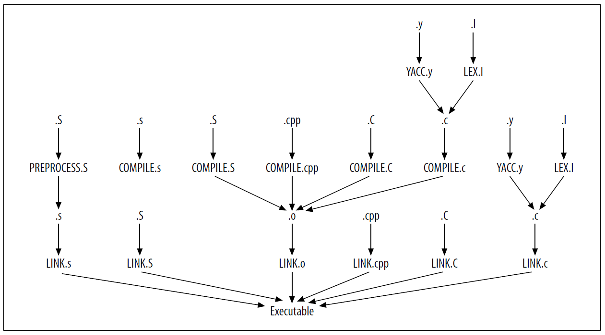

# GNU Make 项目管理 第三章 变量和宏

[annotation]: [id] (9d9e86bc-196b-4e14-a433-56b7d5a2afeb)
[annotation]: [status] (public)
[annotation]: [create_time] (2021-04-18 19:13:11)
[annotation]: [category] (读书笔记)
[annotation]: [tags] (Make|Makefile|GNU)
[annotation]: [topic] (GNU Make 项目管理)
[annotation]: [index> (3)
[annotation]: [comments] (true)
[annotation]: [url] (http://blog.ccyg.studio/article/9d9e86bc-196b-4e14-a433-56b7d5a2afeb)

我们知道 makefile 变量已经有一段时间了，我们看到了许多在内置规则和用户定义规则中使用它们的例子。但我们看到的例子只是触及了表面。变量和宏会变得更加复杂，并赋予 GNU make 强大的功能。

在我们继续之前，重要的是要理解 make 是两种语言的结合体。第一种语言描述由目标和依赖组成的依赖关系图。(这门语言在第二章中介绍过) 第二语言是执行文本替换的宏语言。您可能熟悉的其他语言的宏，例如，C 预处理器、m4、TEX 和 宏汇编器。与其他宏语言一样，make 允许您为更长的字符序列定义一个简写术语，并在程序中使用这个简写。宏处理器会识别你的简写术语，并用它们的展开形式替换它们。尽管把 makefile 变量看作传统编程语言变量很容易，但宏 “变量” 和 “传统” 变量是有区别的。宏变量 被 “就地” 展开以产生一个字符串，然后可以进一步展开。随着我们的深入，这种区别将变得更加清楚。

变量名可以包含几乎任何字符，包括大多数标点符号。即使是空格也是允许的，但如果你想保持理智，就应该避免使用空格。变量名中不允许使用的字符只有 `:`, `#` 和 `=`。

变量是区分大小写的，所以 `cc` 和 `CC` 指向不同的变量。要获取变量的值，请将变量名括在 `$()` 中。作为一种特殊情况，单字母变量名可以省略圆括号，直接使用$letter。这就是为什么自动变量可以不用圆括号来写。一般来说，应该使用括号形式，而避免使用单个字母的变量名。

变量也可以像在 `${CC}` 中那样使用花括号展开，你经常会看到这种形式，特别是在旧的 makefile 中。使用其中一种并没有什么优势，所以选择一种并坚持使用。有些人在变量引用时使用花括号，在函数调用时使用圆括号，类似于 shell 使用它们的方式。大多数现代的 makefile 都使用圆括号，这也是我们在整本书中都会用到的。

按照惯例，用户希望在命令行或环境中自定义的常量都是全大写的。单词之间用下划线分隔。仅出现在 makefile 中的变量都是小写的，单词之间用下划线分隔。最后，在本书中，用户定义的函数在变量和宏中使用小写字母，中间用破折号隔开。其他命名约定将在它们发生的地方进行解释。(下面的示例使用了我们还没有讨论的特性。我用它们来说明变量命名约定，现在不要太关心右边的内容。)

```makefile
# Some simple constants.
CC := gcc
MKDIR := mkdir -p

# Internal variables.
sources = *.c
objects = $(subst .c,.o,$(sources))

# A function or two.
maybe-make-dir = $(if $(wildcard $1),,$(MKDIR) $1)
assert-not-null = $(if $1,,$(error Illegal null value.))
```

变量的值由赋值符号右侧的所有单词组成，并去掉前面的空格。不去掉后面的空格。这有时会造成麻烦，例如，如果变量中包含末尾的空格，然后使用在命令脚本中:

```makefile
LIBRARY = libio.a # LIBRARY has a trailing space.
missing_file:
    touch $(LIBRARY)
    ls -l | grep '$(LIBRARY)'
```

变量赋值包含一个尾随空格，注释使其更加明显(但尾随空格也可以不带尾随注释)。当这个 makefile 运行时，我们得到:

```text
$ make
touch libio.a
ls -l | grep 'libio.a '
make: *** [missing_file] Error 1
```

糟糕，grep 搜索字符串还包括尾随空格，无法在 ls 的输出中找到该文件。稍后我们将更详细地讨论空格问题。现在，让我们更详细地继续研究变量。

## 变量是用来干嘛的

一般来说，使用变量来表示外部程序是一个好主意。这允许 makefile 的用户更容易地使 makefile 适应他们特定的环境。

例如，在一个系统上通常有几个版本的 awk: awk、nawk、gawk。通过创建一个变量 AWK 来保存 AWK 程序的名称，可以使 makefile 的其他用户更容易使用它。另外，如果您的环境中存在安全问题，一个好的做法是使用绝对路径访问外部程序，以避免用户路径出现问题。绝对路径还可以减少出现问题的可能性，如果系统程序的木马版本已经安装在用户路径的某个地方。当然，绝对路径也会降低 makefile 对其他系统的可移植性。这得看你的需求。

虽然变量的第一次使用应该是用来保存简单常量，但它们也可以存储用户定义的命令序列，比如:

```makefile
DF = df
AWK = awk
free-space := $(DF) . | $(AWK) 'NR = = 2 { print $$4 }'
```

用于获取空闲的磁盘空间。我们将会看到，变量被用于这两个目的外，还能做别的。

## 变量类型

在 make 中有两种类型的变量，简单展开变量和递归展开变量。使用 := 赋值操作符定义一个简单展开的变量(或简单变量):

```makefile
MAKE_DEPEND := $(CC) -M
```

它被称为“简单展开”，因为它的右侧在读取 makefile 中的行后立即展开。右侧的任何 make 变量引用都将展开，并将结果文本保存为变量的值。这种行为与大多数编程和脚本语言相同。例如，这个变量的正常展开结果是:

```makefile
gcc -M
```

然而，如果上面的 `CC` 还没有赋值，那么上面赋值的值将是:

```makefile
<space>-M
```

`$(CC)` 被扩展为它的值(不包含字符)，并收缩为空。变量没有定义不是错误。事实上，这非常有用。大多数隐式命令包括未定义的变量，这些变量充当用户自定义的占位符。如果用户没有自定义一个变量，它将压缩为空。现在注意前导空格。右手边首先由 make 进行解析，生成字符串 `$(CC) -M`。当变量引用被压缩为空时，make 不会重新扫描值并修剪空白。空白部分保持完整。

第二种类型的变量称为递归扩展变量。递归展开变量(或递归变量)使用 `=` 赋值操作符定义:

```makefile
MAKE_DEPEND = $(CC) -M
```

它被称为“递归展开”，因为它的右边只是被 make 吃掉，并存储为变量的值，而不需要求值或以任何方式展开。相反，在使用变量时执行展开。对于这个变量，一个更好的术语可能是惰性展开变量，因为计算被推迟到实际使用它的时候。这种扩展风格的一个令人惊讶的效果是，作业可以“无序”执行

```makefile
MAKE_DEPEND = $(CC) -M
...

# Some time later
CC = gcc
```

这里，命令脚本中的 `MAKE_DEPEND` 的值是 `gcc -M`，即使在分配 `MAKE_DEPEND` 时没有定义 `CC`。

实际上，递归变量并不是真正的惰性赋值(至少不是普通的惰性赋值)。每次使用递归变量时，都会对其右侧重新求值。对于根据简单常量定义的变量，如上面的 `MAKE_DEPEND`，这种区别是没有意义的，因为右边的所有变量也是简单常量。但是想象一下，如果右手边的一个变量表示程序的执行，比如 date。每次递归变量展开时，都会执行日期程序，并且每个变量展开都会有不同的值(假设它们至少间隔一秒执行)。有时这是非常有用的。在其他时候，它是非常烦人的!

### 其他赋值类型

在前面的例子中，我们已经看到了两种类型的赋值 `=` 用于创建递归变量，`:=` 用于创建简单变量。make 还提供了另外两个赋值操作符。

`?=` 操作符称为条件变量赋值操作符。这很复杂，我们称之为条件赋值。只有当变量还没有值时，该操作符才会执行所请求的变量赋值。

```makefile
# Put all generated files in the directory $(PROJECT_DIR)/out.
OUTPUT_DIR ?= $(PROJECT_DIR)/out
```

这里，我们设置了输出目录变量 `OUTPUT_DIR`，只有在前面没有设置它的情况下才设置它。这个特性可以很好地与环境变量交互。我们将在本章后面的“变量从何而来”一节讨论这个问题。

另一个赋值操作符 `+=` 通常被称为追加。顾名思义，这个操作符将文本追加到一个变量。这看起来似乎没什么特别的，但在使用递归变量时，这是一个重要的特性。具体来说，赋值右边的值被附加到变量上，而不改变变量中的原始值。“有什么大不了的，这不就是 `append` 一直在做的吗?” 我听到你说。是的，但等等，这有点棘手。

添加一个简单的变量是非常明显的。`+=` 操作符可以这样实现:

```makefile
simple := $(simple) new stuff
```

由于简单变量中的值已经进行了展开，make 可以展开 `$(simple)`、追加文本并完成赋值。但是递归变量带来了一个问题。不允许像下面这样的实现。

```makefile
recursive = $(recursive) new stuff
```

这是一个错误，因为 make 没有好的方法来处理它。如果 make 存储了递归的当前定义加上新东西，make 就不能在运行时再次展开它。此外，尝试展开包含对自身引用的递归变量会产生无限循环。

```text
$ make
makefile:2: *** Recursive variable `recursive' references itself (eventually). Stop.
```

因此，实现 `+=` 是为了允许将文本添加到递归变量中，并执行正确的操作。这个操作符对于将值递增地收集到变量中特别有用。

## 宏

变量可以很好地将值存储为一行文本，但如果我们有一个多行值，比如想要在几个地方执行的命令脚本，该怎么办？例如，可以使用以下命令序列从 Java  .class 文件创建 Java 存档 (或 jar):

```makefile
echo Creating $@...
$(RM) $(TMP_JAR_DIR)
$(MKDIR) $(TMP_JAR_DIR)
$(CP) -r $^ $(TMP_JAR_DIR)
cd $(TMP_JAR_DIR) && $(JAR) $(JARFLAGS) $@ .
$(JAR) -ufm $@ $(MANIFEST)
$(RM) $(TMP_JAR_DIR)
```

在像这样的长序列的开头，我喜欢打印一条简短的消息。它可以使阅读 make 的输出更容易。在收到消息后，我们将类文件收集到一个干净的临时目录中。因此，我们删除临时 jar 目录，以防旧的 jar 目录仍然存在，然后我们创建一个新的临时目录。接下来，我们将依赖(及其所有子目录)复制到临时目录中。然后切换到我们的临时目录并创建带有目标文件名的 jar。我们将清单文件添加到 jar 中，最后进行清理。显然，我们不希望在 makefile 中复制这个命令序列，因为这将成为将来的维护问题。我们可以考虑将所有这些命令打包到一个递归变量中，但当 make 回显命令行时，这样做既不方便维护，也难以阅读 (整个序列被回显为一个巨大的文本行)。

相反，我们可以使用由 `define` 指令创建的 GNU make “罐装序列”。术语 “罐装序列” 有点尴尬，所以我们称之为 **宏**。宏只是 make 中定义变量的另一种方式，它可以包含内嵌的换行符，GNU make 手册似乎交替使用变量和宏这两个词。在本书中，我们将特别使用宏这个词来表示使用 define 指令定义的变量，以及用变量表示仅在使用赋值时才定义的变量。

```makefile
define create-jar
    @echo Creating $@...
    $(RM) $(TMP_JAR_DIR)
    $(MKDIR) $(TMP_JAR_DIR)
    $(CP) -r $^ $(TMP_JAR_DIR)
    cd $(TMP_JAR_DIR) && $(JAR) $(JARFLAGS) $@ .
    $(JAR) -ufm $@ $(MANIFEST)
    $(RM) $(TMP_JAR_DIR)
endef
```

define 指令后面跟着变量名和换行符。变量的主体包含了直到 `endf` 关键字的所有文本，该关键字必须单独出现在一行中。用 define 创建的变量与其他变量展开的方式非常相似，只是在命令脚本的上下文中使用时，宏的每行前面都有一个制表符。一个例子是:

```makefile
$(UI_JAR): $(UI_CLASSES)
    $(create-jar)
```

注意，我们在 echo 命令前添加了一个 `@` 字符。带 `@` 前缀的命令行在执行命令时不会被 make 回显。因此，当我们运行 make 时，它不打印 echo 命令，只打印该命令的输出。如果在宏中使用 `@` 前缀，则前缀字符将应用于使用它的单个行。但是，如果在宏引用中使用了前缀字符，则整个宏体将被隐藏:

```makefile
$(UI_JAR): $(UI_CLASSES)
    @$(create-jar)
```

这只显示:

```text
$ make
Creating ui.jar...
```

`@` 的使用在第五章的“命令修饰符”一节中有更详细的介绍。

## 何时展开变量

在前面几节中，我们开始了解变量扩展的一些微妙之处。结果很大程度上取决于之前定义的内容和地点。您可以很容易地得到您不想要的结果，即使找不到任何错误。那么展开变量的规则是什么呢？这究竟是如何运作的呢？

当 make 运行时，它将分两个阶段执行它的工作。在第一阶段，make 读取 makefile 和包含的任何 makefile。此时，变量和规则被加载到 make 的内部数据库中，并创建了依赖关系图。在第二阶段，make 分析依赖关系图并确定需要更新的目标，然后执行命令脚本来执行所需的更新。

当一个递归变量或定义指令被 make 处理时，变量或宏体中的行会被存储，包括未展开的换行。宏定义的最后一行换行不作为宏的一部分存储。否则，当宏展开时，make 将读取额外的换行符。

当宏被展开时，展开的文本会立即被扫描，以查找进一步的宏或变量引用，这些宏或变量会被展开，以此类推，递归地进行。如果在操作的上下文中展开宏，则宏的每一行都插入一个前导制表符。

总结一下，以下是 makefile 元素展开时的规则:

- 对于变量赋值，当 make 在其第一阶段读取该行时，赋值的左侧总是立即展开。
- `=` 和 `?=` 的右边被推迟，直到在第二阶展开它们。
- `:=` 的右侧立即展开。
- 如果左边最初定义为一个简单变量，则 `+=` 的右边立即展开。否则，它的评估将被推迟。
- 对于宏定义(使用 define 的定义)，宏变量名会立即展开，宏体会推迟到使用时。
- 对于规则，目标和依赖总是立即展开，而命令总是推迟。

表 3-1 总结了变量展开时的情况。

**表 3-1 立即和推迟展开的规则**

| 定义               | a 的展开 | b 的展开     |
| ------------------ | -------- | ------------ |
| a = b              | 立刻     | 推迟         |
| a ?= b             | 立刻     | 推迟         |
| a := b             | 立刻     | 立刻         |
| a += b             | 立刻     | 推迟 或 立刻 |
| `define ... endef` | 立刻     | 推迟         |

作为一条通用规则，在使用变量和宏之前一定要定义它们。特别是，需要在使用目标或依赖中使用的变量之前定义它。

下面的示例将使这一切更加清楚。假设我们重新实现了 `free-space` 宏。我们将一次处理一点示例，然后在最后把它们放在一起。

```makefile
BIN := /usr/bin
PRINTF := $(BIN)/printf
DF := $(BIN)/df
AWK := $(BIN)/awk
```

我们定义了三个变量来保存宏中使用的程序的名称。为了避免代码重复，我们将 `bin` 目录分解为第四个变量。读取这四个变量定义，并立即展开它们的右侧，因为它们是简单的变量。因为 `BIN` 是在其他文件之前定义的，所以可以将它的值插入到它们的值中。

接着，我们定义 `free-space` 宏。

```makefile
define free-space
    $(PRINTF) "Free disk space "
    $(DF) . | $(AWK) 'NR = = 2 { print $$4 }'
endef
```

define 指令后面跟着一个立即展开的变量名。在这种情况下，不需要展开。读取和存储宏的主体是未展开的。

最后，我们在规则中使用宏。

```makefile
OUTPUT_DIR := /tmp

$(OUTPUT_DIR)/very_big_file:
    $(free-space)
```

当读取 `$(OUTPUT_DIR)/very_big_file` 时，在目标和依赖中使用的任何变量都会立即展开。在这里，`$(OUTPUT_DIR)` 被扩展到 `/tmp`，形成 `/tmp/very_big_file` 目标文件。接下来，读取此目标的命令脚本。命令行可由前导制表符识别，并可以读取和存储，但不能展开。

下面是整个示例 makefile。为了说明 make 的评估算法，对文件中元素的顺序进行了有意置乱。

```makefile
OUTPUT_DIR := /tmp

$(OUTPUT_DIR)/very_big_file:
    $(free-space)

define free-space
    $(PRINTF) "Free disk space "
    $(DF) . | $(AWK) 'NR = = 2 { print $$4 }'
endef

BIN := /usr/bin
PRINTF := $(BIN)/printf
DF := $(BIN)/df
AWK := $(BIN)/awk
```

注意，尽管 makefile 中的行顺序似乎是向后的，但它执行得很好。这是递归变量令人惊讶的效果之一。它可能非常有用，但同时也令人困惑。这个 makefile 工作的原因是命令脚本和宏体的扩展被推迟到实际使用时。因此，它们发生的相对顺序对 makefile 的执行并不重要。

在处理的第二阶段，读取 makefile 之后，make 标识目标、执行依赖项分析并为每个规则执行操作。这里唯一的目标 `$(OUTPUT_DIR)/very_big_file` 没有先决条件，因此 make 将简单地执行操作(假设文件不存在)。命令为 `$(free-space)`。所以 make 展开它，就像程序员写的那样:

```makefile
/tmp/very_big_file:
    /usr/bin/printf "Free disk space "
    /usr/bin/df . | /usr/bin/awk 'NR = = 2 { print $$4 }'
```

一旦所有变量都展开，它就开始一次执行一个命令。

让我们看一下 makefile 中顺序很重要的两个部分。如前所述，立即展开目标 `$(OUTPUT_DIR)/very_big_file`。如果变量 `OUTPUT_DIR` 的定义遵循了该规则，则目标的展开将生成 `/very_big_file`。可能不是用户想要的。类似地，如果 `BIN` 的定义在 `AWK` 之后被移除，这三个变量就会展开为 `/printf`、`/df` 和 `/AWK`，因为使用 `:=` 会立即对赋值的右侧进行计算。然而，在这种情况下，我们可以通过更改 `:=` 为 `=` 来避免 `PRINTF`、`DF` 和 `AWK` 的问题，使它们成为递归变量。

最后一个细节。请注意，将 `OUTPUT_DIR` 和 `BIN` 的定义更改为递归变量并不会改变前面排序问题的效果。重要的问题是，当 `$(OUTPUT_DIR)/very_big_file` 以及 `PRINTF`、`DF` 和 `AWK` 的右侧展开时，它们的展开会立即发生，因此它们引用的变量必须已经定义。

## 特定目标的模式变量

在 makefile 执行期间，变量通常只有一个值。这是由 makefile 处理的两阶段性质所保证的。在第一阶段，读取 makefile，分配和扩展变量，并构建依赖关系图。在第二阶段，分析并遍历依赖关系图。因此，当执行命令脚本时，所有的变量处理都已经完成。但是假设我们想为单个规则或模式重新定义一个变量。

在这个例子中，我们正在编译的文件需要一个额外的命令行选项 `-DUSE_NEW_MALLOC=1`，这个选项不应该提供给其他编译器:

```makefile
gui.o: gui.h
    $(COMPILE.c) -DUSE_NEW_MALLOC=1 $(OUTPUT_OPTION) $<
```

这里，我们通过复制编译命令脚本并添加新的选项解决了这个问题。这种方法在几个方面不太令人满意。首先，我们在复制代码。如果规则发生变化，或者我们选择用自定义模式规则替换内置规则，则需要更新这段代码，但我们可能会忘记更新。其次，如果许多文件需要特殊处理，那么粘贴这段代码的任务很快就会变得非常繁琐并且容易出错(想象一下有 100 个这样的文件)。

为了解决这个问题和其他问题，make 提供了特定目标的变量。这些是附加在目标上的变量定义，仅在处理该目标及其任何依赖期间有效。使用这个特性，我们可以这样改写前面的例子:

```makefile
gui.o: CPPFLAGS += -DUSE_NEW_MALLOC=1
gui.o: gui.h
    $(COMPILE.c) $(OUTPUT_OPTION) $<
```

变量 `CPPFLAGS` 内置在默认的 C 编译规则中，它包含用于 C 预处理器的选项。通过使用 `+=` 形式的赋值，我们将新选项附加到任何已经存在的值上。现在编译命令脚本可以完全删除:

```makefile
gui.o: CPPFLAGS += -DUSE_NEW_MALLOC=1
gui.o: gui.h
```

在 `gui.o` 目标正在被处理时，`CPPFLAGS` 的值将包含 `-DUSE_NEW_MALLOC=1`，除了其原始内容。当目标完成后，`CPPFLAGS` 将恢复到原始值。

特定目标变量的通用语法是:

```makefile
target...: variable = value
target...: variable := value
target...: variable += value
target...: variable ?= value
```

如您所见，所有不同形式的赋值对于特定目标的变量都是有效的。变量在赋值之前不需要存在。

而且，直到开始处理目标时，才会实际执行变量赋值。因此，赋值的右侧本身可以是另一个特定目标的变量中设置的值。该变量在处理所有依赖的期间也是有效的。

## 变量来自何处

到目前为止，大多数变量都是在我们自己的 makefile 中显式定义的，但是变量可以有更复杂的起源。例如，我们已经看到变量可以在 make 命令行上定义。事实上，make 变量有以下几个来源:

---

- 文件

当然，变量可以在 makefile 中定义，也可以在 makefile 中包含的文件中定义(我们稍后将讨论 include 指令)。

---

- 命令行

变量可以直接从 make 命令行定义或重新定义:

```text
$ make CFLAGS=-g CPPFLAGS='-DBSD -DDEBUG'
```

包含 `=` 的命令行参数是一个变量赋值。命令行上的每个变量赋值都必须是一个单 shell参数。如果变量的值(或者变量本身)包含空格，参数必须用引号括起来，或者空格必须转义。

在命令行上对变量的赋值将覆盖环境中的任何值和 makefile 中的任何赋值。命令行赋值可以分别使用 `:=` 或 `=` 设置简单变量或递归变量。可以使用 override 指令来允许使用 makefile 赋值来代替命令行赋值。

```makefile
# Use big-endian objects or the program crashes!
override LDFLAGS = -EB
```

当然，您应该只在最紧急的情况下才忽略用户明确的赋值请求(除非你只是想激怒你的用户)。

---

- 环境变量

在 make 启动时，环境中的所有变量都会自动定义为 make 变量。这些变量的优先级很低，因此 makefile 或命令行参数中的赋值将覆盖环境变量的值。您可以使用 `--environment-overrides (-e)` 命令行选项使环境变量覆盖 makefile 变量。

当 make 被递归调用时，来自父 make 的一些变量会通过环境变量传递给子 make。默认情况下，只有那些最初来自环境的变量被导出到子环境中，但是任何变量都可以通过使用 export 指令导出到环境中:

```makefile
export CLASSPATH := $(HOME)/classes:$(PROJECT)/classes
SHELLOPTS = -x
export SHELLOPTS
```

你可以用以下方式导出所有的变量:

```makefile
export
```

注意，make 甚至会导出那些名称中包含无效 shell 变量字符的变量。例如:

```makefile
export valid-variable-in-make = Neat!
show-vars:
    env | grep '^valid-'
    valid_variable_in_shell=Great
    invalid-variable-in-shell=Sorry
```

```text
$ make
env | grep '^valid-'
valid-variable-in-make=Neat!
valid_variable_in_shell=Great
invalid-variable-in-shell=Sorry
/bin/sh: line 1: invalid-variable-in-shell=Sorry: command not found
make: *** [show-vars] Error 127
```

通过导出 `valid-variable-in-make` 创建了一个无效的 shell 变量。这个变量不能通过普通 shell 语法访问，只能通过在环境上运行 grep 这样的技巧来访问。然而，这个变量会被任何有效和可访问的子 make 所继承。我们将在第二部分讨论 “递归” make 的使用。

你还可以防止将环境变量导出到子进程:

```makefile
unexport DISPLAY
```

导出和取消导出指令的工作方式与 sh 中的对应指令相同。

条件赋值操作符可以很好地与环境变量交互。假设您在 makefile 中设置了一个默认的输出目录，但是您希望用户能够轻松地覆盖这个默认目录。条件赋值非常适合这种情况:

```makefile
# Assume the output directory $(PROJECT_DIR)/out.
OUTPUT_DIR ?= $(PROJECT_DIR)/out
```

这里，只有在从未设置OUTPUT_DIR时才执行赋值。我们可以用几乎相同的效果但更冗长的方式:

```makefile
ifndef OUTPUT_DIR
    # Assume the output directory $(PROJECT_DIR)/out.
    OUTPUT_DIR = $(PROJECT_DIR)/out
endif
```

不同之处是，如果变量以任何方式设置，条件赋值操作符将跳过赋值操作，即使设置为空值，而 `ifdef` 和 `ifndef` 操作符将测试是否为非空值。因此，`OUTPUT_DIR=` 被认为是由条件操作符设置的，而不是由 `ifdef` 定义的。

需要注意的是，过度使用环境变量会使您的 makefile 的可移植性大大降低，因为其他用户不太可能拥有相同的环境变量集。正是因此，我很少使用这个特性。

---

- 自动变量

最后，make 在执行规则的命令脚本之前立即创建自动变量。

---

传统上，环境变量用于帮助管理开发人员机器之间的差异。例如，根据 makefile 中引用的环境变量创建开发环境(源代码、编译后的输出树和工具)是很常见的。makefile 将引用每个树根的环境变量。如果源文件树是从变量 `PROJECT_SRC` 引用的，从 `PROJECT_BIN` 引用的二进制输出文件，从 `PROJECT_LIB` 引用的库，那么开发人员可以自由地将这些树放置在任何适当的地方。

当没有设置这些 “根” 变量时，这种方法(以及通常使用的环境变量)会产生一个潜在的问题。一种解决方案是在 makefile 中使用 `$?` 形式的任务:

```makefile
PROJECT_SRC ?= /dev/$(USER)/src
PROJECT_BIN ?= $(patsubst %/src,%/bin,$(PROJECT_SRC))
PROJECT_LIB ?= /net/server/project/lib
```

通过使用这些变量来访问项目组件，您可以创建一个适应于不同机器布局的开发环境。(我们将在第二部分看到更全面的例子)，但是，要注意不要过度依赖环境变量。一般来说，makefile 应该能够在开发环境的最小支持下运行，因此请确保提供合理的默认值并检查关键组件的存在。

## 条件和包含处理

在使用条件处理指令读取 makefile 时，可以省略或选择 makefile 的某些部分。控制选择的条件可以有几个形式，如 “是否已定义” 或“是否相等”。例如:

```makefile
# COMSPEC is defined only on Windows.
ifdef COMSPEC
    PATH_SEP := ;
    EXE_EXT := .exe
else
    PATH_SEP := :
    EXE_EXT :=
endif
```

如果定义了变量 `COMSPEC`，这将选择条件的第一个分支。

条件指令的基本语法是:

```makefile
if-condition
    text if the condition is true
endif
```

或者

```makefile
if-condition
    text if the condition is true
else
    text if the condition is false
endif
```

条件分支可以是:

```makefile
ifdef variable-name
ifndef variable-name
ifeq test
ifneq test
```

对于 `ifdef/ifndef` 条件，变量名不应该被 `$()` 包围。最后，条件可以表示为一下任意一种:

```makefile
"a" "b"
(a,b)
```

其中单引号或双引号可以互换使用(但必须使用匹配的引号)。

条件处理指令可以在宏定义和命令脚本中使用，也可以在 makefile 的顶层使用:

```makefile
libGui.a: $(gui_objects)
    $(AR) $(ARFLAGS) $@ $<
    ifdef RANLIB
        $(RANLIB) $@
    endif
```

我喜欢缩进条件语句，但不小心缩进会导致错误。在前面的行中，条件指令缩进四个空格，而包含的命令有一个前导制表符。如果所包含的命令没有以制表符开头，则make将不能识别它们为命令。如果条件指令有前置选项卡，它们将被错误地识别为命令并传递给子 shell。

`ifeq` 和 `ifneq` 条件会测试它们的参数是否相等。条件处理中的空格可能很难处理。例如，当使用条件的圆括号形式时，逗号后面的空格被忽略，但其他所有的空格都是重要的:

```makefile
ifeq (a, a)
    # These are equal
endif

ifeq ( b, b )
    # These are not equal - ' b' != 'b '
endif
```

就我个人而言，我坚持用引号的形式:

```makefile
ifeq "a" "a"
    # These are equal
endif

ifeq 'b' 'b'
    # So are these
endif
```

即便如此，变量展开时经常会包含意料之外的空格。这可能会导致一些问题，因为条件中包含所有字符。要创建更健壮的 makefile，`请使用strip` 函数:

```makefile
ifeq "$(strip $(OPTIONS)) "-d"
    COMPILATION_FLAGS += -DDEBUG
endif
```

### include 指令

我们第一次看到 include 指令是在第二章 “自动依赖生成” 的一节。(现在让我们更详细地复习一下)

makefile 可以包含其他文件。这通常是为了在 make 头文件中放置通用 make 定义或包含自动生成的依赖信息。include 指令是这样使用的:

```makefile
include definitions.mk
```

指令可以指定任意数量的文件和 shell 通配符，也允许使用 make 变量。

### include 和依赖

当 make 遇到 include 指令时，它展开通配符和变量引用，然后尝试读取 include 的文件。如果文件存在，则正常继续。但是，如果文件不存在，则 make 打印问题并继续读取 makefile 的其余部分。当所有读取完成后，make 在规则数据库中查找任意规则来更新 include 文件。如果找到匹配项，make 将遵循更新目标的正常流程。如果任何包含文件被规则更新，那么 make 将清除其内部数据库并重新读取整个 makefile。如果，在完成读取、更新和重读的过程后，仍然有 include 指令由于缺少文件而失败，make将以错误状态终止。

通过下面的两个文件示例，我们可以看到这个过程的实际情况。我们使用内置的 warning 函数来打印来自 make 的一条简单消息。(本功能和其他功能将在第四章中详细介绍。)，下面是 makefile:

```makefile
# Simple makefile including a generated file.
include foo.mk
$(warning Finished include)

foo.mk: bar.mk
    m4 --define=FILENAME=$@ bar.mk > $@
```

这是 `bar.mk`，include 文件的源文件:

```makefile
# bar.mk - Report when I am being read.
$(warning Reading FILENAME)
```

当运行时，我们看到:

```text
$ make
Makefile:2: foo.mk: No such file or directory
Makefile:3: Finished include
m4 --define=FILENAME=foo.mk bar.mk > foo.mk
foo.mk:2: Reading foo.mk
Makefile:3: Finished include
make: `foo.mk' is up to date.
```

第一行显示 make 无法找到包含文件，但第二行显示 make 继续读取和执行 makefile。读取完成后，make 会发现一条规则来创建包含文件 `foo.mk`，它确实这样干。然后，make 再次启动整个过程，这一次读取 include 文件不会遇到任何困难。

现在是时候提一下 make 也会把 makefile 本身作为一个可能的目标。在读取了整个 makefile 之后，make 将寻找一条规则来重新生成当前正在执行的 makefile。如果找到一个，make 将处理规则，然后检查 makefile 是否已更新。如果是这样，make 将清除其内部状态并重新读取 makefile，再次执行整个分析。下面是一个基于这种行为的无限循环的愚蠢例子:

```makefile
.PHONY: dummy
makefile: dummy
    touch $@
```

当 make 执行这个 makefile 时，它看到这个 makefile 过期了(因为 `.PHONY` 目标 `dummy` 过期了)，所以它执行 touch 命令，该命令更新 makefile 的时间戳。然后，make 重新读取文件，发现 makefile 已过期....嗯，你懂的。

make 在哪里查找 include 的文件？显然，如果 include 的参数是一个绝对文件引用，make 将读取该文件。如果文件引用是相对的，make 首先在其当前工作目录中查找。如果 make 无法找到该文件，它将使用 `--include-dir (-I)` 选项继续搜索您在命令行上指定的任何目录。之后，将搜索设置为类似于:`/usr/local/include`、`/usr/gnu/include`、`/usr/include` 的编译搜索路径。由于make 的编译方式，这条路径可能会有轻微的变化。

如果 make 无法找到包含文件，并且它不能使用规则创建它，则 make 会在退出时出错。如果你想让 make 忽略它无法加载的 include 文件，在 `include` 指令前加上 `-`:

```makefile
-include i-may-not-exist.mk
```

为了与其他 make 兼容，`sinclude` 是 `-include` 的别名。

## 标准 make 变量

除了自动变量，make 维护显示其自身状态的变量，以及用于自定义内置规则的变量:

---

- MAKE_VERSION

这是 GNU make 的版本号。在撰写本文时，其值为 3.80，而 CVS 存储库中的值为 3.81rc1。 make 的早期版本 3.79.1 不支持eval 和 value 函数（除其他更改外），它仍然很常见。因此，当我编写需要这些功能的 makefile 时，我使用此变量来测试正在运行的 make 的版本。我们将在第四章的 “流程控制” 部分中看到一个示例。

---

- CURDIR

这个变量包含正在执行的 make 进程的当前工作目录(cwd)。除非使用 `--directory (-C)` 选项，否则这个目录将与执行 make 程序的目录相同(并且与 shell 变量 `PWD` 相同)。`--directory` 选项指示 make 在搜索任何 makefile 之前更改到一个不同的目录。该选项的完整形式是 `--directory=directory-name` 或 `-C directory-name`。如果使用 `--directory`, `CURDIR` 将包含 `--include-dir` 的目录参数。

我通常在编码时从 emacs 调用 make。例如，我当前的项目是用 Java 编写的，并在顶级目录(不一定是包含代码的目录)中使用单个 makefile。在本例中，使用 `--directory` 选项允许我从源树中的任何目录调用 make，并且仍然访问 makefile。在 makefile中，所有路径都是相对于 makefile 目录的。偶尔需要绝对路径，可以使用 `CURDIR` 访问它们。

---

- MAKEFILE_LIST

这个变量包含 make 读取的每个文件的列表，包括默认的 makefile 和命令行或通过 include 指令指定的 makefile。在读取每个文件之前，名称被追加到 MAKEFILE_LIST 变量。因此，makefile 总是可以通过检查列表的最后一个单词来确定自己的名称。

---

- MAKECMDGOALS

`MAKECMDGOALS` 变量包含在命令行上为 make 的当前执行指定的所有目标的列表。它不包括命令行选项或变量赋值。例如:

```text
$ make -f- FOO=bar -k goal <<< 'goal:;# $(MAKECMDGOALS)'
# goal
```

该示例使用了“技巧”，即告诉 make 使用 `-f- (--file)`选项从 stdin 读取 makefile。使用 bash 的内嵌字符串 `<<<` 语法，从命令行字符串中重定向 stdin。makefile 本身包含默认目标，而命令脚本在同一行中，用分号分隔目标和命令。命令脚本只包含一行:

```makefile
# $(MAKECMDGOALS)
```

当目标需要特殊处理时，通常使用 `MAKECMDGOALS`。主要的例子是 “clean” 目标。当调用 “clean” 时，make 不应该执行通常由include 触发的依赖文件生成(在第2章 “自动依赖生成” 一节中讨论)。为了防止这种情况，可以使用 `ifneq` 和 `MAKECMDGOALS`:

```makefile
ifneq "$(MAKECMDGOALS)" "clean"
    -include $(subst .xml,.d,$(xml_src))
endif
```

---

- .VARIABLES

它包含到目前为止所读取的 makefile 中定义的所有变量的名称列表，特定于目标的变量除外。该变量是只读的，对它的任何赋值都会被忽略。

```makefile
list:
    @echo "$(.VARIABLES)" | tr ' ' '\015' | grep MAKEF
$ make
MAKEFLAGS
MAKEFILE_LIST
MAKEFILES
```

---

如您所见，变量还用于自定义 make 内置的隐式规则。`C/C++` 的规则是这些变量在所有编程语言中的典型形式。下图显示了从一种文件类型控制转换到另一种文件类型的变量。



这些变量的基本形式是 `ACTION.suffix`。编译 `ACTION` 用于创建对象文件，`LINK` 用于创建可执行文件，或者“特殊”`操作PREPROCESS`, `YACC`, `LEX` 用于运行 `C` 预处理器，yacc ，或 lex。`suffix` 表示源文件的类型。

通过这些变量的标准“路径”，比如 `c++`，使用两个规则。首先，将 `c++` 源文件编译为目标文件。然后将目标文件链接到可执行文件中。

```makefile
%.o: %.C
    $(COMPILE.C) $(OUTPUT_OPTION) $<

%: %.o
    $(LINK.o) $^ $(LOADLIBES) $(LDLIBS) -o $@
```

第一条规则使用了这些变量定义:

```makefile
COMPILE.C = $(COMPILE.cc)
COMPILE.cc = $(CXX) $(CXXFLAGS) $(CPPFLAGS) $(TARGET_ARCH) -c
CXX = g++
OUTPUT_OPTION = -o $@
```

GNU make 支持用 `.C` 或 `.cc` 两种后缀来表示 c++ 源文件。`CXX` 变量表示要使用的 `c++` 编译器，默认为 `g++`。`变量CXXFLAGS`、`CPPFLAGS` 和 `TARGET_ARCH` 没有默认值。它们的目的是供最终用户自定义构建过程。这三个变量分别保存 `c++` 编译器标志、C 预处理器标志和特定于体系架构的编译选项。`OUTPUT_OPTION` 包含输出文件选项。

链接规则更简单一些:

```makefile
LINK.o = $(CC) $(LDFLAGS) $(TARGET_ARCH)
CC = gcc
```

该规则使用C编译器将目标文件组合成可执行文件。C 编译器的默认值是 gcc。`LDFLAGS` 和 `TARGET_ARCH` 没有默认值。`LDFLAGS` 变量保存链接的选项，比如 `-L` 标记。`LOADLIBES` 和 `LDLIBS` 变量包含要链接的库列表。包含两个变量主要是为了可移植性。

这是对 make 变量走马观花。还有更多的变量，但这让您了解了变量如何与规则集成。另一组变量处理 TEX，并有自己的一组规则。递归 make 是变量支持的另一个特性。我们将在第六章讨论这个主题。

## 参考资料

- [Managing Projects with GNU Make](https://book.douban.com/subject/1850994/)
