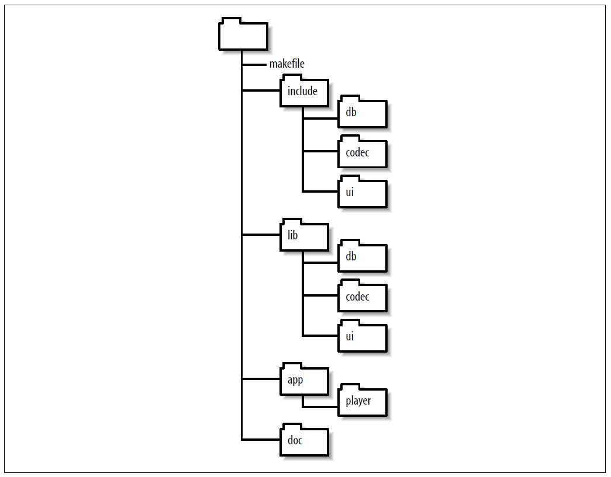
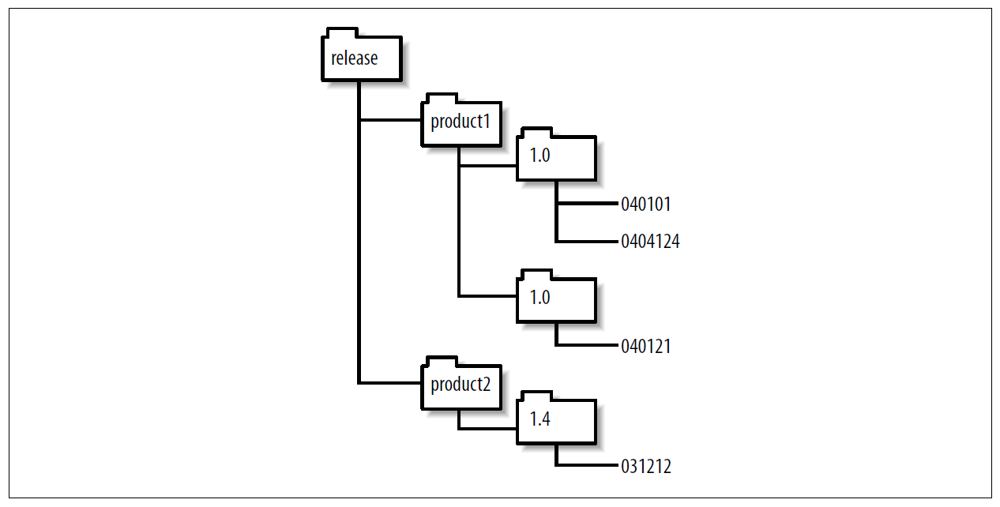

# GNU Make 项目管理 第六章 管理大项目

[annotation]: <id> (8bd85294-b86c-4947-a79a-f63038e72783)
[annotation]: <status> (public)
[annotation]: <create_time> (2021-04-18 19:18:41)
[annotation]: <category> (读书笔记)
[annotation]: <tags> (Make|Makefile|GNU)
[annotation]: <topic> (GNU Make 项目管理)
[annotation]: <index> (6)
[annotation]: <comments> (true)
[annotation]: <url> (http://blog.ccyg.studio/article/8bd85294-b86c-4947-a79a-f63038e72783)

什么样的项目才配称为大项目？对我而言，可能需要一个团队的开发者，可能需要在多种体系结构上运行，也可能有多种领域需要维护。当然，不是所有的大项目都满足以上所有要求。单一平台百万行代码级别的 C++ 的预发布版本同样也是大项目。但是软件不会永远停留在预发布版本。如果它是成功的，那么终将有人想让它运行在其他的平台。所以一段时间之后，大多数大型软件系统都十分相似。

大型软件系统通常通过将系统拆分多个主要的组件来简化复杂性。一般包括程序、库，或者二者皆有。这些组件通常保存在它们自己的目录中而且通过它们自己的 makefile 来管理。一种构建整个系统的方式是自顶向下对每个组件采用 makefile，调用 make 会以适当的顺序构建每个组件。这种方式叫做递归 make，因为顶层 makefile 调用对每个组件递归地调用 make。递归 make 是处理组件构建的常用技巧。

彼得·米勒（Peter Miller）在 1998 年给出了一些替代性建议，通过对每个组件的目录中包含的信息使用单独的 makefile，来避免递归 make 的很多问题。

一旦一个项目超出了构建组件的范围，最终会发现在管理构建中存在很大的组织问题。这里包括了项目开发中处理多版本、支持多平台、提供高效的访问源码和二进制文件，还有执行自动化构建。我们将在本章第二部分讨论这些问题。

## 递归 make

递归 make 背后的动机是简单的：make 在单个目录（或一小撮目录）下工作的特别好，但是当目录的数量多起来以后就变得复杂了。所以，我们可以通过在每一个目录写一个简单的，自包含的 makefile，然后用 make 来构建大项目。然后分别执行它们。我们可以使用一个脚本工具来完成这些步骤，但是，使用 make 本身更高效，特别是更高的级别同样会存在依赖。

例如，假设我们有一个 mp3 播放器程序，他可以在逻辑上分为几个组件：用户图形界面、解码器、和数据区管理工具。可分别表示成三个库文件：`libui.a`, `libcodec.a` 和 `libdb.a`。程序自身再将这些组件组合在一起。一种直接的这些组件到文件结构映射可能如下图所示：



更传统的层次将 程序主函数和 粘合在顶层目录而非子目录 `app/player`，我更喜欢将应用程序代码放在它自身的目录，来为顶层创建一个更加清洁的布局，这样允许系统的增长时添加额外的模块。例如，如果我们选择添加一个独立的目录程序，将来我们可以整齐的放在 `app/catalog` 目录下面。

如果每个目录 `lib/db`, `lib/codec`, `lib/ui` 和 `app.player` 都有自己的 `makefile`，然后下面是顶层 makefile 的工作是来调用它们。

```makefile
lib_codec := lib/codec
lib_db    := lib/db
lib_ui 	  := lib/ui
libraries := $(lib_ui) $(lib_db) $(lib_codec)
player 	  := app/player

.PHONY: all $(player) $(libraries)
all: $(player)

$(player) $(libraries):
	$(MAKE) --directory=$@

$(player): $(libraries)
$(lib_ui): $(lib_db) $(lib_codec)
```

顶层 makefile  通过一条规则在每个子目录中 调用 make，该规则列出了子目录，并将其作为目标，然后执行 make。

```makefile
$(player) $(libraries):
    $(MAKE) --directory=$@
```

变量 `MAKE` 应该总是用于在 makefile 中调用 make. `MAKE` 变量由 make 识别，并设置为 make 的实际路径，因此所有递归调用都使用同一可执行文件。同样，使用命令行选项 `--touch(-t)`, `-just-print(-n)` 和 --question(-q) 时，将特别处理表含变量 `MAKE` 的行。我们将在本章后面的 命令行选项 中详细讨论。

目标目录如果在 `.PHONY` 标识，那么即使目标可能是最新的，规则也会触发。 `--directory (-C)` 选项将会在读 makefile 之前改变目标目录。

下面这个规则，尽管有点微妙，克服了与更直接的命令脚本相关的一些问题。

```makefile
all:
    for d in $(player) $(libraries); \
    do \
        $(MAKE) --directory=$$d; \
    done
```

这个命令脚本给父 make 传递错误时将会失败，而且不允许 make 并行执行多个子目录，我们将会在第十章讨论这个问题。 

在 make 计划执行依赖关系图时，目标的依赖彼此相互独立。此外，彼此之间没有依赖关系的目标也是独立的。例如，这些库与 `app/player` 目标或彼此之间没有继承关系。这意味着 make 在构建任何库之前，随时都可以构建 app/player。很明显，因为链接应用程序需要库，所以这将导致构建失败。为了解决这个问题，我们需要提供额外的依赖信息。

```makefile
$(player): $(libraries)
$(lib_ui): $(lib_db) $(lib_codec)
```

这里我们声明库子目录中的 makefile 必须在播放器目录的 makefile 执行之前被执行。类似的 `lib/ui` 代码需要 `lib/db` 和 `lib/codec` 库才能编译。这保证了任何生成代码的操作 (例如 yacc/lex 文件) 将在 ui 代码编译之前被生成。

在更新依赖时，还有一个更微妙的排序问题。与所有依赖项一样，更新顺序由对依赖关系图的分析确定。但是当目标的依赖在一行中列出时， GNU make 就会从左向右进行更新。例如：

```makefile
all: a b c
all: d e f
```

如果这里没有依赖关系需要考虑，这六个依赖可以以其他的顺序更新，（例如：d b a c e f），但是 GNU make 使用从左向右的顺序更新单行上的目标，所以更新顺序应为：**a b c d e f** 或者 **d e f a b c**。

尽管这个顺序时实现的偶然事件，但执行的顺序似乎时正确的，这样容易忘掉正确的顺序是一次偶然的意外，并且无法提供完整的依赖关系信息。最终，依赖分析将会依从于一种不同的顺序而导致错误。所以，如果某些目标必须以一种特殊的顺序来更新，需要在适当的条件下执行适当的命令。

当顶层 makefile 执行时，我们将看到：

```text
$ make
make --directory=lib/db
make[1]: Entering directory `/test/book/out/ch06-simple/lib/db'
Update db library...
make[1]: Leaving directory `/test/book/out/ch06-simple/lib/db'
make --directory=lib/codec
make[1]: Entering directory `/test/book/out/ch06-simple/lib/codec'
Update codec library...
make[1]: Leaving directory `/test/book/out/ch06-simple/lib/codec'
make --directory=lib/ui
make[1]: Entering directory `/test/book/out/ch06-simple/lib/ui'
Update ui library...
make[1]: Leaving directory `/test/book/out/ch06-simple/lib/ui'
make --directory=app/player
make[1]: Entering directory `/test/book/out/ch06-simple/app/player'
Update player application...
make[1]: Leaving directory `/test/book/out/ch06-simple/app/player'
```

当 make 检测到调用其他递归 make 时，它将打开 `--print-directory (-w)` 选项，这样 make 会在进入目录和离开目录时打印消息。这个命令同样会在 `--directory (-C)` 选项打开时使用。make 变量 `MAKELEVEL` 的值，在每行打印时会包在中括号里。在这个简单的例子里，每个组件的 makefile 在更新组件时打印一个简单的信息。

### 命令行选项

递归 make 是一个非常简单的想法，很快就会变得复杂。完美的递归 make 实现的形为就像系统中的许多 makefile 是单个 makefile 一样。实现这种协调水平实际上是不可能的，因此必须做出妥协。当我们查看必须如何处理命令行选项时，这些细微的问题就变得更加清晰。

假设我们已经在 mp3 播放器的头文件中添加了注释。我们意识到，我们无需编译依赖于已修改头文件的所有目标。我们可以执行 `make --touch` 让相关文件的时间戳保持最新。通过在执行顶层 makefile 时，执行 `make --touch`，我们希望 make 可以 touch 子 make 中所有合适的文件。让我们看看它是怎么工作的。

通常，当 `--touch` 选项在命令行中时，正常的规则处理将被暂停。取而代之的是，遍历依赖关系图，并通过在目标上执行 `touch` 来使选定的目标以及那些未标记为 .PHONY 的依赖保持最新状态。由于我们的子目录被标为 `.PHONY` 因此通常将忽略它们（像普通文件一样 `touch` 毫无意义）。但是我们不希望这些目标被忽略，我们希望它们的命令脚本的已执行。要执行正确的操作， make 会使用 + 修饰符自动标记任何包含 MAKE 的行，这意味着 make 会运行子 make，而不管 `--touch` 选项。

当 make 运行子 make 时，它还必须安排 `--touch` 标志传递给子进程。通过 `MAKEFLAGS` 变量执行此操作。当启动 make 时，它自动将大多数命令行选项附加到 `MAKEFLAGS`，例外是选项是 `--directory (-C)`, `--file (-f)`, `--old-file (-o)` 和 `--newfile (-W)`。然后 `MAKEFLAGS` 将到处到环境变量中，由子 make 在启动时读取。

有了这个特殊支持，子 make 的行为通常会达到你想要的方式。`$(MAKE)` 的递归执行和应用于 `--touch (-t)` 的 `MAKEFLAGS` 的特殊处理，也应用于选项 `--just-print (-n)` 和 `--question (-q)`。

### 传递参数

You can explicitly override the environment for a specific assignment (even when the --environment-overrides option is used) with the override directive:

如前所述，变量通过环境变量传递给子 make 并使用 `export` 和 `unexport` 指令进行控制。通过环境变量传递的参数被视为默认值。但是任何赋值操作都会将其覆盖。使用选项 `--environment-overrides (-e)` 可以允许环境变量覆盖局部赋值。你可以使用 `override` 指令显式覆盖特定赋值（即使是使用 `--environment-overrides` 选项时，也可以）

```makefile
override TMPDIR = ~/tmp
```

如果命令行中定义的变量使用合法的 shell 语法，则会自动导出到环境中。如果变量仅使用字母，数字和下划线，则视为合法。命令行中的变量分配与命令行选项一起存储在 `MAKEFLAGS` 变量中。

### 错误处理

递归 make 出错时会发生什么？实际上，没有什么异常的，接收到错误状态的 make 以状态码 2 终止其处理过程。然后, 父 make 退出，将错误码传递到 递归 make 进程树上。如果在顶层 make 使用 `--keep-going (-k)` 选项，则该选项将照常传递给子 make。子 make 将正常的执行操作。跳过当前目标，然后找到不使用错误目标作为依赖的下一个目标。

例如，如果我们的 mp3 播放器程序在 `lib/db` 组件遇到了编译错误，`lib/db` make 将会退出，向顶层 make 返回错误码 2。如果我们使用了 `--keep-going (-k)` 选项，顶层 makefile 将会处理下一个与之无关的目标，`lib/codec`。当它完成该目标时，无论其状态如何，make 都将以状态 2 退出，因为 `lib/db` 的错误而导致无法处理其他的目标。

`--question (-q)` 选项的行为十分相似，如果某个目标不是最新的，这个选项将使 make 返回错误码 1，否则返回 0。当应用到生成文件树时，make 将开始递归执行 makefile，直到它可以确定项目是否时最新的。一旦发现过期文件，make 将终止当前活动然后展开递归。

### 构建其他目标

基本的构建目标对任何构建系统都是必不可少的，但是我们还需要依赖其他目标来支持。例如 `clean`, `install`, `print` 等等。由于这些是 `.PHONY` 目标，因此前面介绍的技术不能很好的工作。 

例如，这里有几个有问题的方式：

```makefile
clean: $(player) $(libraries)
    $(MAKE) --directory=$@ clean
```

或者 

```makefile
$(player) $(libraries):
    $(MAKE) --directory=$@ clean
```

第一个错误是因为依赖会触发 `$(player)`, `$(libraries)` makefile 中默认目标的构建。而不是 `clean` 目标。第二个错误是因为这些目标已经存在与不同的命令脚本中。

一种方法依赖于 shell 的 `for` 循环才能工作：

```makefile
clean:
    for d in $(player) $(libraries); \
    do \
        $(MAKE) --directory=$$f clean; \
    done
```

A for loop is not very satisfying for all the reasons described earlier, but it (and the preceding illegal example) points us to this solution:

对于如前所述的所有原因，`for` 循环并不是很令人满意，但是它（以及前面的错误案例）是我们找到了这种解决方法：

```makefile
$(player) $(libraries):
    $(MAKE) --directory=$@ $(TARGET)
```

By adding the variable $(TARGET) to the recursive make line and setting the TARGET variable on the make command line, we can add arbitrary goals to the sub-make:

通过添加变量 `$(TARGET)` 到递归 make 的命令行并且在 make 的命令行上设置 `TARGET` 变量，我们可以向子 make 添加任意目标。

```sh
$ make TARGET=clean
```

不幸的是，这并没有在顶层 makefile 调用 `$(TARGET)` 目标，常常是不需要的因为顶层 makefile 无事可做，但是，如果需要，我们可以添加一个受 `if` 保护的 make 调用。

```makefile
$(player) $(libraries):
    $(MAKE) --directory=$@ $(TARGET)
    $(if $(TARGET), $(MAKE) $(TARGET))
```

Now we can invoke the clean target (or any other target) by simply setting TARGET on the command line.

现在我们可以通过简单的在命令行设置 `TARGET` 来调用 clean 目标（或者任何其他目标）。

### 跨 Makefile 依赖

对 make 命令行和通过对环境变量进行通信的特殊支持表明，递归 make 已经经过调整，可以很好的工作。那么，前面提到的严重的复杂性有哪些呢？

分离 makefile 通过递归 `$(MAKE)` 命令得以连接，仅记录最表面的顶层连接，不幸的是，在某些目录中常常埋藏着微妙的依赖关系。

例如，假设 `db` 模块包含用于导入和导出音乐数据基于 yacc 的解析器。如果 `ui` 模块中 `ui.c` 文件包含 yacc 生成的头文件，则我们这里两个模块之间有依赖关系。如果对依赖处理更合理，则只要头文件更新之后，我们都需要重新编译 `ui` 模块。使用前面描述的自动化依赖生成技巧处理它并不难。但是如果 yacc 文件本身被修改怎么办？在这种情况下，运行 `ui` 的 makefile 时，正确的 makefile 将识别出必须先运行 yacc 才能生成解析器和头文件，才能编译 `ui.c`。在我们的递归 make 分解中，不会发生这种情况，因为运行 yacc 的规则和依赖项位于 `db` makefile 中，而不是 `ui` makefile 中。

这种情况下，我们能做的最好的事情就是确保在执行 `ui` makefile 之前始终执行 `db` makefile。此更高级别的依赖必须手动编码，在 makefile 的第一个版本中，我们意识到了这一点，但是，总的来说，这是一个非常困难的维护问题。在编写和修改代码时，顶层 makefile 将无法正确记录模块之间的依赖关系。

为了继续该实例，如果更新了 `db` 中的 yacc 语法，并且 `ui` makefile 在 `db` makefile 之前运行（通过直接执行而不是通过顶层 makefile 来执行），则 `ui` makefile 不知道其中存在未得到满足的依赖项。`db` makefile 和该 yacc 必须运行以更新头文件，取而代之的时，`ui` makefile 使用旧的 yacc 头文件编译器程序，如果已经定义了新符号并引用它们，则会报告编译错误。因此，递归 make 方法本质上比单个 makefile 更加脆弱。

当更广泛地使用代码生成器时，该问题会恶化。假设 RPC 存根生成器的头文件添加到 ui，并且在 `db` 引用之，现在有了相互引用互相对抗。为了解决这个问题，可能需要访问 `db` 来生成 yacc 头，然后访问 `ui` 来生成 RPC 存根，然后访问 `db` 编译文件，最后访问 `ui` 来完成编译过程。创建和编译项目源代码所需的通过次数取决于代码的结构以及用于创建项目的工具。这种相互引用在复杂系统中很常见。

现实世界中 makefile 文件中的标准解决方案通常简单粗暴，为确保所有文件都是最新的，当对顶层 makefile 发出命令时，将执行每个 makefile。请注意，这正式我们 mp3 播放器 makefile 所作的。当运行顶层 makefile 时，四个子生成文件中的每一个都将无条件运行。在复杂的情况下，makefile 会重复运行以确保首先生成所有代码然后进行编译。通常，这种迭代执行有点浪费时间，但有时是必需的。

### 避免重复代码

我们的程序目录包括三个库，这些库的 makefile 非常相似。这是有道理的，因为这三个库在最终的应用程序具有不同的用途，但是都用相似的命令构建。这种分解是大型项目的典型现象，会导致许多类似的 makefile 和很多代码重复。

So we would like to avoid code duplication in our makefiles as much as possible. This is most easily accomplished by moving the common pieces of a makefile into a common include file.

代码重复是不好的，即便是 makefile 的代码也是如此。它将增加软件的维护成本并且可能导致更多的 bug。它同样导致理解算法和识别代码中细微的变化变得更加困难。所以我们要尽可能在我们的项目中避免代码重复。通过将 makefile 的公共部分移到公共的 include 文件中，可以很容易的实现这一点。

例如，编码器和解码器的 makefile 包含：

```makefile
lib_codec := libcodec.a
sources := codec.c
objects := $(subst .c,.o,$(sources))
dependencies := $(subst .c,.d,$(sources))

include_dirs := .. ../../include
CPPFLAGS += $(addprefix -I ,$(include_dirs))
vpath %.h $(include_dirs)

all: $(lib_codec)

$(lib_codec): $(objects)
    $(AR) $(ARFLAGS) $@ $^

.PHONY: clean

clean:
$(RM) $(lib_codec) $(objects) $(dependencies)

ifneq "$(MAKECMDGOALS)" "clean"
    include $(dependencies)
endif

%.d: %.c
    $(CC) $(CFLAGS) $(CPPFLAGS) $(TARGET_ARCH) -M $< | \
    sed 's,\($*\.o\) *:,\1 $@: ,' > $@.tmp
    mv $@.tmp $@
```

Almost all of this code is duplicated in the db and ui makefiles. The only lines that change for each library are the name of the library itself and the source files the library contains. When duplicate code is moved into common.mk, we can pare this makefile down to:

几乎所有的代码重复都在 `db` 和 `ui` 的 makefile 中。对每个库唯一的代码变化是库本身的名字以及库包含的源文件。当重复的代码移到 common.mk 中时，我们可以将此 makefile 缩减为：

```makefile
library := libcodec.a
sources := codec.c
include ../../common.mk
```

看看我们已移至单个共享的包含文件中的内容：

```makefile
MV := mv -f
RM := rm -f
SED := sed

objects := $(subst .c,.o,$(sources))
dependencies := $(subst .c,.d,$(sources))
include_dirs := .. ../../include
CPPFLAGS += $(addprefix -I ,$(include_dirs))

vpath %.h $(include_dirs)

.PHONY: library
library: $(library)

$(library): $(objects)
    $(AR) $(ARFLAGS) $@ $^

.PHONY: clean
clean:
    $(RM) $(objects) $(program) $(library) $(dependencies) $(extra_clean)

ifneq "$(MAKECMDGOALS)" "clean"
-include $(dependencies)
endif

%.c %.h: %.y
    $(YACC.y) --defines $<
    $(MV) y.tab.c $*.c
    $(MV) y.tab.h $*.h

%.d: %.c
    $(CC) $(CFLAGS) $(CPPFLAGS) $(TARGET_ARCH) -M $< | \
    $(SED) 's,\($*\.o\) *:,\1 $@: ,' > $@.tmp
    $(MV) $@.tmp $@
```

变量 `include_dirs` 之前在每个 makefile 中都不同，现在在每个 makefile 中都相同。因为我们重新设计了用于包含的头文件路径，以使得所有库都使用相同的包含路径。

common.mk 文件甚至包含库包含文件的默认目标。原始 makefile 使用默认目标 all。这将导致非库文件的问题，该库文件需要为其默认目标指定一组不同的依赖。因此，共享代码版本使用库的默认目标。

注意，由于该公共文件包含目标，因此必须将其包含在非库 makefile 的默认目标之后。还要注意 clean 命令脚本应用了变量 program, library 和 extra_clean。对于库 makefile，程序变量为空。对于程序 makefile 库变量为空。extra_clean 变量是专门为 db makefile 添加的。该 makefile 使用该变量表示 yacc 生成的代码。这个 makefile 是：

```makefile
library := libdb.a
sources := scanner.c playlist.c
extra_clean := $(sources) playlist.h

.SECONDARY: playlist.c playlist.h scanner.c

include ../../common.mk
```

使用这些技巧，代码重复可以保持最小化，随着更多的 makefile 代码移到公共 makefile，它将演变成整个项目的通用 makefile。make 变量和用户自定义的函数用作自定义的点，从而允许为每个目录修改通用 makefile.

## 非递归 make

多目录项目也可以无递归的进行管理。此处的区别在于，由 makefile 操纵的源位于多个目录中。为了解决这个问题，对子目录中文件的引用必须包括文件的路径 —— 绝对路径或相对路径。

通常，管理大型项目的 makefile 有许多目标，项目中的每个模块都有一个目标。对于我们的 mp3 播放器来说，我们将需要每个库和每个程序的目标。为模块集合（例如所有库的集合）添加伪造目标也很有用。默认目标通常会建立所有这些目标。通常，默认目标会构建文档并运行测试过程。

非递归 make 的最直接用法是在单个 makefile 中包含目标，目标文件引用和依赖项。这对于熟悉递归 make 的开发者通常是不满意的，因为有关目录中文件的信息集中在单个文件中，而源文件本身则分布在文件系统中。为了解决这个问题，Miller 的论文中关于非递归 make，建议为每个目录创建一个 make 包含文件，其中包括文件列表和特殊模块的规则。顶级 makefile 包含(include) 这些子 makefile。

例 6-1 显示了我们的 mp3 播放器的 makefile，其中包括每个子目录中的模块级 makefile。例 6-2 显示了模块级包含文件的其中之一。

**例 6-1 一个非递归 makefile**

```makefile
# Collect information from each module in these four variables.
# Initialize them here as simple variables.
programs :=
sources :=
libraries :=
extra_clean :=

objects = $(subst .c,.o,$(sources))
dependencies = $(subst .c,.d,$(sources))

include_dirs := lib include
CPPFLAGS += $(addprefix -I ,$(include_dirs))
vpath %.h $(include_dirs)

MV := mv -f
RM := rm -f
SED := sed

all:

include lib/codec/module.mk
include lib/db/module.mk
include lib/ui/module.mk
include app/player/module.mk

.PHONY: all
all: $(programs)

.PHONY: libraries
libraries: $(libraries)

.PHONY: clean
clean:
    $(RM)   $(objects) $(programs) $(libraries) \
            $(dependencies) $(extra_clean)

ifneq "$(MAKECMDGOALS)" "clean"
    include $(dependencies)
endif

%.c %.h: %.y
    $(YACC.y) --defines $<
    $(MV) y.tab.c $*.c
    $(MV) y.tab.h $*.h

%.d: %.c
    $(CC) $(CFLAGS) $(CPPFLAGS) $(TARGET_ARCH) -M $< | \
    $(SED) 's,\($(notdir $*)\.o\) *:,$(dir $@)\1 $@: ,' > $@.tmp
    $(MV) $@.tmp $@
```

**例 6-2 给非递归 makefile 的 lib/codec 包含文件**

```makefile
local_dir := lib/codec
local_lib := $(local_dir)/libcodec.a
local_src := $(addprefix $(local_dir)/,codec.c)
local_objs := $(subst .c,.o,$(local_src))

libraries += $(local_lib)
sources += $(local_src)

$(local_lib): $(local_objs)
$(AR) $(ARFLAGS) $@ $^
```

因此，特定模块的所有信息都包含在模块目录本身的包含文件中。顶层 makefile 仅包含模块列表和 include 指令。让我们详细研究一下 makefile 和 module.mk。

每个 module.mk 包含文件都将本地库名称附加到变量库，并将本地源附加到源。 local_ 变量用于保存常量值或避免重复计算值。请注意，每个包含文件都重复使用这些相同的local_变量名称。因此，它使用简单的变量（用 := 赋值的变量）而不是递归的变量，因此结合多个 makefile 的构建没有感染每个 makefile 中变量的风险。库名称和源文件列表使用相对路径，如前所述。最后，包含文件定义了用于更新本地库的规则。在此规则中使用 local_ 变量没有问题，因为将立即评估规则的目标和依赖部分。

在顶层 makefile 中，前四行定义了用于累积每个模块的特定文件信息的变量。这些变量必须是简单变量，因为每个模块将使用相同的局部变量名称附加到它们后面

```makefile
local_src := $(addprefix $(local_dir)/,codec.c)
...
sources += $(local_src)
```

例如，如果将递归变量用于源，则最终值将只是一遍又一遍地重复的 local_src 的最后一个值。即使为它们赋了空值，也需要显式赋值来初始化这些简单变量，因为默认情况下变量是递归的。

接着的一段将从 sources 变量中计算目标文件列表，对象和依赖文件列表。这些变量是递归的，因为此时在 makefile 中，sources 变量为空。直到稍后读取包含文件时，它才会被赋值。在此 makefile 中，将这些变量的定义移到 include 之后，并将其类型更改为简单变量是完全合理的，但是将基本文件列表（例如源，库，对象）维护在一起可以简化对 makefile 的理解，并且通常是好的实践。同样，在其他 makefile 的情况下，变量之间的相互引用需要使用递归变量。

接下来，我们通过设置 `CPPFLAGS` 处理 C 语言包含文件。这使编译器可以找到头文件。我们附加到 CPPFLAGS 变量中，因为我们不知道该变量是否真的为空；命令行选项，环境变量或其他 make 构造可能已对其进行了设置。 vpath 指令允许 make 查找存储在其他目录中的头文件。 include_dirs 变量用于避免重复包含目录列表。

定义了 mv，rm 和 sed 变量，以避免将程序硬编码到 makefile 中。注意变量的情况。我们遵循制造手册中建议的约定。makefile 内部的变量是小写的。在命令行中设置的变量应该是大写的。

在 makefile 的接下来部分中，事情将变得更加有趣。我们想从默认目标 all 开始所有显式规则。不幸的是，所有 all 的依赖都是可变程序。该变量将立即求值，但是可以通过读取模块包含文件来设置。因此，在定义 all 目标之前，我们必须阅读包含文件。再次不幸的是，包含模块中有目标，其中第一个将被视为默认目标。为了解决这个难题，我们可以不带任何依赖地指定 all 目标，提供包含文件的源，然后再将依赖添加到 all 目标中。

makefile 的其余部分在前面的示例中已经很熟悉了，但是 make 如何应用隐式规则是值得注意的。现在，我们的源文件位于子目录中。当尝试应用标准的 `%.o:%.c` 规则时，依赖是具有相对路径的文件，例如 `lib/ui/ui.c`。 make 会自动将该相对路径传播到目标文件，并尝试更新 `lib/ui/ui.o`。因此，自动做出正确的事情。

最后有一个小问题。尽管 make 可以正确处理路径，但并非 makefile 使用的所有工具都可以。特别是，在使用 gcc 时，生成的依赖文件不包括目标对象文件的相对路径。也就是说，`gcc -M` 的输出为：

```makefile
ui.o: lib/ui/ui.c include/ui/ui.h lib/db/playlist.h
```

而不是我们期望的:

```makefile
lib/ui/ui.o: lib/ui/ui.c include/ui/ui.h lib/db/playlist.h
```

这会破坏对头文件依赖的处理。要解决此问题，我们可以用 sed 命令更正以添加相对路径信息：

```makefile
$(SED) 's,\($(notdir $*)\.o\) *:,$(dir $@)\1 $@: ,'
```

调整 makefile 以处理各种工具的怪癖是使用 make 的正常部分。可移植的 makefile 通常非常复杂，这是由于它们被迫依赖各种各样的工具。

Here is the lib/codec include file after refactoring:

现在，我们有了一个不错的非递归 makefile，但是存在维护问题。module.mk 包含文件在很大程度上相似。一个更改可能所有文件都需要更改。对于像我们的 mp3 播放器这样的小型项目，这很烦人。对于包含数百个包含文件的大型项目而言，这可能是致命的。通过使用一致的变量名并规范化 include 文件的内容，我们可以很好地定位问题以解决这些弊端。重构后的 `lib/codec` 包含文件如下：

```makefile
local_src := $(wildcard $(subdirectory)/*.c)

$(eval $(call make-library, $(subdirectory)/libcodec.a, $(local_src)))
```

我们假设不希望按名称指定源文件，而是要重建目录中的所有 .c 文件。现在，make-library 函数执行包含文件的大部分任务。此函数在我们的项目 makefile 的顶部定义为：

```makefile
# $(call make-library, library-name, source-file-list)
define make-library
    libraries += $1
    sources += $2
    $1: $(call source-to-object,$2)
        $(AR) $(ARFLAGS) $$@ $$^
endef
```

该函数将库和源附加到它们各自的变量中，然后定义用于构建库的显式规则。请注意，自动变量如何使用两个 $ 符号将 $@ 和 $^ 的实际求值推迟到触发规则之前。`source-to-object` 函数将源文件列表转换为它们对应的对象文件：

```makefile
source-to-object =  $(subst .c,.o,$(filter %.c,$1)) \
                    $(subst .y,.o,$(filter %.y,$1)) \
                    $(subst .l,.o,$(filter %.l,$1))
```

在之前的 makefile 版本中，我们掩盖了以下事实：实际的解析器和扫描器源文件是 `playlist.y` 和 `scanner.l`。相反，我们将源文件列为生成的 .c 版本。这迫使我们显式列出它们而且包括一个额外的变量 extra_clean。我们已解决了此问题，方法是允许 sources 变量直接包含 .y 和 .l 文件，并让 `source-to-object` 函数完成转换它们的工作。

除了 `source-to-object` 之外，我们还需要另一个函数来计算 yacc 和 lex 输出文件，以便 clean 目标可以执行适当的清理。 generate-source 函数只接受一个源列表，并产生一个中间文件列表作为输出：

```makefile
# $(call generated-source, source-file-list)
generated-source =  $(subst .y,.c,$(filter %.y,$1)) \
                    $(subst .y,.h,$(filter %.y,$1)) \
                    $(subst .l,.c,$(filter %.l,$1))
```

我们的另一个辅助函数，`subdirectory`，允许我们省略变量 `local_dir`

```makefile
subdirectory =  $(patsubst %/makefile,%, \
                $(word \
                $(words $(MAKEFILE_LIST)),$(MAKEFILE_LIST)))
```

如第四章 “字符串函数” 一节中所述，我们可以从 `MAKEFILE_LIST` 中检索当前 makefile 的名称。使用一个简单的 `patsubst`，我们可以从顶层 makefile 中提取相对路径。这消除了另一个变量并减少了包含文件之间的差异。

我们的最终优化（至少在此示例中如此）使用通配符获取源文件列表。在大多数源树保持干净的环境中，此方法效果很好。但是，我曾在不是这种情况的项目中工作过。以防万一，旧代码保留在源代码树中。由于要在全局搜索和替换中找到旧的失效的代码，并且新的程序员（或不熟悉此模块的老程序员）试图编译或调试从未使用过的代码，因此维护了旧的，失效的代码，真正的代价时程序员的时间的浪费及造成的痛苦。如果您使用的是现代的源代码控制系统（例如 CVS），则无需将死代码保留在源树中（因为它位于存储库中），并且使用通配符变得可行。

include 指令也可以被优化：

```makefile
modules := lib/codec lib/db lib/ui app/player
...
include $(addsuffix /module.mk,$(modules))
```

对于较大的项目，随着模块列表增加​​到成百上千，即便是维护都会成问题。在这种情况下，最好将模块定义为 find 命令：

```makefile
modules := $(subst /module.mk,,$(shell find . -name module.mk))
...
include $(addsuffix /module.mk,$(modules))
```

We strip the filename from the find output so the modules variable is more generally useful as the list of modules. If that isn’t necessary, then, of course, we would omit the subst and addsuffix and simply save the output of find in modules. Example 6-3 shows the final makefile.

我们从 find 输出中剥离文件名，因此 modules 变量通常用作模块列表。当然，如果不需要，那么我们将省略 subst 和 adduffix，而只需将 find 的输出保存在模块中。例 6-3 显示了最终的 makefile。

**例 6-3 一个非递归 makefile 第二版**

```makefile
# $(call source-to-object, source-file-list)
source-to-object =  $(subst .c,.o,$(filter %.c,$1)) \
                    $(subst .y,.o,$(filter %.y,$1)) \
                    $(subst .l,.o,$(filter %.l,$1))

# $(subdirectory)
subdirectory =  $(patsubst %/module.mk,%, \
                $(word \
                $(words $(MAKEFILE_LIST)),$(MAKEFILE_LIST)))

# $(call make-library, library-name, source-file-list)
define make-library
    libraries += $1
    sources += $2

    $1: $(call source-to-object,$2)
        $(AR) $(ARFLAGS) $$@ $$^
endef

# $(call generated-source, source-file-list)
generated-source =  $(subst .y,.c,$(filter %.y,$1)) \
                    $(subst .y,.h,$(filter %.y,$1)) \
                    $(subst .l,.c,$(filter %.l,$1))

# Collect information from each module in these four variables.
# Initialize them here as simple variables.

modules := lib/codec lib/db lib/ui app/player
programs :=
libraries :=
sources :=

objects = $(call source-to-object,$(sources))
dependencies = $(subst .o,.d,$(objects))

include_dirs := lib include
CPPFLAGS += $(addprefix -I ,$(include_dirs))
vpath %.h $(include_dirs)

MV := mv -f
RM := rm -f
SED := sed

all:

include $(addsuffix /module.mk,$(modules))

.PHONY: all
all: $(programs)

.PHONY: libraries
libraries: $(libraries)

.PHONY: clean
clean:
    $(RM)   $(objects) $(programs) $(libraries) $(dependencies) \
            $(call generated-source, $(sources))
ifneq "$(MAKECMDGOALS)" "clean"
    include $(dependencies)
endif

%.c %.h: %.y
    $(YACC.y) --defines $<
    $(MV) y.tab.c $*.c
    $(MV) y.tab.h $*.h

%.d: %.c
    $(CC) $(CFLAGS) $(CPPFLAGS) $(TARGET_ARCH) -M $< | \
    $(SED) 's,\($(notdir $*)\.o\) *:,$(dir $@)\1 $@: ,' > $@.tmp
    $(MV) $@.tmp $@
```

每个模块使用一个包含文件是完全可行的，并且具有一些优点，但是我不认为这样做值得。我自己在大型 Java 项目中的经验表明，一个单独的顶层 makefile 可有效地将所有 module.mk 文件直接直接插入到 makefile 中，从而提供了合理的解决方案。该项目包括 997 个独立的模块，大约两个库和六个应用程序。有几个不相交的代码集的生成文件。这些 makefile 大约有 2500 行。包含全局变量，用户定义的函数和模式规则的常见包含文件是另外的 2500 行。

无论您选择单个生成文件还是将模块信息拆分成包含文件，非递归 make 解决方案都是构建大型项目的可行方法。它还解决了递归 make 方法中发现的许多传统问题。我知道的唯一缺点是，习惯于递归制作的开发人员需要进行范式转换。

## 大项目组件

为了便于讨论，当今有两种流行的开发样模式：自由软件模型和商业开发模型。

在自由软件模型中，每个开发人员很大程度上都由他自己决定。一个项目有一个 makefile 文件和一个 README 文件，开发人员只需很少的帮助就可以解决该问题。该项目的负责人希望事情顺利进行，并希望从一个大型社区中获得帮助，但是他们大多对熟练和有进取心的贡献感兴趣。这不是批评。从这个角度来看，软件应该写得很好，而不一定非得按计划进行。

在商业开发模型中，开发人员具有各种各样的技能水平，并且所有人都必须能够开发软件以提高利润。任何无法弄清楚如何完成工作的开发人员都在浪费金钱。如果系统无法正确编译或运行，则整个开发团队可能处于闲置状态，这是最昂贵的方案。为了解决这些问题，开发过程由工程支持团队进行管理，该团队协调构建过程，软件工具的配置，新开发和维护工作的协调以及发行版的管理。在这种环境下，效率问题占据了整个过程的主导地位。

商业开发模型倾向于创建复杂的构建系统。这样做的主要原因是通过提高程序员效率来降低软件开发成本的压力。反过来，这应该导致利润的增加，这个模型需要 make 的支持最多。但是，我们在这里讨论的技术也可以在自由软件模型的需求下应用。

本节包含许多高级信息，只有很少的细节，没有示例。那是因为很大程度上取决于所使用的语言和操作环境。在第八章和第九章中，我将提供有关如何实现其中许多功能的特定示例。

### 需求

当然，每个项目和每个工作环境的要求都不同。在这里，我们涵盖了很大的范围，这些范围在许多商业开发环境中通常被认为很重要。

开发团队最需要的最常见功能是将源代码与二进制代码分离。也就是说，从编译生成的目标文件应放在单独的二进制树中。反过来，这允许添加许多其他功能。单独的二进制树有很多优点：

- 当可以指定大型二进制树的位置时，管理磁盘资源会更容易。
- 可以并行管理二进制树的许多版本。例如，单个源代码树可能具有可用的优化，调试和性能分析二进制版本。
- 可以同时支持多个平台。正确实现的源代码树可用于并行编译许多平台的二进制文件。
- 开发人员可以检出部分源代码树，并使构建系统自动“填充”引用源文件和二进制树中丢失的文件。这并不是严格要求将源代码和二进制文件分开，但是如果没有分开的话，开发人员构建系统很可能会对应该在哪里找到二进制文件感到困惑。
- 可以通过只读访问来保护源树。这提供了额外的保证，即生成的内容反映了代码仓库中的源代码。
- 如果可以将树视为一个单元，而不是在树中搜索要操作的文件，则可以轻松实现某些目标（例如clean）（并且执行速度会大大加快）。

以上大部分内容本身就是重要的构建功能，可能也是项目要求。

能够维护项目的参考构建通常是一项重要的系统功能。这个想法是，每天干净的源检出然后构建，通常每天执行一次 cron 作业，然后，由于生成的源树和二进制树相对于 CVS 源没有被修改，因此我将它们称为参考源树和二进制树。生成的树有许多用途。

首先，需要查看源代码的程序员和管理人员可以使用参考源代码树。这看似微不足道，但是当文件和发行版的数量增加时，期望某人签出源来仅检查单个文件可能是不明智的或不合理的。同样，尽管CVS信息库浏览工具很常见，但它们通常无法轻松搜索整个源代码树。为此，标签表或者 find / grep（或 grep -R）更合适。

其次，也是最重要的是，参考二进制树标志源构建良好。当开发人员每天早上开始工作时，他们就会知道系统是否已损坏或完整。如果有面向批处理的测试框架，则可以使用全新版本来运行自动化测试。开发人员每天都可以检查测试报告以确定系统的运行状况，而不会浪费时间自己运行测试。如果开发人员仅拥有源代码的修改版本，则节省的成本会更加复杂，因为他避免了花费额外的时间执行干净的检出(check out)和构建。最后，开发人员可以运行参考构建，以测试和比较特定组件的功能。

参考构建也可以以其他方式使用。对于包含许多库的项目，程序员可以使用每晚构建的预编译库，将自己的应用程序与未修改的库链接起来。这使他们可以通过从本地编译中省略源代码树的大部分来缩短开发周期。当然，如果开发人员需要检查代码，而且没有完整的检出源代码树，则可以轻松访问本地文件服务器上的项目源代码。

由于用途如此之多，因此验证参考源和二进制树的完整性变得更加重要。一种提高可靠性的简单有效的方法是将源树设为只读。因此，可以确保参考源文件在签出时准确地反映了存储库的状态。这样做可能需要特别注意，因为构建的许多不同方面都可能尝试写入源代码树。特别是在生成源代码或编写临时文件时。将源树设置为只读还可以防止临时用户意外损坏源树（这是最常见的情况）。

项目构建系统的另一个常见要求是能够轻松处理不同的编译，链接和部署配置的能力。构建系统通常必须能够管理项目的不同版本（可能是源存储库的分支）。

大多数大型项目都依靠重要第三方软件，无论是可链接库或工具。如果没有其他工具可以管理软件的配置（通常没有），则使用 makefile 和构建系统来管理它通常是一个合理的选择。

最后，当软件发布给客户时，通常会从其开发形式中对其进行重新包装。这可以像为 Windows 构造 setup.exe 文件一样复杂，也可以像格式化 HTML 文件并将其与 jar 包捆绑在一起一样简单。有时，此安装程序的构建操作与正常的构建过程结合在一起。我更喜欢将构建和安装生成保留为两个单独的阶段，因为它们似乎使用了截然不同的过程。无论如何，这两种操作都可能会对构建系统产生影响。

## 文件系统布局

一旦你选择支持多个二进制树树，就会出现文件系统布局的问题。在需要多个二进制树的环境中，通常会有很多二进制树，要使这些树保持直立状态，需要一些智慧。

组织此数据的常用方法是为二进制树 “场” 指定一个大磁盘。在该磁盘的顶层（或附近）是每个二进制树的一个目录。

这些树的一种合理布局是在每个目录名称中包括供应商，硬件平台，操作系统以及二进制树的构建参数。

```text
$ ls
hp-386-windows-optimized
hp-386-windows-debug
sgi-irix-optimzed
sgi-irix-debug
sun-solaris8-profiled
sun-solaris8-debug
```

当必须保留许多不同时间的构建时，通常最好在目录名称中包含日期戳（甚至时间戳）。格式 yymmdd 或 yymmddhhmm 可以很好地排序：

```text
$ ls
hp-386-windows-optimized-040123
hp-386-windows-debug-040123
sgi-irix-optimzed-040127
sgi-irix-debug-040127
sun-solaris8-profiled-040127
sun-solaris8-debug-040127
```

当然，这些文件名组件的顺序取决于您的站点。这些树的顶级目录是保存 makefile 和测试日志的好地方。

此布局适用于存储许多并行版本的开发人员。如果开发团队可能为内部客户发布“版本”，则可以考虑添加一个附加的发布场，该场由一组产品构成，每个产品都可能具有版本号和时间戳，如下图所示。



在这里，产品可能是作为开发团队输出的库，供其他开发人员使用。当然，它们也可能是传统意义上的产品。

无论您的文件布局或环境如何，许多相同的条件都可以控制实施。识别每棵树必须很容易。清理应该快速而明显。使树木移动和存档树变得容易是很有用的。此外，文件系统布局应与组织的流程结构紧密匹配。这使非编程人员（例如经理，测试和技术出版物）可以轻松地浏览发布场。

## 自动构建和测试

尽可能地自动化构建过程通常很重要。这允许在晚上执行引用树构建，从而节省了开发人员白天的时间。它还允许开发人员自己在无人值守的情况下在自己的计算机上运行构建。

对于“正在生产中”的软件，通常存在许多针对不同产品的不同版本构建的出色需求。对于负责实现这些需求的人来说，同时执行多个构建并 “走开”的能力通常对于保持理智和满足需求至关重要。

自动化测试存在其自身的问题。许多非图形应用程序可以使用简单的脚本来管理测试过程。 GNU 工具 dejaGnu 也可以用于测试需要交互的非图形实用程序。当然，诸如 JUnit（http://www.junit.org）之类的测试框架也提供了对非图形单元测试的支持。

图形应用程序的测试存在特殊问题。对于基于 X11 的系统，我已经使用虚拟帧缓冲区 Xvfb 成功地执行了无人值守的基于 cron 的测试。在Windows 上，我没有找到令人满意的无人值守的测试解决方案。所有方法都依赖于保持测试帐户登录和屏幕解锁。

## 参考资料

- [Example](https://resources.oreilly.com/examples/9780596006105)
- [Managing Projects with GNU Make](https://book.douban.com/subject/1850994/)