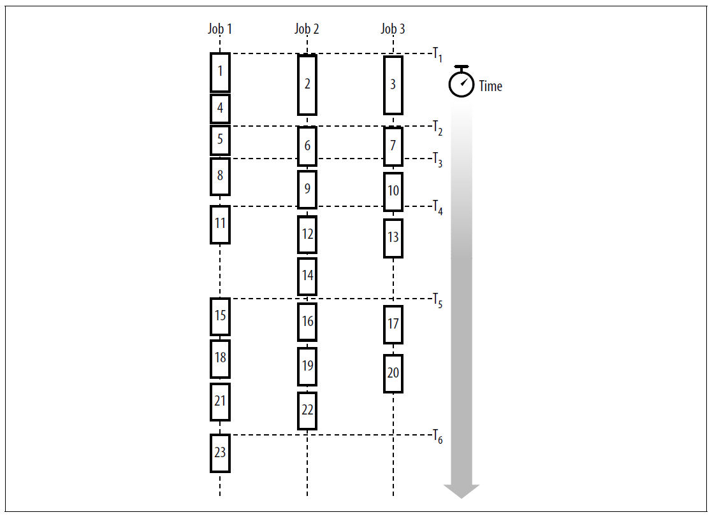

# GNU Make 项目管理 第十章 提升 make 性能

[annotation]: [id] (512cbd16-8d7d-40d4-9daf-3dff0daa72b3)
[annotation]: [status] (protect)
[annotation]: [create_time] (2021-04-18 19:22:43)
[annotation]: [category] (读书笔记)
[annotation]: [tags] (Make|Makefile|GNU)
[annotation]: [topic] (GNU Make 项目管理)
[annotation]: [index] (10)
[annotation]: [comments] (true)
[annotation]: [url] (http://blog.ccyg.studio/article/512cbd16-8d7d-40d4-9daf-3dff0daa72b3)

make 在开发过程中起着至关重要的作用。它结合了项目的组件来创建应用程序，同时允许开发人员避免因意外地省略构建步骤而引起的细微错误。但是，如果开发人员因为觉得 makefile 太慢而避免使用 make，那么 make 的所有好处就都失去了。因此，确保尽可能高效地 makefile 是很重要的。

性能问题总是很棘手，但是当考虑到用户的感知和代码的不同路径时，性能问题就更加棘手了。并不是 makefile 的每个目标都值得优化。根据您的环境，即使是激进的优化也可能不值得。例如，将手术时间从 90 分钟减少到 45 分钟可能并不重要，因为节省出来的时间是“去吃午饭”。另一方面，如果开发者在这段时间里无所事事，那么将任务从 2 分钟缩短到 1 分钟可能会受到热烈欢迎。

在编写 makefile 以便高效执行时，了解各种操作的成本以及正在执行的操作是非常重要的。在下面的部分中，我们将执行一些简单的基准测试来量化这些一般性注解，并介绍一些帮助识别瓶颈的技术。

提高性能的补充方法是利用并行性和本地网络拓扑。通过一次运行多个命令脚本(甚至在单处理器上)，可以减少构建时间。

## 基准测试

这里我们测量 make 中一些基本操作的性能。测量结果如表 10-1 所示。我们将解释每个测试，并建议它们如何影响您编写的 makefile。

表 10-1. 操作耗时

| 操作          | 执行次数 | 每次执行时间 (Windows) | 每秒执行次数 (Windows) | 每次执行时间 (Linux) | 每秒执行次数(Linux) |
| ------------- | -------- | ---------------------- | ---------------------- | -------------------- | ------------------- |
| make (bash)   | 1000     | 0.0436                 | 22                     | 0.0162               | 61                  |
| make (ash)    | 1000     | 0.0413                 | 24                     | 0.0151               | 66                  |
| make (sh)     | 1000     | 0.0452                 | 22                     | 0.0159               | 62                  |
| assignment    | 10000    | 0.0001                 | 8130                   | 0.0001               | 10989               |
| subst (short) | 10000    | 0.0003                 | 3891                   | 0.0003               | 3846                |
| subst (long)  | 10000    | 0.0018                 | 547                    | 0.0014               | 704                 |
| sed (bash)    | 1000     | 0.0910                 | 10                     | 0.0342               | 29                  |
| sed (ash)     | 1000     | 0.0699                 | 14                     | 0.0069               | 144                 |
| sed (sh)      | 1000     | 0.0911                 | 10                     | 0.0139               | 71                  |
| shell (bash)  | 1000     | 0.0398                 | 25                     | 0.0261               | 38                  |
| shell (ash)   | 1000     | 0.0253                 | 39                     | 0.0018               | 555                 |
| shell (sh)    | 1000     | 0.0399                 | 25                     | 0.0050               | 198                 |

Windows 测试是在 1.9 GHz Pentium 4(约 3578 Bogo-Mips)* 和 512 MB RAM 上运行 Windows XP。使用了 make 3.80 的 Cygwin 版本，从 rxvt 窗口启动。Linux 测试是在运行 Linux RedHat 9 的 450 mhz Pentium 2 (891 BogoMips)和 256 MB RAM 上运行的。

> 关于 BogoMips 的解释请参见 <http://www.clifton.nl/bogomips.html>

make 使用的子 shell 会对 makefile 的整体性能产生显著影响。bash shell 是一个复杂的、功能齐全的 shell，因此非常大。

ash shell 要小得多，功能较少，但足以完成大多数任务。更复杂的是，如果 bash 是从文件名 /bin/sh 调用的，它会显著改变其行为以更接近于标准 shell。在大多数 Linux 系统中，/bin/sh 文件是到 bash 的符号链接，而在 Cygwin 中，/bin/sh 实际上是 ash。为了解释这些差异，有些测试运行了三次，每次都使用不同的 shell。使用的 shell 在括号中表示。当“(sh)”出现时，这意味着 bash 被链接到名为 /bin/sh 的文件。

前三个测试的标签是 make，表明了如果无事可做，运行 make 是多么昂贵。makefile 文件包含:

```makefile
SHELL := /bin/bash
.PHONY: x
x:
    $(MAKE) --no-print-directory --silent --question make-bash.mk; \
    …this command repeated 99 more times…
```

单词 “bash” 将根据需要替换为适当的 shell 名称。

我们使用 `--no-print-directory` 和 `--silent` 命令来消除可能使计时测试不准确的不必要计算，并避免将计时输出值与无关文本混淆。`--question` 选项告诉 make 只检查依赖关系，而不执行任何命令，如果文件是最新的，则返回退出状态为 0。这允许 make 做尽可能少的工作。这个 makefile 不会执行任何命令，并且只存在一个 `.PHONY` 目标的依赖项。命令脚本执行 make 100 次。这个 makefile 是 makebash.mk 。由父 makefile 执行 10 次，代码如下:

```makefile
define ten-times
    TESTS += $1
    .PHONY: $1
    $1:
        @echo $(MAKE) --no-print-directory --silent $2; \
        time $(MAKE) --no-print-directory --silent $2; \
        time $(MAKE) --no-print-directory --silent $2; \
        time $(MAKE) --no-print-directory --silent $2; \
        time $(MAKE) --no-print-directory --silent $2; \
        time $(MAKE) --no-print-directory --silent $2; \
        time $(MAKE) --no-print-directory --silent $2; \
        time $(MAKE) --no-print-directory --silent $2; \
        time $(MAKE) --no-print-directory --silent $2; \
        time $(MAKE) --no-print-directory --silent $2; \
        time $(MAKE) --no-print-directory --silent $2
endef

.PHONY: all
all:

$(eval $(call ten-times, make-bash, -f make-bash.mk))

all: $(TESTS)
```

然后取这 1000 次执行的平均时间。

从表中可以看到，Cygwin make 大约每秒执行 22 次，即每次运行 0.044 秒，而 Linux 版本(即使在非常慢的CPU上)大约每秒执行 61 次，即每次运行 0.016 秒。为了验证这些结果，也测试了原生 Windows 版本的 make，但没有产生任何显著的速度提升。结论:虽然 Cygwin make 的进程创建速度比原生 Windows 稍慢，但两者都比 Linux 慢得多。它还表明，在 Windows 平台上使用递归 make 可能比在 Linux 上运行相同的构建执行得慢得多。

如您所料，此测试中使用的 shell 对执行时间没有影响。因为命令脚本不包含任何 shell 特殊字符，所以根本没有调用 shell。相反，make 直接执行命令。这可以通过将 `SHELL` 变量设置为一个完全虚假的值并注意测试仍然正确运行来验证。三个 shell 之间的性能差异必须归因于正常的系统差异。

下一个基准测量变量分配的速度。这是校准最基本的 make 操作。makefile 是 assign.mk，包含:

```makefile
# 10000 assignments
z := 10

…repeated 10000 times…

.PHONY: x
x: ;
```

然后使用父 makefile 中的 `ten-times` 函数运行这个 makefile。

赋值显然很快。Cygwin make 每秒将执行 8130 个任务，而 Linux 系统每秒可以执行 10989 个任务。我相信 Windows 对于这些操作的性能实际上比基准测试显示的要好，因为创建 10 倍 make 进程的成本不可能被可靠地排除在时间之外。结论:因为平均 makefile 不太可能执行 10000 次赋值，所以平均 makefile 中变量赋值的代价可以忽略不计。

接下来的两个基准测试度量 `subst` 函数调用的成本。第一个使用 10 个字符的短字符串，有三个替换:

```makefile
# 10000 subst on a 10 char string
dir := ab/cd/ef/g
x := $(subst /, ,$(dir))
…repeated 10000 times…
.PHONY: x
x: ;
```

这个操作花费的时间大约是一个简单赋值的两倍，即 Windows 上每秒 3891 次操作的时间。再次，Linux 系统的表现似乎比 Windows 系统要好得多。(请记住，Linux 系统的运行速度不到 Windows 系统时钟速度的四分之一。)

较长的替换操作在 1000 个字符的字符串上进行大约 100 次替换:

```makefile
# Ten character file
dir := ab/cd/ef/g
# 1000 character path
p100 := $(dir);$(dir);$(dir);$(dir);$(dir);…
p1000 := $(p100)$(p100)$(p100)$(p100)$(p100)…

# 10000 subst on a 1000 char string
x := $(subst ;, ,$(p1000))
…repeated 10000 times…
.PHONY: x
x: ;
```

接下来的三个基准测试使用 sed 度量相同替换的速度。

基准测试包含:

```makefile
# 100 sed using bash
SHELL := /bin/bash

.PHONY: sed-bash
sed-bash:
    echo '$(p1000)' | sed 's/;/ /g' > /dev/null
    …repeated 100 times…
```

通常，这个 makefile 是使用 `ten-times` 函数执行的。在 Windows 上，sed 的执行时间大约是 subst 函数的 50 倍。在我们的 Linux 系统上，sed 只慢了 24 倍。

当我们考虑到 shell 的成本时，我们看到 Windows 上的 ash 确实提供了一个有用的加速。使用 ash, sed 只比 subst 慢39倍!(wink)在Linux 上，使用的 shell 有更深刻的影响。在 Cygwin 上，/bin/bash 和 /bin/sh 之间没有区别，但是在 Linux 上，链接到 /bin/sh 的bash 性能要好得多。

最后的基准测试只是调用 make shell 命令来评估运行子 shell 的成本。makefile 文件包含:

```makefile
# 100 $(shell ) using bash
SHELL := /bin/bash
x := $(shell :)
…repeated 100 times…
.PHONY: x
x: ;
```

这里没有什么惊喜。Windows 系统比 Linux 慢，ash 比 bash 有优势。ash 的性能提高更明显，大约快 50%。Linux 系统使用 ash 表现最好，使用 bash(当命名为“bash”时)表现最慢。

基准测试是一项永无止境的任务，然而，我们所做的测量可以提供一些有用的见解。如果变量有助于澄清 makefile 的结构，那么可以创建任意多的变量，因为它们基本上是免费的。内置的 make 函数优先于运行命令，即使代码结构要求您重复执行 make 函数。避免在 Windows 上递归创建或不必要的进程创建。在 Linux 上，如果要创建许多进程，请使用 ash。

最后，请记住，在大多数 makefile 中，makefile 运行所需的时间几乎完全取决于程序运行的成本，而不是 make 或 makefile 的结构。通常，减少程序运行的数量对于减少 makefile 的执行时间是最有帮助的。

## 识别和处理瓶颈

makefile 中不必要的延迟有几个原因: makefile 的结构不佳、依赖性分析不佳、make 函数和变量使用不当。

这些问题可以通过 make 函数(如shell)来掩盖，这些函数调用命令而不回显命令，使得很难找到延迟的来源。

依赖分析是一把双刃剑。一方面，如果执行完整的依赖关系分析，分析本身可能会导致严重的延迟。如果没有 gcc 或 jikes 提供的特殊编译器支持，创建依赖项文件需要运行另一个程序，这几乎是编译时间的两倍。完全依赖分析的优点是它允许 make 执行更少的编译。不幸的是，开发人员可能不相信这种好处已经实现，所以编写 makefile 时使用的依赖关系信息不太完整。这种妥协几乎总是导致开发问题的增加，导致其他开发人员通过编译比使用原始的、完整的依赖关系信息所需要的更多的代码来进行过度补偿。

> 实际上，编译时间随输入文本的大小呈线性增长，而且这段时间几乎总是由磁盘I/O支配。类似地，使用简单的-M选项计算依赖关系的时间是线性的，受磁盘I/O的限制。

要制定依赖性分析策略，首先要理解项目中固有的依赖性。一旦理解了完整的依赖项信息，您就可以选择在 makefile 中表示多少(计算的或硬编码的)，以及在构建过程中可以采用什么快捷方式。虽然这些都不简单，但是很直接。

一旦确定了 makefile 结构和必要的依赖项，实现高效的 makefile 通常就是避免一些简单的缺陷。

### 简单变量 vs 递归变量

最常见的性能相关问题之一是使用递归变量而不是简单变量。例如，因为下面的代码使用了 `=` 操作符而不是 `:=`，所以每次使用 date 变量时它都会执行 date 命令:

```makefile
DATE = $(shell date +%F)
```
`+%F` 选项指示 date 以 “yyyy-mm-dd” 格式返回日期，因此对于大多数用户来说，重复执行 date 不会引起注意。当然，在午夜工作的开发人员可能会感到惊讶!

因为 make 不回显 shell 函数中执行的命令，所以很难确定实际运行的是什么。通过将 SHELL 变量重置为 /bin/sh -x，可以欺骗 make 显示它执行的所有命令。

这个 makefile 在执行任何操作之前创建它的输出目录。输出目录的名称由单词“out”和日期组成:

```makefile
DATE = $(shell date +%F)
OUTPUT_DIR = out-$(DATE)

make-directories := $(shell [ -d $(OUTPUT_DIR) ] || mkdir -p $(OUTPUT_DIR))

all: ;
```

当使用一个调试 shell 运行时，我们可以看到:

```text
$ make SHELL='/bin/sh -x'
+ date +%F
+ date +%F
+ '[' -d out-2004-03-30 ']'
+ mkdir -p out-2004-03-30
make: all is up to date.
```

这清楚地表明 date 命令执行了两次。如果你需要经常执行这种 shell 跟踪，你可以让它更容易访问:

```makefile
ifdef DEBUG_SHELL
    SHELL = /bin/sh -x
endif
```

### 禁用 @

隐藏命令的另一种方法是使用静默命令修饰符 `@`。有时禁用此特性会很有用。你可以通过定义一个变量 QUIET 来保持 @ 符号，并在命令中使用该变量来实现这一点:

```makefile
ifndef VERBOSE
    QUIET := @
endif
…
target:
    $(QUIET) echo Building target...
```

当需要查看被 silent 修饰符隐藏的命令时，只需在命令行上定义 VERBOSE:

```text
$ make VERBOSE=1
echo Building target...
Building target...
```

### 延迟初始化

当简单变量与 shell 函数一起使用时，make 在读取 makefile 时计算所有 shell 函数调用。如果有很多这样的程序，或者如果它们执行昂贵的计算，make 会感觉迟钝。当一个不存在的目标被调用时，make 的响应性可以通过定时 make 来度量:

```text
$ time make no-such-target
make: *** No rule to make target no-such-target. Stop.
real 0m0.058s
user 0m0.062s
sys 0m0.015s
```

这段代码乘以执行的任何命令的开销，甚至是微不足道或错误的命令。

因为递归变量每次展开时都会重新计算其右侧，因此有将复杂计算表示为简单变量的倾向。然而，这降低了 make 对所有目标的响应能力。似乎需要另一种类型的变量，它的右侧只在第一次计算变量时进行一次计算，而不是在此之前。

一个说明这种类型初始化需要的例子是 `findcompile-dirs` 函数，在第九章的 “快速方法:一体化编译” s一节中介绍:

```makefile
# $(call find-compilation-dirs, root-directory)
find-compilation-dirs = \
  $(patsubst %/,%,      \
    $(sort              \
      $(dir             \
        $(shell $(FIND) $1 -name '*.java'))))

PACKAGE_DIRS := $(call find-compilation-dirs, $(SOURCE_DIR))
```

理想情况下，我们希望每次执行时只执行一次查找操作，但只有在实际使用 `PACKAGE_DIRS` 变量时才执行。这可以称为延迟初始化。我们可以像这样使用 eval 来构建这样一个变量:

```makefile
PACKAGE_DIRS = $(redefine-package-dirs) $(PACKAGE_DIRS)

redefine-package-dirs = \
    $(eval PACKAGE_DIRS := $(call find-compilation-dirs, $(SOURCE_DIR)))
```

基本方法是首先将 `PACKAGE_DIRS` 定义为递归变量。展开后，该变量计算代价昂贵的函数(这里是 `find-compilationdirs` )，并将自身重新定义为一个简单变量。最后，从最初的递归变量定义返回变量值(现在很简单)。让我们来详细讨论一下:

1. 当 make 读取这些变量时，它只记录它们的右侧，因为这些变量是递归的。
2. 第一次使用 `PACKAGE_DIRS` 变量时，make 检索右侧并展开第一个变量，即 `redefine-package-dirs`。
3. `redefine-package-dirs` 的值是一个单独的函数调用 `eval`。
4. `eval` 的主体将递归变量 `PACKAGE_DIRS` 重新定义为一个简单变量，该变量的值是 `find-compile-dirs` 返回的一组目录。现在已经用目录列表初始化了 `PACKAGE_DIRS`。
5. `redefine-package-dirs` 变量被展开为空字符串(因为 `eval` 展开为空字符串)。
6. 现在 make 继续扩展 `PACKAGE_DIRS` 的原始右侧。剩下要做的唯一一件事就是展开变量 `PACKAGE_DIRS`。`make` 查找变量的值，查看一个简单变量，并返回它的值。

这段代码中唯一真正棘手的部分是依赖 make 从左到右计算递归变量的右侧。例如，如果 make 决定在 `$(redefine-package-dirs)` 之前计算 `$(PACKAGE_DIRS)`，那么代码将失败。

我刚才描述的过程可以被重构为一个函数，`lazy-init`:

```makefile
# $(call lazy-init,variable-name,value)
define lazy-init
    $1 = $$(redefine-$1) $$($1)
    redefine-$1 = $$(eval $1 := $2)
endef

# PACKAGE_DIRS - a lazy list of directories
$(eval                              \
  $(call lazy-init,PACKAGE_DIRS,    \
    $$(call find-compilation-dirs,$(SOURCE_DIRS))))
```

## 并行 make

另一种提高构建性能的方法是利用 makefile 解决的问题中固有的并行性。大多数 makefile 执行许多容易并行执行的任务，例如将 C 源代码编译为目标文件或从目标文件中创建库。此外，编写良好的 makefile 的结构本身提供了自动控制并发进程所需的所有信息。

示例 10-1 显示了使用 jobs 选项 `--jobs=2 (-j 2)` 执行的 mp3_player 程序。图 10-1 在伪 UML 序列图中显示了相同的 make 运行。使用 `--jobs=2` 告诉 make 在可能的情况下并行更新两个目标。当 make 同步更新目标时，它会按照执行命令的顺序回显命令，并将它们交错在输出中。这使得并行读取输出变得更加困难。让我们更仔细地看看这个输出。

示例 10-1 当 `--jobs = 2` 时 make 的输出

```text
$ make -f ../ch07-separate-binaries/makefile --jobs=2

1 bison -y --defines ../ch07-separate-binaries/lib/db/playlist.y

2 flex -t ../ch07-separate-binaries/lib/db/scanner.l > lib/db/scanner.c

3 gcc -I lib -I ../ch07-separate-binaries/lib -I ../ch07-separate-binaries/include -M
    ../ch07-separate-binaries/app/player/play_mp3.c | \
    sed 's,\(play_mp3\.o\) *:,app/player/\1 app/player/play_mp3.d: ,' > app/player/play_mp3.d.tmp

4 mv -f y.tab.c lib/db/playlist.c

5 mv -f y.tab.h lib/db/playlist.h

6 gcc -I lib -I ../ch07-separate-binaries/lib -I ../ch07-separate-binaries/include -M
    ../ch07-separate-binaries/lib/codec/codec.c | \
    sed 's,\(codec\.o\) *:,lib/codec/\1 lib/codec/codec.d: ,' > lib/codec/codec.d.tmp

7 mv -f app/player/play_mp3.d.tmp app/player/play_mp3.d

8 gcc -I lib -I ../ch07-separate-binaries/lib -I ../ch07-separate-binaries/include -M lib/db/playlist.c | \
    sed 's,\(playlist\.o\) *:,lib/db/\1 lib/db/playlist.d: ,' > lib/db/playlist.d.tmp

9 mv -f lib/codec/codec.d.tmp lib/codec/codec.d

10 gcc -I lib -I ../ch07-separate-binaries/lib -I ../ch07-separate-binaries/include -M
../ch07-separate-binaries/lib/ui/ui.c | \
    sed 's,\(ui\.o\) *:,lib/ui/\1 lib/ui/ui.d: ,' > lib/ui/ui.d.tmp

11 mv -f lib/db/playlist.d.tmp lib/db/playlist.d

12 gcc -I lib -I ../ch07-separate-binaries/lib -I ../ch07-separate-binaries/include -M
lib/db/scanner.c | \
    sed 's,\(scanner\.o\) *:,lib/db/\1 lib/db/scanner.d: ,' > lib/db/scanner.d.tmp

13 mv -f lib/ui/ui.d.tmp lib/ui/ui.d

14 mv -f lib/db/scanner.d.tmp lib/db/scanner.d

15 gcc -I lib -I ../ch07-separate-binaries/lib -I ../ch07-separate-binaries/include -c -o app/player/play_mp3.o ../ch07-separate-binaries/app/player/play_mp3.c

16 gcc -I lib -I ../ch07-separate-binaries/lib -I ../ch07-separate-binaries/include -c -o lib/codec/codec.o ../ch07-separate-binaries/lib/codec/codec.c

17 gcc -I lib -I ../ch07-separate-binaries/lib -I ../ch07-separate-binaries/include -c -o lib/db/playlist.o lib/db/playlist.c

18 gcc -I lib -I ../ch07-separate-binaries/lib -I ../ch07-separate-binaries/include -c -o lib/db/scanner.o lib/db/scanner.c
    ../ch07-separate-binaries/lib/db/scanner.l: In function yylex:
    ../ch07-separate-binaries/lib/db/scanner.l:9: warning: return makes integer from
pointer without a cast

19 gcc -I lib -I ../ch07-separate-binaries/lib -I ../ch07-separate-binaries/include -c -o lib/ui/ui.o ../ch07-separate-binaries/lib/ui/ui.c

20 ar rv lib/codec/libcodec.a lib/codec/codec.o
    ar: creating lib/codec/libcodec.a
    a - lib/codec/codec.o

21 ar rv lib/db/libdb.a lib/db/playlist.o lib/db/scanner.o
    ar: creating lib/db/libdb.a
    a - lib/db/playlist.o
    a - lib/db/scanner.o

22 ar rv lib/ui/libui.a lib/ui/ui.o
    ar: creating lib/ui/libui.a
    a - lib/ui/ui.o

23 gcc app/player/play_mp3.o lib/codec/libcodec.a lib/db/libdb.a lib/ui/libui.a -o app/player/play_mp3
```



首先，make必须构建生成的源文件和依赖文件。生成的两个源文件是 yacc 和 lex 的输出。这用于命令 1 和命令 2。第三个命令为 `play_mp3.c` 生成依赖文件，并且在 `playlist.c` 或 `scanner.c` 的依赖文件被完成之前就开始了(通过命令4、5、8、9、12 和 14)。因此，这个 make 将并行运行三个作业，即使命令行选项请求两个作业。

mv 命令 4 和 5 完成了从命令 1 开始的 `playlist.c` 源代码生成。命令 6 开始另一个依赖文件。每个命令脚本总是由单个 make 执行，但每个目标和依赖构成一个单独的作业。因此，命令 7 (依赖性生成脚本的第二个命令)正在由与命令 3 相同的 make 进程执行。虽然命令 6 可能是由执行命令 1-4-5(处理 yacc 语法)的 make 完成后立即生成的 make 执行的，但是在命令 8 中生成依赖项文件之前。

依赖项生成将继续以这种方式进行，直到命令 14。所有依赖项文件必须完成后，make 才能进入下一个处理阶段，即重新读取 makefile。这形成了一个自然的同步点，make 自动服从。

一旦使用依赖项信息重新读取 makefile, make 就可以再次并行地继续构建过程。这次 make 选择在构建每个归档库之前编译所有目标文件。这个顺序是不确定的。也就是说，如果再次运行 makefile，可能是 `libcodec.a` 库可以在 `playlist.c` 编译之前构建，因为该库不需要除 `codec.o` 之外的任何对象。因此，该示例表示许多执行顺序中的一个可能的执行顺序。

最后，链接程序。对于这个 makefile，链接阶段也是一个自然的同步点，并且总是最后出现。但是，如果目标不是单个程序而是多个程序或库，那么最后执行的命令也可能不同。

在多处理器上运行多个作业显然是有意义的，但在单处理器上运行多个作业也可能非常有用。这是因为磁盘 I/O 的延迟和大多数系统上的大量缓存。例如，如果一个进程(如 gcc)正在空闲等待磁盘I/O，那么可能是另一个任务(如 mv、yacc 或 ar)的数据当前在内存中。在这种情况下，最好允许具有可用数据的任务继续进行。一般来说，在单处理器上运行两个作业的 make 几乎总是比运行一个作业快，而且三个甚至四个任务比两个任务快的情况也并不少见。

`--jobs` 选项可以不带数字使用。如果是这样，make将生成与要更新的目标一样多的作业。这通常不是一个好主意，因为大量作业通常会淹没处理器，运行速度甚至比单个作业要慢得多。

管理多个作业的另一种方法是使用系统平均负载作为指导。平均负载是一段时间内的平均可运行进程数，通常为 1 分钟、5 分钟和 15 分钟。负载平均值用浮点数表示。`--load-average (-l)` 选项给出了一个阈值，超过这个阈值就不能生成新作业。例如，该命令:

```text
$ make --load-average=3.5
```

告诉 make 只有在平均负载小于或等于 3.5 时才生成新作业。如果平均负载更大，则等待，直到平均负载低于这个数字，或直到所有其他作业完成。

在编写并行执行的 makefile 时，注意适当的依赖更加重要。如前所述，当 `--jobs` 为 1 时，通常将从左到右评估依赖列表。当 `--jobs` 大于 1 时，可以并行计算这些依赖。因此，在并行运行时，任何由默认的从左到右的计算顺序隐式处理的依赖关系都必须是显式的。

并行生成的另一个危险是共享中间文件的问题。例如，如果一个目录包含 `foo.y` 和 `bar.y`。并行运行两次 yacc 可能导致其中一个获得另一个的 `y.tab.c` 或 `y.tab.h` 实例，或者两者都移到自己的 `.c` 或 `.h` 文件中。在具有固定名称的临时文件中存储临时信息的任何过程都面临类似的危险。

另一个阻碍并行执行的常见习惯用法是从 shell for 循环调用递归 make:

```makefile
dir:
    for d in $(SUBDIRS);            \
        do                          \
        $(MAKE) --directory=$$d;    \
        done
```

正如第六章“递归 make”一节所提到的，make 不能并行执行这些递归调用。为了实现并行执行，声明目录 `.PHONY` 并使它们成为目标:

```makefile
.PHONY: $(SUBDIRS)
$(SUBDIRS):
    $(MAKE) --directory=$@
```

## 分布式 make

GNU make 支持一个鲜为人知的构建选项，用于管理在网络上使用多个系统的构建。该特性依赖于与 Pmake 一起分布的 Customs 库。Pmake 是 Adam de Boor 于 1989 年为 Sprite 操作系统编写的 make 的替代版本(并一直由 Andreas Stolcke 维护)。Customs 库有助于在许多机器上并行地分发 make 执行。从 3.77 版开始，GNU make 包含了对用于发布 make 的 Customs 库的支持。

要启用 Customs 库支持，必须从源重新生成 make。这个过程的说明在 `README.customs` 中。首先，您必须下载并构建 pmake 发行版(URL 在 README 中)，然后使用 `--with-customs` 选项构建make。

Customs 库的核心是在参与分布式 make 网络的每个主机上运行的 Customs 守护进程。这些主机必须共享文件系统的公共视图，例如 NFS 提供的视图。自定义守护进程的一个实例被指定为 master。主服务器监控参与主机列表中的主机，并将作业分配给每个成员。当 make 以大于 1 的 --jobs 标志运行时，make 与主服务器联系，它们一起在网络中可用的主机上生成作业。

Customs 库支持多种功能。可以根据架构对主机进行分组，并根据性能对主机进行评级。可以根据属性和布尔运算符的组合为主机分配任意属性，也可以将作业分配给主机。此外，在处理作业时，还可以考虑空闲时间、空闲磁盘空间、空闲交换空间和当前平均负载等主机状态。

如果您的项目是用 C、C++ 或 Objective-C 实现的，您还应该考虑 distcc (<http://distcc.samba.org>)，以便在多个主机上发布编译器。distcc 是由 Martin Pool 和其他人编写的，以加速 Samba 构建。对于用 C、C++ 或 Objective-C 编写的项目，它是一个健壮而完整的解决方案。只需用 distcc 程序替换 C 编译器即可使用该工具:

```text
$ make --jobs=8 CC=distcc
```

对于每次编译，distcc 使用本地编译器对输出进行预处理，然后将扩展后的源代码发送到可用的远程机器进行编译。最后，远程主机将结果对象文件返回给主服务器。这种方法消除了共享文件系统的必要性，极大地简化了安装和配置。

可以通过几种方式指定工作者或志愿者主机集。最简单的方法是在启动 distcc 之前在一个环境变量中列出志愿者主机:

```text
$ export DISTCC_HOSTS='localhost wasatch oops'
```

distcc 非常好配置，可以处理主机列表、与本机编译器集成、管理压缩、搜索路径以及处理故障和恢复。

ccache 是另一个提高编译性能的工具，由 Samba 项目负责人 Andrew Tridgell 编写。想法很简单，缓存以前编译的结果。在执行编译之前，检查缓存是否已经包含结果对象文件。这并不需要多台主机，甚至不需要一个网络。作者报告说，在一般的编辑速度快 5 到 10 倍。使用 ccache 最简单的方法是在编译器命令前加上 ccache:

```text
$ make CC='ccache gcc'
```

ccache 可以与 distcc 一起使用，以获得更大的性能改进。此外，这两个工具都可以在 Cygwin 工具集中使用。

## 参考资料

- [Managing Projects with GNU Make](https://book.douban.com/subject/1850994/)
