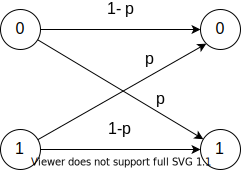

# 信息论

[annotation]: [id] (29a1fb18-6dbe-4457-9eed-b33af2849700)
[annotation]: [status] (public)
[annotation]: [create_time] (2021-09-22 19:33:29)
[annotation]: [category] (读书笔记)
[annotation]: [tags] (信息论|编码)
[annotation]: [comments] (true)
[annotation]: [url] (http://blog.ccyg.studio/article/29a1fb18-6dbe-4457-9eed-b33af2849700)

## 一些定义

- 信息：可以降低不确定性的东西
- 信源：信息的发送方
- 信宿：信息的接收方
- 信道：信息从发送方到接收方的传输途径

## 信源编码

### 不确定性和信息

信源存在 **模拟信源** 和 **离散信源** 两种

> 定义：考虑可能输出为 $x_i, i=1, 2, \cdots, n$ 的离散随机变量 $X$。则事件 $X=x_i$ 的 **自信息** 定义为
> 
> $$I(x_i) = \log\left({1 \over P(x_i)}\right) = -\log P(x_i)$$

注意到大概率事件没有小概率事件携带的信息多，对于 $P(x_i) = 1$ 的事件，有 $I(x_i) = 0$，因为小概率事件意味着高度的不确定性，反之亦然；具有高度不确定性的随机变量带有更多的信息。我们在本章中将一直用不确定性的信息量的这种相关性作自然解释。

$I(x_i)$ 的单位取决于取对数的底数，通常取 $2$ 或者 $e$。当以 $2$ 为底数时，单位为 **比特(bit)**，当以 $e$ 为底数时，单位为 **奈特(nat)**；由于 $0 \leqslant P(x_i) \leqslant 1$，故 $I(x_i) \geqslant 0$，即自信息是非负的；

----

例：假如有一个掷硬币的二元信源：若正面 $H$ 出现则输出 $1$，若反面 $T$ 出现则输出 $0$，对于该信源，有 $\displaystyle P(1) = P(0) = {1 \over 2}$。来自该信源的每一个输出所含的信息量为：

$$\begin{aligned}
I(x_i) =& -\log_2 P(x_i) \\
=& -\log_2 P(0.5)  = 1 (bit)\\
\end{aligned}$$

> 假定二元信源连续输出是统计独立的，即信源是 **无记忆的**

例：假如一个 $m$ 比特的数组，则共有 $2^m$ 个可能的 $m$ 比特组，每一个都等可能地具有概率 $2^{-m}$，一个 $m$ 比特组的自信息为

$$\begin{aligned}
I(x_i) =& -\log_2 P(x_i) \\
=& -\log_2 2^{-m}  = m (bit)\\
\end{aligned}$$

> 当信源的一些输出被看做一个组的时候，这种信息的对数 度量具有所期望的 **可加性**

---

> 定义：随机变量 $x_i, y_j$ 之间的 **互信息 $I(x_i; y_j)$** 为
> 
> $$I(x_i;y_j) = \log \left[{P(x_i | y_j) \over P(x_i)}\right]$$

$$\begin{aligned}
& {P(x_i|y_j) \over P(x_i)}\\
\xlongequal{分子分母同乘以 P(y_j)}& {P(x_i|y_j)P(y_j) \over P(x_i)P(y_j)}\\
\xlongequal{概率乘法公式}& {P(x_i, y_j) \over P(x_i)P(y_j)}\\
\xlongequal{条件概率公式}& {P(y_j | x_i) \over P(y_j)}\\
\end{aligned}$$

因此

$$\begin{aligned}
I(x_i;y_j) =& \log \left[{P(x_i | y_j) \over P(x_i)}\right] \\
=& \log \left[ P(y_j | x_i) \over P(y_j) \right] \\
=& I(y_j;x_i)
\end{aligned}$$

对 $I(x_i;y_j) = I(y_j;x_i)$ 的自然解释如下：事件 $Y = y_j$ 的出现所提供的关于 $X = x_i$ 的信息完全等同于事件 $X = x_i$ 出现提供关于 $Y = y_j$ 的信息。**考虑文氏图，换句话说，两件事交叉的部分是唯一的，**

----

例：考虑如下图所示的 **二元对称信道(BSC Binary Symmetric Channel)**。

这是种从发射端 (Tx) 到接收端 (Rx) 传递许多 $1$ 和 $0$ 的信道。它偶尔以概率 $p$ 发生错误。一个 BSC 会把 $1$ 变成 $0$，也以同样的概率把 $0$ 变成 $1$，令随机变量 $X$ 和 $Y$ 分别表示该 BSC 的输入和输出，并设输入符号等可能地出现，而且输出符号根据下面的信道转移概率依赖与输入

$$\begin{aligned}
P(Y=0|X=0) =& 1-p \\
P(Y=0|X=1) =& p \\
P(Y=1|X=1) =& 1-p \\
P(Y=1|X=0) =& p \\
\end{aligned}$$

这说明在该 BSC 中传输时，数字发生转变（出错）的概率为 $p$。从这些信道转移概率中我们得到：

$$\begin{aligned}
P(Y=0) =& P(X=0) P(Y=0|X=0) + P(X=1)P(Y=0|X=1) \\
=& 0.5(1-p) + 0.5p = 0.5 \\
P(Y=1) =& P(X=0) P(Y=1|X=0) + P(X=1)P(Y=1|X=1) \\
=& 0.5p + 0.5(1-p) = 0.5 \\
\end{aligned}$$

假定我们在接受端根据接收到的信号想要确定从发送端发送的是什么。在给定 $Y = 0$ 的情况下，关于事件 $X = 0$ 发生的互信息为：

$$\begin{aligned}
I(x_0; y_0) =& I(0; 0) \\
=& \log_2\left[ {P(Y=0|X=0) \over P(Y = 0) } \right] \\
=& \log_2\left[{1 - p \over 0.5 } \right] \\
=& \log_2 2(1-p) \\
I(x_1; y_0) =& I(1; 0) \\
=& \log_2\left[ {P(Y=0|X=1) \over P(Y = 0) } \right] \\
=& \log_2\left[{p \over 0.5 } \right] \\
=& \log_2 2p \\
\end{aligned}$$

假定 $p = 0$ 即为理想信道，无噪声，则

$I(x_0; y_0) = I(0;0) = \log_2 2(1 - p) = 1(bit)$

但是，若 $p = 0.5$，我们得到：

$I(x_0; y_0) = I(0; 0) = \log_2 2(1-p) = \log_2 2 \times 0.5 = 0$

很明显，我们从输出得不到任何有用信息，这是一个无用信道，对于这种信道，我们完全可以通过在接受端掷硬币的方法来确定发送的是什么。

---

> 定义：在给定 $Y = y_j$ 的情况下，事件 $X=x_i$ 的 **条件自信息** 为
> 
> $$I(x_i | y_j) = \log \left[{1 \over P(x_i | y_j)}\right] = -\log P(x_i | y_j)$$

由此，我们可以写为

$$I(x_i;y_j) = I(x_i) - I(x_i | y_j)$$

条件自信息可解释为在事件 $Y = y_j$ 的基础上关于事件 $X = x_i$ 的自信息。

### 平均互信息和熵

> 定义：两个随机变量 $X$ 和 $Y$ 的 **平均互信息** 为

$$\begin{aligned}
I(X;Y) =& \sum_{i = 1}^n\sum_{j = 1}^m P(x_i, y_j) I(x_i;y_j) \\
=& \sum_{i = 1}^n\sum_{j = 1}^m P(x_i, y_j) \log {P(x_i, y_j) \over P(x_i) P(y_j)} \\
=& \sum_{i = 1}^n\sum_{j = 1}^m P(x_i)P(y_j|x_i) \log {P(y_j | x_i) \over P(y_j)} \\
=& \sum_{i = 1}^n\sum_{j = 1}^m P(y_j)P(x_i|y_j) \log {P(x_i | y_j) \over P(x_i)} \\
\end{aligned}$$

对于 $X$ 和 $Y$ 统计独立的情况，有 $I(X;Y) = 0$，即 $X$ 和 $Y$ 之间没有平均互信息；

平均互信息的一个重要的性质是 $I(X; Y) \geqslant 0$，其中当且仅当 $X$ 与 $Y$ 统计独立时，等号成立；

---

> 定义：随机变量 $X$ 的 **平均自信息** 为：
> 
> $$H(X) = \sum_{i = 1}^n P(x_i)I(x_i) = - \sum_{i = 1}^n P(x_i) \log P(x_i)$$

其中，$X$ 代表信源可能输出的字母符号，$H(X)$ 代表每个信源字母的平均信息；在此情况下，我们称 $H(X)$ 为 **熵(entropy)**；

$X$ 的熵可以表示为 $\displaystyle\log\left[{1 \over P(X)}\right]$ 的数学期望值。

术语熵取则统计力学，在该学科中它用来表示一个系统的无序程度，某种意义上二者是等价的；

---

> 定义：**平均条件自信息** 又称作 **条件熵**，定义为：
> 
> $$H(X|Y) = \sum_{i = 1}^n \sum_{j = 1}^n P(x_i, y_j) \log {1 \over P(x_i | y_j)}$$

对该定义的自然解释如下：$H(X|Y)$ 是在观察到 $Y$ 的情况下，$X$ 中的 **信息（或不确定性）**

---

> 定义：一对联合概率分布是 $p(x, y)$ 的离散随机变量 $(X, Y)$ 的 **联合熵** 定义为：
> 
> $$H(X;Y) = - \sum_{i = 1}^n\sum_{j = 1}^m p(x_i, y_j) \log p(x_i, y_j)$$

我们有以下规则：

$$\begin{aligned}
H(X,Y) =& H(X) + H(Y|X) = H(Y) + H(X|Y) \\
I(X;Y) =& H(X) + H(Y) - H(X,Y) \\
I(X;X) =& H(X) - H(X | Y) = H(X) \\
\end{aligned}$$

---

### 信源编码定理

---

## 参考资料

1. [Ranjan Bose & 武传坤 - 信息论、编码与密码学](https://book.douban.com/subject/1220502/)
