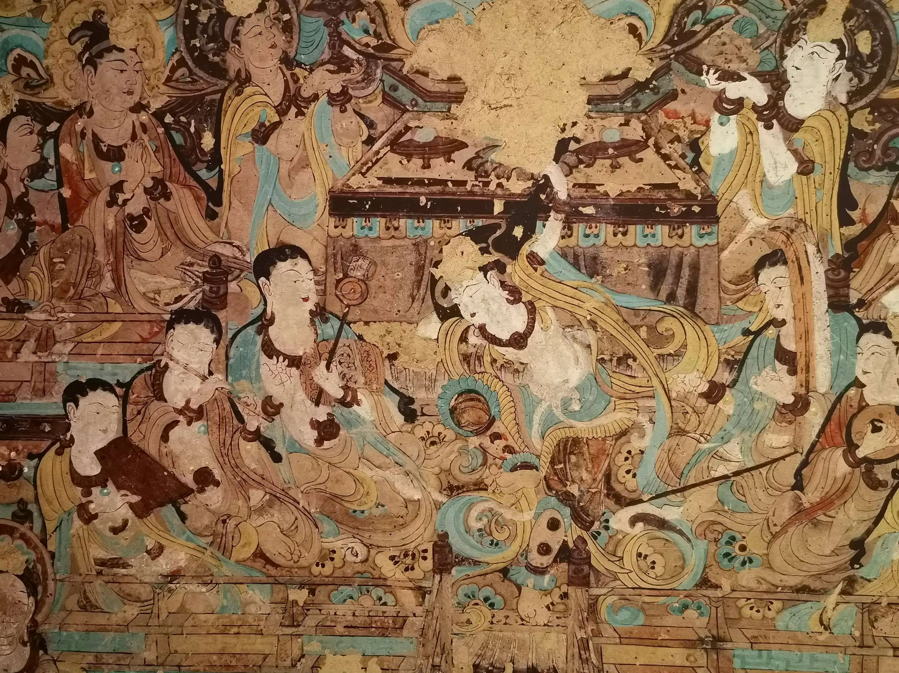

# 我的书单 2022

[annotation]: [id] (e4453e06-caa7-43d1-badb-3e70b8c76490)
[annotation]: [status] (public)
[annotation]: [create_time] (2022-01-27 22:57:53)
[annotation]: [category] (读书笔记)
[annotation]: [tags] ()
[annotation]: [comments] (true)
[annotation]: [url] (http://blog.ccyg.studio/article/e4453e06-caa7-43d1-badb-3e70b8c76490)

## 2022-11

- 2022-11-19 [[英] 伊扎基 - 《混音指南》](https://book.douban.com/subject/5957920/)

- 2022-11-13 [[英]玛丽·雪莱 - 《弗兰肯斯坦》](https://book.douban.com/subject/1443455/)

    真实一个无聊的故事！

- 2022-11-06 [[美] 李维(Mario Livio) - 《数学沉思录》](https://book.douban.com/subject/4904722/)

## 2022-10

- 2022-10-31 [[美] 理查德·费曼 - 《别闹了，费曼先生》](https://book.douban.com/subject/1037602/)

- 2022-10-23 [钱歌川 - 《翻译的技巧》](https://book.douban.com/subject/6559347/)

- 2022-10-09 [[德] 托马斯·曼 - 《魔山》](https://book.douban.com/subject/26117522/)

## 2022-09

- 2022-09-12 [[法] 阿尔贝·加缪 - 《局外人》](https://book.douban.com/subject/24257486/)

- 2022-09-02 [[英] 伊恩·麦克尤恩 - 《水泥花园》](https://book.douban.com/subject/6126815/)

    既邪恶，又变态！

- 2022-09-01 [[美] 塔拉·韦斯特弗 - 《你当像鸟飞往你的山》](https://book.douban.com/subject/33440205/)

    借我一生，还你永恒！了却残生，不见永恒。

    > 好奇心是一种奢侈品  
    > 改变重大的误解便是改变了世界  
    > 过去是一个幽灵，虚无缥缈，没什么影响力。只有未来才有力量。  

## 2022-08

- 2022-08-30 [岸见一郎 / 古贺史健 - 《被讨厌的勇气》](https://book.douban.com/subject/26369699/)

- 2022-08-29 [David Salsburg 萨尔斯伯格 - 《女士品茶》](https://book.douban.com/subject/1626392/)

- 2022-08-24 [[英] 萨曼·鲁西迪 - 《午夜之子》](https://book.douban.com/subject/26607924/)

    > 我也像所有的自传作者一样受到了诱惑，自以为既然往事只是存在于个人的记忆和徒劳无功地企图进行概括的词语之中，因此只要说以前有过什么什么事，就完全可以把往事编造出来。尽管在这两种处理中，歪曲是难免的。恐怕我们只能生活在缺憾的阴影之中了。归根到底，腌制就是使之不朽。

- 2022-08-18 [[德] Tobias Klein - 《捉虫日记》](https://book.douban.com/subject/11589836/)

- 2022-08-15 [Norman Matloff / Peter Jay Salzman - 《软件调试的艺术》](https://book.douban.com/subject/4111413/)

    比较基础！

- 2022-08-13 [樊锦诗 & 顾春芳 - 《我心归处是敦煌》](https://book.douban.com/subject/34799573/)

    > 第112窟的《反弹琵琶》，这是大家都知道的敦煌的标志性壁画，是最能代表敦煌艺术的图像。以前在画册上看到过，现在近在咫尺，感觉完全不同。画面表现的是伎乐天神态悠闲雍容、落落大方，一举足一顿地，一个出胯旋身凌空跃起，使出了“反弹琵琶”的绝技，仿佛能听到项饰臂钏在飞动中叮当作响的声音……这一刻被天才的画工永远定格在墙壁上，整个大唐盛世也好像被定格在这一刻，时间和空间也仿佛被色彩和线条凝固起来，成为永恒的瞬间。

    

- 2022-08-08 [罗翔 - 《刑法学讲义》](https://book.douban.com/subject/35154591/)

    > 这个世界有太多让人感到寒冷的事情，但如果你能够成为一场光，你就能照亮周边的人，而周边的人被照亮，你自己也能被照亮。很多时候，大家不必强迫自己去做出伟大的事业，我们只要心怀伟大的爱，在每天的小事中让这个世界感到温暖。

- 2022-08-04

    

- 2022-08-03 [三毛 - 《撒哈拉的故事》](https://book.douban.com/subject/1361264/)

    > 人，真是奇怪，没有外人来证明你，就往往看不出自己的价值。

- 2022-08-01 [[英] 加文·普雷特-平尼 - 《云彩收集者手册》](https://book.douban.com/subject/27624390/)

- 2022-08-01 [[美] Matthew Monte - 《网络攻击与漏洞利用 安全攻防策略》](https://book.douban.com/subject/30205620/)

- 2022-08-01 [三毛 - 《梦里花落知多少》](https://book.douban.com/subject/1082398/)

## 2022-07

- 2022-07-30 [[美] 苏珊·福沃德 / [美] 琼·托雷斯 - 《依恋》](https://book.douban.com/subject/30199459/)

- 2022-07-27 [[美] 苏珊·福沃德 / [美] 克雷格·巴克 - 《执迷》](https://book.douban.com/subject/30199456/)

    不太愿意承认犯过的错误！

- 2022-07-26 [[美] 苏珊·福沃德 / [美] 克雷格·巴克 - 《原生家庭》](https://book.douban.com/subject/30199434/)

    尽管有些困难，但家庭给我的，是在困境中挣扎的力量！我觉得我挺幸运的。

- 2022-07-22 [[加拿大] 扬·马特尔 - 《少年 Pi 的奇幻漂流》](https://book.douban.com/subject/30216638/)

    > 我的一生见过许多美丽的星空，在那上面，大自然只用了两种颜色和最简单的方式画出了最壮丽的图画，我和所有人一样，感到自然的神奇和自己的渺小；
    >
    > 事物应该恰当地结束，这在生活中很重要。只有在这时你才能放手，否则你的心里就会装满应该说却不曾说的话，你的心就会因悔恨而沉重。比如那个没有说出的再见直到今天都让我伤心。
    >
    > 这个世界并不是它本来的样子，它是我们所理解的样子，不是吗？
    >
    > 它的快乐被击的粉碎，它深深地渴望自由，它用尽一切方法逃跑。

- 2022-07-21 [姚淑萍 - 《网络安全预警防御技术》](https://book.douban.com/subject/30572775/)

    能力有限，没有看懂！

- 2022-07-19 [李运华 - 《从零开始学架构》](https://book.douban.com/subject/30335935/)

    有一些启发，特别是文字的组织，人真的是又知识诅咒，有时候一些显而易见的没用的东西，写出来整理整理也是很有意义的。因为这些东西对别人来说可能是新鲜的玩意儿。这里并无贬义，只是我以前忽略了一些东西，在与人的沟通中会有一些障碍。

- 2022-07-18 [张爱玲 - 《倾城之恋》](https://book.douban.com/subject/10757940/)

    张爱玲真是矫情啊！

- 2022-07-15 [李亚伟 - 《Kali Linux无线网络渗透测试详解》](https://book.douban.com/subject/26743729/)

    了解了一些基础概念

- 2022-07-13 [[美] 梭罗 - 《瓦尔登湖》](https://book.douban.com/subject/6041310/)

    > 一代人放弃另一代人的事业，就像搁浅的船一样。

- 2022-07-06 [冰心 - 《繁星·春水》](https://book.douban.com/subject/26835043/)

    > 青青河边草 绵绵思远道 远道不可思 夙昔梦之见

- 2022-07-04 [[美] 布鲁斯·本沃德 & 芭芭拉·加维·杰克逊 & 布鲁斯·r·杰克逊 - 《认识乐理》](https://book.douban.com/subject/26825412/)

- 2022-07-02 [Christof Paar & Jan Pelzl - 《深入浅出密码学》](https://book.douban.com/subject/19986936/)

    椭圆函数密码学还是不懂！

- 2022-07-01 [[美] 艾伯特-拉斯洛·巴拉巴西 - 《链接》](https://book.douban.com/subject/24862722/)

    > 所有人造的东西通常都会出现错误和故障。

## 2022-06

- 2022-06-27 [刘小枫 - 《沉重的肉身》](https://book.douban.com/subject/1059537/)

    > 性感的歌声出自孤独的灵魂！

## 2022-05

- 2022-05-31 [[法]托克维尔 - 《论美国的民主》](https://book.douban.com/subject/1041385/)

## 2022-04

- 2022-04-13 [毛泽东 - 《毛泽东选集 第五卷》](https://book.douban.com/subject/1916533/)

## 2022-03

- 2022-03-15 [毛泽东 - 《毛泽东选集 第四卷》](https://book.douban.com/subject/1139359/)

- 2022-03-14 [Perry R. Cook - 《Music, Cognition, and Computerized Sound》](https://book.douban.com/subject/1935213/)

    关于音乐的，物理学基础和认知科学以及计算机声学的基础研究。

- 2022-03-09 [毛泽东 - 《毛泽东选集 第三卷》](https://book.douban.com/subject/1077621/)

- 2022-03-07 [Abbott, Doug - 《PCI Bus Demystified》](https://book.douban.com/subject/4329391/)

    我只能说，英语相当的简单，我都能看懂了！！！

- 2022-03-05 [江晨 - 《哈农钢琴练指法》](https://book.douban.com/subject/3192794/)

    经过深思熟虑，第 50 条以上的，战略性放弃，如有必要再来研习。

- 2022-03-01 [Maurice J.Bach - 《UNIX 操作系统设计》](https://book.douban.com/subject/1035710/)

## 2022-02

- 2022-02-28 [[美]蕾切尔·卡森 - 《寂静的春天》](https://book.douban.com/subject/27614954/)

- 2022-02-21 [毛泽东 - 《毛泽东选集 第二卷》](https://book.douban.com/subject/1125026/)

- 2022-02-17 [毛泽东 - 《毛泽东选集 第一卷》](https://book.douban.com/subject/1139360/)

- 2022-02-13 [约翰.葛瑞宾 - 《深奥的简洁》](https://book.douban.com/subject/3370214/)

    复杂就是简单系统之间的相互作用造成混沌的边界！

## 2022-01

- 2022-01-27 [[美] 克雷格·莱特 - 《聆听音乐》](https://book.douban.com/subject/10590165/)

    <iframe class='row' frameborder="no" border="0" marginwidth="0" marginheight="0" width=330 height=86 src="https://music.163.com/outchain/player?type=2&id=22341167&height=66"></iframe>

    <iframe class='row' frameborder="no" border="0" marginwidth="0" marginheight="0" width=330 height=86 src="https://music.163.com/outchain/player?type=2&id=1400389599&height=66"></iframe>

    

    > 音乐是无害的奢侈品 —— 查理斯·伯尔尼

    > 如果是艺术，它就不是为所有人的，如果是为所有人的，它就不是艺术。 —— 阿诺尔德·勋伯格

