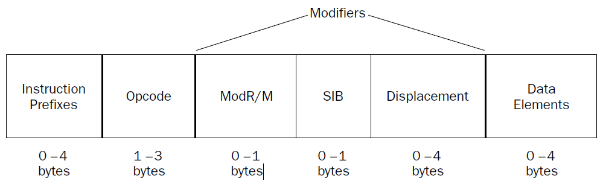

# 编程语言程序设计

[annotation]: [id] (d8df2fd4-57a7-4b7c-9e19-75b2c0d2c8f2)
[annotation]: [status] (public)
[annotation]: [create_time] (2021-04-28 11:37:52)
[annotation]: [category] (计算机技术)
[annotation]: [tags] (汇编语言)
[annotation]: [comments] (false)
[annotation]: [url] (http://blog.ccyg.studio/article/d8df2fd4-57a7-4b7c-9e19-75b2c0d2c8f2)

## 什么是汇编语言

### 处理器指令

IA-32 指令码格式由四部分组成：

- 可选指令前缀
- 指令码
- 可选指令修改器
- 可选数据元素



#### 指令码

指令码是指令格式中必须提供的，指示处理器应该执行什么功能或者任务。

指令码的长度为 1 ~ 3 字节不等，例如 `OF A2` 表示了 `cupid` 指令，执行该指令时，处理器会把当前微处理器的信息存储到不同的寄存器。

#### 指令前缀

指令前缀可以包含 1 ~ 4 个字节的信息，来修改指令码的行为。指令前缀可分为四类：

- 锁前缀和重复前缀
- 段重写前缀和分支提示前缀
- 操作数大小前缀
- 地址大小前缀

每一类在前缀中只能只能用一次来修改指令码，或者说描述指令码。

锁前缀指示任何共享内存区域将被该指令排他性的使用。这对于多处理器和混合多线程系统特别重要。

重复前缀用于指示重复的功能，通常用于操作字符串。

段重写前缀指示指令可以重写预定义的段寄存器。

分支提示前缀尝试给处理器一些线索，用于指示条件转义指令的时候，最可能跳转的分支，常用于分支预测硬件。

操作数大小前缀用于提示处理器，当前操作码是 16 位 还是 32 位的。可以帮助处理器使用大操作数，和加速数据赋值到寄存器。

地址大小签注提示处理器使用的是那种大小的内存地址，每种大小都可以被设置为程序的默认大小，前缀可用于临时修改该大小。

#### 修改器

一些指令码需要额外的修改器来定义什么寄存器或者内存地址参与其中。修改器包含三个不同的值。

- 地址格式指示字节
- SIB 字节
- 1,2 或 4 个地址位移字节

### 汇编语言

汇编语言程序由三部分来定义程序的操作：

- 操作码助记符
- 数据段
- 汇编指令

#### 操作码助记符

例如：指令码的样例：

```
55
89 E5
83 EC 08
C7 45 FC 01 00 00 00
83 EC 0C
6A 00
E8 D1 FE FF FF
```

可以重写成为：

```s
push %ebp
mov %esp, %ebp
sub $0x8, %esp
movl $0x1, -4(%ebp)
sub $0xc, %esp
push $0x0
call 8048348
```

## IA-32 平台

使用汇编语言只是为了在应用中探索处理器的底层特性。来理解程序怎样才能尽可能的高效。

### 控制单元

处理器的核心是控制单元，主要的目的是控制处理器中什么时候该做什么，处理器运行的时候指令必须从内存中加载到处理器中进行处理，那么控制单元有四个基础功能：

- 从内存读取指令
- 解码指令操作
- 如果需要从内存读取数据
- 如果需要将处理结果写入内存

指令指针指示下一个需要处理的指令，指令解码器用于将指令翻译成微指令，微指令用来控制处理器芯片上的信号，一般而言，微指令将输出寄存器的三态门控制端置为高电平，使得寄存器（内部一般为D边沿触发器）中的数据流入片内总线，另一方面微指令还控制另一寄存器的写控制端，使得总线上的数据写入另一个寄存器。

为了加速处理器的速度，现代处理器一般会有更加高级的手段，比如 Intel NetBurst 控制器技术，有如下的特性：

- 预取指和译码
- 分支预测
- 乱序执行
- 指令引退

#### 预取指令和译码流水线

由于取指令需要操作内存，所以执行指令一般来说要比取指令快；这样的话就可能出现积压，所以预取指令就登场了。

为了支持预取指令，CPU中需要一个特殊的存储区域来存放取出的指令。可以让处理器简单而快速的访问数据，然后流水线就登场了。缓存(cache)的存取速度一般要比内存快得多。

流水线在CPU中创建了一撮内存的缓存，，里面存储了预先取出的指令和数据，当执行单元可以执行下一条指令的时候，流水线中已经准备好了指令，于是可以快速的执行。

IA-32 平台通过多级 cache 实现流水线，第一级缓存 (L1) 尝试预先从内存中取出指令和数据。

当然，一个问题是无法保证程序按照顺序执行指令，如果指令指针因逻辑分支转移到了其他的地方，那么整条流水线的数据就没用了，需要清空还需要重新注入流水线。

为了解决这个问题，第二级缓存（L2）登场，第二级缓存同样保存指令和数据，当逻辑跳转到另一个分支时，第二级缓存还保存着相关的指令和数据，如果程序逻辑再次跳转回原来的分支，那么第二级缓存就派上用场了。

尽管汇编语言无法访问缓存中的指令和数据，但直到他们是如何工作的同样有用。尽量减少分支的使用，可以帮助加速程序的执行速度。

#### 分支预测单元

为了解决转移指令后的流水线重置，有了分支预测，也就是说尽可能地让流水线中分支命中，而避免清空流水线。

特殊的统计和分析算法，决定了哪个分支最可能被执行，然后在流水线中载入相关地指令和数据。

奔腾 4 处理器有以下几种方式实现分支预测：

- 深分支预测
- 动态数据流分析
- 推测执行

**深分支预测** 让处理器可以尝试译码多个分支，同样，统计算法预测哪个分支最可能被执行，尽管这个技术很有用，但也不是万无一失的。

**动态数据流分析** 执行实时数据流分析，如果必要的话，指令将被乱序执行，任何指令都可能在等待数据的时候被执行。

**推测执行** 可以让处理器确定分支中较远的代码，然后尝试处理这些指令，同样使用乱序执行引擎。


#### 乱序执行引擎

乱序执行引擎中有以下几部分：

- 分配器
- 寄存器重命名
- 微操作调度器

分配器用来提前分配好缓存空间

寄存器重命名，分配逻辑寄存器代替通用寄存器。可以用于重命名的寄存器有 128 个。

位操作调度器，向退役单元(Retirement Unit) 发送微操作，在保持程序依赖的时候，微操作调度器使用两个对列，一个队列保存请求内存访问的微操作，一个队列保存没有访问内存的微操作。队列与分发端口相关联，不同类型的处理器可能包含不同的分发端口，分发端口向退役单元发送微操作。

####  退役单元（Retirement Unit）

退役单元保证乱序执行的指令处理的数据和正常执行的指令是一致的。

### 执行单元

一个处理器可能包含多个执行单元，来同时执行多个指令。

浮点执行单元包含 MMX 和 SSE 支持

### 寄存器

- 通用寄存器
- 段寄存器
- 指令指针寄存器
- 浮点数数据寄存器
- 控制寄存器
- 调试寄存器

#### 通用寄存器

| 寄存器 | 描述               |
| ------ | ------------------ |
| EAX    | 累加结果数据       |
| EBX    | 数据段数据指针     |
| ECX    | 字符串和循环计数器 |
| EDX    | I/O 指针           |
| EDI    | 目的数据指针       |
| ESI    | 源数据指针         |
| ESP    | 栈指针             |
| EBP    | 栈数据指针         |

EAX / EBX / ECX / EDX 四个寄存器可以拆分成 16位，8位，来访问。

#### 段寄存器

段寄存器与内存地址相关联，IA-32 处理器有几种不同的方法来访问内存：


- 平坦内存模型
- 段内存模型
- 实地址模式

平坦模型将所有系统内存连续表示成一个段，所有数据、栈，代码都存储在相同的内存空间。每个内存地址通过特定的地址来访问，叫做线性地址。

段内存模型，将内存分为独立的几段，依赖于段寄存器中的指针，每个段来保存特定类型的数据，分别包括代码、数据、栈等等。

| 段寄存器 | 描述         |
| -------- | ------------ |
| CS       | 代码段寄存器 |
| DS       | 数据段寄存器 |
| SS       | 栈段寄存器   |
| ES       | 额外的寄存器 |
| FS       | 额外的寄存器 |
| GS       | 额外的寄存器 |

#### 指令指针寄存器

EIP，保存了下一条需要执行的指令

转移指令、函数返回指令等可以修改该寄存器的内容，程序无法直接操作。

#### 控制寄存器

| 控制寄存器 | 描述                         |
| ---------- | ---------------------------- |
| CR0        | 处理器系统标志，控制操作模式 |
| CR1        | 预留，目前没用               |
| CR2        | 内存缺页信息                 |
| CR3        | 内存页目录信息               |
| CR4        | 处理器功能标志               |
为啥 CR1 寄存器被预留了？Intel 并没有任何的官方回应，只说该寄存器留作未来使用。反正控制寄存器确实是有点乱。

#### 标志寄存器

| 状态标志 | 位  | 名称     |
| -------- | --- | -------- |
| CF       | 0   | 进位标志 |
| PF       | 2   | 奇偶标志 |
| AF       | 4   | 调整标志 |
| ZF       | 6   | 零标志   |
| SF       | 7   | 符号标志 |
| OF       | 11  | 溢出标志 |


| 系统标志 | 位    | 名称                |
| -------- | ----- | ------------------- |
| TF       | 8     | 陷阱标志            |
| IF       | 9     | 中断允许标志        |
| IOPL     | 12-13 | I/O 权限级别标志    |
| NT       | 14    | 嵌套任务标志        |
| RF       | 16    | 恢复标志            |
| VM       | 17    | 虚拟 8086 模式 标志 |
| AC       | 18    | 对齐检测标志        |
| VIF      | 19    | 虚拟中断标志        |
| VIP      | 20    | 虚拟中断阻塞标志    |
| ID       | 21    | 识别标志            |


## 开发工具

## 一个例子

程序的模板如下：

```s
.section.data

    < initialized data here>

.section .bss

    < uninitialized data here>

.section .text
.globl _start
_start:

    <instruction code goes here>
```

第一个例子：

```s
# cpuid 
.section .data
output:
    .ascii "The processor Vendor ID is "
_ebx:
    .ascii "xxxx"
_edx:
    .ascii "xxxx"
_ecx:
    .ascii "xxxx\r\n"
output_end:

.section .text
.globl _start
_start:

    movl $0, %eax # show vendor ID String
    cpuid

    movl $_ebx, %edi # move registers data to somewhere
    movl %ebx, (%edi)
    movl $_ecx, %edi
    movl %ecx, (%edi)
    movl $_edx, %edi
    movl %edx, (%edi)

    movl $4, %eax # sys_write(dest, src, length)
    movl $1, %ebx # stdout
    movl $output, %ecx # output 
    movl $(output_end - output), %edx # length
    int $0x80

    movl $1, %eax # exit
    movl $0, %ebx # code = 0
    int $0x80
```

指令 `.ascii` 声明了 ASCII 字符串，所在位置用 `output` 标识。


---

下面是调用 `printf` 的例子

```s
# cpuid2.s View the CPUID Vendor ID string using C library calls
.section .data
output:
    .asciz "The processor Vendor ID is '%s'\n"

.section .bss
    .lcomm buffer, 12

.section .text

.globl main
main:

    movl $0, %eax
    cpuid

    movl $buffer, %edi
    movl %ebx, (%edi)
    movl %edx, 4(%edi)
    movl %ecx, 8(%edi)

    pushl $buffer
    pushl $output

    call printf

    addl $8, %esp
    pushl $0

    call exit
```

## 传送数据

### 数据段

`.data` 用于声明数据段，还有另一种数据段 `.rodata`，表示只读数据段。标签对处理器是无意义的，它只对汇编器有用。

| 命令    | 数据类型                 |
| ------- | ------------------------ |
| .ascii  | 字符串                   |
| .asciz  | 以空字符结尾的文本字符串 |
| .byte   | 字节                     |
| .double | 双精度浮点               |
| .float  | 单精度浮点               |
| .int    | 32位整数                 |
| .long   | 32位整数                 |
| .octa   | 16 字节整数              |
| .quad   | 8位整数                  |
| .short  | 16位整数                 |
| .single | 单精度浮点               |

---

```s
output:
    .ascii "The processor Vendor ID is "
```

这段代码开辟了一段内存，初始化成以上的字符串。

---

```s
sizes:
    .long 0x100, 0x150, 0x200, 0x250,
```

声明多个长整型

---

`.equ` 指令可以声明静态数据，并不占用实际的内存，只在使用时具体产生数据，是完全的汇编指令。

```s
.equ factor, 3
.equ LINUX_SYS_CALL, 0x80
```

----

bss 段中定义数据和数据段中有所不同，bss 是程序运行时产生的数据，有点像是某种意义上的缓存，这部分内容不会存储在程序中，程序中只标记需要多大的空间。

| 命令   | 描述         |
| ------ | ------------ |
| .comm  | 通用内存区域 |
| .lcomm | 局部内存区域 |

```s
.section .bss
.lcomm buffer1, 0x1111
.comm buffer2, 0x2222
```

### 数据传送指令

`mov` 指令的基本格式如下，AT&T 语法

```s
movx source, destination
```

source 和 destination 的值可以是立即数、内存地址、存储在内存中的数据、或者寄存器。它与英特尔的语法是反着的，我更喜欢英特尔的语法，但是奈何 gcc 使用了 AT&T 语法。以下是所有 `mov` 指令。

| movx   | 描述 |
| ------ | ---- |
| `movl` | 32位 |
| `movw` | 16位 |
| `movb` | 8位  |

下面是一些 `mov` 指令

```s
.section .text

movl %eax, %ebx
movw %ax, %bx
movb %al, %bl
```

`mov` 指令有一些约束，也是可以使用 `mov` 的规则，这些规则如下：

- 把 立即数 传送给 通用寄存器
- 把 立即数 传送给 内存位置
- 把 通用寄存器 传送给 另一个通用寄存器
- 把 通用寄存器 传送给 段寄存器
- 把 段寄存器 传送给 通用寄存器
- 把 通用寄存器 传送给 控制寄存器
- 把 控制寄存器 传送给 通用寄存器
- 把 通用寄存器 传送给 调试寄存器
- 把 调试寄存器 传送给 通用寄存器
- 把 内存位置 传送给 通用寄存器
- 把 内存位置 传送给 段寄存器
- 把 通用寄存器 传送给 内存位置
- 把 段寄存器 传送给 内存位置

`movs` 指令是一种特殊的指令，把字符串从一个内存位置，传送到另一个内存位置。

### 条件传送指令

无符号条件传送指令

| 指令对          | 描述                 | EFLAG 状态   |
| --------------- | -------------------- | ------------ |
| `cmova/cmovnbe` | 大于／不小于或者等于 | (CF或ZF) = 0 |
| `cmovae/cmovnb` | 大于或者等于／不小于 | CF = 0       |
| `cmovnc`        | 无进位               | CF = 0       |
| `cmovb/cmovnae` | 小于／不大于或者等于 | CF = 1       |
| `cmovc`         | 进位                 | CF = 1       |
| `cmovbe/cmovna` | 小于或者等于/不大于  | (CF或ZF) = 1 |
| `cmove/cmovz`   | 等于/零              | ZF = 1       |
| `cmovne/cmovnz` | 不等于/不为零        | ZF = 0       |
| `cmovp/cmovpe`  | 奇偶校验/偶校验      | PF = 1       |
| `cmovnp/cmovpo` | 非奇偶校验/奇校验    | PF = 0       |


带符号条件传送指令

| 指令对          | 描述                | EFLAG 状态             |
| --------------- | ------------------- | ---------------------- |
| `cmovge/cmovnl` | 大于或者等于/不小于 | (SF异或OF) = 0         |
| `cmovl/cmovnge` | 小于/不大于或者等于 | (SF异或OF) = 1         |
| `cmovle/cmovng` | 小于或者等千/不大于 | ((SF异或OF) 或 ZF) = 1 |
| `cmovo`         | 溢出                | OF = 1                 |
| `cmovno`        | 未溢出              | OF = 0                 |
| `cmovs`         | 带符号(负)          | SF = 1                 |
| `cmovns`        | 元符号(非负)        | SF = 0                 |

### 交换数据

`xchg %eax, %ebx`

| 指令        | 描述                                             |
| ----------- | ------------------------------------------------ |
| `xchg`      | 交换后面两个位置的值                             |
| `bswap`     | 反转 32 位寄存器中的字节序                       |
| `xadd`      | 交换两个值且把总和存储在目的寄存器中             |
| `cmpxchg`   | 把一个值和个外部值进行比较，并且交换它和另一个值 |
| `cmpxchg8b` | 比较两个 64 位值并且交换他们                     |

### 堆栈

| 指令           | 描述                                   |
| -------------- | -------------------------------------- |
| `PUSHA/POPA`   | 压入或者弹出所有 16 位通用寄存器       |
| `PUSHAD/POPAD` | 压入或者弹出所有 32 位通用寄存器       |
| `PUSHF/POPF`   | 压入或者弹出 EFLAGS 寄存器的低 16 位   |
| `PUSHFD/POPFD` | 压入或者弹出 EFLAGS 寄存器的全部 32 位 |

## 控制执行流程

## 使用数字

### 浮点数

从 80486 (1989) 处理器开始，Intel 直接支持浮点数操作。

浮点数用科学计数法表示，科学计数法把数字表示成 系数(coefficient) (也称尾数 (mantissa)) 和指数(exponent)，比如 $3.6845 \times 10^ 2$，在十进制中，指数的基数为 $10$，并且表示小数点移动多少位以生成系数。

科学计数法中 $253.92$ 可以表示成 $2.5392 \times 10^2$，其中 $2.5392$ 是系数，$10^2$ 是指数。

---

计算机使用二进制浮点数，这种格式用二进制科学计数法表示值。因为数字按照二进制格式表示，所以系数和指数都基于二进制值。而不是十进制。

为了对二进制浮点数进行译码，首先要了解小数数字的意义。在十进制中，$0.159$ 表示 $\displaystyle 0 + {1\over 10} + {5 \over 100} + {9 \over 1000}$，同样的原则也应用于二进制浮点数。

系数值 $1.0101 \times 2^2$ 应该生成二进制值 $101.01$，表示十进制 $\displaystyle 5 + {0 \over 2} + {1 \over 2^2} = 5.25$

二进制小数数字是浮点数处理过程中最容易混淆的部分，下面列出二进制小数以及他们对应的十进制值。

| 二进制小数 | 十进制分数     | 十进制小数 |
| ---------- | -------------- | ---------- |
| $0.1$      | ${1 \over 2}$  | $0.5$      |
| $0.01$     | ${1 \over 4}$  | $0.25$     |
| $0.001$    | ${1 \over 8}$  | $0.125$    |
| $0.0001$   | ${1 \over 16}$ | $0.0625$   |
| $0.00001$  | ${1 \over 32}$ | $0.03125$  |
| $0.000001$ | ${1 \over 64}$ | $0.015625$ |

十进制小数都以 $5$ 结尾，另外写出十进制分数可能更容易对二进制小数有一个感性的认识。

为了帮助说明二进制小数，下面列出了使用二进制浮点数的几个例子：

| 二进制值     | 十进制分数              | 十进制值  |
| ------------ | ----------------------- | --------- |
| $10.101$     | $2 + 1/2 + 1/8$         | $2.625$   |
| $10011.001$  | $19 + 1/8$              | $19.125$  |
| $10110.1101$ | $22 + 1/2 + 1/4 + 1/16$ | $22.8125$ |
| $1101.011$   | $13 + 1/4 + 1/8$        | $13.375$  |

十进制可能有循环小数，例如 $\displaystyle {1 \over 3} = 0.3333333\cdots$，二进制也可能有循环小数，所以必须在某个位置截断这些值，并只能以二进制格式估计十进制小数。

编写二进制浮点值时，通常被规格化了，这个操作把小数点移动到最左侧的位置，并且修改指数进行补偿。例如 $1101.011$ 规格化成了 $1.101011 \times 2^3$。

---

在计算机时代的早期，试图在计算机系统中正确的表示二进制浮点数是一个挑战。幸运的是，现在已经有了相关的标准。

1985 年，电气和电子工程师学会(Institute of Electrical and Electronics Engineers, IEEE) 创建了称为 IEEE 标准 754 的浮点格式。这些格式用于在计算机系统中通用地表示实数。Intel 在 IA-32 平台中采用这种标准来表示浮点值。


| 类型   | 符号位 | 指数   | 系数   | 开发者 |
| ------ | ------ | ------ | ------ | ------ |
| 32 bit | 1 bit  | 8 bit  | 23 bit | IEEE   |
| 64 bit | 1 bit  | 11 bit | 52 bit | IEEE   |
| 80 bit | 1 bit  | 15 bit | 64 bit | INTEL  |

IA-32 平台使用 IEEE 标淮 754 的单精度和双精度浮点格式，还使用它自己的 80 位格式，称为扩展双精度浮点格式。在执行浮点运算时，这 3 种格式提供不同的精度度级别。在浮点运算处理的过程中，扩展双精度浮点格式使用在 80 位 FPU 寄存器内。

---

### MMX (MultiMedia eXtension)

由英特尔奔腾2处理器引入

### SSE (Streaming SIMD Extension)

由英特尔奔腾4处理器引入

## 基本数学功能

### 加法

### 减法

### 乘法

### 除法

### 移位指令

### 逻辑操作

## 高级数学功能

### FPU 环境

### 三角函数

### 浮点条件分支

## 处理字符串

### 传送字符串

### 存储和加载字符串

### 比较字符串

### 扫描字符串

## 使用函数

### 定义函数

### C 样式的参数传递

### 使用独立的函数文件

### 命令行参数

## Linux 系统调用

## 内联汇编

asm 扩展版本的格式如下：

```c
asm ("assembly code" : output locations: input operands: changed registers);
```

这种格式由 4 个部分构成，使用冒号分隔：

- 汇编代码：使用和基本 asm 格式相同的语法的内联汇编代码
- 输出位置：包含内联汇编代码的输出值的寄存器和内存位置的列表
- 输入操作数：包含内联汇编代码的输入值的寄存器和内存位置的列表
- 改动的寄存器：内联代码改变的任何其他寄存器的列表

在扩展 asm 格式中，并不是所有这些部分都必须出现。如果汇编代码不生成输出值，这个部分就必须为空，但是必须使用两个冒号把汇编代码和输入操作数分隔开，如果内联汇编代码不改动寄存器的值，那么可以忽略最后的冒号。

在扩展格式中，可以从寄存器和内存位置给输入和输出赋值。输入值和输出值列表的格式是：

```c
"constraint" (variable)
```

其中 `variable` 是程序中声明的 C 变量。在扩展 asm 格式中，局部和全局变量都可以使用。

`constraint` 定义把变量存放到哪里（对于输入值）或者从哪里传送变量（对于输出值)。使用它定义把变量存放在寄存器中还是内存位置中。

约束时单一字符的代码，约束代码如下所示：

| 约束 | 描述                                 |
| ---- | ------------------------------------ |
| a    | 使用 eax 寄存器                      |
| b    | 使用 ebx 寄存器                      |
| c    | 使用 ecx 寄存器                      |
| d    | 使用 edx 寄存器                      |
| S    | 使用 esi 寄存器                      |
| D    | 使用 edi 寄存器                      |
| r    | 使用任何可用的通用寄存器             |
| q    | 使用 eax,ebx,ecx,edx 之一            |
| A    | 对于 64 位值使用 eax 和 edx 寄存器   |
| f    | 使用浮点寄存器                       |
| t    | 使用第一个（顶部的）浮点寄存器       |
| u    | 使用第二个浮点寄存器                 |
| m    | 使用变量的内存位置                   |
| o    | 使用偏移的内存位置                   |
| V    | 只使用直接内存位置                   |
| i    | 使用立即数整型                       |
| n    | 使用值已知的立即数整型               |
| g    | 使用任何可用的寄存器或者任何内存位置 |

除了这些约束之外，输出值还包含一个约束修饰符，它指示编译器如何处理输出值，可以使用的输出修饰符如下表所示。

| 输出修饰符 | 描述                                           |
| ---------- | ---------------------------------------------- |
| +          | 可以读取和写入操作数                           |
| =          | 只能写入操作数                                 |
| %          | 如果必要，操作数可以和下一个操作数切换         |
| &          | 在内联函数完成之前，可以删除或者重新使用操作数 |

在扩展asm 格式中，为了在汇编代码中引用寄存器，必须使用两个百分号符号，而不是一个（其原因将在稍后讨论）。这使代码看上去稍显奇怪，但是没有太多区别。

```c
#include <stdio.h>

int main()
{
    int data1 = 10;
    int data2 = 20;
    int result;

    asm(
        "imul %%edx, %%ecx\n"
        "movl %%ecx, %%eax\n"
        : "=a"(result)
        : "d"(data1), "c"(data2));

    printf("The result is %d\n", result);

    asm(
        "movl $1, %eax \n"
        "movl $0, %ebx \n"
        "int $0x80 \n"
    );

}
```

编译器把 `data1` 和 `data2` 的值传送到为 C 变量保留的堆栈空间，然后按照内联汇编代码的要求。把这些值加载到 `EDX` 和 `ECX` 寄存器中。然后把 `EAX` 寄存器中生成的结果输出传送到堆栈中的变量位置 `result`。

不一定总要在内联汇编段中指定输出值。一些汇编指令已经假设输入值包含输出值。

```c
#include <stdio.h>

int main()
{
    char input[] = {"This is a test message."};
    char output[sizeof(input)];

    int length = sizeof(input);

    asm volatile(
        "cld \n"
        "rep movsb \n"
        :
        : "S"(input), "D"(output), "c"(length));
    printf("%s\n", output);
    exit(0);
}
```
movstest.c 程序把 `MOVS` 指令需要的 3 个输入值指定为输入值。要复制的字符串的位置存放在 `ESI` 寄存器中，目标位置存放在 `EDI` 寄存器中，要复制的字符串的长度存放在 `ECX` 寄存器中（记住字符串长度中包含结尾的空字符）。

输出值已经被定义为输人值之一，所以在扩展格式中没有专门定义输出值。因为没有定专门的输出值，所以使用关键字 `volatile` 很重要；否则，编译器也许会认为这个 asm 段是不必要的而删除它，因为它不生成输出。

使用占位符的例子

```c
#include <stdio.h>

int main()
{
    int data1 = 10;
    int data2 = 20;
    int result;

    asm(
        "imul %1, %2\n"
        "movl %2, %0\n"
        : "=r"(result)
        : "r"(data1), "r"(data2));

    printf("The result is %d\n", result);

    asm(
        "movl $1, %eax \n"
        "movl $0, %ebx \n"
        "int $0x80 \n"
    );
}
```

引用占位符的例子

```c
#include <stdio.h>

int main()
{
    int data1 = 10;
    int data2 = 20;

    asm(
        "imul %1, %0\n"
        : "=r"(data2)
        : "r"(data1), "0"(data2));

    printf("The result is %d\n", data2);

    asm(
        "movl $1, %eax \n"
        "movl $0, %ebx \n"
        "int $0x80 \n"
    );
}
```

## 调用汇编库

## 优化程序

## 使用文件

## 参考资料

- [Professional Assembly Language](https://book.douban.com/subject/2039913/)
