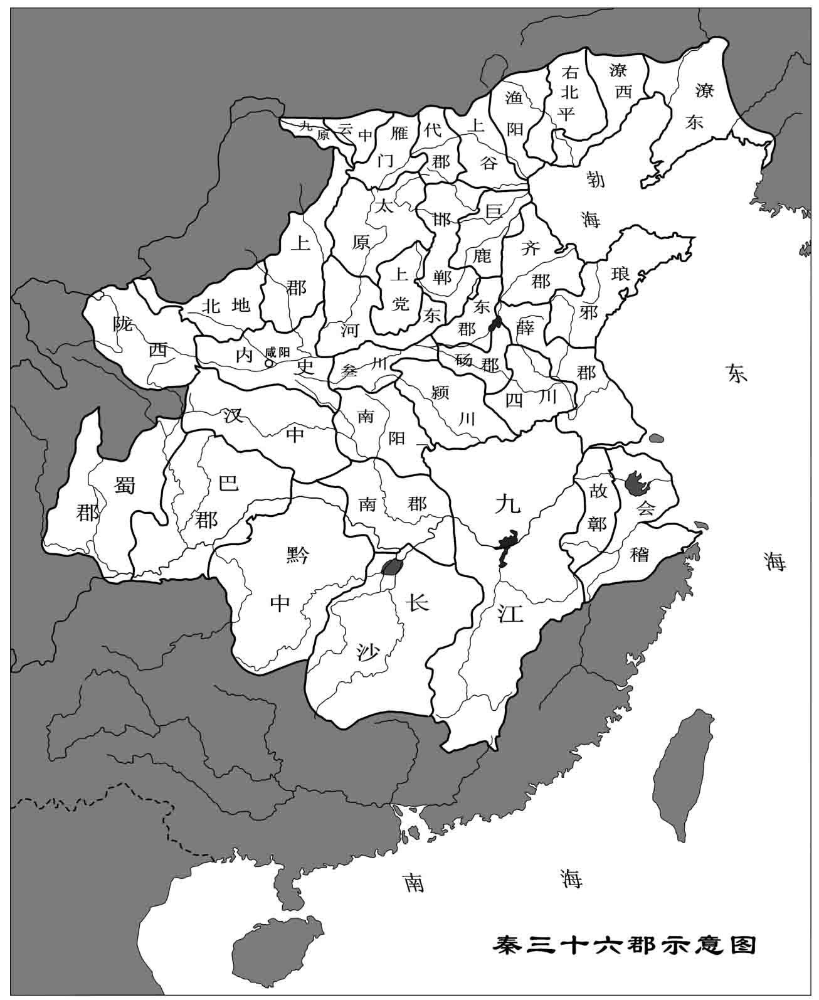

# 中国历史地理

[annotation]: [id] (20443446-b96b-4459-ac33-a7a9d61039a2)
[annotation]: [status] (private)
[annotation]: [create_time] (2021-09-08 18:30:35)
[annotation]: [category] (读书笔记)
[annotation]: [tags] (研究生课程|历史|地理)
[annotation]: [comments] (false)
[annotation]: [url] (http://blog.ccyg.studio/article/20443446-b96b-4459-ac33-a7a9d61039a2)

主讲教师：陈晓珊

----

## 中国历史政区与地方行政制度

一些主要的关键词：

- 九州五服
- 甸侯绥要荒
- 人和环境互动的关系
- 诸葛亮
- 喇家遗址
- 熵增原理：王朝的兴盛与衰落
- 郦道元 - 《水经注》
- 中国历史上三次人口大迁移：
    - 永嘉之乱：衣冠南渡
    - 安史之乱
    - 靖康之乱
- 分封制
    - 先秦
    - 西汉
    - 西晋
    - 明初
- 郡县制
- 体国经野 设官分职
- 李斯 嬴政 ->[秦王巡行]-> 秦皇岛
- 北狩 西狩 [逃难...]
- 灵渠

---

---

> **筹笔驿** [唐] 罗隐
> 
> 抛掷南阳为主忧，北征东讨尽良筹。
> 
> **时来天地皆同力，运去英雄不自由。**
> 
> 千里山河轻孺子，两朝冠剑恨谯周。
> 
> 唯馀岩下多情水，犹解年年傍驿流。

---

> 一扁舟，二**客商**，三四五六水手，扯起七八尺风帆，离九江，还有十里；
> 
> 十里运，九里香，八七六五号轮，仍走四三年旧道，只二日，胜似一年。

---

最后，老师放了一段秦腔 《未央宫》（斩韩信）的片段：

<iframe class="video" width="640" height="360" src="//player.bilibili.com/player.html?aid=15739713&bvid=BV1vx41177oq&cid=25631207&page=4" scrolling="no" border="0" frameborder="no" framespacing="0" allowfullscreen="true"> </iframe>

## 参考资料

- [韩茂莉 - 中国历史地理十五讲](https://book.douban.com/subject/26467045/)
