# 区块链技术及应用

[annotation]: [id] (a0385cf4-a2aa-4ce1-8af3-1fdf48500421)
[annotation]: [status] (private)
[annotation]: [create_time] (2021-09-06 17:37:51)
[annotation]: [category] (读书笔记)
[annotation]: [tags] (研究生课程|区块链|密码学)
[annotation]: [comments] (false)
[annotation]: [url] (http://blog.ccyg.studio/article/a0385cf4-a2aa-4ce1-8af3-1fdf48500421)

## 区块链概论

### 比特币的历史

2008年，一个化名为中本聪（Satoshi Nakamoto）的人公开发表了一篇叫作 [《比特币：一个点对点数字货币系统》(Bitcoin:A Peer-to-Peer Electronic Cash System)](https://bitcoin.org/bitcoin.pdf) 的论文，比特币从此出现在世人面前。中本聪结合之前发明的几种数字货币，如 b-money、HashCash等，创建了一个完全去中心化的货币系统，它不依赖于任何中央机构进行货币发行或者交易结算、验证。其最主要的创新在于利用分布式计算系统（被称为 **工作量证明 (POW Proof Of Work)** 算法）来组织 10 分钟一次的全局“选举”，使去中心化的网络形成对交易状态的共识。这个机制优雅地解决了双重支付问题，避免了货币能被多次消费的问题。之前，双重支付一直都是数字货币系统的弱点，以致不得不引入一个中央清算机构来完成交易清算。

比特币网络开始于2009年，它由基于中本聪发布的并被大量其他程序员修订过的核心客户端发展而来的。比特币发明以来，为比特币提供安全性和弹性保障的分布式计算已经实现了指数级的增长，现在其计算能力已超过了全世界最强大的超级计算机的处理能力。基于比特币与美元的汇率估算，比特币的全部市场容量介于 50 亿到 100 亿美元之间。比特币网络迄今处理的最大一笔交易额为 1.5 亿美元，瞬间就完成了传递和处理，并且没有产生任何费用。

中本聪自 2011 年 4 月起从公众视野中消失，将开发代码和建设网络的责任交给了一个活跃的志愿者小组。这个比特币背后的人（或者群体）的身份依然未知。但是，不管是中本聪还是任何其他人均无法对比特币系统进行控制，这个系统只依赖于完全透明的数学法则。发明本身是开创性的，并且已经在分布式计算、经济学、计量经济学等领域中产生了新的学科。

---

### 散列函数 

(sha-256) $\{0, 1\}^* \to \{0, 1\}^{256}$

- 单向性
- 抗碰撞
- 不可预测

---

### 块链结构




---

### 区块链特点

- 去中心化
- 集体维护
- 高度透明
- 去信任
- 匿名

---

共识机制解决了区块链如何在分布式场景下
**达成一致性** 的问题

- 工作量证明 (Proof of work POW) 机制
- 权益证明 (Proof of Stake, POS) 机制
- 股份授权证明 (Delegated Proof of Stake, DPOS) 机制
- 分布式一致性算法: PBFT, Raft

其他重要关键词：

- PBFT 拜占庭容错算法
- pasox 
- raft
- algorand
- Ouroboros
- 零知识证明

## 背景知识

### 哈希函数

- 输入：任意长度
- 输出：固定长度
- 效率：给定 $x$，$H(x)$ 容易计算

---

### 安全性要求

抗碰撞性：

给定 $H$，找两个不同的消息 $x,y$，使得 $H(x) = H(y)$，是计算上不可行的；

- 生日攻击
    - 是一般的攻击方法
    - 依赖 Hash 的长度
    - 提出必要的安全条件
    - 来源于生日问题：一个教室中最小应有多少学生，才能使 不小于 1/2

----

隐藏性质：

最小熵的定义：

$$H_\infty (X) \xlongequal{def} -\log(max_x Pr\{X=x\})$$

当 $r$ 取自一个高最小熵的概率分布，在给定 $H(r|x)$ 条件下确定 $x$ 是不可行的；

应用：承诺方案

- Com=Commit(msg, nonce)
- Verify(Com, msg, nonce)
- Hiding: 给定 Com，找不到 msg
- Binding：找不到 (msg, nonce), (msg', nonce') 使得 msg = msg', Commit(msg, nonce) = Commit(msg', nonce')

---

谜题友好：

对任意可能的 $n$ 比特输出值 $y$；当 $r$ 取自一个高最小熵的概率分布，找到 $x$，使得 $H(r||x) = y$，其事件与 $2^n$ 相当

----

### SHA-256 (Secure Hash Algorithm)

### SM3 算法

### Hash 应用

- 区块链中，每个区块指向上一个区块的值，并包含了该值的摘要
- 区块链的应用：防篡改日志；

### RSA 算法

参考 [RSA 算法原理](../3c22edc1-3de9-464d-9325-a589bd095968)

### 作业

RSA 的流程：找两个素数，写流程

---

**密钥生成的步骤**

1. 随机选择两个不相等的质数 $p$ 和 $q$；

> 取 $p=37$，$q=71$

---

2. 计算 $p$ 和 $q$ 的乘积 $n=p \cdot q$；

> $n = p \cdot q = 37 \times 71 = 2627$

---

3. 计算 $n$ 的欧拉函数 $\varphi(n) = (p - 1)(q - 1)$；

> $\varphi(n) = (p - 1)(q - 1) = 36 \times 70 = 2520$

---

4. 随机选择一个整数 $e$, 条件是 $1 < e < \varphi(n)$，且 $e$ 与 $\varphi(n)$ 互质；

> 假设选择了 $e = 23$

---

5. 计算 $e$ 对于 $\varphi(n)$ 的模反元素 $d$，即满足条件 $e \cdot d \equiv 1 \mod \varphi(n)$

上面的式子等价于 $e \cdot d = k \varphi(n) + 1$, $k \in \mathbb{Z}$

找 $d$ 的过程实际上是对以下方程的未知数 $(d, k)$ 求解：

> $e \cdot d+ \varphi(n)\cdot k = 1$

代入已知数得方程：

$23 d + 2520 k = 1$

这个方程可使用 **扩展欧几里得算法** 求解：

```python
def ext_euclid(e, phi):
    if phi == 0:
        return 1, 0, e

    x, y, q = ext_euclid(phi, e % phi)
    x, y = y, (x - (e // phi) * y)
    return x, y, q

print(ext_euclid(23, 2520))
```

得到一组解为 $(767, -7)$，即 $d=767$

---

6. 将 $n$ 和 $e$ 封装成公钥，$n$ 和 $d$ 封装成私钥；

$n = 2627$, $e=23$, $d=767$

所以，公钥就是 $(2627, 23)$，私钥就是 $(2627, 767)$

---

**加密和解密**

加密要用公钥 $(n, e)$, 计算下式：

> $m^e \equiv c\ ( \textrm{mod}\ n)$

假设 $m = 123$，那么可以得到如下等式：

$123^{23} \equiv  2264\ ( \textrm{mod}\ 2627)$

用 Python 代码来算就是 `c = (m ** e) % n`

现在就可以使用信道发送密文 $2264$ 了

----

假设信宿收到了密文 $2264$，现在要使用密钥 $(2627, 767)$ 来解密，可以证明，下式一定成立：

> $c^d \equiv m \ ( \textrm{mod}\ n)$

也就是说 `(c ** d) % n == m`，则

$m = c^d \textrm{mod}\ n = 2264^{767}\ \textrm{mod}\ 2627 = 123$

这样，接收方就获得了发送方发送的明文 $m = 123$；

至此，加密解密过程全部结束。

---

### RSA - DSA - ECDSA

- 《抽象代数》
- 《代数几何》
- 群-环-域
- 快速模幂算法
- 椭圆曲线
- 中国余数定理
- Koblitz 曲线
- SM3 算法
- SM2 算法

作业：DSA 流程

- 高飞币
- 财奴币

## 比特币协议

- 分布式共识：所有正确的节点都的到相同的值而结束，排除故障节点和恶意节点；

- Reaching Agreement in the Presence of Faults 
- The Byzantine Generals Problem

- 女巫攻击

> 随机性是安全性的保障；

----

一般的分布式共识：

- 所有正确的节点都得到相同的值而结束，
- 排除故障节点或恶意节点
- 此相同的值是某个正确节点得输入

## 比特币交易

- Compact Multi-signatures for smaller blockchains - Dan Boneh

---

- BLS 签名方案

## 参考资料

- Time, Clocks, and the Ordering of Events in a Distributed System  
    <https://lamport.azurewebsites.net/pubs/time-clocks.pdf>
- A Peer-to-Peer Electronic Cash System  
    <https://bitcoin.org/bitcoin.pdf>
- 《区块链-通往资产数字化之路》  
    <https://book.douban.com/subject/30180770/>
- The Science of the Blockchain  
    <https://book.douban.com/subject/26785096/>
- 《区块链核心算法解析》上面这本书的翻译  
    <https://book.douban.com/subject/27081206/>