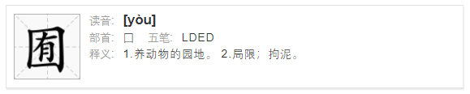
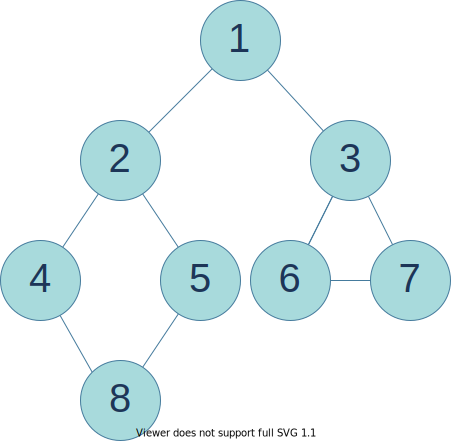
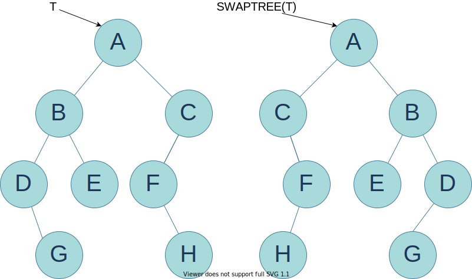
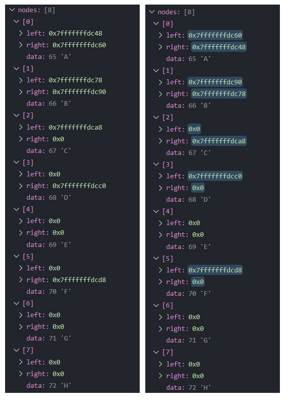

# 算法设计与分析

[annotation]: [id] (6a208dc4-6d3b-4ce2-bd82-d6856eab1ff3)
[annotation]: [status] (public)
[annotation]: [create_time] (2021-09-07 10:21:33)
[annotation]: [category] (读书笔记)
[annotation]: [tags] (研究生课程|算法)
[annotation]: [comments] (true)
[annotation]: [url] (http://blog.ccyg.studio/article/6a208dc4-6d3b-4ce2-bd82-d6856eab1ff3)

主讲教师：马丙鹏 马菲菲

考核方式：

- 作业 20%
- 上课 10%
- 笔试 70%

## 绪论

- 人机大战 / 2016 年 3 月，阿尔法狗战胜李世石

* 算法是计算机软件的灵魂
* 算法是计算机科学的核心
* 国家科技综合实力的体现

---

算法设计的目的：

- 好奇心的需要：人们热衷于寻找不同的方法解决各种各样的问题
- 研究的需要：
    - 性质不同：稳定/不稳定
    - 性能不同：速度，空间
    - 适用场合不同
- 应用的需要：没有万能的算法适用于所有的应用


----

学习算法的收获：

* 积累经验
* 训练编程
* 训练思维
    * 严谨、科学的逻辑推理能力
    * 培养计算机系统观
    * 计算机求解问题的能力

----

### 算法的定义和特性

算法是解一 **确定类问题** 的任意一种 **特殊的方法**

算法是一组 **有穷的规则**，它规定了解决某一**特定类型问题**的一系列运算

- 算法：
    - 数值计算：求解数值问题，插值计算
    - 非数值计算

算法早于计算机出现

--- 

算法的五个重要特性：：

- 确定性
- 可行性 （能行性）<- 我觉得这个词好别扭
- 输入：可能没有
- 输出：至少有一个
- 有穷性

---

课程的主要任务：

- 设计算法
- 表示算法
- 确认算法
- 分析算法
- 测试程序



[感觉这个流程图画了个寂寞]

---

### 复杂性分析初步

计算的约定

算法的执行时间：

$$T=\sum F_i \cdot t_i$$

其中：

- $F_i$ 是运算 $i$ 执行的 **频率计数**
- $t_i$ 是运算 $i$ 执行的时间

---

- 时间囿界于常数的运算
    - 执行时间是固定量，与操作数无关
- 时间非囿界于常数的运算
    - 运行时间是其包含的所有基本运算的执行时间之和
    - 可将其分解为若干时间囿界于常数的运算



然而，我没有找到 **囿界** 这个词的定义，但是从字面意思理解，应该是和某常量差不多的意思；

----

在不同的数据配置上，同一算法有不同的执行情况，可分为 **最好**、**最坏** 和 **平均** 等情况讨论；[信息会影响决策]

---

算法的分析步骤：

- 事前分析：
    - 时间分析
    - 空间分析
- 事后分析：
    - 直接与物理实现有关
    - 分析手段：作时空性能分布图

算法分析主要集中于 **与物理实现无关** 的 **事前分析** 阶段，也就是获取算法的时间复杂度和空间复杂度。

---

一般更关心算法的 **最坏时间** 执行时间，是算法渐进执行时间的上界，用 $O$ 来表示；

下界用 $\Omega$ 表示

如果上界和下届相等 则用 $\Theta$ 表示

> 渐进时间复杂度，我觉得是求 $n \to \infty$ 时，算法的极限，**渐进** 就是 **趋于无穷** 的这个过程；

### 递归

程序调用自身的编程技巧称为递归(recursion)，包括直接或简介调用自身。

它通常把一个 **大型复杂的问题** 层层 **转化为** 一个与原问题 **相似的** **规模较小的问题** 来求解，递归策略只需少量的程序就可描述出解题过程所需要的多次重复计算，大大地减少了程序的代码量；

递归调用的堆栈操作的问题，主要有两方面：

- 一方面，任何函数调用时需要将指令指针入栈，也就是函数执行完成之后，需要执行的下一条指令的地址，这样函数返回时就可以通过这个地址找到相应的位置了。
- 另一方面，递归函数中如果有局部变量，这些局部变量也是需要存储在栈中的，所以如果递归过多可能会造成堆栈溢出；

于是，一般情况下，递归会比非递归算法更加低效。

---

递归算法设计：

定义：**树** 是一个或多个结点的有限集合，它使得：

- 有一个指定为根(root)的结点
- 剩余结点被划分成 $m \geqslant 0$ 个不相交的集合：$T_1,\cdots, T_m$, 这些集合的每一个又都是一棵树，并称 $T_1,\cdots, T_m$ 为根的子树

定义：**二叉树**（二元树）是结点的有限集合：

- 它或者为空
- 或者由一个根和两棵称为左子树和右子树的不相交二叉树所组成

```cpp
int P(参数表)
{
    if(递归出口)
    {
        简单操作;
    }
    else
    {
        一种简单操作;
        P(递归参数);
        另一种简单操作;
    }
}
```

相关问题：

- 阶乘
- 斐波那契数列  
    $F_0 = F_1 = 1; F_i = F_{i - 1} + F_{i-2} \ (i > 1)$
- 最大公因数 / 辗转相除法
- 汉诺塔问题
- 棋子移动问题
- 01 背包问题 knap

## 图与遍历算法

- 栈和队列
- 树
- 二叉树（二元树）
- 堆（优先队列）

---

### 集合操作

- 方法一：位向量   
    当 $n$ 很大，而每个集合的大小相对于 $n$ 来说又很小时，并或者交的 执行时间不是与两个集合中的元素数目成正比，而不是与 $n$ 成正比
- 方法二：集合元素表
    - 合并操作：无序 $|s_1| \times |s_2|$，有序 $|s_1| + |s_2|$
    - 查找操作：与集合长度的和成正比，最坏为 $|n|$
- 方法三：树
    - 直接称为另一棵树的子树，[重复元素？]
    - U 和 F 的性能问题 --> 退化树
    - 加权规则：节点少 -> 节点多
    - 压缩规则

> 引理 2.3 设 $T$ 是一棵由算法 Union 所产生的有 $n$ 个节点的树；在 $T$ 中没有节点的级数会大于 $\inf \log n + 1$

### 图的遍历算法

- 检索：以某种方法检查给定的数据对象，找出满足某些给定性质的结点的过程称为检索
- 遍历：当检索过程必须检索到数据对象的每一个结点时，则该检索过程称为遍历
- 访问：当算法对一个结点的信息段进行处理时，称该结点被访问

---

- 二叉树的遍历
    - 先根遍历
    - 中根遍历
    - 后根遍历

----

> 定理 2.1 当输入的树 $T$ 有 $n≥0$ 个结点时，设 $t(n)$ 和 $s(n)$ 分别表示这些遍历算法中的任意一个算法所需要的最大 **时间** 和 **空间**；如果访问一个结点所需要的时间和空间是 $Θ(1)$，则 $t(n)=Θ(n)$， $s(n)=Θ(n)$

证明：使用数学归纳法

---

- 广度（宽度）优先搜索
- 广度（宽度）优先生成树
- 深度优先搜索
- 深度优先生成树
- D_Search：广度优先搜索使用栈来存储带检测数据，这样检索的过程就变成了深度优先搜索

> 深度优先搜索以递归实现同样需要用到栈，D_Search 这样只是将程序栈替换到了自己维护的栈，所以算法的结构上是一样的。

---

作业

> 注：当算法访问了邻接于某结点的所有结点时，称该结点被 **检测** 了



- 以 $v_1$ 为起点，写出 **BFS** 的结点检测顺序

答：

> 1 --> 2 --> 3 --> 4 --> 5 --> 6 --> 7 --> 8

- 以 $v_2$ 为起点，写出 **DFS** 的结点检测顺序

答：

> 5 --> 8 --> 4 --> 7 --> 6 --> 3 --> 1 --> 2

- 以 $v_8$ 为起点，写出 **D_Search** 的结点检测顺序和结点访问顺序

答：

访问顺序：

> 8 --> 4 --> 5 --> 2 --> 1 --> 3 --> 6 --> 7

检测顺序：

> 8 --> 5 --> 2 --> 1 --> 3 --> 7 --> 6 --> 4

----

参考中根遍历方法，用伪代码实现一个求二元树的镜像树的算法SWAPTREE(T)。下图给出了一棵二元树和它的镜像树



代码如下：

```cpp
struct node_t
{
    node_t *left;
    node_t *right;
    char data;
};

#define NODE_INDEX(letter) (letter - 'A')

void SWAPTREE(node_t *tree)
{
    if (tree == nullptr)
        return;

    SWAPTREE(tree->left);

    node_t *temp = tree->right;
    tree->right = tree->left;
    tree->left = temp;

    SWAPTREE(tree->left);
}

int main(int argc, char const *argv[])
{
    const int NODE_LENGTH = 8;
    node_t nodes[NODE_LENGTH];

    for (char i = 0; i < NODE_LENGTH; i++)
    {
        node_t *node = &nodes[i];
        node->data = 'A' + i;
        node->left = nullptr;
        node->right = nullptr;
    }

    nodes[NODE_INDEX('A')].left = &nodes[NODE_INDEX('B')];
    nodes[NODE_INDEX('A')].right = &nodes[NODE_INDEX('C')];

    nodes[NODE_INDEX('B')].left = &nodes[NODE_INDEX('D')];
    nodes[NODE_INDEX('B')].right = &nodes[NODE_INDEX('E')];

    nodes[NODE_INDEX('D')].right = &nodes[NODE_INDEX('G')];

    nodes[NODE_INDEX('C')].left = &nodes[NODE_INDEX('F')];

    nodes[NODE_INDEX('F')].right = &nodes[NODE_INDEX('H')];

    SWAPTREE(nodes);

    return 0;
}
```

以下为，运行前后的内存检测对比，证明算法有效；



---

### 双连通图与网络可靠性

- 关节点：去掉该节点，使得图变成了多个子图的节点；
- 双连通图
    - 判断双连通：寻找关节点？
- 双连通分图：最大双连通子图称为双连通分图
  
---

双连通分图的性质：

- 双连通图只有一个双连通分图，就是它自身
- 两个双连通分图至多有一个公共节点，且这个节点是关节点
- 任何一条边不可能同时在两个不同的连通分图中

---

问题一：如何把一个非双连通的无向连通图变成双连通图？

答：通过加边，使双连通分图间有其他的边相连接

对每个关节点，对双连通分图进行连接

如果 $G$ 有 $p$ 个关节点，而与每个 TODO: ……

---

问题二：如何识别图 $G$ 的关节点和双连通分图？

- 树边：构成 $G$ 深度优先生成树的边
- 逆边：不在生成树中的边

深度优先生成树的性质：

- 性质1：TODO:
- 交叉边：设 $(u, v)\in E$，TODO:
- 性质二：
    - 如果有限生成树的根有两个儿子，则根是关节点
    - TODO:...

关节点判定条件：

如果 $u$ 不是根，那么当且仅当 $u$ 有一个儿子 $w$，使得 $L(w) \geqslant DFN(u)$时，$u$ 是一个关节点

### 决策树（对策树）

就是研究个体如何在错综复杂的相互影响中做出最合理的策略；

$\alpha - \beta$ 截断规则，剪枝算法；

## 分治法

- 分治思想
- 分治策略的抽象化控制
- DANDC 的计算时间

### 二分检索

在有序顺序表中，判断给定的 $x$ 是否出现；   

二元比较树：

- 内节点：代表一次元素比较用圆形节点表示存放一个 mid 值下标代表成功检索的情况
- 外界点：表示不成功检索的情况
- 路径：比较的元素的序列

### 找最大和最小元素

可以使用分治法来求解，这样时间复杂度可有线性比较的 $O(2n)$ 变成 $O({3\over 2} n)$

---

## 参考资料

- [算法导论](https://book.douban.com/subject/20432061/)
- [计算机算法基础](https://book.douban.com/subject/1815995/)  
    这本书只看豆瓣评价，感觉好辣鸡啊！！！
