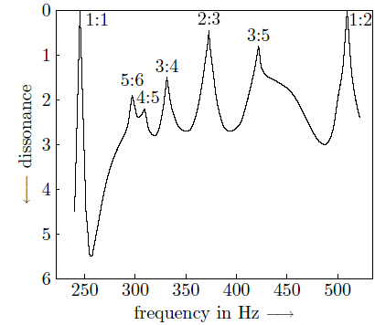
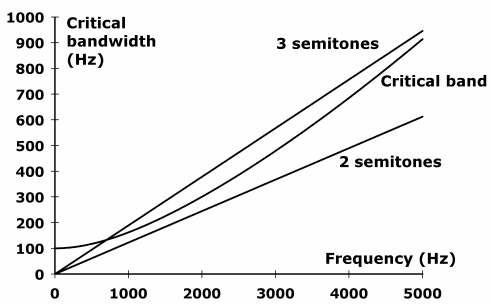

# 音高与听觉的关系 [转]

[annotation]: <id> (9afc048e-19bf-421d-9d1b-b0709bf768a7)
[annotation]: <status> (public)
[annotation]: <create_time> (2019-04-25 10:57:45)
[annotation]: <category> (音乐理论)
[annotation]: <comments> (true)

> 原文链接：<http://blog.ccyg.studio/article/9afc048e-19bf-421d-9d1b-b0709bf768a7>

---

## 关于音律

人的听觉和很多音乐设备的频率范围是 20 Hz ~ 20000 Hz，但是成年人一般只能听到 30 ~ 15000 Hz，所以上面表格的频率范围已经足够用了。

上次说到现在最通用的音阶是把一个八度的倍频等比分为 12 份，那么为什么要这么做呢？在开始讲这个之前，先看两条人民群众总结的规律：

- 人耳对音高的感觉主要取决于频率比，而不是频率差。比如 220 Hz 到 440 Hz 的音差，和 440 Hz 到 880 Hz 的音差，一般人认为是一样大的音差。

- 如果两个音的频率比值很接近小整数比，那么这两个音同时发出来人会感觉很和谐。比如 440 Hz 和 660 Hz 的两个音，频率比值是 2:3，一般叫做完全五度，同时发出来很和谐。

至于为什么有以上的规律，这个问题太深刻了，折磨了一代又一代的音乐家、数学家、物理学家、心理学家、生理学家、哲学家……这里不深入说了，就把它们当作公理好了。下面是某个测试人对各种频率比评价的结果，峰越高表示人觉得越和谐。可以看见，1:1 1:2 是很和谐的，接下来是 2:3 3:5 3:4 等小整数比。（这张图的出处不祥，应该是某个论文或者教科书。）

有了上述公理，怎么样来定音阶？早在公元前，伟大的毕达哥拉斯就发现了小整数频率比很和谐的规律。首先最简单的整数比是 1:2，接下来分别是 2:3 和 3:4，于是他先定出四个音（按照现在的写法）：F:C=4:3，G:C=3:2，高八度C’:C=2:1。然后他把 F 和 G 之间的间隔 9:8 叫做一个全音，按照 9:8 全音间隔填补空档他定下来这样的音阶：

C:C = 1:1 = 1.0000
D:C = 9:8 = 1.1250
E:C = 81:64 = 1.2656
F:C = 4:3 = 1.3333
G:C = 3:2 = 1.5000
A:C = 27:16 = 1.6875
B:C = 243:128 = 1.8984
C’:C = 2:1 = 2.0000

可以看到 E:F 和 B:C’ 之间的间隔是 256:243 = 1.0535，差不多是 9:8 的一半，毕达哥拉斯把这种间隔叫做半音。这样定出来的音阶其实已经蛮好用的了，现在把这种用整数比定音的方法叫做纯律（just intonation）。纯律的主要问题是有些音之间的比例很古怪，比如上面的 F:D 是 32:27，非常不和谐。另外，巴赫同学后来出了各种奇怪变调的钢琴曲，而纯律变调之后音阶就变了，于是巴赫就开始鼓吹当时已经建立起来的平均律（equal temperament）了。

平均律沿用了这种七个基本音的全音阶（diatonic scale）系统，但是让全音刚好等于两个半音，这样无论如何变调，整个音阶只要偏移一下即可，而各个音之间音程不变。我们知道，一个八度之间是 5 个全音间隔 + 2 个半音间隔，也就是 12 个半音间隔，于是就一刀切，直接把 2 等比分 12 份就是半音间隔了。下面是十二平均律（12-TET）和毕达哥拉斯的纯律的对比：

| 音程|纯律 |十二平均律 |
| :-: | :-: | :-: |
| C:C|1.0000| 1.0000 |
|D:C|1.1250|1.1225|
|E:C|1.2656|1.2599|
|F:C|1.3333|1.3348|
|G:C|1.5000|1.4983|
|A:C|1.6875|1.6818|
|B:C|1.8984|1.8877|
|C’:C|2.0000|2.0000|

可以看到，十二平均律和纯律很接近，特别是 F:C 完全四度和 G:C 完全五度非常接近应有的整数比 4:3 和 3:2，只相差 2 个音分（cents）。一般没有受过音乐训练的人对 20 音分以下的音差已经不敏感；即使专业调音师，不靠仪器的话 5 个音分也基本是分辨极限了。所以在实际使用中，十二平均律对完全五度这么小的误差是完全可以忽略的。

理论上说，如果把 2 等比分为别的份数，也可以制造出可用的音阶。一个例子是等比分为 29 份，这样出来的音阶比 12-TET 更接近 3:2，但是大三度 5:4 却惨不忍睹，相差很大。一个小细节是有些音程是互补的，比如某个平均律如果很接近 G:C 3:2 完全五度，那么 C’:G 4:3 完全四度也同时被搞定。一般人们评价一个平均律，主要看它和大三度、完全五度、大六度的偏差总和（同时搞定的互补音程为小六度、完全四度、小三度），计算表明，比十二平均律更好的下一个音律是十九平均律，接下去更好的分别是 31、34 和 53。可以想象，即使是十九平均律，钢琴键盘也会复杂很多，而且由于多了很多音，不和谐的音高组合也会更多，所以非十二等分的平均律使用很有限，现在一般只局限在理论研究上。

中国古代各类弦乐器五声音阶宫商角徵羽按照五度相生律定音，演奏起来非常优美。五度相生律可以算是纯律的一种，中国人发现这个小整数比的规律应该比毕达哥拉斯早好多年。不过到了现代，特别是键盘乐器的普及以及大型乐队的配合需要，最后还是十二平均律胜出了。

## 关于音程

为什么小整数频率比的两个音比较和谐？这个问题，要从乐音的谐波说起。

一般乐器发出的音都不是纯频率的音，而是由好多谐波（harmonic）组成的；其中频率最低的那个通常最强，叫做基音。比如小提琴发出音高 A4 的音，指的就是其基音是 440 Hz，而声波频谱里面同时有二次谐波 880 Hz、三次谐波 1320 Hz、四次谐波……等等。不同乐器发出的声音，其谐波强度分布往往完全不同，因此音色（timbre）也就不同（比如高谐波强的话听起来就亮一些）。乐音含有谐波这个特性和小整数比的和音规则有什么关系？以完全五度举例，A4 和 E5 的两个乐音，频率比为 2:3，而 A4 的三次谐波和 E5 的二次谐波刚好重合，都是 1320 Hz。相隔完全五度的两个乐音同时听起来比较好听，是不是因为它们大部分的谐波都重合了？

于是就有科学家做实验了。人们发现，把纯频率的音（不含谐波）A4 和 E5 同时发出来听并不怎么好听。还有人用电脑制作了扭曲的乐音，把 N 次谐波搞成 $N\frac{log(2.1)}{log(2)}$ 倍（谐波从 2 倍拉宽到 2.1 倍，自然界是没有这种声音的），然后发现谐波重合的扭曲乐音同时听起来还比较和谐，而它们的基音却不是小整数比了。还有一些别的实验，但是结论都是差不多的，就是两个乐音和谐主要是因为他们的谐波重合，转换为数学语言，就是基音必须是小整数比。

为啥谐波重合就好听呢？这是因为，如果谐波不重合但是距离很近，它们就会干涉形成低频率的拍（beat），这种低频拍音嗡嗡作响，非常难听。两个频率距离多近才会形成不好听的拍？人们一般把这个临界距离叫做临界频宽（critical bandwidth），处于临界频宽之内的两个频率就会互相干涉。这个临界频宽本身是频率的函数，频率越高，临界频宽带也就越宽，如下图所示：

可以看到，临界频宽在低频区是 100 Hz 左右；高频区大约是本身频率的 1/6。比如，900 Hz 的临界频宽是 150 Hz，这就是说，750 – 1050 Hz 频率范围内的音都会和 900 Hz 的音干涉。用音乐术语，1/6 频宽介于大二度和小三度之间（上图所示 2&3 semitones 之间），所以在高频区域里，间隔一个或者两个半音的音就会相互干涉形成不愉悦的拍。

乐音的高谐波排列非常紧密，比如 A4 的 10 次谐波和 11 次谐波分别是 4.4 kHz 4.84 kHz，间隔不到两个半音，所以高谐波之间就会相互干涉。如果对小提琴乐音做频谱分析，会发现它有很多谐波强度很弱，造成的结果是各个强谐波之间间隔都比较大，不在互相的临界频宽内，所以小提琴乐音本身极少有难听的拍，这也正是小提琴乐音很好听的原因之一。有些乐器音高很准，但是发出声音很难听，可能就是因为它自己有很多谐波互相打架，形成很多低频拍，听起来很难受。

那么为什么低频的拍听起来难听呢？有人认为这和人耳的解剖学结构有关。匈牙利生物物理学家 Georg von Békésy 发现人的耳蜗里有很多小毛毛，功能是把外界声波在内耳液体中产生的振动转换为神经电信号，而且耳蜗的特殊生理结构导致每根小毛毛只对一小段频率的振动敏感。也就是说，耳蜗就是一个频谱分析仪；而小毛毛的敏感频率段，差不多就是相应频率的临界频宽。好的乐音因为没有互相打架的拍频，小毛毛们都会做优美的简谐运动，人就会觉得很愉快；相反，如果临界频宽内有两个频率的声音，有一些小毛毛就会受到两种频率的影响，运动起来比较别扭，所以人也觉得不怎么愉快。Békésy 这个发现是得了诺贝尔医学奖的，不过后来进一步的研究发现虽然他的理论基本成立，但是数据并不正确，主要是因为 Békésy 是拿死人耳朵做实验的，因为尸体失水，耳朵的频率响应也非常不同。不过炸药奖发了就发了，也收不回了，Békésy 本人在晚年也否定了自己早期的一些研究。

如果还有人偏要问到底，为什么耳蜗里小毛毛运动别扭，人就觉得难受呢？有些问题呢，它就是没什么道理的。好不好听这本身就是个主观的问题，如果你偏要问为什么，那估计就只好把你的脑袋砸开来研究了……现代脑科学的研究已经越来越科学，越来越定量化，但是像乐音和谐度这类宏观问题上，基本上也只有一些假说，信仰假说的人多了，也就成了学派。有些哲学家对脑科学前景非常悲观，认为人自己的主观意志去研究自己的主观意志，是很难有结果的。这个说法倒是过于杞人忧天了，目前人类对脑子的了解还远远不够，可以研究的东西还多得很，不过也许在遥远的未来，人就真的要面对无法继续研究自己的问题了。

说了这么多，可千万不要以为知道了一个小整数比就可以谱曲了。翻开和声学，你会发现正统的和声规则要复杂得多，甚至用什么乐器来演奏，调起多高，是小型音乐厅还是露天演奏，等等都是需要考虑的因素。几百年前就有很多音乐家搞出各类奇奇怪怪的规则，而现代人类更是从胎教开始就逐渐接受正统的规则，作曲人即使没有受过专业训练也会在潜移默化中将这些规律继续发扬光大。事实上音乐制作已经在人类社会中形成了巨大的正反馈，某些和声规则逐渐被强化。原始部落的人们听到贝多芬的曲子，并不会神魂颠倒。所以说，可能也只有最朴素的小整数比和声规律还有一定的生理基础，现在复杂的和声学则基本上算是美学，没有道理可言。我曾经看到有人对着乐谱做傅立叶分析，研究为什么某些和声听起来好听。挺美好的音乐，偏偏硬要去扣个科学的帽子，我想说，你从小就是听这些和声规则长大的，能不觉得好听么……

## 最后的整理

[Fang](http://yunfang.net/fang/) 在《[写作的重要性](http://fangwu.blogspot.com/2005/09/blog-post.html)》一文中提到：看完书不写读后就好像做完题目不写成 paper，不是好习惯。在这个方针的指引下，我在过去几年看的音乐方面的书该摘录的前面三篇差不多写完了，这里补点小问题作个尾巴吧。

音高感知：比较流行的理论是，几百赫兹以下大脑是直接数周期来确定音高的，1600 Hz 以上则主要靠内耳频谱分析，中间频率段两种机制都在起作用。

声源定位：人有俩耳朵，定位声源主要靠分辨声音到达耳朵的时间差。比较令人惊讶的是，虽然声音感知的神经脉冲有 100 微秒，但是人可以分辨的时间差在 10 微秒的量级。另外，左右耳的声强和频谱对比也对判断声源有帮助，比如，右边来的声音在右耳听起来会亮一些，因为声波经过圆型头部的时候高频被吸收得多。

还有一个有趣的现象是声源的上下定位。人即使不移动脑袋，也是可以感觉到正前方声源的上下位置的，而这种声源对左右耳完全对称，因此也不可能用左右耳差异来判断位置。实验发现，如果堵上耳朵或者改变耳廓形状，人的声源上下定位能力就会减弱或者消失。流行理论是人对预定声音的频谱会有记忆，而声源上下移动会在耳廓上产生不同的反射模式，特别会影响高频部分的频谱，人估计就是从高频频谱里得到声源位置的暗示的。实验也发现，如果编造不熟悉的声音，人对声源高度的判断就不会那么准确了。

另外，一般在房间里声源到接受者耳朵里不光有直接声波还有大量墙壁和地面的反射波。首先，人会选取最先听到的直接声波判断出声源的位置；其次，人也会利用反射波的信息来感知房间大小。实验发现，如果把房间墙壁搞成完全吸收声波，哪怕再小的房间人也不会感觉到房间很小（当然这个实验需要把人眼睛蒙起来）。

鸡尾酒会效应：Cocktail party effect，听觉系统的一种选择能力。在鸡尾酒会上即使周围噪声很大，我们还是可以听到朋友说的内容。听音乐时，人如果专注于一样乐器，也可以跟随那个乐器的声音。这种能把注意力集中在某个声音上的现象就是鸡尾酒会效应，这和视觉里人可以在纷乱的背景中看出熟悉的图形可能是类似的机制。大凡自然界的声音、人声和乐器都会略有噪音和瑕疵，实验发现人对声音里面这种瑕疵非常敏感，这也很可能是人分辨相近声音的主要线索。两个人说话或者两种乐器演奏，频谱一般有很明显的不同，所以人能分辨出来并不奇怪；两把几乎相同的小提琴一起演奏，人还是可以听出有两把小提琴，这是因为两个乐器各有各的瑕疵，演奏的人也可能技巧略有不同。电子合成的乐音如果不加瑕疵，听起来很机械，完全没有美感，两个不加瑕疵的电子小提琴一起演奏，人是分辨不出来的。可见完美的世界并不美好，我们需要一定的个性才能让这个世界变得有趣。

最后推荐一本书 Music, Cognition, and Computerized Sound:  An Introduction to Psychoacoustics，这本书是 Stanford Center for Computer Research in Music and Acoustics ([CCRMA](http://ccrma.stanford.edu/index.html)) 的一帮人根据教学经历整理的。这个多学科研究中心集结了音乐、计算机、电子和机械工程、物理和心理方面的大牛，成立多年虽无重大突破，但是成功改变了过去各个学科独自研究音乐的局面，算是在这个交叉学科领域走出了重要的一步。

> 长大了，去了很远的地方，却依然捉不住月亮

## 参考资料

- <https://blog.wuxinan.net/archives/171>
- <https://blog.wuxinan.net/archives/272>
- <https://blog.wuxinan.net/archives/287>
