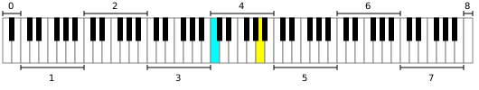

# 音高和频率的关系

[annotation]: <id> (be12c2ee-d47c-4098-9782-ca76da3035e4)
[annotation]: <status> (public)
[annotation]: <create_time> (2019-04-24 18:56:37)
[annotation]: <category> (音乐理论)
[annotation]: <comments> (true)

> 原文链接：<http://blog.ccyg.studio/article/be12c2ee-d47c-4098-9782-ca76da3035e4>

---

音高和频率的转换表如下，此表基于钢琴频率，换句话说，基于十二平均律。标准音高 $A_4 = 440Hz$。如果钢琴使用纯律，则会有些不同。

<table style="max-width: 800px; font-size: 0.7rem;">
    <caption>
        基础频率与音高关系表
    </caption>
    <tbody>
        <tr>
            <th>
                
Octave

                
Note

            </th>
            <th>−1</th>
            <th>0</th>
            <th>1</th>
            <th>2</th>
            <th>3</th>
            <th>4</th>
            <th>5</th>
            <th>6</th>
            <th>7</th>
            <th>8</th>
            <th>9</th>
            <th>10
            </th>
        </tr>
        <tr>
            <th>C
            </th>
            <td>8.1758 (0)</td>
            <td>16.352 (12)</td>
            <td>32.703 (24)</td>
            <td>65.406 (36)</td>
            <td>130.81 (48)</td>
            <td style="background-color:#0ff">261.63 (60)</td>
            <td>523.25 (72)</td>
            <td>1046.5 (84)</td>
            <td>2093.0 (96)</td>
            <td>4186.0 (108)</td>
            <td>8372.0 (120)</td>
            <td>16744 ()<i></i>
            </td>
        </tr>
        <tr>
            <th>C♯/D♭
            </th>
            <td>8.6620 (1)</td>
            <td>17.324 (13)</td>
            <td>34.648 (25)</td>
            <td>69.296 (37)</td>
            <td>138.59 (49)</td>
            <td>277.18 (61)</td>
            <td>554.37 (73)</td>
            <td>1108.7 (85)</td>
            <td>2217.5 (97)</td>
            <td>4434.9 (109)</td>
            <td>8869.8 (121)</td>
            <td>17740 ()<i></i>
            </td>
        </tr>
        <tr>
            <th>D
            </th>
            <td>9.1770 (2)</td>
            <td>18.354 (14)</td>
            <td>36.708 (26)</td>
            <td>73.416 (38)</td>
            <td>146.83 (50)</td>
            <td>293.66 (62)</td>
            <td>587.33 (74)</td>
            <td>1174.7 (86)</td>
            <td>2349.3 (98)</td>
            <td>4698.6 (110)</td>
            <td>9397.3 (122)</td>
            <td>18795 ()<i></i>
            </td>
        </tr>
        <tr>
            <th>E♭/D♯
            </th>
            <td>9.7227 (3)</td>
            <td>19.445 (15)</td>
            <td>38.891 (27)</td>
            <td>77.782 (39)</td>
            <td>155.56 (51)</td>
            <td>311.13 (63)</td>
            <td>622.25 (75)</td>
            <td>1244.5 (87)</td>
            <td>2489.0 (99)</td>
            <td>4978.0 (111)</td>
            <td>9956.1 (123)</td>
            <td>19912 ()<i></i>
            </td>
        </tr>
        <tr>
            <th>E
            </th>
            <td>10.301 (4)</td>
            <td>20.602 (16)</td>
            <td>41.203 (28)</td>
            <td>82.407 (40)</td>
            <td>164.81 (52)</td>
            <td>329.63 (64)</td>
            <td>659.26 (76)</td>
            <td>1318.5 (88)</td>
            <td>2637.0 (100)</td>
            <td>5274.0 (112)</td>
            <td>10548 (124)</td>
            <td>21096 ()<i></i>
            </td>
        </tr>
        <tr>
            <th>F
            </th>
            <td>10.914 (5)</td>
            <td>21.827 (17)</td>
            <td>43.654 (29)</td>
            <td>87.307 (41)</td>
            <td>174.61 (53)</td>
            <td>349.23 (65)</td>
            <td>698.46 (77)</td>
            <td>1396.9 (89)</td>
            <td>2793.8 (101)</td>
            <td>5587.7 (113)</td>
            <td>11175 (125)</td>
            <td>22351 ()<i></i>
            </td>
        </tr>
        <tr>
            <th>F♯/G♭
            </th>
            <td>11.563 (6)</td>
            <td>23.125 (18)</td>
            <td>46.249 (30)</td>
            <td>92.499 (42)</td>
            <td>185.00 (54)</td>
            <td>369.99 (66)</td>
            <td>739.99 (78)</td>
            <td>1480.0 (90)</td>
            <td>2960.0 (102)</td>
            <td>5919.9 (114)</td>
            <td>11840 (126)</td>
            <td>23680 ()<i></i>
            </td>
        </tr>
        <tr>
            <th>G
            </th>
            <td>12.250 (7)</td>
            <td>24.500 (19)</td>
            <td>48.999 (31)</td>
            <td>97.999 (43)</td>
            <td>196.00 (55)</td>
            <td>392.00 (67)</td>
            <td>783.99 (79)</td>
            <td>1568.0 (91)</td>
            <td>3136.0 (103)</td>
            <td>6271.9 (115)</td>
            <td>12544 (127)</td>
            <td>25088 ()<i></i>
            </td>
        </tr>
        <tr>
            <th>A♭/G♯
            </th>
            <td>12.979 (8)</td>
            <td>25.957 (20)</td>
            <td>51.913 (32)</td>
            <td>103.83 (44)</td>
            <td>207.65 (56)</td>
            <td>415.30 (68)</td>
            <td>830.61 (80)</td>
            <td>1661.2 (92)</td>
            <td>3322.4 (104)</td>
            <td>6644.9 (116)
            </td>
            <td>13290 ()</td>
            <td>26580 ()<i></i>
            </td>
        </tr>
        <tr>
            <th>A
            </th>
            <td>13.750 (9)</td>
            <td>27.500 (21)</td>
            <td>55.000 (33)</td>
            <td>110.00 (45)</td>
            <td>220.00 (57)</td>
            <td style="background-color:#ff0">440.00 (69)</td>
            <td>880.00 (81)</td>
            <td>1760.0 (93)</td>
            <td>3520.0 (105)</td>
            <td>7040.0 (117)</td>
            <td>14080 ()</td>
            <td>28160 ()<i></i>
            </td>
        </tr>
        <tr>
            <th>B♭/A♯
            </th>
            <td>14.568 (10)</td>
            <td>29.135 (22)</td>
            <td>58.270 (34)</td>
            <td>116.54 (46)</td>
            <td>233.08 (58)</td>
            <td>466.16 (70)</td>
            <td>932.33 (82)</td>
            <td>1864.7 (94)</td>
            <td>3729.3 (106)</td>
            <td>7458.6 (118)
            </td>
            <td>14917 ()</td>
            <td>29834 ()<i></i>
            </td>
        </tr>
        <tr>
            <th>B
            </th>
            <td>15.434 (11)</td>
            <td>30.868 (23)</td>
            <td>61.735 (35)</td>
            <td>123.47 (47)</td>
            <td>246.94 (59)</td>
            <td>493.88 (71)</td>
            <td>987.77 (83)</td>
            <td>1975.5 (95)</td>
            <td>3951.1 (107)</td>
            <td>7902.1 (119)
            </td>
            <td>15804 ()</td>
            <td>31609 ()<i></i>
            </td>
        </tr>
    </tbody>
</table>

下面是对此表的一些解释：

- 横向表示八度 Octave
- 纵向表示音符 Note
- 上面表示频率
- 下面括号里的数字表示MIDI的音符

下面是钢琴键盘，中央$C_4$ 和标准音 $A_4$ 以颜色与表中对应。

标准88键钢琴键盘如上图所示，从0到8分为9各组。这些组与乐理中对钢琴分组略有不同，如下所示：

1. 大字二组，用 $A_2, B_2$ 表示
2. 大字一组，用 $C_1 \cdots B_1$ 表示
3. 大字组，用 $C \cdots B$ 表示
4. 小字组，用 $c \cdots b$ 表示
5. 小字一组，用 $c_1 \cdots b_1$ 表示
6. 小字二组，用 $c_2 \cdots b_2$ 表示
7. 小字三组，用 $c_3 \cdots b_3$ 表示
8. 小字四组，用 $c_4 \cdots b_5$ 表示
9. 小字五组，用 $c_5$ 表示

## 十二平均律与计算机中的音符

升高一个八度相当于把频率翻番，例如 A4 频率为 440 Hz，A5 的频率成了 880 Hz，一个八度中有十二个音，就是把这两倍的频率等比分为12份，所以两个相邻半音的频率之比为 $\sqrt[12]{2} \approx 1.05946$ 这种定音法就称为**十二平均律**。

两个半音之间再等比分可以分 100 份，每份叫做一音分（cent）。科学音调记号加上音分一般足够表示准确的音高了。比如 A4 +30 表示比 440 Hz 高 30 音分，可以算出来具体频率是 447.69 Hz。

A4 又称 A440，是国际标准音高。钢琴调音师或者大型乐队乐器之间调音都用这个频率。

C4 又称 中央C，是中音八度的开始。有一种音高标定方法是和 C4 比较相隔的半音数，比方 B4 就是 +11，表示比 C4 高 11 个半音。

MIDI音符值 p 和频率 f 转换关系：。

$$p = 69 + 12 \cdot log_2(\frac{f}{440})$$

$$f=440\cdot 2^{(n-69)/12}$$

这实际上就是把 C4 定为MIDI音符 60，然后每升降一个半音就加减一个号码。

## 参考资料

- [Scientific pitch notation](https://en.wikipedia.org/wiki/Scientific_pitch_notation)
- <https://blog.wuxinan.net/archives/153>
- <https://blog.wuxinan.net/archives/171>
- <https://blog.wuxinan.net/archives/272>
- <https://blog.wuxinan.net/archives/287>