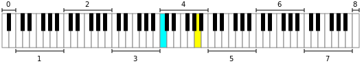
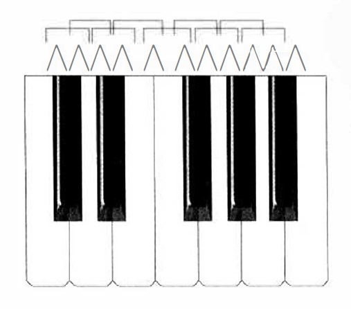
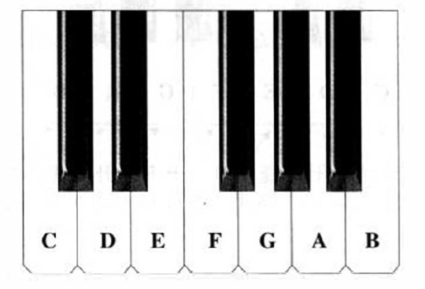
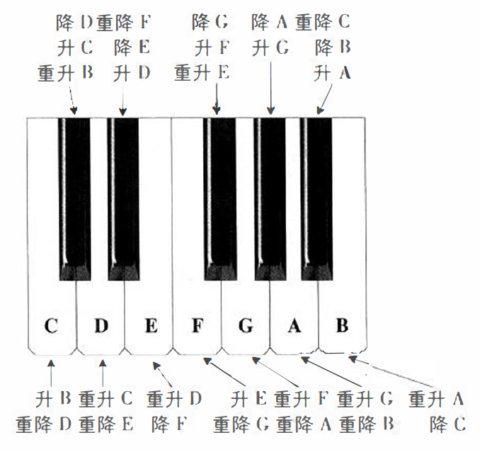
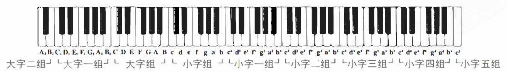

# 我所理解的音乐 乐音体系

[annotation]: <id> (98ad5046-75ea-4fd9-a7c7-6bf8515b6710)
[annotation]: <status> (public)
[annotation]: <create_time> (2019-05-27 21:22:28)
[annotation]: <category> (音乐的迷思)
[annotation]: <tags> (音乐理论)
[annotation]: <comments> (false)
[annotation]: <topic> (我所理解的音乐)
[annotation]: <index> (4)

如前所述，音乐中的音符实际上拥有特定的频率。拥有特定频率的音，就表示了特定的音高。音乐中为了把这些音高表示出来，就产生了 **乐音体系**。

> 音乐中所使用的基本的乐音的集合，叫 **乐音体系**。

一般情况下，绝大多数的乐理都以钢琴为乐器来教授，这里也不例外。因为钢琴拥有绝大多数乐器的音域范围。而音域表示一个乐器能够演奏的所有音符的集合。

在一般的钢琴上，总共有88个键；其中 52 个白键，36 个黑键。如下图所示：

这里定义了普遍意义上的88个音，实际上音乐中用到的音远远不止这些，不过一般来说，通常听到的音乐几乎都没有找过钢琴的音域。关于钢琴上的音符是以什么为标准划分的，这个回头再说。

## 半音和全音

在钢琴上，相邻的两个音之间的关系，叫做**半音**。间隔一个音的两个音之间的关系，叫做**全音**。

这里特别的指出：半音和全音是两个音之间的关系，类似于几何中，余角和补角的关系。

现用记号/\ 表示半音，用记号 [ 表示全音， 将钢琴键盘上的全音半音关系列示如下：

这里只特殊的说明了邻近音符之间的关系，对于距离更远的音符之间的关系，特别定义了 **音程**，关于音程的解释，以后再说。

## 音名和唱名

乐音体系中的各音级，都有着各自的名称，这就是 **音名**。音名的称谓，在不同的国家也不尽相同，被广泛采用的是： CDEFGAB。这些音名在键盘上的位置，如下图所示：

在乐音体系中， 虽有八十多个高低不同的音，但音的名称，基本上却只有这七个，其他各音级的名称，都是在这七个音名的基础上变化而成的。

钢琴键盘上的五十二个白键，在相应的位置上循环项复使用这七个音名。按照基本音级的高低次序，从某一音级开始， 向上或向下数到第八个音，这两音间的关系，就叫做“八度” ，并具有相同的名称（准确地讲，这里的八度应叫“ 纯八度")。音名相同的各音，在音乐中具有相同的意义，只是高度不同而已。两个八度之间叫 **等价八度**，具体的成因，以后再说。

被广泛采用的音名， 除了 C D E F G A B 之外，还有do re mi fa sol la si。这些音名因多用于歌唱，故又叫做 **唱名**。有人把唱名和音名割裂开，甚至认为唱名不是音名，我们认为这种看法不妥。

在乐音体系中， 音名CDEFGAB是固定不变的，而唱名do re mi fa sol la si 则因唱名法的不同而不固定。

> 实际上绝大多数人听到的乐曲都是相对音高，也就是说，音名对应的是绝对音高，而唱名对应的是相对音高。do re mi fa sol la si 在简谱中通常记作 1 2 3 4 5 6 7。对于 1 = C 的情况下，1 2 3 4 5 6 7 刚好对应 C D E F G A B。

## 音的升降

将基本音级加以升高或降低（包括重升和重降）而得来的音，叫做 **变化音级**:

- 将基本音级升高半音，叫做 **升音级**，如升C、升D、升E、升F、升G、升A、升B
- 将基本音级降低半音，叫做 **降音级**，如降C、降D、降E、降F、降G、降A、降B
- 将基本音级升高全音，叫做 **重升音级**，如重升C、重升D、重升E、重升F、重升G、重升A、重升B
- 将基本音级降低全音，叫做 **重降音级**，如重降C、重降D、重降E、重降F、重降C、重降A、重降B

各变化音级在键盘上的位置是：

> 这里的 **重** 字读音为 chóng

## 音的分组

### 传统分组

乐音体系中有八十多个音，仅用七个音名来表示， 因而便产生了许多音名相同而音高不同的音。为了区分这些音名相同而音高不同的音，于是便产生了音的分组，这就是 **音组**。

在乐音体系总音列中央的一组，也就是靠近钢琴钥匙孔的那一组，叫做“小字一组” 。它的标记是用小写字母井在右上角加数字"1"来表示，如 $c^1 d^1 e^1 f^1 g^1 a^1 b^1$.

比小字一组高的各组，由低到高，依次定名为 小字二组、小字三组、小字四组、小字五组：

- 小字二组是在小写字母右上角加数字 2，如$c^2 d^2 e^2 f^2 g^2 a^2 b^2$
- 小字三组是在小写字母右上角加数字 3，如$c^3 d^3 e^3 f^3 g^3 a^3 b^3$
- 小字四组是在小写字母右上角加数字 4，如$c^4 d^4 e^4 f^4 g^4 a^4 b^4$
- 小字五组只有一个音，那就是$c^5$

比小字一组低的各组， 由高到低，依次定名为 小字组、大字组、大字一组、大字二组：

- 小字组用小写字母标记，如$c d e f g a b$
- 大字组用大写字母标记，如$C D E F G A B$
- 大字一组是在大写字母右下方加数字 1，如$C_1 D_1 E_1 F_1 G_1 A_1 B_1$
- 大字二组只有两个音，那就是$A_2 B_2$

一个完全的音组，共包括十二个高低不同的音， 十一个半音（这里于万注意不要把“ 音”和“半音”搞混）。大字二组和小字下组，都是不完全的音组。

现将各音组的标记及其在钢琴键盘上的位置。列示如下：

### MIDI分组

传统分组已经在很多的音乐教材中有过介绍，但是它有一个很严重的缺陷，就是不够统一。

于是将传统分组重新进行定义，分组从0开始，各个分组的定义如下:

- 大字二组 A0-B0
- 大字一组 C1-B1
- 大字组 C2-B2
- 小字组 C3-B3
- 小字一组 C4-B4
- 小字二组 C5-B5
- 小字三组 C6-B6
- 小字四组 C7-B7
- 小字五组 C8

## 标准音和中央C

**标准音** A4，或者小字一组的A，这就是标准音。标准音的音高所对应的频率一般定义在 440Hz，不过标准音的频率历来并不一致。在17、18世纪，A4的高度约在415-430Hz之间，这种高度叫做**古典高度**。在1834年，稳国斯图加特物理学家会议决定A4=440Hz，1859年，法国巴黎音乐家和物理学家会议决定A4=435Hz。

A4=440Hz，被称为**第一国际高度**，A4=435Hz, 被称为**第二国际高度**。现在国际上通用的标准音高度为第一国际高度。

**中央C** C4，即小字一组的C，就是中央C，因其位于乐音体系总音列的中央而得名。

## 参考资料

- [基本乐理 - 李重光](https://book.douban.com/subject/3902787/)