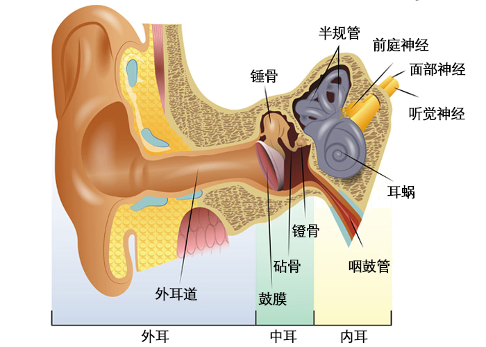

# 我所理解的音乐 第三章 声音的属性

[annotation]: <id> (04484205-97ed-4607-8c18-8bb9c134cff6)
[annotation]: <status> (public)
[annotation]: <create_time> (2019-05-25 18:56:30)
[annotation]: <category> (音乐的迷思)
[annotation]: <tags> (音乐理论)
[annotation]: <comments> (false)
[annotation]: <topic> (我所理解的音乐)
[annotation]: <index> (3)

> 原文链接：<http://blog.ccyg.studio/article/04484205-97ed-4607-8c18-8bb9c134cff6>

---

前文[关于音乐的概论](/article/a9065e01-2382-4f61-9a9f-cfde2cd2ce36)中说到了音乐的三要素，分别是：节奏、旋律、和声。当然这里也只是做了简单的介绍，让大家能够知道音乐本质上研究的对象。由于音乐是由声音构成的，所以音乐本质上是在研究特定的一些声音。所以研究声音就成了音乐的基础，这里简单介绍一下声音的一些属性。

## 声音的产生

在自然界中，充斥着各种各样的声音，有些声音我们能听到，有些不能听到。发声体通过震动影响周围空气的压力，压力在发声体的周期震动之下产生声波，外耳收集到声波后，通过外耳道，使鼓膜产生震动，震动使得锤骨、砧骨和镫骨开始运动。然后将能量传送到耳蜗。耳蜗中有大量的纤维，这些纤维类似于小毛毛，不同频率的声波会使得不同的毛毛产生**共振**。<i class='ui pop heart circular pink small icon'></i>
一种物理学现象，未来会详细介绍

这些小毛毛的震动使听觉神经产生电脉冲，然后传送至大脑。不同的音量产生的震动幅度不同。

人类能听到声音的频率，大概在20 Hz ~ 20000 Hz，但是成年人一般只能听到 20 Hz ~ 15000 Hz。标准 88 键的钢琴，频率的范围在 27.5 Hz (A0) ~ 4186.0 Hz (C8)。一般低于 20 Hz 的声音称为 **次声波**。高于 20000 Hz 的声音称为 **超声波**。

## 声音的基础属性

### 音高

**音高**是由声波的频率来决定的，声波的频率高，音就高，反之，音就低。而频率是一个物理学概念，它表示发声体每秒的震动次数。比如钢琴上的中央C，每秒大概震动 261 次，也就是 261 Hz。

特别的，在音乐中，对于乐音和噪音有不同的定义。

- **乐音** 音高确定或者十分明显的音，比如钢琴，吉他等等的声音都是乐音。
- **噪音** 音高不确定或者不明显的音，比如军鼓，锣等等。

### 音量

**音量** 是由发声体的振幅来决定的，振幅是一个物理学概念，震动的物理量可能达到的最大值。对于发声体而言，振幅就是发声体震动过程中，离开平衡位置最远的距离。简单点说，在拨弦的过程中，如果出的力量大，那么相应的音量就大，反之亦然，这个显然是很简单的。

### 音值

**音值** 表示声音的延续时间长短，有些声音可能会很长，也有些声音会很短促。延续的时间长，音就长；延续的时间短，音就短。

音符的长短，在节奏中是一个很重要的属性。

### 音色

**音色** 是发声体的固有属性，它有发声体所产生的基音和泛音的稳定性和音量大小等等共同决定。

搞清楚音色是不容易的，这点之后会详细说明。关于泛音可以参考 [泛音的频谱分析](http://blog.ccyg.studio/article/67be018a-2aa9-43a3-81cd-1e4aaae5797a) 来加深对泛音的认识。

---

音乐的四种属性，在音乐中的表现，各不相同。由于音色的不同，我们才能区分出不同的乐器，不同的人声。由于音量的不同，我们才能听到节奏中节拍的强弱。音高和音值在音乐中的表现则更为突出，人们实际感受到的歌曲大多是由音高和音值来决定的。

## 参考资料

- [基本乐理 - 李重光](https://book.douban.com/subject/3902787/)
- [How the ear works](https://www.youtube.com/watch?v=qgdqp-oPb1Q)