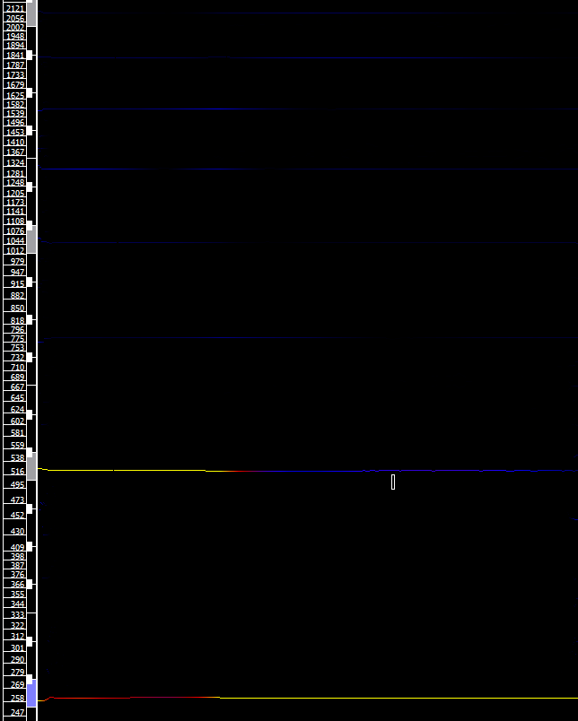
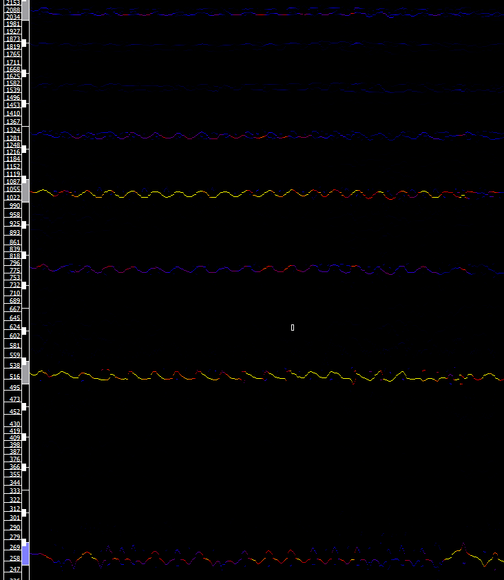
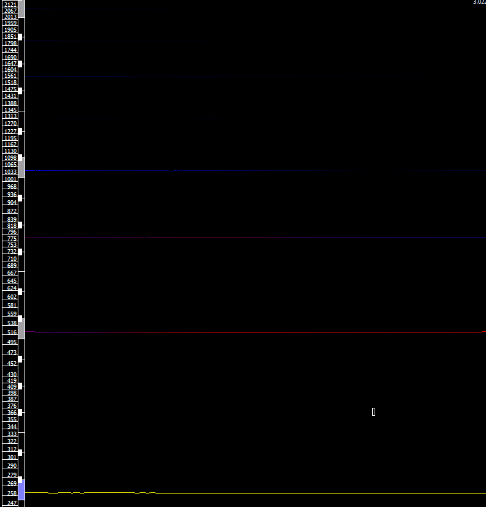

# 泛音的频谱分析

[annotation]: <id> (67be018a-2aa9-43a3-81cd-1e4aaae5797a)
[annotation]: <status> (public)
[annotation]: <create_time> (2019-05-14 14:36:58)
[annotation]: <category> (音乐的迷思)
[annotation]: <comments> (true)

## 万有引力

在我之前写的一篇文章[关于和声学的一些理解](/article/e0b15173-dd51-4040-b119-fff18ed1d168)中写到了，和声学的一些基础概念以及为什么大三和弦最稳定。其中书中写到了大字组C容易证实的泛音，如下所示：

那么这些泛音究竟是怎么确定的，接下来我们就来研究一下。

为了能够和多种乐器比较，所以这里使用中央C作为研究对象，也就是C4。

## 钢琴

下面是我用音色 Alicias Keys 生成的中央C

在 Sonic Visualizer 中打开，可以看到下面的频谱

很容易可以确定中央C的泛音列大致如下：

分别是： C4 C5 G5 C6 E6 G6 A#6 C7 D7 E7 F#7 G7

## 小提琴

下面是我用音色 Joshua Bell Violin 生成的中央C

可以看到下面的频谱

可以看出泛音列和钢琴音色一致，只不过各个泛音的频率很有规律的波动。而钢琴音色泛音的频率基本上是一致的。

## 钢弦吉他

下面是我用音色 Ample Sound T II 生成的中央C

可以看到下面的频谱

可以看出泛音列和钢琴音色一致，只不过各个泛音的幅值，也就是音量与钢琴的有所不一。

## 总结

假设发声体是自然的，那么发声体发出的声音就得基因和泛音得频率就是相对固定的。决定音色细节的东西主要是由泛音频率的稳定性和泛音音量控制的。根据傅里叶变换，简谐波应该可以分解称为一系列的正弦波。所以这些分解出来的正弦波就应该是相对应的泛音。

大胆想象一下，我们便可以根据泛音列的规律来自己生成自己独特的音色，由于这些音色是我们自己生成的，而不是自然的录音。所以电音应该就是这样形成的吧。
